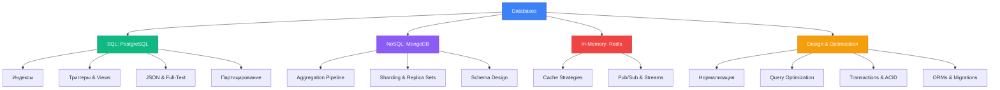
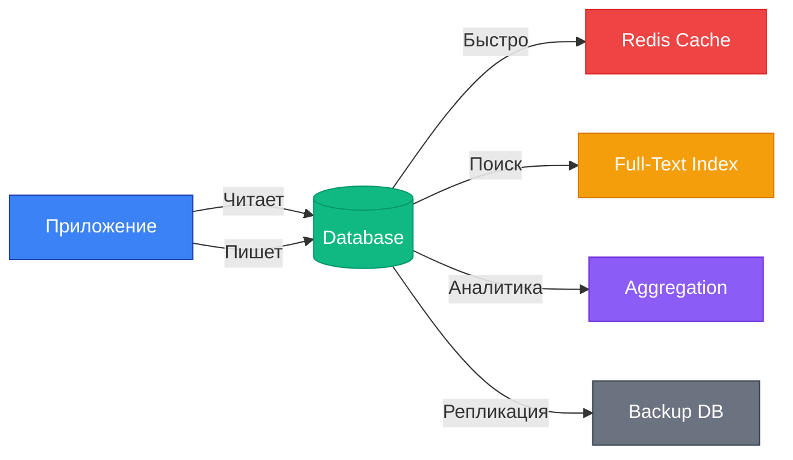

# 🗄️ Databases: Data Layer

Базы данных — сердце любого современного приложения. Здесь хранятся данные, здесь происходит магия CRUD, транзакций и масштабирования.

## Что будет в этом разделе?

---

## 🎯 Что вы изучите

### **PostgreSQL** (8 уроков)
Самая мощная open-source реляционная БД. От базовых запросов до advanced фич:
- **Индексы:** B-tree, Hash, GIN, GiST — когда и что использовать
- **Триггеры:** Автоматизация бизнес-логики на уровне БД
- **Views & Materialized Views:** Виртуальные таблицы и кеширование запросов
- **Оконные функции:** `ROW_NUMBER()`, `LAG()`, `LEAD()` — аналитика прямо в SQL
- **JSON/JSONB:** Гибридные документы в реляционной БД
- **Full-Text Search:** Поиск без Elasticsearch
- **Партицирование:** Разделение больших таблиц для скорости

---

### **MongoDB** (7 уроков)
Документо-ориентированная NoSQL БД. Когда схема гибкая, а данные — неструктурированные:
- **Aggregation Pipeline:** MapReduce на стероидах
- **Индексы:** Как индексировать вложенные документы и массивы
- **Sharding:** Горизонтальное масштабирование на сотни серверов
- **Replica Sets:** Отказоустойчивость через репликацию
- **Транзакции:** Да, в MongoDB тоже есть ACID!
- **Schema Design Patterns:** Bucket, Outlier, Computed — когда какой паттерн применять

---

### **Redis** (5 уроков)
In-memory key-value store. Когда нужна сверх-скорость:
- **Структуры данных:** Strings, Lists, Sets, Sorted Sets, Hashes, HyperLogLog
- **Cache Strategies:** Write-through, Write-behind, Cache-aside
- **Sessions:** Хранение сессий без нагрузки на основную БД
- **Pub/Sub:** Real-time сообщения между сервисами
- **Streams:** Event sourcing и message queues

---

### **Database Design & Optimization** (6 уроков)
Теория и практика проектирования схем:
- **Нормализация:** 1NF, 2NF, 3NF — избавляемся от дубликатов
- **Relationships:** One-to-One, One-to-Many, Many-to-Many
- **Денормализация:** Когда нарушение правил — правильное решение
- **Query Optimization:** `EXPLAIN`, индексы, covering indexes
- **Transactions & ACID:** Atomicity, Consistency, Isolation, Durability

---

### **ORMs & Migrations** (4 урока)
Работа с БД через код:
- **Prisma:** Type-safe ORM для TypeScript/JavaScript
- **TypeORM vs Mongoose:** SQL ORM vs MongoDB ODM
- **Schema Evolution:** Как эволюционировать схему без даунтайма
- **Zero-Downtime Migrations:** Blue-green deployments, rolling updates

---

## 🔥 Зачем это нужно?

---

## 💡 Философия

**Не существует "идеальной" БД.** Есть правильный выбор под конкретную задачу:
- **PostgreSQL:** Когда нужны отношения, транзакции, ACID
- **MongoDB:** Когда схема меняется часто, данные неструктурированные
- **Redis:** Когда критична скорость, данные временные

**Масштабирование:**
- **Вертикальное:** Больше CPU/RAM на одном сервере (PostgreSQL любит это)
- **Горизонтальное:** Больше серверов (MongoDB sharding, PostgreSQL Citus)

**Оптимизация:**
1. Сначала правильная схема (нормализация/денормализация)
2. Потом индексы (но не все подряд!)
3. Потом кеш (Redis)
4. И только потом — переписывание запросов

---

## 🚀 Готовы?

Это не просто "как создать таблицу". Это глубокое погружение в Data Engineering: от теории до production-ready решений.

**Следующий урок:** [PostgreSQL: Основы](/databases/postgresql-intro) →

---

## 📚 Дополнительные ресурсы

- [PostgreSQL Documentation](https://www.postgresql.org/docs/)
- [MongoDB University](https://university.mongodb.com/)
- [Redis University](https://university.redis.com/)
- [Use The Index, Luke!](https://use-the-index-luke.com/) — Библия индексов
- [Database Internals](https://www.databass.dev/) — Как БД работают внутри
