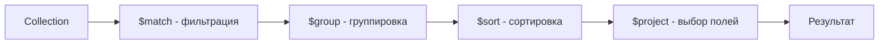

# 📊 Aggregation Pipeline в MongoDB

Aggregation Pipeline — это мощный фреймворк для обработки и трансформации данных в MongoDB. Он работает как конвейер: данные проходят через последовательность стадий (stages), на каждой из которых трансформируются.

## Концепция Pipeline



## Основные стадии

### $match - Фильтрация документов

```javascript
// Аналог find()
db.orders.aggregate([
  { $match: { status: "completed", total: { $gte: 100 } } }
])

// Важно: $match в начале pipeline использует индексы!
```

### $group - Группировка и агрегация

```javascript
// Подсчёт заказов по статусу
db.orders.aggregate([
  {
    $group: {
      _id: "$status",  // поле для группировки
      count: { $sum: 1 },
      totalRevenue: { $sum: "$total" },
      avgOrderValue: { $avg: "$total" },
      maxOrder: { $max: "$total" },
      minOrder: { $min: "$total" }
    }
  }
])

// Группировка по нескольким полям
db.orders.aggregate([
  {
    $group: {
      _id: {
        status: "$status",
        paymentMethod: "$paymentMethod"
      },
      count: { $sum: 1 }
    }
  }
])

// Без группировки (_id: null) - общая статистика
db.orders.aggregate([
  {
    $group: {
      _id: null,
      totalOrders: { $sum: 1 },
      totalRevenue: { $sum: "$total" }
    }
  }
])
```

### $project - Выбор и трансформация полей

```javascript
db.orders.aggregate([
  {
    $project: {
      _id: 0,  // исключить
      orderId: "$_id",  // переименовать
      customerName: "$customer.name",  // вложенное поле
      total: 1,  // включить
      // Вычисляемые поля
      tax: { $multiply: ["$total", 0.2] },
      totalWithTax: { $add: ["$total", { $multiply: ["$total", 0.2] }] },
      // Строковые операции
      upperStatus: { $toUpper: "$status" },
      // Условия
      isPremium: { $gte: ["$total", 1000] }
    }
  }
])
```

### $sort - Сортировка

```javascript
db.orders.aggregate([
  { $match: { status: "completed" } },
  { $sort: { total: -1, createdAt: 1 } }  // -1 = desc, 1 = asc
])
```

### $limit и $skip - Пагинация

```javascript
// Топ 10 самых дорогих заказов
db.orders.aggregate([
  { $match: { status: "completed" } },
  { $sort: { total: -1 } },
  { $limit: 10 }
])

// Пагинация (страница 2, по 20 на странице)
const page = 2;
const perPage = 20;
db.orders.aggregate([
  { $sort: { createdAt: -1 } },
  { $skip: (page - 1) * perPage },
  { $limit: perPage }
])
```

### $unwind - Развёртывание массивов

```javascript
// Документ с массивом:
// { _id: 1, items: ["apple", "banana", "orange"] }

db.orders.aggregate([
  { $unwind: "$items" }
])

// Результат (3 документа):
// { _id: 1, items: "apple" }
// { _id: 1, items: "banana" }
// { _id: 1, items: "orange" }

// Практический пример: заказы с items
db.orders.aggregate([
  { $unwind: "$items" },
  {
    $group: {
      _id: "$items.productId",
      totalSold: { $sum: "$items.quantity" },
      revenue: { $sum: { $multiply: ["$items.price", "$items.quantity"] } }
    }
  },
  { $sort: { totalSold: -1 } },
  { $limit: 10 }
])
```

### $lookup - JOIN с другой коллекцией

```javascript
// Коллекции:
// users: { _id, username, email }
// orders: { _id, userId, total }

db.orders.aggregate([
  {
    $lookup: {
      from: "users",  // коллекция для join
      localField: "userId",  // поле в orders
      foreignField: "_id",  // поле в users
      as: "userInfo"  // новое поле (массив)
    }
  },
  {
    $unwind: "$userInfo"  // превратить массив в объект
  },
  {
    $project: {
      orderId: "$_id",
      total: 1,
      username: "$userInfo.username",
      email: "$userInfo.email"
    }
  }
])

// Или pipeline в $lookup (более гибко)
db.orders.aggregate([
  {
    $lookup: {
      from: "users",
      let: { userId: "$userId" },
      pipeline: [
        { $match: { $expr: { $eq: ["$_id", "$$userId"] } } },
        { $project: { username: 1, email: 1 } }
      ],
      as: "user"
    }
  }
])
```

### $addFields / $set - Добавление полей

```javascript
db.orders.aggregate([
  {
    $addFields: {
      tax: { $multiply: ["$total", 0.2] },
      totalWithTax: { $add: ["$total", { $multiply: ["$total", 0.2] }] },
      orderDate: { $toDate: "$createdAt" }
    }
  }
])
```

## Практические примеры

### Sales Dashboard

```javascript
db.orders.aggregate([
  // Фильтр: только завершённые заказы за последние 30 дней
  {
    $match: {
      status: "completed",
      createdAt: { $gte: new Date(Date.now() - 30 * 24 * 60 * 60 * 1000) }
    }
  },
  // Группировка по дням
  {
    $group: {
      _id: {
        $dateToString: { format: "%Y-%m-%d", date: "$createdAt" }
      },
      dailyRevenue: { $sum: "$total" },
      orderCount: { $sum: 1 },
      avgOrderValue: { $avg: "$total" }
    }
  },
  // Сортировка по дате
  { $sort: { _id: 1 } },
  // Переименование полей
  {
    $project: {
      _id: 0,
      date: "$_id",
      revenue: "$dailyRevenue",
      orders: "$orderCount",
      avgValue: "$avgOrderValue"
    }
  }
])
```

### Top Products

```javascript
db.orders.aggregate([
  { $match: { status: "completed" } },
  { $unwind: "$items" },
  {
    $group: {
      _id: "$items.productId",
      productName: { $first: "$items.productName" },
      totalQuantity: { $sum: "$items.quantity" },
      totalRevenue: { $sum: { $multiply: ["$items.price", "$items.quantity"] } }
    }
  },
  { $sort: { totalRevenue: -1 } },
  { $limit: 20 },
  {
    $lookup: {
      from: "products",
      localField: "_id",
      foreignField: "_id",
      as: "productDetails"
    }
  },
  {
    $project: {
      productName: 1,
      totalQuantity: 1,
      totalRevenue: 1,
      category: { $arrayElemAt: ["$productDetails.category", 0] }
    }
  }
])
```

### Customer Segmentation

```javascript
db.users.aggregate([
  {
    $lookup: {
      from: "orders",
      localField: "_id",
      foreignField: "userId",
      as: "orders"
    }
  },
  {
    $addFields: {
      orderCount: { $size: "$orders" },
      totalSpent: { $sum: "$orders.total" },
      avgOrderValue: { $avg: "$orders.total" }
    }
  },
  {
    $addFields: {
      segment: {
        $switch: {
          branches: [
            { case: { $gte: ["$totalSpent", 5000] }, then: "VIP" },
            { case: { $gte: ["$totalSpent", 1000] }, then: "Premium" },
            { case: { $gte: ["$orderCount", 5] }, then: "Regular" }
          ],
          default: "New"
        }
      }
    }
  },
  {
    $group: {
      _id: "$segment",
      count: { $sum: 1 },
      avgSpent: { $avg: "$totalSpent" },
      totalRevenue: { $sum: "$totalSpent" }
    }
  },
  { $sort: { totalRevenue: -1 } }
])
```

## Временные агрегации

```javascript
// Продажи по часам дня
db.orders.aggregate([
  {
    $group: {
      _id: { $hour: "$createdAt" },
      count: { $sum: 1 },
      revenue: { $sum: "$total" }
    }
  },
  { $sort: { _id: 1 } }
])

// Продажи по дням недели
db.orders.aggregate([
  {
    $group: {
      _id: { $dayOfWeek: "$createdAt" },  // 1=Sunday, 7=Saturday
      count: { $sum: 1 },
      revenue: { $sum: "$total" }
    }
  }
])

// Продажи по месяцам
db.orders.aggregate([
  {
    $group: {
      _id: {
        year: { $year: "$createdAt" },
        month: { $month: "$createdAt" }
      },
      revenue: { $sum: "$total" }
    }
  },
  { $sort: { "_id.year": 1, "_id.month": 1 } }
])
```

## TypeScript примеры

```typescript
import { MongoClient } from 'mongodb';

const client = new MongoClient('mongodb://localhost:27017');
const db = client.db('myapp');

// Dashboard метрики
async function getDashboardMetrics(days: number = 30) {
  const startDate = new Date(Date.now() - days * 24 * 60 * 60 * 1000);
  
  const metrics = await db.collection('orders').aggregate([
    {
      $match: {
        status: 'completed',
        createdAt: { $gte: startDate }
      }
    },
    {
      $group: {
        _id: null,
        totalRevenue: { $sum: '$total' },
        orderCount: { $sum: 1 },
        avgOrderValue: { $avg: '$total' }
      }
    }
  ]).toArray();
  
  return metrics[0];
}

// Топ продукты
async function getTopProducts(limit: number = 10) {
  return db.collection('orders').aggregate([
    { $match: { status: 'completed' } },
    { $unwind: '$items' },
    {
      $group: {
        _id: '$items.productId',
        productName: { $first: '$items.productName' },
        totalSold: { $sum: '$items.quantity' },
        revenue: {
          $sum: { $multiply: ['$items.price', '$items.quantity'] }
        }
      }
    },
    { $sort: { revenue: -1 } },
    { $limit: limit }
  ]).toArray();
}

// Sales по дням
async function getDailySales(days: number = 30) {
  const startDate = new Date(Date.now() - days * 24 * 60 * 60 * 1000);
  
  return db.collection('orders').aggregate([
    {
      $match: {
        status: 'completed',
        createdAt: { $gte: startDate }
      }
    },
    {
      $group: {
        _id: {
          $dateToString: { format: '%Y-%m-%d', date: '$createdAt' }
        },
        revenue: { $sum: '$total' },
        orders: { $sum: 1 }
      }
    },
    { $sort: { _id: 1 } },
    {
      $project: {
        _id: 0,
        date: '$_id',
        revenue: 1,
        orders: 1
      }
    }
  ]).toArray();
}

// Сегментация клиентов
async function getCustomerSegments() {
  return db.collection('users').aggregate([
    {
      $lookup: {
        from: 'orders',
        localField: '_id',
        foreignField: 'userId',
        as: 'orders'
      }
    },
    {
      $addFields: {
        totalSpent: { $sum: '$orders.total' },
        orderCount: { $size: '$orders' }
      }
    },
    {
      $bucket: {
        groupBy: '$totalSpent',
        boundaries: [0, 100, 500, 1000, 5000, Infinity],
        default: 'Other',
        output: {
          count: { $sum: 1 },
          avgSpent: { $avg: '$totalSpent' },
          users: { $push: '$username' }
        }
      }
    }
  ]).toArray();
}

// Использование
async function main() {
  await client.connect();
  
  const metrics = await getDashboardMetrics(30);
  console.log('Dashboard:', metrics);
  
  const topProducts = await getTopProducts(10);
  console.log('Top Products:', topProducts);
  
  const dailySales = await getDailySales(7);
  console.log('Last 7 Days:', dailySales);
  
  await client.close();
}
```

## Оптимизация Pipeline

```javascript
// ❌ Плохо: сортировка без индекса и limit
db.orders.aggregate([
  { $match: { status: "completed" } },
  { $sort: { total: -1 } },
  // ... много других стадий
])

// ✅ Хорошо: $match и $sort в начале, используют индекс
db.orders.aggregate([
  { $match: { status: "completed" } },
  { $sort: { total: -1 } },
  { $limit: 100 },  // уменьшаем данные для следующих стадий
  // ... остальные стадии
])

// Создание индекса
db.orders.createIndex({ status: 1, total: -1 })
```

## 💡 Best Practices

1. **$match в начале** - фильтруйте данные как можно раньше
2. **$project после группировки** - не тащите лишние поля
3. **Индексы** - создавайте для полей в $match и $sort
4. **$limit** - используйте после $sort для уменьшения данных
5. **allowDiskUse** - для больших агрегаций (>100MB RAM)
6. **explain()** - анализируйте производительность

## Анализ производительности

```javascript
// Explain для pipeline
db.orders.aggregate([
  { $match: { status: "completed" } },
  { $group: { _id: "$userId", total: { $sum: "$total" } } }
], { explain: true })

// Использование диска для больших агрегаций
db.orders.aggregate([
  // ... pipeline
], { allowDiskUse: true })
```

## ⚠️ Частые ошибки

- $match и $sort в конце pipeline (не используют индексы)
- Забывают $unwind перед группировкой по массивам
- Не используют $project для исключения ненужных полей
- Превышают 100MB RAM без allowDiskUse

---

**Следующий урок:** [Индексы в MongoDB](/databases/mongodb-indexes) →
