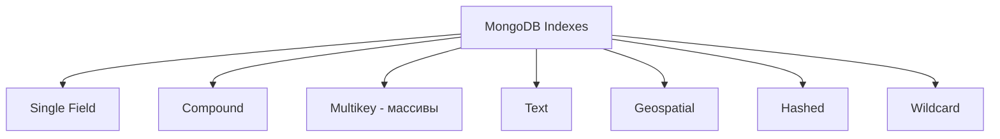

# 🔍 Индексы в MongoDB

Индексы в MongoDB работают аналогично индексам в реляционных БД — ускоряют поиск, но замедляют запись. MongoDB поддерживает различные типы индексов для разных сценариев.

## Типы индексов



## Single Field Index

```javascript
// Создание индекса
db.users.createIndex({ email: 1 })  // 1 = ascending, -1 = descending

// Уникальный индекс
db.users.createIndex({ username: 1 }, { unique: true })

// Частичный индекс (только для активных пользователей)
db.users.createIndex(
  { email: 1 },
  { partialFilterExpression: { status: "active" } }
)

// Sparse индекс (только документы с полем)
db.users.createIndex(
  { phoneNumber: 1 },
  { sparse: true }
)
```

## Compound Index

```javascript
// Составной индекс (порядок важен!)
db.orders.createIndex({ status: 1, createdAt: -1 })

// Эффективно для:
db.orders.find({ status: "pending" }).sort({ createdAt: -1 })
db.orders.find({ status: "completed", createdAt: { $gte: date } })

// Неэффективно (обратный порядок):
db.orders.find({ createdAt: { $gte: date } })  // не использует индекс полностью
```

**Правило:** Индекс `{a: 1, b: 1, c: 1}` поддерживает:
- `{a}`
- `{a, b}`
- `{a, b, c}`

Но НЕ поддерживает: `{b}`, `{c}`, `{b, c}`

## Multikey Index (для массивов)

```javascript
// Документ:
// { _id: 1, tags: ["mongodb", "database", "nosql"] }

// Индекс на массив
db.articles.createIndex({ tags: 1 })

// Эффективно работает с:
db.articles.find({ tags: "mongodb" })
db.articles.find({ tags: { $in: ["mongodb", "redis"] } })

// ⚠️ Нельзя создать compound multikey index на два массива!
// db.posts.createIndex({ tags: 1, categories: 1 })  // ERROR если оба массивы
```

## Text Index

```javascript
// Создание text индекса
db.articles.createIndex({ title: "text", content: "text" })

// Веса для полей (title важнее content)
db.articles.createIndex(
  { title: "text", content: "text" },
  { weights: { title: 10, content: 5 } }
)

// Поиск
db.articles.find({ $text: { $search: "mongodb tutorial" } })

// Поиск с фразой
db.articles.find({ $text: { $search: "\"full text search\"" } })

// Исключение слов
db.articles.find({ $text: { $search: "mongodb -SQL" } })

// Сортировка по релевантности
db.articles.find(
  { $text: { $search: "mongodb" } },
  { score: { $meta: "textScore" } }
).sort({ score: { $meta: "textScore" } })
```

⚠️ **Ограничение:** Только один text индекс на коллекцию!

## Geospatial Index

```javascript
// 2dsphere индекс для GeoJSON
db.places.createIndex({ location: "2dsphere" })

// Документ:
db.places.insertOne({
  name: "Central Park",
  location: {
    type: "Point",
    coordinates: [-73.968285, 40.785091]  // [longitude, latitude]
  }
})

// Поиск в радиусе (в метрах)
db.places.find({
  location: {
    $near: {
      $geometry: {
        type: "Point",
        coordinates: [-73.9, 40.7]
      },
      $maxDistance: 5000  // 5km
    }
  }
})

// Поиск в полигоне
db.places.find({
  location: {
    $geoWithin: {
      $geometry: {
        type: "Polygon",
        coordinates: [[
          [-74.0, 40.7],
          [-73.9, 40.7],
          [-73.9, 40.8],
          [-74.0, 40.8],
          [-74.0, 40.7]
        ]]
      }
    }
  }
})
```

## Hashed Index

Используется для sharding.

```javascript
// Hashed индекс
db.users.createIndex({ userId: "hashed" })

// Хорош для равномерного распределения в sharding
// Не поддерживает диапазонные запросы ($gt, $lt)
```

## Wildcard Index

Для динамических схем и вложенных полей.

```javascript
// Индекс на все поля в metadata
db.products.createIndex({ "metadata.$**": 1 })

// Теперь работает для любых полей:
db.products.find({ "metadata.color": "red" })
db.products.find({ "metadata.size": "large" })
db.products.find({ "metadata.brand.name": "Apple" })

// Wildcard на всю коллекцию
db.products.createIndex({ "$**": 1 })
```

## TTL Index (Time-To-Live)

Автоматическое удаление старых документов.

```javascript
// Удалять документы через 1 час после createdAt
db.sessions.createIndex(
  { createdAt: 1 },
  { expireAfterSeconds: 3600 }
)

// Удалять в конкретное время (expireAt)
db.events.createIndex({ expireAt: 1 }, { expireAfterSeconds: 0 })

// Документ:
db.events.insertOne({
  message: "Event",
  expireAt: new Date(Date.now() + 24 * 60 * 60 * 1000)  // через 24 часа
})
```

⚠️ **Важно:** TTL background задача запускается каждые 60 секунд!

## Управление индексами

```javascript
// Список всех индексов
db.users.getIndexes()

// Удаление индекса
db.users.dropIndex("email_1")
db.users.dropIndex({ email: 1 })

// Удаление всех индексов (кроме _id)
db.users.dropIndexes()

// Пересоздание индекса (background)
db.users.createIndex(
  { email: 1 },
  { background: true }  // не блокирует запись
)

// Информация о размере индексов
db.users.stats().indexSizes
```

## Анализ использования индексов

```javascript
// Explain - анализ запроса
db.users.find({ email: "john@example.com" }).explain("executionStats")

// Проверка использования индекса
const explain = db.users.find({ email: "john@example.com" }).explain("executionStats")
console.log(explain.executionStats.totalDocsExamined)  // должно быть минимально
console.log(explain.executionStats.executionTimeMillis)

// Index hints (принудительное использование)
db.users.find({ email: "john@example.com" }).hint({ email: 1 })
```

**Хорошие показатели:**
- `totalDocsExamined` ≈ `nReturned`
- `executionStage: "IXSCAN"` (использует индекс)
- `executionTimeMillis` < 100ms

**Плохие показатели:**
- `executionStage: "COLLSCAN"` (сканирование всей коллекции!)
- `totalDocsExamined` >> `nReturned`

## TypeScript примеры

```typescript
import { MongoClient } from 'mongodb';

const client = new MongoClient('mongodb://localhost:27017');
const db = client.db('myapp');

// Создание индексов при инициализации
async function setupIndexes() {
  const users = db.collection('users');
  
  // Уникальные индексы
  await users.createIndex({ email: 1 }, { unique: true });
  await users.createIndex({ username: 1 }, { unique: true });
  
  // Compound индексы
  await users.createIndex({ status: 1, createdAt: -1 });
  
  // Частичный индекс
  await users.createIndex(
    { lastLoginAt: 1 },
    {
      partialFilterExpression: { status: 'active' },
      expireAfterSeconds: 90 * 24 * 60 * 60  // 90 дней
    }
  );
  
  console.log('Indexes created');
}

// Анализ производительности запроса
async function analyzeQuery(collection: string, query: any) {
  const result = await db.collection(collection)
    .find(query)
    .explain('executionStats');
  
  const stats = result.executionStats;
  
  return {
    executionTime: stats.executionTimeMillis,
    docsExamined: stats.totalDocsExamined,
    docsReturned: stats.nReturned,
    usedIndex: stats.executionStages.stage === 'IXSCAN',
    indexName: stats.executionStages.indexName || null,
    efficiency: stats.totalDocsExamined === 0 
      ? 100 
      : (stats.nReturned / stats.totalDocsExamined * 100).toFixed(2)
  };
}

// Пример использования
async function main() {
  await client.connect();
  await setupIndexes();
  
  // Анализ запроса
  const analysis = await analyzeQuery('users', { email: 'john@example.com' });
  console.log('Query analysis:', analysis);
  
  // Slow queries мониторинг
  const slowQueries = await findSlowQueries();
  console.log('Slow queries:', slowQueries);
  
  await client.close();
}

// Мониторинг медленных запросов
async function findSlowQueries(thresholdMs: number = 100) {
  // Включить profiling
  await db.command({ profile: 2, slowms: thresholdMs });
  
  // Через некоторое время проверить system.profile
  const slowQueries = await db.collection('system.profile')
    .find({ millis: { $gte: thresholdMs } })
    .sort({ ts: -1 })
    .limit(10)
    .toArray();
  
  return slowQueries.map(q => ({
    operation: q.op,
    query: q.command,
    duration: q.millis,
    timestamp: q.ts
  }));
}

// Статистика по индексам
async function getIndexStats(collectionName: string) {
  const stats = await db.collection(collectionName).aggregate([
    { $indexStats: {} }
  ]).toArray();
  
  return stats.map(stat => ({
    name: stat.name,
    operations: stat.accesses.ops,
    since: stat.accesses.since
  }));
}
```

## Mongoose индексы

```typescript
import mongoose from 'mongoose';

const userSchema = new mongoose.Schema({
  username: {
    type: String,
    required: true,
    unique: true,  // создаёт уникальный индекс
    lowercase: true,
    trim: true
  },
  email: {
    type: String,
    required: true,
    unique: true,
    index: true  // обычный индекс
  },
  status: {
    type: String,
    enum: ['active', 'inactive', 'banned']
  },
  createdAt: {
    type: Date,
    default: Date.now
  },
  lastLoginAt: Date,
  metadata: mongoose.Schema.Types.Mixed
});

// Compound индексы
userSchema.index({ status: 1, createdAt: -1 });

// Text индекс
userSchema.index({ username: 'text', email: 'text' });

// Geospatial
userSchema.index({ location: '2dsphere' });

// Частичный индекс
userSchema.index(
  { lastLoginAt: 1 },
  { 
    partialFilterExpression: { status: 'active' },
    expireAfterSeconds: 90 * 24 * 60 * 60
  }
);

// Wildcard индекс
userSchema.index({ 'metadata.$**': 1 });

const User = mongoose.model('User', userSchema);

// Автоматическое создание индексов при старте
await User.createIndexes();
```

## 💡 Best Practices

1. **ESR Rule** для compound индексов:
   - **E**quality (=)
   - **S**ort
   - **R**ange (<, >, >=, <=)
   
   Пример: `{ status: 1, createdAt: -1 }` для `find({ status: "active" }).sort({ createdAt: -1 })`

2. **Покрывающие индексы:**
   ```javascript
   db.users.createIndex({ email: 1, username: 1, status: 1 })
   db.users.find({ email: "john@example.com" }, { username: 1, status: 1, _id: 0 })
   // Не обращается к документам, читает только из индекса!
   ```

3. **Не создавайте лишние индексы:**
   - Каждый индекс замедляет INSERT/UPDATE
   - Занимает дополнительное место
   - Только на часто используемых полях

4. **Background индексы** для production:
   ```javascript
   db.users.createIndex({ email: 1 }, { background: true })
   ```

5. **Мониторинг:**
   - Используйте MongoDB Atlas или Ops Manager
   - Анализируйте slow query log
   - Проверяйте `$indexStats` aggregation

## Index Intersection

MongoDB может использовать несколько индексов одновременно:

```javascript
// Индексы:
db.users.createIndex({ status: 1 })
db.users.createIndex({ age: 1 })

// Запрос может использовать оба:
db.users.find({ status: "active", age: { $gte: 18 } })

// Но лучше создать compound:
db.users.createIndex({ status: 1, age: 1 })
```

## ⚠️ Частые ошибки

- Создание индексов в неправильном порядке (compound)
- Слишком много индексов (замедляют запись)
- Забывают добавить `background: true` на production
- Не анализируют `explain()` для медленных запросов
- Используют `$regex` без префикса (не использует индекс)

---

**Следующий урок:** [Sharding в MongoDB](/databases/mongodb-sharding) →
