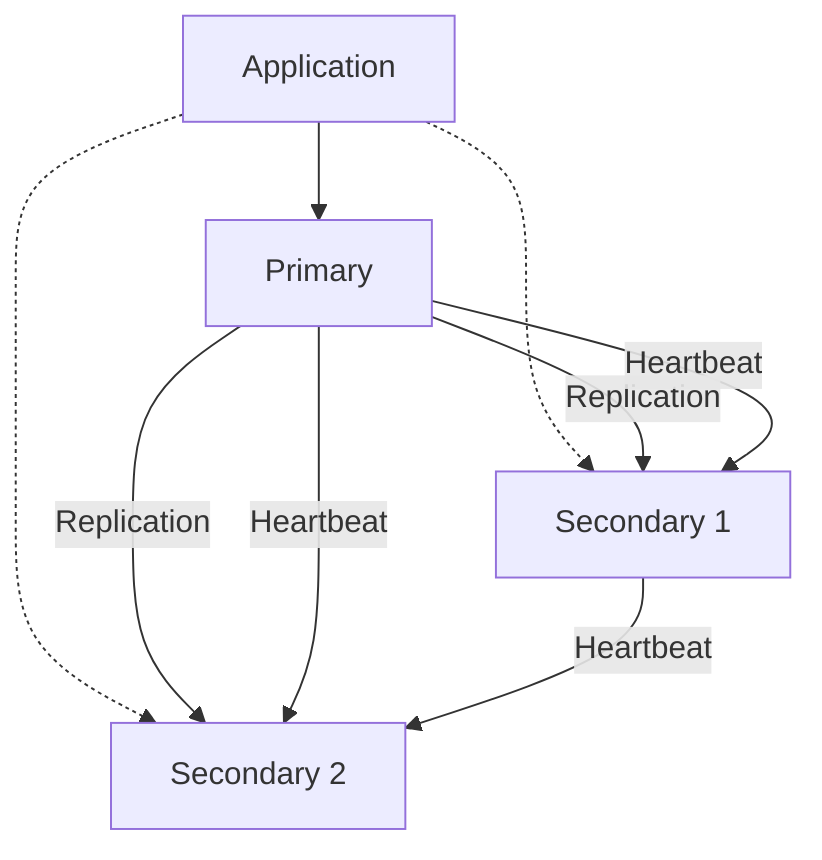
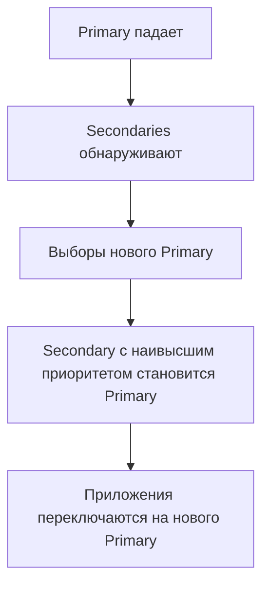

# 🔄 Replica Sets в MongoDB

Replica Set — это группа MongoDB серверов (nodes), которые хранят одинаковые данные. Обеспечивает высокую доступность (HA) и отказоустойчивость.

## Архитектура Replica Set



**Роли:**
- **Primary:** Принимает все write операции
- **Secondary:** Реплицируют данные с Primary, могут обслуживать read (если настроено)
- **Arbiter:** Участвует только в выборах, не хранит данные

## Зачем нужны Replica Sets?

✅ **Преимущества:**
- **High Availability:** При падении Primary автоматически выбирается новый
- **Data Redundancy:** Данные хранятся на нескольких серверах
- **Read Scaling:** Можно читать с Secondary (trade-off: eventual consistency)
- **Zero-Downtime Maintenance:** Обновление серверов по одному

## Настройка Replica Set

### Локальная настройка (для тестирования)

```bash
# Создание 3 nodes
mkdir -p /data/rs0-1 /data/rs0-2 /data/rs0-3

# Запуск nodes
mongod --replSet rs0 --port 27017 --dbpath /data/rs0-1 --bind_ip localhost
mongod --replSet rs0 --port 27018 --dbpath /data/rs0-2 --bind_ip localhost
mongod --replSet rs0 --port 27019 --dbpath /data/rs0-3 --bind_ip localhost
```

### Инициализация Replica Set

```javascript
// Подключение к одному из nodes
mongosh --port 27017

// Инициализация
rs.initiate({
  _id: "rs0",
  members: [
    { _id: 0, host: "localhost:27017", priority: 2 },  // Primary предпочтительнее
    { _id: 1, host: "localhost:27018" },
    { _id: 2, host: "localhost:27019" }
  ]
})

// Проверка статуса
rs.status()
rs.isMaster()  // или rs.hello()
```

### Добавление/удаление членов

```javascript
// Добавить Secondary
rs.add("localhost:27020")

// Добавить Arbiter
rs.addArb("localhost:27021")

// Удалить член
rs.remove("localhost:27020")

// Изменить конфигурацию
cfg = rs.conf()
cfg.members[0].priority = 3  // увеличить приоритет
rs.reconfig(cfg)
```

## Опции членов Replica Set

```javascript
rs.add({
  _id: 3,
  host: "localhost:27020",
  priority: 0,  // не может стать Primary
  hidden: true,  // скрыт от приложений
  slaveDelay: 3600  // отстаёт на 1 час (для восстановления)
})

// Delayed member полезен для защиты от ошибок
// Если случайно удалили данные, можно восстановить с delayed member
```

## Write Concern

Write Concern определяет уровень гарантий записи.

```javascript
// w: 1 (default) - подтверждение от Primary
db.users.insertOne(
  { username: "john" },
  { writeConcern: { w: 1 } }
)

// w: "majority" - подтверждение от большинства
db.users.insertOne(
  { username: "alice" },
  { writeConcern: { w: "majority", wtimeout: 5000 } }
)
// Если не получено подтверждение за 5 сек - ошибка

// w: 0 - без подтверждения (fire and forget)
db.users.insertOne(
  { username: "bob" },
  { writeConcern: { w: 0 } }
)

// j: true - запись в journal (durability)
db.users.insertOne(
  { username: "eve" },
  { writeConcern: { w: "majority", j: true } }
)
```

**Trade-offs:**
- `w: 1` - быстро, но можно потерять данные при падении Primary
- `w: "majority"` - медленнее, но данные надёжно сохранены
- `j: true` - ещё медленнее, но гарантирует durability

## Read Preference

Read Preference определяет, откуда читать данные.

```javascript
// primary (default) - только с Primary
db.users.find().readPref("primary")

// primaryPreferred - Primary, если доступен, иначе Secondary
db.users.find().readPref("primaryPreferred")

// secondary - только с Secondary
db.users.find().readPref("secondary")

// secondaryPreferred - Secondary, если доступен, иначе Primary
db.users.find().readPref("secondaryPreferred")

// nearest - ближайший по latency
db.users.find().readPref("nearest")
```

⚠️ **Важно:** Чтение с Secondary может вернуть устаревшие данные!

## Read Concern

Read Concern определяет уровень консистентности чтения.

```javascript
// local (default) - возвращает последние данные с текущего node
db.users.find().readConcern("local")

// majority - данные, подтверждённые большинством
db.users.find().readConcern("majority")

// linearizable - строгая консистентность (медленно!)
db.users.findOne({ _id: 1 }).readConcern("linearizable")
```

## Failover и Elections

При падении Primary автоматически запускаются выборы (elections).



```javascript
// Принудительный перезапуск выборов
rs.stepDown(60)  // Primary step down на 60 секунд

// Заморозить Secondary (не участвует в выборах)
rs.freeze(120)  // на 120 секунд
```

## Мониторинг Replica Set

```javascript
// Статус replica set
rs.status()

// Информация о репликации
rs.printReplicationInfo()  // на Primary
rs.printSlaveReplicationInfo()  // на Secondary

// Oplog статистика
use local
db.oplog.rs.stats()

// Текущий oplog lag
db.getReplicationInfo()
```

## Oplog

Oplog (operations log) — это capped коллекция в БД `local`, которая хранит все операции записи.

```javascript
// Просмотр oplog
use local
db.oplog.rs.find().sort({ $natural: -1 }).limit(10)

// Размер oplog
db.oplog.rs.stats().maxSize / (1024 * 1024 * 1024)  // GB

// Изменение размера oplog (MongoDB 4.0+)
use admin
db.adminCommand({ replSetResizeOplog: 1, size: 10240 })  // 10GB
```

**Важно:** Oplog должен быть достаточно большим, чтобы Secondary успевали реплицироваться!

## TypeScript примеры

```typescript
import { MongoClient } from 'mongodb';

// Connection String с replica set
const uri = 'mongodb://localhost:27017,localhost:27018,localhost:27019/?replicaSet=rs0';
const client = new MongoClient(uri);

async function replicaSetExamples() {
  await client.connect();
  const db = client.db('myapp');
  
  // Write с majority write concern
  await db.collection('users').insertOne(
    { username: 'john', email: 'john@example.com' },
    { writeConcern: { w: 'majority', wtimeout: 5000 } }
  );
  
  // Read с secondary preference
  const users = await db.collection('users')
    .find()
    .readPref('secondary')
    .toArray();
  
  // Read с majority read concern
  const user = await db.collection('users')
    .find({ username: 'john' })
    .readConcern('majority')
    .toArray();
  
  await client.close();
}

// Мониторинг replica set health
async function monitorReplicaSet() {
  await client.connect();
  const admin = client.db('admin');
  
  // Статус replica set
  const status = await admin.command({ replSetGetStatus: 1 });
  console.log('Replica Set Status:', status);
  
  // Проверка Primary
  const isMaster = await admin.command({ isMaster: 1 });
  console.log('Is Master:', isMaster.ismaster);
  console.log('Primary:', isMaster.primary);
  console.log('Secondaries:', isMaster.hosts);
  
  // Oplog info
  const local = client.db('local');
  const oplogStats = await local.collection('oplog.rs').stats();
  console.log('Oplog size:', oplogStats.size);
  
  await client.close();
}

// Mongoose с Replica Set
import mongoose from 'mongoose';

await mongoose.connect(
  'mongodb://localhost:27017,localhost:27018,localhost:27019/myapp?replicaSet=rs0',
  {
    readPreference: 'secondaryPreferred',
    w: 'majority',
    wtimeoutMS: 5000
  }
);
```

## Production Best Practices

### 1. Минимум 3 members

```javascript
// ❌ Плохо: 2 members (нет majority при падении одного)
// ✅ Хорошо: 3+ members
rs.initiate({
  _id: "rs0",
  members: [
    { _id: 0, host: "server1:27017" },
    { _id: 1, host: "server2:27017" },
    { _id: 2, host: "server3:27017" }
  ]
})
```

### 2. Odd number of voting members

Если чётное число members, добавьте arbiter:

```javascript
rs.addArb("arbiter:27017")
```

### 3. Распределение по датацентрам

```javascript
rs.initiate({
  _id: "rs0",
  members: [
    { _id: 0, host: "dc1-server1:27017", priority: 2 },  // Primary в DC1
    { _id: 1, host: "dc1-server2:27017" },
    { _id: 2, host: "dc2-server1:27017", priority: 0 },  // DR в DC2
    { _id: 3, host: "dc2-server2:27017", priority: 0 }
  ]
})
```

### 4. Hidden member для backups

```javascript
rs.add({
  _id: 4,
  host: "backup-server:27017",
  priority: 0,
  hidden: true,
  votes: 0  // не участвует в выборах
})

// Backup с hidden member не влияет на production
```

## Обновление Replica Set (Zero Downtime)

```bash
# 1. Обновить Secondaries по одному
# Secondary 1
mongosh --port 27018
use admin
db.shutdownServer()
# Обновить бинарник MongoDB
mongod --replSet rs0 --port 27018 --dbpath /data/rs0-2

# Secondary 2
# ... аналогично

# 2. Step down Primary
mongosh --port 27017
rs.stepDown(60)

# 3. Обновить бывший Primary
use admin
db.shutdownServer()
# Обновить бинарник
mongod --replSet rs0 --port 27017 --dbpath /data/rs0-1
```

## 💡 Best Practices

1. **Write Concern:** Используйте `w: "majority"` для критичных данных
2. **Read Preference:** `secondaryPreferred` для read-heavy нагрузки
3. **Oplog Size:** Минимум 24 часа операций
4. **Monitoring:** Настройте алерты на replication lag
5. **Backups:** Делайте с hidden member

## Troubleshooting

### Высокий Replication Lag

```javascript
// Проверка lag
rs.printSlaveReplicationInfo()

// Причины:
// 1. Слабый Secondary (CPU, disk I/O)
// 2. Большая write нагрузка
// 3. Медленная сеть
// 4. Маленький oplog

// Решения:
// - Увеличить oplog
// - Улучшить hardware Secondary
// - Использовать secondary reads с осторожностью
```

### Split Brain (редко)

Когда несколько members считают себя Primary:

```javascript
// Решение: force reconfiguration
cfg = rs.conf()
cfg.version++
rs.reconfig(cfg, { force: true })
```

## ⚠️ Частые ошибки

- 2 members без arbiter (нет majority)
- Чтение с secondary без учёта lag
- Маленький oplog
- Игнорирование write concern (потеря данных)

---

**Следующий урок:** [Транзакции в MongoDB](/databases/mongodb-transactions) →
