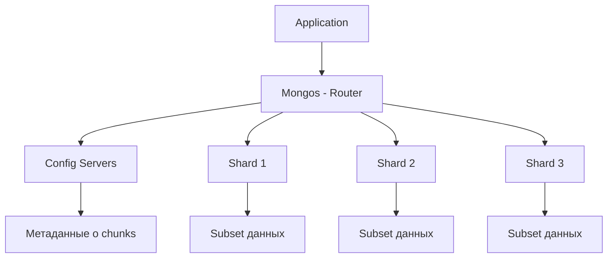

# 🗂️ Sharding в MongoDB

Sharding — это метод горизонтального масштабирования, при котором данные распределяются по нескольким серверам (shards). Это позволяет обрабатывать терабайты данных и миллионы операций в секунду.

## Архитектура Sharded Cluster



**Компоненты:**
- **Mongos:** Роутер запросов, выбирает нужные shard'ы
- **Config Servers:** Хранят метаданные о распределении данных
- **Shards:** Хранят актуальные данные (обычно replica sets)

## Зачем нужен Sharding?

✅ **Когда использовать:**
- Размер данных превышает ресурсы одного сервера (>2TB)
- Пропускная способность (queries/sec) упирается в лимиты сервера
- Рабочий набор данных не помещается в RAM

❌ **Когда НЕ нужен:**
- Данные `<` 100GB (достаточно вертикального масштабирования)
- Большинство запросов не используют shard key
- Слабая инфраструктура (нужно минимум 3 config + 2 shards + mongos)

## Shard Key

Shard key — это поле (или набор полей), по которому данные распределяются между shards.

### Выбор Shard Key

```javascript
// ❌ Плохой shard key: монотонно растущий _id
sh.shardCollection("mydb.users", { _id: 1 })
// Проблема: все новые документы попадают в один shard (hotspot)

// ✅ Хороший shard key: hashed _id
sh.shardCollection("mydb.users", { _id: "hashed" })
// Равномерное распределение

// ✅ Compound shard key: country + userId
sh.shardCollection("mydb.users", { country: 1, userId: 1 })
// Можно эффективно запрашивать по country
```

**Критерии хорошего shard key:**
1. **Cardinality (уникальность):** Много разных значений
2. **Write Distribution:** Запись равномерно по shards
3. **Query Isolation:** Запросы попадают в минимум shards
4. **Monotonicity:** Не монотонно растущий

### Примеры Shard Keys

```javascript
// Для логов: хеш timestamp + userId
sh.shardCollection("logs.events", { 
  timestamp: "hashed", 
  userId: 1 
})

// Для e-commerce: country + customerId
sh.shardCollection("shop.orders", { 
  country: 1, 
  customerId: 1 
})

// Для IoT: deviceId
sh.shardCollection("iot.sensors", { 
  deviceId: "hashed" 
})

// Для multitenancy: tenantId + createdAt
sh.shardCollection("saas.data", { 
  tenantId: 1, 
  createdAt: 1 
})
```

## Настройка Sharded Cluster

### 1. Запуск Config Servers

```bash
# 3 config servers (replica set)
mongod --configsvr --replSet configRS --port 27019 --dbpath /data/config1
mongod --configsvr --replSet configRS --port 27020 --dbpath /data/config2
mongod --configsvr --replSet configRS --port 27021 --dbpath /data/config3

# Инициализация
mongosh --port 27019
rs.initiate({
  _id: "configRS",
  configsvr: true,
  members: [
    { _id: 0, host: "localhost:27019" },
    { _id: 1, host: "localhost:27020" },
    { _id: 2, host: "localhost:27021" }
  ]
})
```

### 2. Запуск Shards

```bash
# Shard 1 (replica set)
mongod --shardsvr --replSet shard1RS --port 27017 --dbpath /data/shard1
# ... остальные члены replica set

# Shard 2 (replica set)
mongod --shardsvr --replSet shard2RS --port 27018 --dbpath /data/shard2
# ... остальные члены replica set
```

### 3. Запуск Mongos

```bash
mongos --configdb configRS/localhost:27019,localhost:27020,localhost:27021 --port 27016
```

### 4. Добавление Shards

```javascript
// Подключение к mongos
mongosh --port 27016

// Добавление shards
sh.addShard("shard1RS/localhost:27017")
sh.addShard("shard2RS/localhost:27018")

// Проверка статуса
sh.status()
```

### 5. Включение Sharding для БД и коллекции

```javascript
// Включить sharding для БД
sh.enableSharding("mydb")

// Создать индекс на shard key
db.users.createIndex({ userId: "hashed" })

// Shard коллекцию
sh.shardCollection("mydb.users", { userId: "hashed" })
```

## Chunks и Balancing

MongoDB разбивает данные на **chunks** (по умолчанию 64MB). Балансер автоматически перемещает chunks между shards.

```javascript
// Просмотр chunks
use config
db.chunks.find({ ns: "mydb.users" }).pretty()

// Статистика по shards
db.users.getShardDistribution()

// Настройки балансировки
sh.setBalancerState(true)  // включить
sh.setBalancerState(false)  // выключить

// Балансировка только ночью
use config
db.settings.update(
  { _id: "balancer" },
  { $set: { activeWindow: { start: "23:00", stop: "06:00" } } },
  { upsert: true }
)

// Размер chunk (default 64MB)
use config
db.settings.save({ _id: "chunksize", value: 128 })  // 128MB
```

## Запросы в Sharded Cluster

### Targeted Query (эффективно)

```javascript
// Запрос использует shard key → попадает в 1 shard
db.users.find({ userId: 12345 })
```

### Broadcast Query (неэффективно)

```javascript
// Запрос БЕЗ shard key → mongos опрашивает ВСЕ shards
db.users.find({ email: "john@example.com" })
```

### Aggregate с Sharding

```javascript
// Pipeline разбивается: часть на shards, часть на mongos
db.orders.aggregate([
  { $match: { status: "completed" } },  // на shards
  { $group: { _id: "$userId", total: { $sum: "$amount" } } },  // на shards
  { $sort: { total: -1 } },  // на mongos (merge)
  { $limit: 10 }  // на mongos
])
```

## TypeScript примеры

```typescript
import { MongoClient } from 'mongodb';

// Подключение к mongos
const client = new MongoClient('mongodb://localhost:27016');

async function shardingExamples() {
  await client.connect();
  const db = client.db('mydb');
  const admin = client.db('admin');
  
  // Включить sharding для БД
  await admin.command({ enableSharding: 'mydb' });
  
  // Создать индекс и shard коллекцию
  await db.collection('users').createIndex({ userId: 'hashed' });
  await admin.command({
    shardCollection: 'mydb.users',
    key: { userId: 'hashed' }
  });
  
  // Статистика
  const shardStats = await db.command({ dbStats: 1 });
  console.log('Database stats:', shardStats);
  
  // Распределение коллекции по shards
  const collStats = await db.collection('users').stats();
  console.log('Collection stats:', collStats.sharded, collStats.shards);
  
  await client.close();
}

// Мониторинг балансировки
async function monitorBalancing() {
  await client.connect();
  const config = client.db('config');
  
  // Chunks по shards
  const chunks = await config.collection('chunks')
    .aggregate([
      { $match: { ns: 'mydb.users' } },
      { $group: { _id: '$shard', count: { $sum: 1 } } }
    ])
    .toArray();
  
  console.log('Chunks per shard:', chunks);
  
  // История балансировки
  const balancerHistory = await config.collection('changelog')
    .find({ what: 'moveChunk.commit' })
    .sort({ time: -1 })
    .limit(10)
    .toArray();
  
  console.log('Recent balancing:', balancerHistory);
  
  await client.close();
}
```

## Zones (Tag-aware Sharding)

Zones позволяют привязать диапазоны данных к конкретным shards.

```javascript
// Создать зоны для geo-distribution
sh.addShardTag("shard1RS", "US")
sh.addShardTag("shard2RS", "EU")
sh.addShardTag("shard3RS", "ASIA")

// Назначить диапазоны
sh.addTagRange(
  "mydb.users",
  { country: "US", userId: MinKey },
  { country: "US", userId: MaxKey },
  "US"
)

sh.addTagRange(
  "mydb.users",
  { country: "DE", userId: MinKey },
  { country: "DE", userId: MaxKey },
  "EU"
)

// Теперь данные пользователей из US останутся в shard1RS
```

## Резервное копирование Sharded Cluster

```bash
# Остановить балансировку
mongosh --port 27016
sh.stopBalancer()

# Бэкап каждого shard
mongodump --host shard1RS/localhost:27017 --out /backup/shard1
mongodump --host shard2RS/localhost:27018 --out /backup/shard2

# Бэкап config servers
mongodump --host configRS/localhost:27019 --out /backup/config

# Возобновить балансировку
sh.startBalancer()
```

## 💡 Best Practices

1. **Shard Key нельзя изменить** после создания коллекции! Выбирайте тщательно.

2. **Тестируйте на реальных данных:**
   - Симулируйте production нагрузку
   - Проверяйте распределение chunks
   - Мониторьте hotspots

3. **Мониторинг:**
   - Размер chunks и балансировка
   - Targeted vs broadcast queries
   - Latency между mongos и shards

4. **Планируйте миграцию:**
   - Начинайте с replica set
   - Переходите на sharding при >100GB или bottleneck

5. **Инфраструктура:**
   - Config servers: минимум 3 (replica set)
   - Shards: минимум 2 (каждый replica set)
   - Mongos: минимум 2 (для HA)

## Ограничения Sharding

- Уникальные индексы должны включать shard key
- Нельзя делать multi-document transactions между shards (до MongoDB 4.2)
- Некоторые команды не поддерживаются (group, mapReduce)
- Overhead на мониторинг и управление

## ⚠️ Частые ошибки

- Выбор монотонно растущего shard key (_id, timestamp)
- Недостаточная cardinality (например, только 10 разных значений)
- Запросы без shard key (broadcast на все shards)
- Игнорирование мониторинга балансировки

---

**Следующий урок:** [Replica Sets в MongoDB](/databases/mongodb-replica-sets) →
