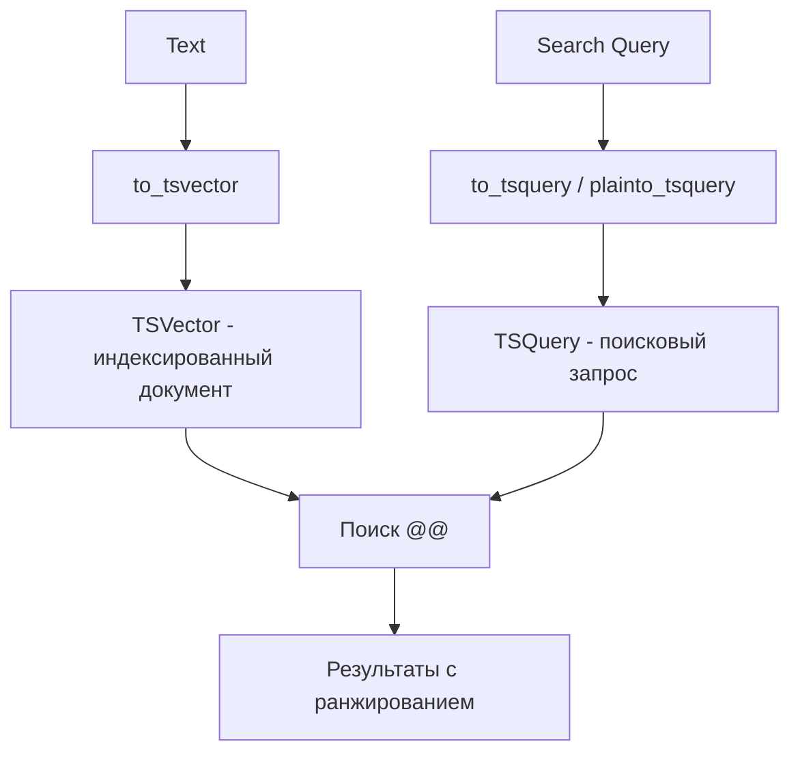

# 🔎 Full-Text Search в PostgreSQL

Full-Text Search (FTS) в PostgreSQL позволяет эффективно искать по текстовым данным с учётом морфологии, релевантности и ранжирования.

## Основные концепции



## TSVector и TSQuery

### TSVector - представление документа

```sql
-- Создание tsvector из текста
SELECT to_tsvector('english', 'The quick brown fox jumps over the lazy dog');
-- Результат: 'brown':3 'dog':9 'fox':4 'jump':5 'lazi':8 'quick':2

-- Процесс:
-- 1. Токенизация (разбиение на слова)
-- 2. Нормализация (приведение к нижнему регистру)
-- 3. Удаление стоп-слов (the, over, etc.)
-- 4. Стемминг (jumps -> jump, lazy -> lazi)
```

### TSQuery - поисковый запрос

```sql
-- to_tsquery - полный контроль (операторы &, |, !)
SELECT to_tsquery('english', 'fox & dog');
SELECT to_tsquery('english', 'fox | cat');
SELECT to_tsquery('english', 'fox & !cat');

-- plainto_tsquery - простой текст
SELECT plainto_tsquery('english', 'fox dog');  -- fox & dog

-- phraseto_tsquery - фраза целиком
SELECT phraseto_tsquery('english', 'quick brown fox');  -- 'quick' `<->` 'brown' `<->` 'fox'

-- websearch_to_tsquery - синтаксис Google (PostgreSQL 11+)
SELECT websearch_to_tsquery('english', '"quick fox" OR cat -dog');
```

## Базовый полнотекстовый поиск

```sql
CREATE TABLE articles (
    id SERIAL PRIMARY KEY,
    title VARCHAR(200),
    content TEXT,
    author VARCHAR(100),
    created_at TIMESTAMP DEFAULT NOW()
);

INSERT INTO articles (title, content, author) VALUES
('PostgreSQL Full-Text Search', 'PostgreSQL provides powerful full-text search capabilities...', 'Alice'),
('Introduction to Databases', 'Databases are essential for modern applications...', 'Bob'),
('Advanced PostgreSQL', 'Learn advanced PostgreSQL features like partitioning...', 'Alice');

-- Простой поиск
SELECT title 
FROM articles
WHERE to_tsvector('english', content) @@ to_tsquery('english', 'PostgreSQL');

-- Поиск по нескольким полям
SELECT title, author
FROM articles
WHERE to_tsvector('english', title || ' ' || content) @@ plainto_tsquery('english', 'PostgreSQL search');
```

## Generated Column для FTS

```sql
-- Добавление generated column для поискового вектора
ALTER TABLE articles
ADD COLUMN search_vector tsvector
GENERATED ALWAYS AS (
    setweight(to_tsvector('english', coalesce(title, '')), 'A') ||
    setweight(to_tsvector('english', coalesce(content, '')), 'B') ||
    setweight(to_tsvector('english', coalesce(author, '')), 'C')
) STORED;

-- Теперь поиск проще и быстрее
SELECT title FROM articles
WHERE search_vector @@ plainto_tsquery('english', 'PostgreSQL');
```

**Веса:**
- `A`: Самая высокая важность (заголовки)
- `B`: Высокая важность (основной контент)
- `C`: Средняя важность (автор, метаданные)
- `D`: Низкая важность

## GIN индекс для FTS

```sql
-- Создание GIN индекса
CREATE INDEX idx_articles_search ON articles USING GIN(search_vector);

-- Теперь поиск использует индекс
EXPLAIN ANALYZE
SELECT title FROM articles
WHERE search_vector @@ plainto_tsquery('english', 'PostgreSQL');
```

## Ранжирование результатов

```sql
-- ts_rank - базовое ранжирование
SELECT 
    title,
    ts_rank(search_vector, query) AS rank
FROM articles, plainto_tsquery('english', 'PostgreSQL database') query
WHERE search_vector @@ query
ORDER BY rank DESC;

-- ts_rank_cd - с учётом расстояния между словами
SELECT 
    title,
    ts_rank_cd(search_vector, query) AS rank
FROM articles, plainto_tsquery('english', 'PostgreSQL database') query
WHERE search_vector @@ query
ORDER BY rank DESC;

-- Нормализация ранга (0..1)
SELECT 
    title,
    ts_rank(search_vector, query, 1) AS normalized_rank
FROM articles, plainto_tsquery('english', 'PostgreSQL') query
WHERE search_vector @@ query
ORDER BY normalized_rank DESC;
```

## Подсветка результатов

```sql
-- ts_headline - выделение найденных слов
SELECT 
    title,
    ts_headline(
        'english',
        content,
        query,
        'StartSel=<b>, StopSel=</b>, MaxWords=50, MinWords=25'
    ) AS snippet
FROM articles, plainto_tsquery('english', 'PostgreSQL search') query
WHERE search_vector @@ query;

-- Результат:
-- PostgreSQL provides powerful full-text search capabilities... (with <b> tags)
```

## Многоязычный поиск

```sql
CREATE TABLE multilang_articles (
    id SERIAL PRIMARY KEY,
    title VARCHAR(200),
    content TEXT,
    language VARCHAR(20),  -- 'english', 'russian', 'spanish'
    search_vector tsvector
);

-- Триггер для автоматического обновления search_vector
CREATE OR REPLACE FUNCTION update_search_vector()
RETURNS TRIGGER AS $$
BEGIN
    NEW.search_vector := 
        setweight(to_tsvector(NEW.language::regconfig, coalesce(NEW.title, '')), 'A') ||
        setweight(to_tsvector(NEW.language::regconfig, coalesce(NEW.content, '')), 'B');
    RETURN NEW;
END;
$$ LANGUAGE plpgsql;

CREATE TRIGGER tsvector_update
    BEFORE INSERT OR UPDATE ON multilang_articles
    FOR EACH ROW
    EXECUTE FUNCTION update_search_vector();

-- Вставка на разных языках
INSERT INTO multilang_articles (title, content, language) VALUES
('PostgreSQL Tutorial', 'Learn PostgreSQL full-text search', 'english'),
('Руководство по PostgreSQL', 'Изучаем полнотекстовый поиск в PostgreSQL', 'russian');

-- Поиск на английском
SELECT title FROM multilang_articles
WHERE language = 'english' 
AND search_vector @@ plainto_tsquery('english', 'PostgreSQL search');

-- Поиск на русском
SELECT title FROM multilang_articles
WHERE language = 'russian' 
AND search_vector @@ plainto_tsquery('russian', 'полнотекстовый поиск');
```

## Продвинутые техники

### Fuzzy Search (нечёткий поиск)

```sql
-- Установка расширения pg_trgm
CREATE EXTENSION IF NOT EXISTS pg_trgm;

-- GIN индекс для триграмм
CREATE INDEX idx_articles_title_trgm ON articles USING GIN(title gin_trgm_ops);

-- Поиск с опечатками (similarity)
SELECT title, similarity(title, 'PostgreSQl') AS sim
FROM articles
WHERE title % 'PostgreSQl'  -- оператор % использует триграммы
ORDER BY sim DESC;

-- Комбинация FTS и fuzzy search
SELECT title,
       ts_rank(search_vector, query) AS fts_rank,
       similarity(title, 'PostgreSQl') AS fuzzy_rank
FROM articles, plainto_tsquery('english', 'PostgreSQL') query
WHERE search_vector @@ query OR title % 'PostgreSQl'
ORDER BY fts_rank + fuzzy_rank DESC;
```

### Autocomplete / Suggestions

```sql
-- Префиксный поиск с :*
SELECT title
FROM articles
WHERE search_vector @@ to_tsquery('english', 'post:*');
-- Найдёт: PostgreSQL, posting, postman, etc.

-- TOP suggestions с частотой
SELECT word, ndoc AS frequency
FROM ts_stat('SELECT search_vector FROM articles')
WHERE word LIKE 'post%'
ORDER BY frequency DESC
LIMIT 10;
```

## Агрегация и группировка

```sql
-- Поиск по агрегированным документам
WITH aggregated AS (
    SELECT 
        author,
        string_agg(title || ' ' || content, ' ') AS all_text
    FROM articles
    GROUP BY author
)
SELECT 
    author,
    ts_rank(to_tsvector('english', all_text), query) AS rank
FROM aggregated, plainto_tsquery('english', 'PostgreSQL') query
WHERE to_tsvector('english', all_text) @@ query
ORDER BY rank DESC;
```

## TypeScript примеры

```typescript
import { Pool } from 'pg';

const pool = new Pool({
  connectionString: process.env.DATABASE_URL,
});

interface SearchResult {
  id: number;
  title: string;
  snippet: string;
  rank: number;
}

// Полнотекстовый поиск с подсветкой
async function searchArticles(
  searchQuery: string,
  limit: number = 10
): Promise<SearchResult[]> {
  const result = await pool.query(
    `
    SELECT 
      id,
      title,
      ts_headline(
        'english',
        content,
        query,
        'StartSel=<mark>, StopSel=</mark>, MaxWords=50'
      ) AS snippet,
      ts_rank(search_vector, query) AS rank
    FROM articles, plainto_tsquery('english', $1) query
    WHERE search_vector @@ query
    ORDER BY rank DESC
    LIMIT $2
    `,
    [searchQuery, limit]
  );
  return result.rows;
}

// Поиск с фильтрами
async function advancedSearch(params: {
  query: string;
  author?: string;
  dateFrom?: Date;
  dateTo?: Date;
}) {
  let sql = `
    SELECT id, title, author, created_at,
           ts_rank(search_vector, plainto_tsquery('english', $1)) AS rank
    FROM articles
    WHERE search_vector @@ plainto_tsquery('english', $1)
  `;
  const values: any[] = [params.query];
  let paramIndex = 2;

  if (params.author) {
    sql += ` AND author = $${paramIndex}`;
    values.push(params.author);
    paramIndex++;
  }

  if (params.dateFrom) {
    sql += ` AND created_at >= $${paramIndex}`;
    values.push(params.dateFrom);
    paramIndex++;
  }

  if (params.dateTo) {
    sql += ` AND created_at <= $${paramIndex}`;
    values.push(params.dateTo);
    paramIndex++;
  }

  sql += ' ORDER BY rank DESC LIMIT 20';

  const result = await pool.query(sql, values);
  return result.rows;
}

// Autocomplete suggestions
async function getSuggestions(prefix: string, limit: number = 5) {
  const result = await pool.query(
    `
    SELECT DISTINCT word
    FROM ts_stat(
      'SELECT search_vector FROM articles'
    )
    WHERE word LIKE $1
    ORDER BY ndoc DESC
    LIMIT $2
    `,
    [`${prefix}%`, limit]
  );
  return result.rows.map((r) => r.word);
}

// Fuzzy search для опечаток
async function fuzzySearch(query: string) {
  const result = await pool.query(
    `
    SELECT 
      id,
      title,
      similarity(title, $1) AS sim
    FROM articles
    WHERE title % $1
    ORDER BY sim DESC
    LIMIT 10
    `,
    [query]
  );
  return result.rows;
}

// Поиск "похожих" статей
async function findSimilar(articleId: number, limit: number = 5) {
  const result = await pool.query(
    `
    WITH target AS (
      SELECT search_vector FROM articles WHERE id = $1
    )
    SELECT 
      a.id,
      a.title,
      ts_rank(a.search_vector, target.search_vector::tsquery) AS similarity
    FROM articles a, target
    WHERE a.id != $1
    ORDER BY similarity DESC
    LIMIT $2
    `,
    [articleId, limit]
  );
  return result.rows;
}
```

## 💡 Best Practices

1. **Используйте generated columns** для search_vector
2. **Создавайте GIN индексы** на tsvector колонках
3. **Устанавливайте веса** (A, B, C, D) для разных полей
4. **Нормализуйте ранги** для сравнимых результатов
5. **Комбинируйте FTS с pg_trgm** для устойчивости к опечаткам
6. **Кэшируйте популярные запросы** в приложении

## Производительность

```sql
-- Проверка использования индекса
EXPLAIN ANALYZE
SELECT title FROM articles
WHERE search_vector @@ plainto_tsquery('english', 'PostgreSQL');

-- Статистика по индексу
SELECT 
    schemaname,
    tablename,
    indexname,
    idx_scan,
    pg_size_pretty(pg_relation_size(indexname::regclass))
FROM pg_stat_user_indexes
WHERE indexname LIKE '%search%';
```

## Альтернативы

Когда FTS PostgreSQL не подходит:
- **Elasticsearch**: Более мощные возможности, real-time индексация
- **Meilisearch**: Быстрый typo-tolerant поиск
- **Typesense**: Open-source альтернатива Algolia
- **Algolia**: SaaS решение для поиска

Используйте PostgreSQL FTS если:
- Уже используете PostgreSQL
- Простые требования к поиску
- Не хотите поднимать отдельный сервис
- Данные не очень большие (меньше 10M документов)

## ⚠️ Частые ошибки

- Забывают создать GIN индекс (медленный поиск)
- Не используют generated columns (пересчёт при каждом запросе)
- Игнорируют веса полей (плохое ранжирование)
- Используют `LIKE '%text%'` вместо FTS

---

**Следующий урок:** [Partitioning в PostgreSQL](/databases/postgresql-partitioning) →
