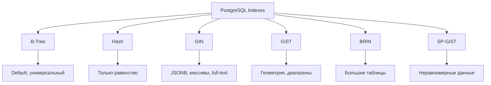

# 🔍 Индексы в PostgreSQL

Индексы — это структуры данных, которые ускоряют поиск записей в таблице. PostgreSQL поддерживает несколько типов индексов для разных сценариев использования.

## Типы индексов



## B-Tree: Универсальный индекс

B-Tree — это индекс по умолчанию, подходит для большинства случаев.

### Когда использовать B-Tree

- Поиск по равенству: `WHERE id = 10`
- Диапазоны: `WHERE created_at > '2024-01-01'`
- Сортировка: `ORDER BY username`
- Префиксный поиск: `WHERE email LIKE 'john%'`

### Создание B-Tree индекса

```sql
-- Простой индекс
CREATE INDEX idx_users_email ON users(email);

-- Составной индекс (порядок важен!)
CREATE INDEX idx_users_status_created ON users(status, created_at);

-- Уникальный индекс
CREATE UNIQUE INDEX idx_users_username ON users(username);

-- Частичный индекс (только активные пользователи)
CREATE INDEX idx_active_users 
ON users(email) 
WHERE status = 'active';

-- Индекс с сортировкой
CREATE INDEX idx_posts_created_desc 
ON posts(created_at DESC NULLS LAST);
```

### Пример использования

```sql
-- Запрос использует индекс
EXPLAIN ANALYZE
SELECT * FROM users 
WHERE email = 'john@example.com';

-- Составной индекс: эффективен
SELECT * FROM users 
WHERE status = 'active' AND created_at > NOW() - INTERVAL '1 day';

-- Неэффективно: индекс не используется (обратный порядок)
SELECT * FROM users 
WHERE created_at > NOW() - INTERVAL '1 day' AND status = 'active';
```

## Hash: Только для равенства

Hash индексы оптимизированы для операций `=`, но не поддерживают диапазоны и сортировку.

```sql
-- Создание Hash индекса
CREATE INDEX idx_users_api_key ON users USING HASH(api_key);

-- Эффективно
SELECT * FROM users WHERE api_key = 'abc123xyz';

-- НЕ использует индекс
SELECT * FROM users WHERE api_key > 'abc';
```

⚠️ **Важно:** Hash индексы раньше не логировались в WAL (до PostgreSQL 10), теперь безопасны для использования.

## GIN: Для массивов и JSONB

GIN (Generalized Inverted Index) идеален для полнотекстового поиска, JSONB и массивов.

### JSONB индексы

```sql
-- Таблица с JSONB
CREATE TABLE products (
    id SERIAL PRIMARY KEY,
    name VARCHAR(100),
    attributes JSONB
);

-- GIN индекс для JSONB
CREATE INDEX idx_products_attributes ON products USING GIN(attributes);

-- Вставка данных
INSERT INTO products (name, attributes) VALUES 
('Laptop', '{"brand": "Dell", "ram": 16, "tags": ["business", "portable"]}'),
('Phone', '{"brand": "Apple", "storage": 128, "tags": ["mobile", "5G"]}');

-- Поиск по ключу
SELECT * FROM products 
WHERE attributes ? 'brand';

-- Поиск по значению
SELECT * FROM products 
WHERE attributes @> '{"brand": "Dell"}';

-- Поиск в массиве
SELECT * FROM products 
WHERE attributes->'tags' ? 'portable';
```

### Массивы

```sql
CREATE TABLE articles (
    id SERIAL PRIMARY KEY,
    title TEXT,
    tags TEXT[]
);

-- GIN индекс для массива
CREATE INDEX idx_articles_tags ON articles USING GIN(tags);

INSERT INTO articles (title, tags) VALUES 
('PostgreSQL Guide', ARRAY['database', 'sql', 'tutorial']),
('Node.js Best Practices', ARRAY['javascript', 'nodejs', 'backend']);

-- Поиск статей с тегом 'database'
SELECT * FROM articles WHERE tags @> ARRAY['database'];

-- Поиск статей с любым из тегов
SELECT * FROM articles WHERE tags && ARRAY['sql', 'nodejs'];
```

## GiST: Геометрия и диапазоны

GiST (Generalized Search Tree) для пространственных данных и диапазонов.

```sql
-- Установка PostGIS для геоданных
CREATE EXTENSION postgis;

CREATE TABLE locations (
    id SERIAL PRIMARY KEY,
    name VARCHAR(100),
    coordinates GEOGRAPHY(POINT)
);

-- GiST индекс для геоданных
CREATE INDEX idx_locations_coordinates 
ON locations USING GIST(coordinates);

-- Поиск в радиусе 1000 метров
SELECT name 
FROM locations 
WHERE ST_DWithin(
    coordinates,
    ST_MakePoint(37.7749, -122.4194)::geography,
    1000
);

-- Диапазоны
CREATE TABLE bookings (
    id SERIAL PRIMARY KEY,
    room_id INT,
    period TSRANGE
);

CREATE INDEX idx_bookings_period ON bookings USING GIST(period);

-- Поиск пересечений
SELECT * FROM bookings 
WHERE period && tsrange('2024-01-01', '2024-01-10');
```

## BRIN: Для больших таблиц

BRIN (Block Range Index) — компактный индекс для больших отсортированных таблиц.

```sql
-- Таблица с логами (миллионы записей)
CREATE TABLE logs (
    id BIGSERIAL PRIMARY KEY,
    created_at TIMESTAMP NOT NULL,
    message TEXT
);

-- BRIN индекс (очень маленький размер)
CREATE INDEX idx_logs_created ON logs USING BRIN(created_at);

-- Эффективен для диапазонов
SELECT * FROM logs 
WHERE created_at BETWEEN '2024-01-01' AND '2024-01-31';
```

**Плюсы BRIN:**
- Очень маленький размер (1-2% от B-Tree)
- Быстрое создание и обновление

**Минусы:**
- Требует физической сортировки данных
- Менее точный, чем B-Tree

## Мониторинг индексов

```sql
-- Размер индексов
SELECT
    schemaname,
    tablename,
    indexname,
    pg_size_pretty(pg_relation_size(indexname::regclass)) as size
FROM pg_indexes
WHERE schemaname = 'public'
ORDER BY pg_relation_size(indexname::regclass) DESC;

-- Неиспользуемые индексы
SELECT
    schemaname,
    tablename,
    indexname,
    idx_scan,
    idx_tup_read,
    idx_tup_fetch
FROM pg_stat_user_indexes
WHERE idx_scan = 0
ORDER BY pg_relation_size(indexname::regclass) DESC;

-- Эффективность использования индекса
SELECT
    schemaname,
    tablename,
    indexname,
    idx_scan,
    pg_size_pretty(pg_relation_size(indexname::regclass)) as size
FROM pg_stat_user_indexes
ORDER BY idx_scan ASC;
```

## TypeScript пример с индексами

```typescript
import { Pool } from 'pg';

const pool = new Pool({
  connectionString: process.env.DATABASE_URL,
});

// Поиск с использованием B-Tree индекса
async function findUserByEmail(email: string) {
  const result = await pool.query(
    'SELECT * FROM users WHERE email = $1',
    [email]
  );
  return result.rows[0];
}

// JSONB поиск с GIN индексом
async function findProductsByBrand(brand: string) {
  const result = await pool.query(
    'SELECT * FROM products WHERE attributes @> $1',
    [JSON.stringify({ brand })]
  );
  return result.rows;
}

// Поиск по массиву с GIN индексом
async function findArticlesByTags(tags: string[]) {
  const result = await pool.query(
    'SELECT * FROM articles WHERE tags && $1',
    [tags]
  );
  return result.rows;
}

// Анализ использования индекса
async function explainQuery(query: string, params: any[]) {
  const result = await pool.query(
    `EXPLAIN (ANALYZE, BUFFERS, FORMAT JSON) ${query}`,
    params
  );
  console.log(JSON.stringify(result.rows[0], null, 2));
}
```

## 💡 Best Practices

1. **Составные индексы**: Помещайте селективные колонки первыми
2. **Частичные индексы**: Индексируйте только нужные строки (WHERE clause)
3. **Покрывающие индексы**: Добавляйте INCLUDE для избежания обращения к таблице
4. **Мониторинг**: Регулярно проверяйте неиспользуемые индексы
5. **EXPLAIN ANALYZE**: Всегда проверяйте планы запросов

## ⚠️ Частые ошибки

- Создание индексов на каждую колонку (overhead на INSERT/UPDATE)
- Игнорирование порядка колонок в составных индексах
- Не использование частичных индексов для фильтрации
- Забывают обновлять статистику (`ANALYZE`)

---

**Следующий урок:** [Триггеры в PostgreSQL](/databases/postgresql-triggers) →
