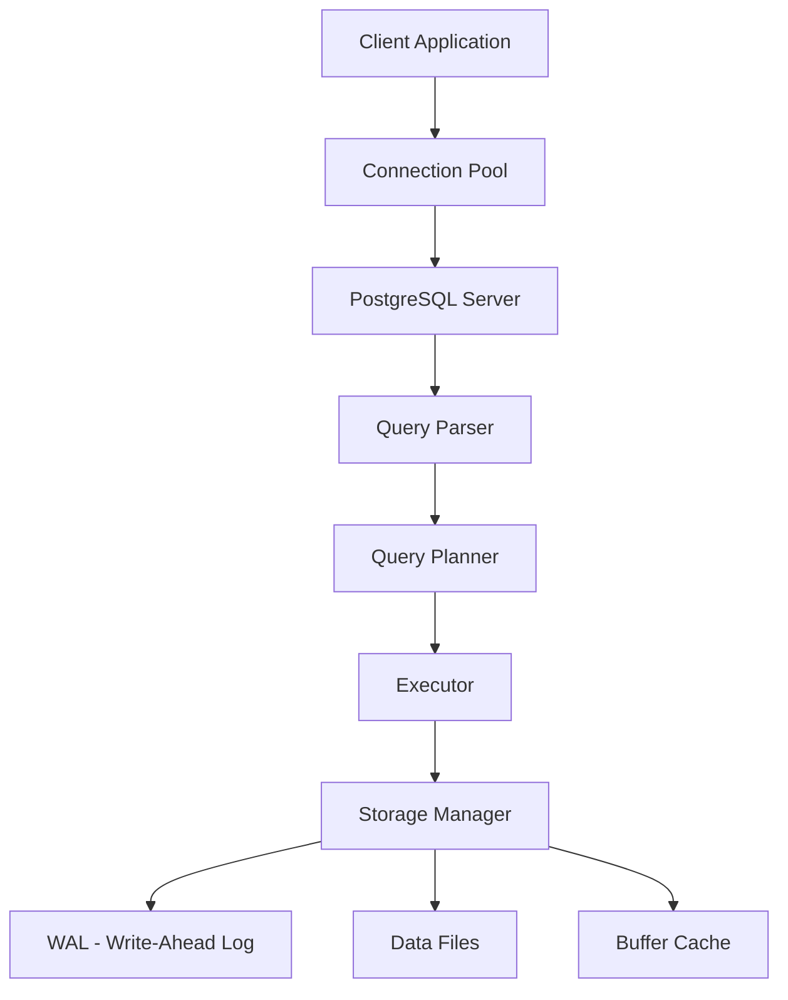

# 🐘 PostgreSQL: Основы

PostgreSQL — это мощная объектно-реляционная СУБД с открытым исходным кодом. Известна своей надёжностью, расширяемостью и соответствием стандартам SQL.

## Почему PostgreSQL?

- **ACID-совместимость**: Полная поддержка транзакций
- **Богатый набор типов данных**: JSON, массивы, геометрия, XML
- **Расширяемость**: Возможность создавать свои типы данных и функции
- **Производительность**: Эффективная обработка сложных запросов
- **Сообщество**: Активная поддержка и регулярные обновления

## Архитектура PostgreSQL



## Основные компоненты

### 1. Процессы
- **Postmaster**: Главный процесс сервера
- **Backend processes**: Обрабатывают запросы клиентов
- **Background workers**: Автовакуум, checkpoint, WAL writer

### 2. Память
- **Shared buffers**: Кэш страниц данных
- **Work memory**: Для операций сортировки и хеширования
- **Maintenance work memory**: Для VACUUM, CREATE INDEX

## Базовые операции

### Создание базы данных

```sql
-- Создание базы данных
CREATE DATABASE myapp
    WITH ENCODING 'UTF8'
    LC_COLLATE = 'en_US.UTF-8'
    LC_CTYPE = 'en_US.UTF-8'
    TEMPLATE template0;

-- Подключение к базе
\c myapp
```

### Создание таблицы

```sql
CREATE TABLE users (
    id SERIAL PRIMARY KEY,
    username VARCHAR(50) UNIQUE NOT NULL,
    email VARCHAR(100) UNIQUE NOT NULL,
    created_at TIMESTAMP DEFAULT NOW(),
    updated_at TIMESTAMP DEFAULT NOW(),
    metadata JSONB
);

-- Добавление индекса
CREATE INDEX idx_users_email ON users(email);
CREATE INDEX idx_users_metadata ON users USING GIN(metadata);
```

### CRUD операции

```sql
-- Create
INSERT INTO users (username, email, metadata)
VALUES ('john_doe', 'john@example.com', '{"role": "admin", "verified": true}');

-- Read
SELECT id, username, email, metadata->>'role' as role
FROM users
WHERE metadata->>'verified' = 'true';

-- Update
UPDATE users
SET metadata = jsonb_set(metadata, '{last_login}', to_jsonb(NOW()))
WHERE username = 'john_doe';

-- Delete
DELETE FROM users WHERE id = 1;
```

## Работа с транзакциями

```sql
BEGIN;

INSERT INTO users (username, email) VALUES ('alice', 'alice@example.com');
UPDATE users SET updated_at = NOW() WHERE username = 'john_doe';

-- Проверка перед коммитом
SELECT * FROM users WHERE username IN ('alice', 'john_doe');

COMMIT; -- или ROLLBACK для отмены
```

## Использование в Node.js

```typescript
import { Pool } from 'pg';

const pool = new Pool({
  host: 'localhost',
  port: 5432,
  database: 'myapp',
  user: 'postgres',
  password: 'password',
  max: 20, // максимум подключений в пуле
});

// Простой запрос
async function getUser(id: number) {
  const result = await pool.query(
    'SELECT * FROM users WHERE id = $1',
    [id]
  );
  return result.rows[0];
}

// Транзакция
async function createUser(username: string, email: string) {
  const client = await pool.connect();
  try {
    await client.query('BEGIN');
    
    const result = await client.query(
      'INSERT INTO users (username, email) VALUES ($1, $2) RETURNING id',
      [username, email]
    );
    
    await client.query(
      'INSERT INTO user_audit (user_id, action) VALUES ($1, $2)',
      [result.rows[0].id, 'created']
    );
    
    await client.query('COMMIT');
    return result.rows[0];
  } catch (e) {
    await client.query('ROLLBACK');
    throw e;
  } finally {
    client.release();
  }
}
```

## 💡 Best Practices

1. **Используйте подготовленные запросы** для защиты от SQL-инъекций
2. **Настройте connection pooling** для эффективного управления подключениями
3. **Регулярно запускайте VACUUM** для очистки мёртвых строк
4. **Мониторьте производительность** с помощью pg_stat_statements
5. **Делайте резервные копии** с помощью pg_dump или pg_basebackup

## Полезные команды psql

```sql
-- Список баз данных
\l

-- Список таблиц
\dt

-- Описание таблицы
\d users

-- Список индексов
\di

-- Размер таблицы
SELECT pg_size_pretty(pg_total_relation_size('users'));

-- Активные подключения
SELECT * FROM pg_stat_activity;
```

## ⚠️ Частые ошибки

- Забывают создавать индексы на внешние ключи
- Не используют EXPLAIN ANALYZE для анализа запросов
- Игнорируют настройки shared_buffers и work_mem
- Не мониторят размер таблиц и индексов

---

**Следующий урок:** [Индексы в PostgreSQL](/databases/postgresql-indexes) →
