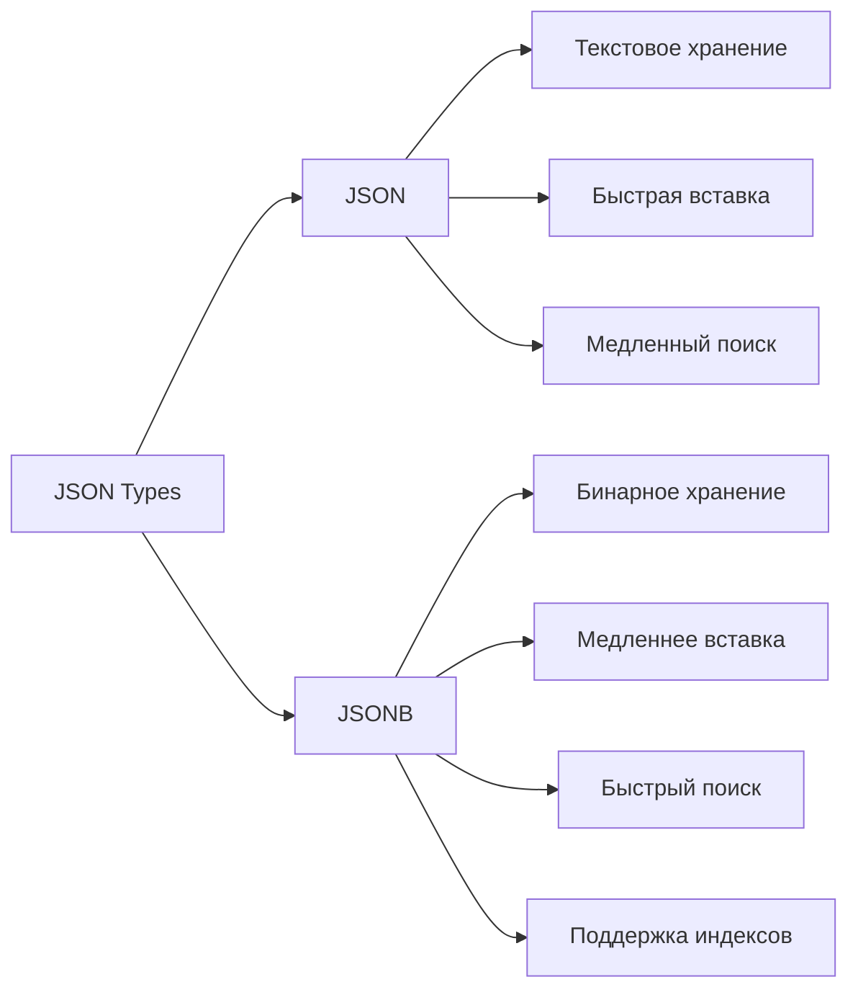

# 📦 JSON и JSONB в PostgreSQL

PostgreSQL имеет мощную поддержку JSON, позволяя хранить полуструктурированные данные в реляционной базе.

## JSON vs JSONB



| Характеристика | JSON | JSONB |
|---|---|---|
| Хранение | Текст (как введено) | Бинарный формат |
| Вставка | Быстрая | Медленнее (парсинг) |
| Поиск | Медленный | Быстрый |
| Индексы | Нет | GIN, GiST |
| Порядок ключей | Сохраняется | Не гарантируется |
| Дубликаты ключей | Сохраняются | Удаляются |
| Пробелы | Сохраняются | Удаляются |

**Рекомендация:** Почти всегда используйте `JSONB`!

## Создание таблицы с JSONB

```sql
CREATE TABLE products (
    id SERIAL PRIMARY KEY,
    name VARCHAR(200) NOT NULL,
    category VARCHAR(100),
    attributes JSONB,
    created_at TIMESTAMP DEFAULT NOW()
);

-- Вставка данных
INSERT INTO products (name, category, attributes) VALUES
('Laptop Dell XPS 15', 'Computers', '{
    "brand": "Dell",
    "model": "XPS 15",
    "specs": {
        "cpu": "Intel i7",
        "ram": 16,
        "storage": 512,
        "screen": 15.6
    },
    "tags": ["business", "portable", "premium"],
    "price": 1500,
    "in_stock": true
}'),
('iPhone 15 Pro', 'Phones', '{
    "brand": "Apple",
    "model": "iPhone 15 Pro",
    "specs": {
        "storage": 256,
        "camera": "48MP",
        "screen": 6.1
    },
    "tags": ["mobile", "5G", "premium"],
    "price": 999,
    "in_stock": true
}');
```

## Операторы для работы с JSON/JSONB

### Извлечение данных

```sql
-- -> возвращает JSON
SELECT attributes -> 'brand' FROM products;
-- Результат: "Dell"

-- ->> возвращает текст
SELECT attributes ->> 'brand' FROM products;
-- Результат: Dell

-- Вложенные объекты
SELECT attributes -> 'specs' -> 'cpu' FROM products;
SELECT attributes -> 'specs' ->> 'cpu' FROM products;  -- Intel i7

-- Массивы (индекс с 0)
SELECT attributes -> 'tags' -> 0 FROM products;  -- "business"
SELECT attributes -> 'tags' ->> 1 FROM products;  -- portable

-- Путь через несколько уровней
SELECT attributes #> '{specs, ram}' FROM products;
SELECT attributes #>> '{specs, ram}' FROM products;  -- 16
```

### Проверка существования

```sql
-- ? - ключ существует на верхнем уровне
SELECT * FROM products WHERE attributes ? 'brand';

-- ?& - все ключи существуют
SELECT * FROM products WHERE attributes ?& ARRAY['brand', 'price'];

-- ?| - хотя бы один ключ существует
SELECT * FROM products WHERE attributes ?| ARRAY['brand', 'manufacturer'];

-- @> - содержит JSON
SELECT * FROM products WHERE attributes @> '{"brand": "Dell"}';

-- <@ - содержится в JSON
SELECT * FROM products WHERE '{"brand": "Dell"}' <@ attributes;
```

### Поиск в массивах

```sql
-- Массив содержит элемент
SELECT * FROM products 
WHERE attributes -> 'tags' ? 'premium';

-- Массив содержит любой из элементов
SELECT * FROM products 
WHERE attributes -> 'tags' ?| ARRAY['mobile', '5G'];

-- Массив содержит все элементы
SELECT * FROM products 
WHERE attributes -> 'tags' ?& ARRAY['premium', 'portable'];

-- Альтернативный синтаксис
SELECT * FROM products 
WHERE attributes @> '{"tags": ["premium"]}';
```

## Индексы для JSONB

### GIN индекс

```sql
-- Базовый GIN индекс для всего документа
CREATE INDEX idx_products_attributes ON products USING GIN(attributes);

-- Поддерживает операторы: ?, ?&, ?|, @>, @@

-- GIN индекс для конкретного поля
CREATE INDEX idx_products_tags ON products USING GIN((attributes -> 'tags'));

-- Для полнотекстового поиска
CREATE INDEX idx_products_search ON products 
USING GIN(to_tsvector('english', attributes ->> 'name'));
```

### Выражения в индексах

```sql
-- Индекс на конкретное поле
CREATE INDEX idx_products_brand ON products((attributes ->> 'brand'));

-- Индекс на вложенное поле
CREATE INDEX idx_products_cpu ON products((attributes #>> '{specs, cpu}'));

-- Теперь можно эффективно искать
SELECT * FROM products WHERE attributes ->> 'brand' = 'Dell';
SELECT * FROM products WHERE attributes #>> '{specs, cpu}' = 'Intel i7';
```

## Изменение JSONB данных

### jsonb_set - обновление значения

```sql
-- Обновление поля верхнего уровня
UPDATE products 
SET attributes = jsonb_set(
    attributes,
    '{price}',
    '1299'
)
WHERE name = 'Laptop Dell XPS 15';

-- Обновление вложенного поля
UPDATE products 
SET attributes = jsonb_set(
    attributes,
    '{specs, ram}',
    '32'
)
WHERE id = 1;

-- Создание нового поля
UPDATE products 
SET attributes = jsonb_set(
    attributes,
    '{discount}',
    '10',
    true  -- create_missing = true
)
WHERE category = 'Computers';
```

### Добавление и удаление полей

```sql
-- Добавление поля (concatenation)
UPDATE products 
SET attributes = attributes || '{"warranty": "2 years"}'
WHERE id = 1;

-- Удаление поля
UPDATE products 
SET attributes = attributes - 'discount'
WHERE id = 1;

-- Удаление вложенного поля
UPDATE products 
SET attributes = attributes #- '{specs, old_field}'
WHERE id = 1;
```

### Операции с массивами

```sql
-- Добавление элемента в массив
UPDATE products 
SET attributes = jsonb_set(
    attributes,
    '{tags}',
    (attributes -> 'tags') || '"new-tag"'
)
WHERE id = 1;

-- Удаление элемента из массива (индекс 0)
UPDATE products 
SET attributes = jsonb_set(
    attributes,
    '{tags}',
    (attributes -> 'tags') - 0
)
WHERE id = 1;
```

## JSON функции

### Построение JSON

```sql
-- json_build_object
SELECT json_build_object(
    'id', id,
    'name', name,
    'brand', attributes ->> 'brand'
) FROM products;

-- json_agg - агрегация в массив
SELECT category, json_agg(
    json_build_object(
        'name', name,
        'price', attributes -> 'price'
    )
) as products
FROM products
GROUP BY category;

-- jsonb_object_agg - агрегация в объект
SELECT jsonb_object_agg(name, attributes -> 'price') as prices
FROM products;
```

### Разбор JSON

```sql
-- jsonb_each - развернуть объект в строки
SELECT * FROM jsonb_each('{"a": 1, "b": 2, "c": 3}');
-- key | value
-- a   | 1
-- b   | 2
-- c   | 3

-- jsonb_array_elements - развернуть массив
SELECT * FROM products, 
    jsonb_array_elements(attributes -> 'tags') as tag;

-- jsonb_to_record - JSON в запись
SELECT * FROM jsonb_to_record('{"name": "John", "age": 30}') 
AS x(name text, age int);
```

## Валидация с JSON Schema

```sql
-- Функция для валидации (требует расширения)
CREATE EXTENSION IF NOT EXISTS plpython3u;

CREATE OR REPLACE FUNCTION validate_product_attributes(data jsonb)
RETURNS boolean AS $$
    # Простая валидация
    if 'brand' not in data:
        return False
    if 'price' not in data or float(data['price']) <= 0:
        return False
    return True
$$ LANGUAGE plpython3u;

-- Constraint с валидацией
ALTER TABLE products
ADD CONSTRAINT valid_attributes 
CHECK (validate_product_attributes(attributes));
```

Или с триггером:

```sql
CREATE OR REPLACE FUNCTION check_product_attributes()
RETURNS TRIGGER AS $$
BEGIN
    IF NOT (NEW.attributes ? 'brand') THEN
        RAISE EXCEPTION 'brand is required';
    END IF;
    IF NOT (NEW.attributes ? 'price') THEN
        RAISE EXCEPTION 'price is required';
    END IF;
    RETURN NEW;
END;
$$ LANGUAGE plpgsql;

CREATE TRIGGER validate_product
    BEFORE INSERT OR UPDATE ON products
    FOR EACH ROW
    EXECUTE FUNCTION check_product_attributes();
```

## TypeScript примеры

```typescript
import { Pool } from 'pg';

const pool = new Pool({
  connectionString: process.env.DATABASE_URL,
});

interface ProductAttributes {
  brand: string;
  model: string;
  specs: {
    cpu?: string;
    ram?: number;
    storage?: number;
  };
  tags: string[];
  price: number;
  in_stock: boolean;
}

// Создание продукта
async function createProduct(
  name: string,
  category: string,
  attributes: ProductAttributes
) {
  const result = await pool.query(
    'INSERT INTO products (name, category, attributes) VALUES ($1, $2, $3) RETURNING *',
    [name, category, attributes]
  );
  return result.rows[0];
}

// Поиск по JSONB
async function findProductsByBrand(brand: string) {
  const result = await pool.query(
    `SELECT id, name, attributes 
     FROM products 
     WHERE attributes @> $1`,
    [JSON.stringify({ brand })]
  );
  return result.rows;
}

// Поиск по тегам
async function findProductsByTags(tags: string[]) {
  const result = await pool.query(
    `SELECT id, name, attributes 
     FROM products 
     WHERE attributes -> 'tags' ?| $1`,
    [tags]
  );
  return result.rows;
}

// Обновление цены
async function updatePrice(id: number, newPrice: number) {
  await pool.query(
    `UPDATE products 
     SET attributes = jsonb_set(attributes, '{price}', $2)
     WHERE id = $1`,
    [id, JSON.stringify(newPrice)]
  );
}

// Фильтрация по диапазону цен
async function findProductsByPriceRange(min: number, max: number) {
  const result = await pool.query(
    `SELECT id, name, attributes ->> 'price' as price
     FROM products 
     WHERE (attributes ->> 'price')::numeric BETWEEN $1 AND $2
     ORDER BY (attributes ->> 'price')::numeric`,
    [min, max]
  );
  return result.rows;
}

// Агрегация с группировкой
async function getProductStatsByCategory() {
  const result = await pool.query(`
    SELECT 
      category,
      COUNT(*) as total_products,
      AVG((attributes ->> 'price')::numeric) as avg_price,
      jsonb_agg(
        jsonb_build_object(
          'name', name,
          'brand', attributes ->> 'brand',
          'price', attributes -> 'price'
        )
      ) as products
    FROM products
    GROUP BY category
  `);
  return result.rows;
}
```

## 💡 Best Practices

1. **Используйте JSONB** вместо JSON (почти всегда)
2. **Создавайте GIN индексы** для часто используемых полей
3. **Валидируйте структуру** через триггеры или constraints
4. **Не злоупотребляйте**: Если структура фиксирована — используйте обычные колонки
5. **Комбинируйте** реляционные и JSONB данные для гибкости

## Когда использовать JSONB

✅ **Хорошо для:**
- Гибкая схема (разные атрибуты для разных продуктов)
- Метаданные и настройки
- Логи и события
- API ответы
- Интеграции с внешними системами

❌ **Плохо для:**
- Данные с фиксированной структурой
- Частые JOIN'ы по полям внутри JSON
- Данные, требующие строгой типизации
- Поля для foreign key

## ⚠️ Частые ошибки

- Использование JSON вместо JSONB
- Отсутствие индексов на часто запрашиваемых полях
- Хранение всего в JSON (избыточная гибкость)
- Забывают приведение типов при сравнении чисел

---

**Следующий урок:** [Full-Text Search в PostgreSQL](/databases/postgresql-fulltext) →
