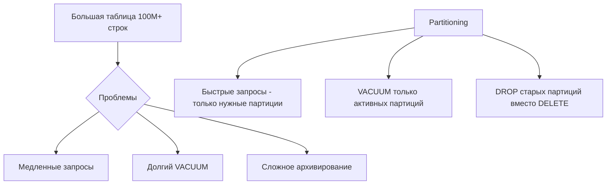

# 📊 Partitioning (секционирование) в PostgreSQL

Partitioning позволяет разбить большую таблицу на более мелкие физические части, сохраняя единую логическую структуру. Это улучшает производительность и управляемость.

## Зачем нужен Partitioning?



**Преимущества:**
- Быстрые запросы (scan только нужных партиций)
- Эффективный VACUUM (каждая партиция отдельно)
- Простое удаление старых данных (DROP PARTITION вместо DELETE)
- Параллельная обработка партиций

## Типы Partitioning

### 1. Range Partitioning

Разбиение по диапазону значений (даты, числа).

```sql
-- Родительская таблица
CREATE TABLE orders (
    id BIGSERIAL,
    order_date DATE NOT NULL,
    customer_id INT,
    amount DECIMAL(10, 2),
    status VARCHAR(20)
) PARTITION BY RANGE (order_date);

-- Партиции по месяцам
CREATE TABLE orders_2024_01 PARTITION OF orders
    FOR VALUES FROM ('2024-01-01') TO ('2024-02-01');

CREATE TABLE orders_2024_02 PARTITION OF orders
    FOR VALUES FROM ('2024-02-01') TO ('2024-03-01');

CREATE TABLE orders_2024_03 PARTITION OF orders
    FOR VALUES FROM ('2024-03-01') TO ('2024-04-01');

-- Партиция по умолчанию (для неподходящих значений)
CREATE TABLE orders_default PARTITION OF orders DEFAULT;

-- Вставка данных автоматически попадает в нужную партицию
INSERT INTO orders (order_date, customer_id, amount, status)
VALUES ('2024-01-15', 123, 99.99, 'completed');

-- Запрос автоматически использует только нужные партиции
SELECT * FROM orders WHERE order_date BETWEEN '2024-01-01' AND '2024-01-31';
-- Сканируется только orders_2024_01
```

### 2. List Partitioning

Разбиение по списку конкретных значений.

```sql
CREATE TABLE users (
    id BIGSERIAL,
    username VARCHAR(100),
    country VARCHAR(2),
    email VARCHAR(200)
) PARTITION BY LIST (country);

-- Партиции по странам
CREATE TABLE users_us PARTITION OF users
    FOR VALUES IN ('US');

CREATE TABLE users_eu PARTITION OF users
    FOR VALUES IN ('DE', 'FR', 'ES', 'IT');

CREATE TABLE users_asia PARTITION OF users
    FOR VALUES IN ('JP', 'CN', 'IN');

CREATE TABLE users_other PARTITION OF users DEFAULT;
```

### 3. Hash Partitioning

Разбиение по хешу (для равномерного распределения).

```sql
CREATE TABLE events (
    id BIGSERIAL,
    event_type VARCHAR(50),
    user_id BIGINT,
    data JSONB,
    created_at TIMESTAMP
) PARTITION BY HASH (user_id);

-- 4 партиции для равномерного распределения
CREATE TABLE events_0 PARTITION OF events
    FOR VALUES WITH (MODULUS 4, REMAINDER 0);

CREATE TABLE events_1 PARTITION OF events
    FOR VALUES WITH (MODULUS 4, REMAINDER 1);

CREATE TABLE events_2 PARTITION OF events
    FOR VALUES WITH (MODULUS 4, REMAINDER 2);

CREATE TABLE events_3 PARTITION OF events
    FOR VALUES WITH (MODULUS 4, REMAINDER 3);
```

## Многоуровневое Partitioning

```sql
-- Сначала по диапазону (год), затем по списку (статус)
CREATE TABLE sales (
    id BIGSERIAL,
    sale_date DATE NOT NULL,
    region VARCHAR(50),
    amount DECIMAL(10, 2),
    status VARCHAR(20)
) PARTITION BY RANGE (sale_date);

-- Партиция по годам
CREATE TABLE sales_2024 PARTITION OF sales
    FOR VALUES FROM ('2024-01-01') TO ('2025-01-01')
    PARTITION BY LIST (region);

-- Подпартиции по регионам
CREATE TABLE sales_2024_us PARTITION OF sales_2024
    FOR VALUES IN ('US', 'CA');

CREATE TABLE sales_2024_eu PARTITION OF sales_2024
    FOR VALUES IN ('DE', 'FR', 'UK');

CREATE TABLE sales_2024_asia PARTITION OF sales_2024
    FOR VALUES IN ('JP', 'CN');
```

## Индексы на партиционированных таблицах

```sql
-- Индекс на родительской таблице автоматически создаётся на всех партициях
CREATE INDEX idx_orders_customer ON orders(customer_id);

-- Индекс на конкретной партиции
CREATE INDEX idx_orders_2024_01_status ON orders_2024_01(status);

-- Уникальный индекс должен включать ключ партиционирования
CREATE UNIQUE INDEX idx_orders_id_date ON orders(id, order_date);
```

## Автоматическое создание партиций

### Функция для создания партиций

```sql
CREATE OR REPLACE FUNCTION create_monthly_partitions(
    table_name TEXT,
    start_date DATE,
    end_date DATE
)
RETURNS VOID AS $$
DECLARE
    partition_date DATE;
    partition_name TEXT;
    start_range DATE;
    end_range DATE;
BEGIN
    partition_date := DATE_TRUNC('month', start_date);
    
    WHILE partition_date < end_date LOOP
        partition_name := table_name || '_' || TO_CHAR(partition_date, 'YYYY_MM');
        start_range := partition_date;
        end_range := partition_date + INTERVAL '1 month';
        
        -- Проверка существования партиции
        IF NOT EXISTS (
            SELECT 1 FROM pg_class WHERE relname = partition_name
        ) THEN
            EXECUTE format(
                'CREATE TABLE %I PARTITION OF %I FOR VALUES FROM (%L) TO (%L)',
                partition_name, table_name, start_range, end_range
            );
            RAISE NOTICE 'Created partition: %', partition_name;
        END IF;
        
        partition_date := partition_date + INTERVAL '1 month';
    END LOOP;
END;
$$ LANGUAGE plpgsql;

-- Создание партиций на год вперёд
SELECT create_monthly_partitions('orders', CURRENT_DATE, CURRENT_DATE + INTERVAL '12 months');
```

### Триггер для автоматического создания

```sql
CREATE OR REPLACE FUNCTION auto_create_partition()
RETURNS TRIGGER AS $$
DECLARE
    partition_name TEXT;
    start_date DATE;
    end_date DATE;
BEGIN
    start_date := DATE_TRUNC('month', NEW.order_date);
    end_date := start_date + INTERVAL '1 month';
    partition_name := 'orders_' || TO_CHAR(start_date, 'YYYY_MM');
    
    IF NOT EXISTS (
        SELECT 1 FROM pg_class WHERE relname = partition_name
    ) THEN
        EXECUTE format(
            'CREATE TABLE %I PARTITION OF orders FOR VALUES FROM (%L) TO (%L)',
            partition_name, start_date, end_date
        );
        RAISE NOTICE 'Auto-created partition: %', partition_name;
    END IF;
    
    RETURN NEW;
END;
$$ LANGUAGE plpgsql;

CREATE TRIGGER create_partition_trigger
    BEFORE INSERT ON orders
    FOR EACH ROW
    EXECUTE FUNCTION auto_create_partition();
```

## Управление партициями

### Присоединение существующей таблицы

```sql
-- Создание таблицы с такой же структурой
CREATE TABLE old_orders (LIKE orders INCLUDING ALL);

-- Заполнение данными
INSERT INTO old_orders SELECT * FROM some_archive WHERE ...;

-- Присоединение как партиция
ALTER TABLE orders ATTACH PARTITION old_orders
    FOR VALUES FROM ('2023-01-01') TO ('2023-02-01');
```

### Отсоединение партиции

```sql
-- Отсоединить партицию (превращается в обычную таблицу)
ALTER TABLE orders DETACH PARTITION orders_2023_01;

-- Теперь можно работать с ней отдельно
ALTER TABLE orders_2023_01 RENAME TO archived_orders_2023_01;

-- Или удалить
DROP TABLE orders_2023_01;
```

### Удаление старых данных

```sql
-- Вместо медленного DELETE
-- DELETE FROM orders WHERE order_date < '2023-01-01';

-- Быстрое удаление партиции
DROP TABLE orders_2023_01;
DROP TABLE orders_2023_02;
-- и т.д.
```

## TypeScript примеры

```typescript
import { Pool } from 'pg';

const pool = new Pool({
  connectionString: process.env.DATABASE_URL,
});

// Автоматическое создание будущих партиций
async function ensurePartitionsExist(months: number = 3) {
  const result = await pool.query(
    `SELECT create_monthly_partitions('orders', CURRENT_DATE, CURRENT_DATE + INTERVAL '${months} months')`
  );
  console.log('Partitions ensured for next', months, 'months');
}

// Получение списка партиций
async function listPartitions(tableName: string) {
  const result = await pool.query(
    `
    SELECT 
      schemaname,
      tablename,
      pg_size_pretty(pg_total_relation_size(schemaname||'.'||tablename)) as size
    FROM pg_tables
    WHERE tablename LIKE $1
    ORDER BY tablename DESC
    `,
    [`${tableName}_%`]
  );
  return result.rows;
}

// Удаление старых партиций
async function dropOldPartitions(
  tableName: string,
  keepMonths: number = 12
) {
  const cutoffDate = new Date();
  cutoffDate.setMonth(cutoffDate.getMonth() - keepMonths);
  
  const partitions = await listPartitions(tableName);
  
  for (const partition of partitions) {
    // Парсинг даты из имени партиции (orders_2023_01)
    const match = partition.tablename.match(/_(\d{4})_(\d{2})$/);
    if (!match) continue;
    
    const partitionDate = new Date(parseInt(match[1]), parseInt(match[2]) - 1);
    
    if (partitionDate < cutoffDate) {
      console.log(`Dropping old partition: ${partition.tablename}`);
      await pool.query(`DROP TABLE IF EXISTS ${partition.tablename}`);
    }
  }
}

// Статистика по партициям
async function getPartitionStats(tableName: string) {
  const result = await pool.query(
    `
    SELECT 
      c.relname as partition_name,
      pg_size_pretty(pg_total_relation_size(c.oid)) as total_size,
      pg_size_pretty(pg_relation_size(c.oid)) as table_size,
      pg_size_pretty(pg_total_relation_size(c.oid) - pg_relation_size(c.oid)) as indexes_size,
      (SELECT count(*) FROM ONLY c.relname) as approx_row_count
    FROM pg_class c
    JOIN pg_inherits i ON i.inhrelid = c.oid
    JOIN pg_class p ON i.inhparent = p.oid
    WHERE p.relname = $1
    ORDER BY c.relname DESC
    `,
    [tableName]
  );
  return result.rows;
}

// Миграция данных между партициями (если нужно изменить ключ)
async function rebalancePartitions(
  tableName: string,
  fromPartition: string,
  toPartition: string,
  condition: string
) {
  const client = await pool.connect();
  try {
    await client.query('BEGIN');
    
    // Перенос данных
    await client.query(
      `INSERT INTO ${toPartition} SELECT * FROM ${fromPartition} WHERE ${condition}`
    );
    
    // Удаление из старой партиции
    await client.query(`DELETE FROM ${fromPartition} WHERE ${condition}`);
    
    await client.query('COMMIT');
    console.log('Rebalancing completed');
  } catch (error) {
    await client.query('ROLLBACK');
    throw error;
  } finally {
    client.release();
  }
}

// Cron job для поддержания партиций
async function maintenanceJob() {
  // Создать партиции на 3 месяца вперёд
  await ensurePartitionsExist(3);
  
  // Удалить партиции старше 12 месяцев
  await dropOldPartitions('orders', 12);
  
  // Статистика
  const stats = await getPartitionStats('orders');
  console.log('Partition stats:', stats);
}

// Запуск раз в день
setInterval(maintenanceJob, 24 * 60 * 60 * 1000);
```

## Partition Pruning (оптимизация)

```sql
-- Включить partition pruning (по умолчанию включен)
SET enable_partition_pruning = ON;

-- Проверка, какие партиции сканируются
EXPLAIN (ANALYZE, BUFFERS)
SELECT * FROM orders WHERE order_date BETWEEN '2024-01-01' AND '2024-01-31';

-- Должно показать только orders_2024_01
```

## 💡 Best Practices

1. **Выбор ключа партиционирования:**
   - Используйте колонки, по которым часто фильтруете
   - Для логов/событий: дата/время
   - Для географических данных: регион/страна

2. **Размер партиций:**
   - Не слишком маленькие (<1GB)
   - Не слишком большие (>100GB)
   - Золотая середина: 10-50GB

3. **Индексы:**
   - Создавайте на родительской таблице
   - Локальные индексы для специфичных партиций

4. **Автоматизация:**
   - Автоматическое создание будущих партиций
   - Регулярное удаление старых партиций
   - Мониторинг размера партиций

5. **Constraint Exclusion:**
   - Добавляйте CHECK constraints для старых версий PG (<11)

## Когда НЕ использовать Partitioning

❌ **Не подходит для:**
- Маленьких таблиц (<10M строк)
- Таблиц без явного ключа для разбиения
- Когда запросы редко фильтруют по ключу партиционирования
- Частых UPDATE, которые меняют ключ партиционирования

## ⚠️ Частые ошибки

- Партиции слишком маленькие (сотни партиций)
- Забывают создавать партиции заранее (данные попадают в DEFAULT)
- Не удаляют старые партиции (место не освобождается)
- Уникальные ключи без ключа партиционирования

---

**Следующий урок:** [MongoDB: Введение](/databases/mongodb-intro) →
