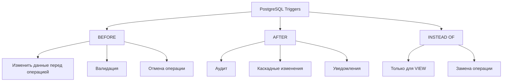

# ⚡ Триггеры в PostgreSQL

Триггеры — это функции, которые автоматически выполняются при определённых событиях на таблице: INSERT, UPDATE, DELETE или TRUNCATE.

## Типы триггеров



## Структура триггера

Триггер состоит из двух частей:
1. **Триггерная функция** (написана на PL/pgSQL)
2. **Сам триггер** (привязка функции к таблице)

## BEFORE триггеры

BEFORE триггеры выполняются до изменения данных и могут изменить или отменить операцию.

### Автообновление timestamp

```sql
-- Функция для обновления updated_at
CREATE OR REPLACE FUNCTION update_timestamp()
RETURNS TRIGGER AS $$
BEGIN
    NEW.updated_at = NOW();
    RETURN NEW;
END;
$$ LANGUAGE plpgsql;

-- Создание таблицы
CREATE TABLE posts (
    id SERIAL PRIMARY KEY,
    title VARCHAR(200) NOT NULL,
    content TEXT,
    created_at TIMESTAMP DEFAULT NOW(),
    updated_at TIMESTAMP DEFAULT NOW()
);

-- Триггер на UPDATE
CREATE TRIGGER set_updated_at
    BEFORE UPDATE ON posts
    FOR EACH ROW
    EXECUTE FUNCTION update_timestamp();

-- Тест
INSERT INTO posts (title, content) VALUES ('First Post', 'Hello World');
UPDATE posts SET content = 'Updated content' WHERE id = 1;

SELECT id, title, created_at, updated_at FROM posts;
```

### Валидация данных

```sql
-- Функция валидации email
CREATE OR REPLACE FUNCTION validate_email()
RETURNS TRIGGER AS $$
BEGIN
    IF NEW.email !~ '^[A-Za-z0-9._%+-]+@[A-Za-z0-9.-]+\.[A-Z|a-z]{2,}$' THEN
        RAISE EXCEPTION 'Invalid email format: %', NEW.email;
    END IF;
    RETURN NEW;
END;
$$ LANGUAGE plpgsql;

CREATE TABLE users (
    id SERIAL PRIMARY KEY,
    username VARCHAR(50) NOT NULL,
    email VARCHAR(100) NOT NULL
);

CREATE TRIGGER check_email
    BEFORE INSERT OR UPDATE ON users
    FOR EACH ROW
    EXECUTE FUNCTION validate_email();

-- Ошибка: Invalid email format
INSERT INTO users (username, email) VALUES ('john', 'invalid-email');

-- Успех
INSERT INTO users (username, email) VALUES ('john', 'john@example.com');
```

### Автоматическое заполнение slug

```sql
CREATE OR REPLACE FUNCTION generate_slug()
RETURNS TRIGGER AS $$
BEGIN
    NEW.slug = lower(
        regexp_replace(
            regexp_replace(NEW.title, '[^a-zA-Z0-9\s-]', '', 'g'),
            '\s+', '-', 'g'
        )
    );
    RETURN NEW;
END;
$$ LANGUAGE plpgsql;

CREATE TABLE articles (
    id SERIAL PRIMARY KEY,
    title VARCHAR(200) NOT NULL,
    slug VARCHAR(200),
    content TEXT
);

CREATE TRIGGER auto_slug
    BEFORE INSERT OR UPDATE OF title ON articles
    FOR EACH ROW
    EXECUTE FUNCTION generate_slug();

INSERT INTO articles (title, content) 
VALUES ('Hello World! This is #1', 'Some content');

SELECT id, title, slug FROM articles;
-- slug: hello-world-this-is-1
```

## AFTER триггеры

AFTER триггеры выполняются после изменения данных, полезны для аудита и каскадных операций.

### Аудит изменений

```sql
-- Таблица аудита
CREATE TABLE audit_log (
    id BIGSERIAL PRIMARY KEY,
    table_name VARCHAR(50),
    operation VARCHAR(10),
    old_data JSONB,
    new_data JSONB,
    changed_by VARCHAR(50),
    changed_at TIMESTAMP DEFAULT NOW()
);

-- Функция аудита
CREATE OR REPLACE FUNCTION audit_changes()
RETURNS TRIGGER AS $$
BEGIN
    INSERT INTO audit_log (table_name, operation, old_data, new_data, changed_by)
    VALUES (
        TG_TABLE_NAME,
        TG_OP,
        CASE WHEN TG_OP = 'DELETE' THEN to_jsonb(OLD) ELSE NULL END,
        CASE WHEN TG_OP IN ('INSERT', 'UPDATE') THEN to_jsonb(NEW) ELSE NULL END,
        current_user
    );
    
    IF TG_OP = 'DELETE' THEN
        RETURN OLD;
    ELSE
        RETURN NEW;
    END IF;
END;
$$ LANGUAGE plpgsql;

-- Применение ко всем операциям
CREATE TRIGGER users_audit
    AFTER INSERT OR UPDATE OR DELETE ON users
    FOR EACH ROW
    EXECUTE FUNCTION audit_changes();

-- Тест
INSERT INTO users (username, email) VALUES ('alice', 'alice@example.com');
UPDATE users SET email = 'alice.new@example.com' WHERE username = 'alice';
DELETE FROM users WHERE username = 'alice';

-- Проверка аудита
SELECT 
    operation,
    old_data->>'email' as old_email,
    new_data->>'email' as new_email,
    changed_at
FROM audit_log
WHERE table_name = 'users'
ORDER BY changed_at DESC;
```

### Каскадное обновление счётчика

```sql
CREATE TABLE categories (
    id SERIAL PRIMARY KEY,
    name VARCHAR(100),
    post_count INT DEFAULT 0
);

CREATE TABLE blog_posts (
    id SERIAL PRIMARY KEY,
    title VARCHAR(200),
    category_id INT REFERENCES categories(id)
);

-- Увеличение счётчика
CREATE OR REPLACE FUNCTION increment_post_count()
RETURNS TRIGGER AS $$
BEGIN
    UPDATE categories 
    SET post_count = post_count + 1 
    WHERE id = NEW.category_id;
    RETURN NEW;
END;
$$ LANGUAGE plpgsql;

-- Уменьшение счётчика
CREATE OR REPLACE FUNCTION decrement_post_count()
RETURNS TRIGGER AS $$
BEGIN
    UPDATE categories 
    SET post_count = post_count - 1 
    WHERE id = OLD.category_id;
    RETURN OLD;
END;
$$ LANGUAGE plpgsql;

CREATE TRIGGER blog_posts_insert
    AFTER INSERT ON blog_posts
    FOR EACH ROW
    EXECUTE FUNCTION increment_post_count();

CREATE TRIGGER blog_posts_delete
    AFTER DELETE ON blog_posts
    FOR EACH ROW
    EXECUTE FUNCTION decrement_post_count();

-- Тест
INSERT INTO categories (name) VALUES ('Technology');
INSERT INTO blog_posts (title, category_id) VALUES ('PostgreSQL Guide', 1);
INSERT INTO blog_posts (title, category_id) VALUES ('Node.js Tips', 1);

SELECT name, post_count FROM categories;
-- post_count: 2
```

### NOTIFY для real-time обновлений

```sql
CREATE OR REPLACE FUNCTION notify_new_post()
RETURNS TRIGGER AS $$
BEGIN
    PERFORM pg_notify(
        'new_post',
        json_build_object(
            'id', NEW.id,
            'title', NEW.title,
            'category_id', NEW.category_id
        )::text
    );
    RETURN NEW;
END;
$$ LANGUAGE plpgsql;

CREATE TRIGGER new_post_notification
    AFTER INSERT ON blog_posts
    FOR EACH ROW
    EXECUTE FUNCTION notify_new_post();
```

## INSTEAD OF триггеры (для VIEW)

```sql
-- Представление с объединением таблиц
CREATE VIEW user_posts AS
SELECT 
    u.id as user_id,
    u.username,
    p.id as post_id,
    p.title,
    p.content
FROM users u
LEFT JOIN posts p ON u.id = p.user_id;

-- INSTEAD OF триггер для INSERT
CREATE OR REPLACE FUNCTION insert_user_post()
RETURNS TRIGGER AS $$
BEGIN
    -- Вставка в таблицу posts
    INSERT INTO posts (user_id, title, content)
    VALUES (NEW.user_id, NEW.title, NEW.content);
    RETURN NEW;
END;
$$ LANGUAGE plpgsql;

CREATE TRIGGER insert_via_view
    INSTEAD OF INSERT ON user_posts
    FOR EACH ROW
    EXECUTE FUNCTION insert_user_post();

-- Теперь можем вставлять через VIEW
INSERT INTO user_posts (user_id, title, content)
VALUES (1, 'New Post', 'Content here');
```

## Условные триггеры (WHEN)

```sql
-- Триггер срабатывает только если изменился email
CREATE TRIGGER email_changed
    AFTER UPDATE ON users
    FOR EACH ROW
    WHEN (OLD.email IS DISTINCT FROM NEW.email)
    EXECUTE FUNCTION audit_changes();

-- Триггер только для активных пользователей
CREATE TRIGGER active_users_only
    BEFORE UPDATE ON users
    FOR EACH ROW
    WHEN (NEW.status = 'active')
    EXECUTE FUNCTION update_timestamp();
```

## TypeScript: Работа с NOTIFY

```typescript
import { Client } from 'pg';

const client = new Client({
  connectionString: process.env.DATABASE_URL,
});

await client.connect();

// Подписка на уведомления
client.on('notification', (msg) => {
  console.log('Channel:', msg.channel);
  console.log('Payload:', JSON.parse(msg.payload));
  
  // Отправка в WebSocket, SSE и т.д.
  broadcastToClients(msg.channel, JSON.parse(msg.payload));
});

await client.query('LISTEN new_post');

console.log('Listening for new posts...');
```

## 💡 Best Practices

1. **Держите триггеры простыми**: Сложная логика лучше в приложении
2. **Избегайте каскадных триггеров**: Может привести к бесконечным циклам
3. **Используйте WHEN**: Для фильтрации ненужных срабатываний
4. **Логируйте ошибки**: В триггерах сложно дебажить
5. **Тестируйте производительность**: Триггеры выполняются при каждой операции

## Управление триггерами

```sql
-- Отключить триггер
ALTER TABLE users DISABLE TRIGGER users_audit;

-- Включить триггер
ALTER TABLE users ENABLE TRIGGER users_audit;

-- Удалить триггер
DROP TRIGGER IF EXISTS users_audit ON users;

-- Список всех триггеров
SELECT 
    trigger_name,
    event_manipulation,
    event_object_table,
    action_timing
FROM information_schema.triggers
WHERE trigger_schema = 'public'
ORDER BY event_object_table, trigger_name;
```

## ⚠️ Частые ошибки

- Забывают `RETURN NEW` в BEFORE триггерах (операция отменяется!)
- Бесконечные циклы при каскадных триггерах
- Тяжёлые операции в триггерах (замедляют INSERT/UPDATE)
- Не обрабатывают исключения

---

**Следующий урок:** [Views и Materialized Views](/databases/postgresql-views) →
