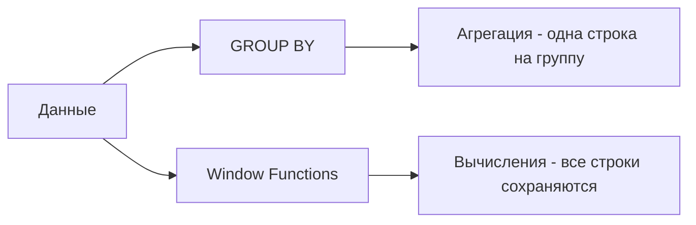

# 🪟 Window Functions в PostgreSQL

Window Functions (оконные функции) выполняют вычисления по набору строк, связанных с текущей строкой, без группировки результата.

## Разница с GROUP BY



```sql
-- GROUP BY - сворачивает строки
SELECT 
    department,
    AVG(salary) as avg_salary
FROM employees
GROUP BY department;

-- Window Function - сохраняет все строки
SELECT 
    name,
    department,
    salary,
    AVG(salary) OVER (PARTITION BY department) as dept_avg_salary
FROM employees;
```

## Базовый синтаксис

```sql
function_name([args]) OVER (
    [PARTITION BY partition_expression]
    [ORDER BY sort_expression]
    [frame_clause]
)
```

## Ranking Functions

### ROW_NUMBER(), RANK(), DENSE_RANK()

```sql
CREATE TABLE employees (
    id SERIAL PRIMARY KEY,
    name VARCHAR(100),
    department VARCHAR(50),
    salary DECIMAL(10, 2)
);

INSERT INTO employees (name, department, salary) VALUES
('Alice', 'Engineering', 95000),
('Bob', 'Engineering', 95000),
('Charlie', 'Engineering', 85000),
('David', 'Sales', 75000),
('Eve', 'Sales', 75000),
('Frank', 'Sales', 70000);

SELECT 
    name,
    department,
    salary,
    ROW_NUMBER() OVER (PARTITION BY department ORDER BY salary DESC) as row_num,
    RANK() OVER (PARTITION BY department ORDER BY salary DESC) as rank,
    DENSE_RANK() OVER (PARTITION BY department ORDER BY salary DESC) as dense_rank
FROM employees;

/*
Результат:
name    | dept         | salary | row_num | rank | dense_rank
--------|--------------|--------|---------|------|------------
Alice   | Engineering  | 95000  | 1       | 1    | 1
Bob     | Engineering  | 95000  | 2       | 1    | 1
Charlie | Engineering  | 85000  | 3       | 3    | 2
David   | Sales        | 75000  | 1       | 1    | 1
Eve     | Sales        | 75000  | 2       | 1    | 1
Frank   | Sales        | 70000  | 3       | 3    | 2
*/
```

**Разница:**
- `ROW_NUMBER()`: Уникальный номер для каждой строки (1, 2, 3...)
- `RANK()`: Одинаковый ранг для равных, пропускает (1, 1, 3...)
- `DENSE_RANK()`: Одинаковый ранг, не пропускает (1, 1, 2...)

### NTILE() - разбиение на группы

```sql
-- Разбить сотрудников на 4 квартиля по зарплате
SELECT 
    name,
    salary,
    NTILE(4) OVER (ORDER BY salary DESC) as quartile
FROM employees;

-- Применение: найти топ 25%
SELECT * FROM (
    SELECT 
        name,
        salary,
        NTILE(4) OVER (ORDER BY salary DESC) as quartile
    FROM employees
) t
WHERE quartile = 1;
```

## Aggregate Window Functions

### Cumulative SUM

```sql
CREATE TABLE sales (
    id SERIAL PRIMARY KEY,
    sale_date DATE,
    amount DECIMAL(10, 2)
);

INSERT INTO sales (sale_date, amount) VALUES
('2024-01-01', 100),
('2024-01-02', 150),
('2024-01-03', 200),
('2024-01-04', 120);

SELECT 
    sale_date,
    amount,
    SUM(amount) OVER (ORDER BY sale_date) as cumulative_total,
    AVG(amount) OVER (ORDER BY sale_date) as cumulative_avg
FROM sales;

/*
sale_date  | amount | cumulative_total | cumulative_avg
-----------|--------|------------------|----------------
2024-01-01 | 100    | 100              | 100.00
2024-01-02 | 150    | 250              | 125.00
2024-01-03 | 200    | 450              | 150.00
2024-01-04 | 120    | 570              | 142.50
*/
```

### Moving Average (скользящее среднее)

```sql
SELECT 
    sale_date,
    amount,
    -- Среднее за последние 3 дня (включая текущий)
    AVG(amount) OVER (
        ORDER BY sale_date
        ROWS BETWEEN 2 PRECEDING AND CURRENT ROW
    ) as moving_avg_3day
FROM sales;
```

## LAG() и LEAD()

Доступ к предыдущим и следующим строкам:

```sql
SELECT 
    sale_date,
    amount,
    LAG(amount, 1) OVER (ORDER BY sale_date) as prev_day_amount,
    LEAD(amount, 1) OVER (ORDER BY sale_date) as next_day_amount,
    amount - LAG(amount, 1) OVER (ORDER BY sale_date) as day_over_day_change
FROM sales;

/*
sale_date  | amount | prev_day | next_day | change
-----------|--------|----------|----------|--------
2024-01-01 | 100    | NULL     | 150      | NULL
2024-01-02 | 150    | 100      | 200      | 50
2024-01-03 | 200    | 150      | 120      | 50
2024-01-04 | 120    | 200      | NULL     | -80
*/
```

## FIRST_VALUE() и LAST_VALUE()

```sql
SELECT 
    sale_date,
    amount,
    FIRST_VALUE(amount) OVER (ORDER BY sale_date) as first_sale,
    LAST_VALUE(amount) OVER (
        ORDER BY sale_date
        ROWS BETWEEN UNBOUNDED PRECEDING AND UNBOUNDED FOLLOWING
    ) as last_sale
FROM sales;
```

⚠️ **Важно:** `LAST_VALUE()` требует явного указания рамки окна!

## Frame Clauses (рамки окна)

```sql
-- ROWS: физические строки
ROWS BETWEEN 2 PRECEDING AND CURRENT ROW  -- 3 строки: 2 предыдущих + текущая
ROWS BETWEEN UNBOUNDED PRECEDING AND CURRENT ROW  -- от начала до текущей
ROWS BETWEEN CURRENT ROW AND UNBOUNDED FOLLOWING  -- от текущей до конца

-- RANGE: логический диапазон (по значению ORDER BY)
RANGE BETWEEN INTERVAL '7 days' PRECEDING AND CURRENT ROW  -- последние 7 дней
```

Пример: скользящее окно за 7 дней

```sql
SELECT 
    sale_date,
    amount,
    SUM(amount) OVER (
        ORDER BY sale_date
        RANGE BETWEEN INTERVAL '6 days' PRECEDING AND CURRENT ROW
    ) as last_7_days_total
FROM sales;
```

## Практические примеры

### Топ N в каждой категории

```sql
-- Топ 3 самых дорогих продукта в каждой категории
WITH ranked_products AS (
    SELECT 
        category,
        name,
        price,
        ROW_NUMBER() OVER (PARTITION BY category ORDER BY price DESC) as rank
    FROM products
)
SELECT category, name, price
FROM ranked_products
WHERE rank <= 3;
```

### Процент от общего

```sql
SELECT 
    department,
    name,
    salary,
    ROUND(
        salary * 100.0 / SUM(salary) OVER (PARTITION BY department),
        2
    ) as percent_of_dept_budget
FROM employees;
```

### Сравнение с предыдущим периодом

```sql
WITH monthly_sales AS (
    SELECT 
        DATE_TRUNC('month', sale_date) as month,
        SUM(amount) as total
    FROM sales
    GROUP BY DATE_TRUNC('month', sale_date)
)
SELECT 
    month,
    total,
    LAG(total, 1) OVER (ORDER BY month) as prev_month,
    ROUND(
        (total - LAG(total, 1) OVER (ORDER BY month)) * 100.0 
        / LAG(total, 1) OVER (ORDER BY month),
        2
    ) as growth_percent
FROM monthly_sales;
```

### Running Total с группировкой

```sql
SELECT 
    department,
    name,
    salary,
    SUM(salary) OVER (
        PARTITION BY department 
        ORDER BY salary DESC
    ) as running_total_by_dept
FROM employees
ORDER BY department, salary DESC;
```

## TypeScript примеры

```typescript
import { Pool } from 'pg';

const pool = new Pool({
  connectionString: process.env.DATABASE_URL,
});

// Топ 10 продуктов в каждой категории
async function getTopProductsByCategory(limit: number = 10) {
  const result = await pool.query(`
    WITH ranked AS (
      SELECT 
        category,
        name,
        price,
        sales_count,
        ROW_NUMBER() OVER (
          PARTITION BY category 
          ORDER BY sales_count DESC
        ) as rank
      FROM products
    )
    SELECT category, name, price, sales_count
    FROM ranked
    WHERE rank <= $1
    ORDER BY category, rank
  `, [limit]);
  
  return result.rows;
}

// Growth анализ
async function getSalesGrowth(months: number = 12) {
  const result = await pool.query(`
    WITH monthly AS (
      SELECT 
        DATE_TRUNC('month', created_at) as month,
        SUM(amount) as revenue
      FROM orders
      WHERE created_at >= NOW() - INTERVAL '${months} months'
      GROUP BY DATE_TRUNC('month', created_at)
    )
    SELECT 
      month,
      revenue,
      LAG(revenue) OVER (ORDER BY month) as prev_month_revenue,
      ROUND(
        (revenue - LAG(revenue) OVER (ORDER BY month)) * 100.0 
        / NULLIF(LAG(revenue) OVER (ORDER BY month), 0),
        2
      ) as growth_percent
    FROM monthly
    ORDER BY month DESC
  `);
  
  return result.rows;
}

// Moving average для дашборда
async function getDailySalesWithMovingAvg(days: number = 30) {
  const result = await pool.query(`
    SELECT 
      DATE(created_at) as sale_date,
      SUM(amount) as daily_revenue,
      AVG(SUM(amount)) OVER (
        ORDER BY DATE(created_at)
        ROWS BETWEEN 6 PRECEDING AND CURRENT ROW
      ) as moving_avg_7day
    FROM orders
    WHERE created_at >= CURRENT_DATE - INTERVAL '${days} days'
    GROUP BY DATE(created_at)
    ORDER BY sale_date DESC
  `);
  
  return result.rows;
}

// Percentile анализ
async function getSalaryPercentiles() {
  const result = await pool.query(`
    SELECT 
      department,
      name,
      salary,
      NTILE(100) OVER (
        PARTITION BY department 
        ORDER BY salary
      ) as percentile
    FROM employees
  `);
  
  return result.rows;
}
```

## Оптимизация Window Functions

```sql
-- Плохо: многократное сканирование
SELECT 
    name,
    AVG(salary) OVER (PARTITION BY department),
    SUM(salary) OVER (PARTITION BY department),
    COUNT(*) OVER (PARTITION BY department)
FROM employees;

-- Хорошо: одно окно, несколько функций
SELECT 
    name,
    AVG(salary) OVER w as avg_sal,
    SUM(salary) OVER w as total_sal,
    COUNT(*) OVER w as count
FROM employees
WINDOW w AS (PARTITION BY department);
```

## 💡 Best Practices

1. **Используйте именованные окна** (WINDOW clause) для переиспользования
2. **Добавляйте индексы** на колонки в PARTITION BY и ORDER BY
3. **Ограничивайте размер окна** с помощью frame clauses
4. **Используйте CTE** для читаемости сложных запросов
5. **EXPLAIN ANALYZE** для проверки производительности

## Сравнение производительности

```sql
-- Проверка плана выполнения
EXPLAIN ANALYZE
SELECT 
    name,
    department,
    salary,
    AVG(salary) OVER (PARTITION BY department) as dept_avg
FROM employees;
```

## ⚠️ Частые ошибки

- Забывают `PARTITION BY` (окно становится глобальным)
- Путают `ROWS` и `RANGE` в frame clause
- Не указывают frame для `LAST_VALUE()` (получают неожиданный результат)
- Используют window functions в WHERE (нужен подзапрос или CTE)

---

**Следующий урок:** [JSON и JSONB в PostgreSQL](/databases/postgresql-json) →
