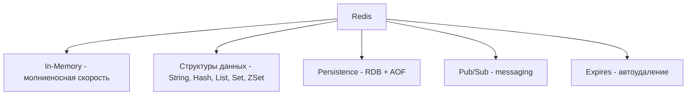

# ⚡ Redis: Введение

Redis (Remote Dictionary Server) — это in-memory хранилище данных с поддержкой различных структур данных. Используется как кэш, брокер сообщений, база данных и для real-time аналитики.

## Основные возможности



**Преимущества:**
- Экстремальная скорость (>100K ops/sec)
- Богатые структуры данных
- Атомарные операции
- Pub/Sub для real-time
- TTL для автоудаления

## Установка и запуск

```bash
# macOS
brew install redis
brew services start redis

# Ubuntu
sudo apt install redis-server
sudo systemctl start redis

# Docker
docker run -d --name redis -p 6379:6379 redis

# Проверка
redis-cli ping
# PONG
```

## Базовые команды

```bash
# String
SET user:1:name "John Doe"
GET user:1:name  # "John Doe"
INCR counter  # 1
INCRBY counter 5  # 6
APPEND user:1:name " Jr."  # "John Doe Jr."

# Expiration (TTL)
SET session:abc123 "data" EX 3600  # expires in 1 hour
SETEX temp:key 60 "value"  # тоже expires in 60 sec
TTL session:abc123  # 3599, 3598, ...
EXPIRE mykey 10  # set TTL на существующий ключ

# Delete
DEL user:1:name
EXISTS user:1:name  # 0 (deleted)
```

## Типы данных

### Hash - для объектов

```bash
HSET user:1 name "John" email "john@example.com" age 30
HGET user:1 name  # "John"
HGETALL user:1  # все поля и значения
HINCRBY user:1 age 1  # 31
HDEL user:1 email
```

### List - для очередей

```bash
LPUSH queue:tasks "task1" "task2"  # добавить слева
RPUSH queue:tasks "task3"  # добавить справа
LPOP queue:tasks  # извлечь слева (task2)
RPOP queue:tasks  # извлечь справа (task3)
LRANGE queue:tasks 0 -1  # все элементы
LLEN queue:tasks  # длина списка
```

### Set - для уникальных значений

```bash
SADD tags:post1 "redis" "database" "nosql"
SMEMBERS tags:post1  # все элементы
SISMEMBER tags:post1 "redis"  # 1 (exists)
SCARD tags:post1  # 3 (count)
SINTER tags:post1 tags:post2  # пересечение множеств
SUNION tags:post1 tags:post2  # объединение
```

### Sorted Set - для рейтингов

```bash
ZADD leaderboard 100 "Alice" 85 "Bob" 120 "Charlie"
ZRANGE leaderboard 0 -1 WITHSCORES  # сортировка по score
ZREVRANGE leaderboard 0 2  # топ 3 (по убыванию)
ZINCRBY leaderboard 10 "Bob"  # 95
ZRANK leaderboard "Bob"  # позиция (0-indexed)
ZREM leaderboard "Alice"
```

## Node.js/TypeScript с Redis

```typescript
import { createClient } from 'redis';

const client = createClient({
  url: 'redis://localhost:6379'
});

await client.connect();

// String operations
await client.set('user:1:name', 'John Doe');
await client.setEx('session:abc', 3600, 'session-data');
const name = await client.get('user:1:name');

// Hash operations
await client.hSet('user:1', {
  name: 'John',
  email: 'john@example.com',
  age: 30
});
const user = await client.hGetAll('user:1');
await client.hIncrBy('user:1', 'age', 1);

// List operations
await client.lPush('queue:tasks', ['task1', 'task2']);
const task = await client.rPop('queue:tasks');

// Set operations
await client.sAdd('tags:post1', ['redis', 'database']);
const tags = await client.sMembers('tags:post1');

// Sorted Set
await client.zAdd('leaderboard', [
  { score: 100, value: 'Alice' },
  { score: 85, value: 'Bob' }
]);
const top3 = await client.zRange('leaderboard', 0, 2, { REV: true });

await client.disconnect();
```

## Кэширование

```typescript
// Простой кэш с TTL
async function getCachedUser(userId: string) {
  const cacheKey = `user:${userId}`;
  
  // Проверяем кэш
  const cached = await client.get(cacheKey);
  if (cached) {
    return JSON.parse(cached);
  }
  
  // Если нет - берём из БД
  const user = await db.users.findById(userId);
  
  // Сохраняем в кэш на 1 час
  await client.setEx(cacheKey, 3600, JSON.stringify(user));
  
  return user;
}

// Инвалидация кэша при обновлении
async function updateUser(userId: string, data: any) {
  await db.users.update(userId, data);
  
  // Удаляем из кэша
  await client.del(`user:${userId}`);
}
```

## Rate Limiting

```typescript
async function rateLimit(userId: string, maxRequests = 100, windowSec = 60) {
  const key = `rate:${userId}`;
  
  const count = await client.incr(key);
  
  if (count === 1) {
    await client.expire(key, windowSec);
  }
  
  if (count > maxRequests) {
    throw new Error('Rate limit exceeded');
  }
  
  return { remaining: maxRequests - count };
}

// Использование
try {
  await rateLimit('user123', 10, 60);  // 10 req/min
  // ... handle request
} catch (error) {
  // 429 Too Many Requests
}
```

## Pub/Sub

```typescript
// Publisher
await client.publish('notifications', JSON.stringify({
  type: 'new_message',
  userId: 123,
  text: 'Hello!'
}));

// Subscriber
const subscriber = client.duplicate();
await subscriber.connect();

await subscriber.subscribe('notifications', (message) => {
  const data = JSON.parse(message);
  console.log('Notification:', data);
  // Отправить push, email, etc.
});
```

## Паттерны ключей

```typescript
// ✅ Хорошие паттерны
user:123:profile
user:123:sessions:abc
cache:posts:recent
leaderboard:weekly:2024-01
analytics:pageviews:2024-01-15

// ❌ Плохие паттерны
user123  // непонятно
temp_data  // нет структуры
x  // слишком короткий
```

**Правила:**
- Используйте `:` как разделитель
- Начинайте с типа данных (user, cache, session)
- ID/ключи в конце
- Понятные имена

## Persistence

Redis может сохранять данные на диск:

### RDB (Snapshotting)

```bash
# redis.conf
save 900 1      # snapshot если 1+ изменение за 15 мин
save 300 10     # snapshot если 10+ изменений за 5 мин
save 60 10000   # snapshot если 10000+ изменений за 1 мин

# Ручной snapshot
SAVE  # блокирующий
BGSAVE  # асинхронный (рекомендуется)
```

### AOF (Append-Only File)

```bash
# redis.conf
appendonly yes
appendfsync everysec  # everysec | always | no
```

**Рекомендация:** Используйте оба (RDB + AOF) для максимальной durability.

## Redis vs Memcached

| Характеристика | Redis | Memcached |
|---|---|---|
| Типы данных | Много (String, Hash, List, Set, ZSet) | Только String |
| Persistence | Да (RDB + AOF) | Нет |
| Pub/Sub | Да | Нет |
| Clustering | Да (Redis Cluster) | Да |
| Lua scripting | Да | Нет |

**Вывод:** Redis более функциональный, Memcached проще и быстрее для простого кэша.

## 💡 Best Practices

1. **Используйте connection pooling** (1 client на приложение)
2. **Установите maxmemory** и eviction policy
3. **Мониторьте memory usage** (INFO memory)
4. **Pipeline для batch операций**
5. **Не храните большие значения** (>1MB)

## ⚠️ Частые ошибки

- Забывают установить TTL (memory leak!)
- Слишком много мелких ключей (overhead)
- Не используют pipelining для batch операций
- Хранят всё в Redis (используйте как кэш, не как primary DB)

---

**Следующий урок:** [Redis Cache Strategies](/databases/redis-cache) →
