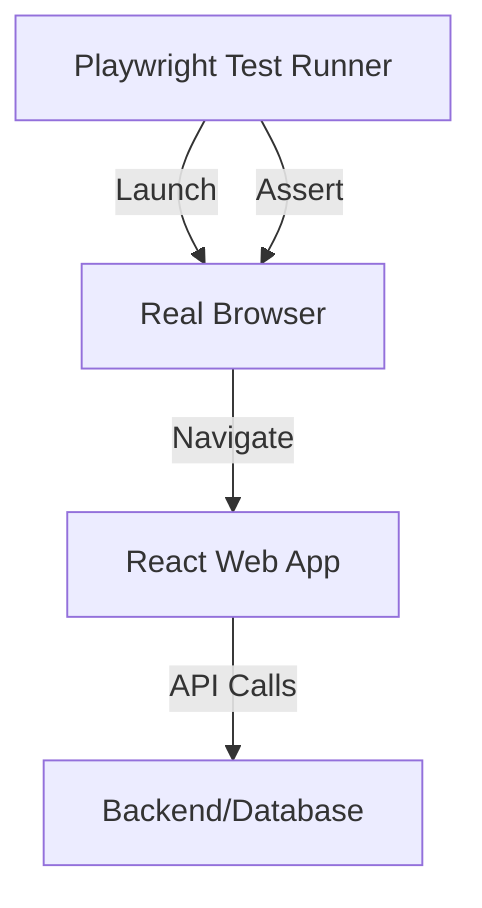

# E2E тестирование с Playwright

End-to-End (E2E) тесты проверяют все приложение целиком в реальном браузере, имитируя полный путь пользователя.

Icon: Monitor (Монитор)

## Описание

Playwright — это современный фреймворк от Microsoft, который позволяет запускать тесты в Chromium, Firefox и Webkit. Он быстрее и стабильнее старых инструментов вроде Selenium.

## Mermaid Диаграмма



## Установка

```bash
npm init playwright@latest
```

## Пример теста

Создайте файл `tests/auth.spec.ts`:

```typescript
import { test, expect } from '@playwright/test';

test('успешный логин пользователя', async ({ page }) => {
  await page.goto('http://localhost:3000/login');

  await page.fill('input[name="email"]', 'test@example.com');
  await page.fill('input[name="password"]', 'password123');
  await page.click('button[type="submit"]');

  await expect(page).toHaveURL('http://localhost:3000/dashboard');
  await expect(page.locator('h1')).toContainText('Добро пожаловать');
});
```

## Ключевые фишки Playwright

1. **Auto-waiting**: Playwright ждет, пока элемент станет видимым и доступным для клика, прежде чем выполнить действие. Это убирает 90% "хрупких" тестов.
2. **Trace Viewer**: Возможность просмотреть запись выполнения теста, увидеть скриншоты и состояние DOM на каждом шагу.
3. **Параллелизм**: Тесты запускаются очень быстро благодаря нативной поддержке параллельного выполнения.
4. **Скриншот-тестирование**: Сравнение визуального вида страниц.

## Когда использовать?

E2E тесты дороги в поддержке и медленны. Используйте их для "критических путей" (Critical Path): регистрация, оплата, оформление заказа. Для всего остального лучше подходят Unit и Integration тесты.

---

## 🔗 Полезные ссылки
- [Настройка Vitest для React](/react/vitest-setup)
- [React Testing Library: Основы](/react/rtl-basics)

### Практика

Попробуйте примеры в интерактивном редакторе:

<Playground template="react" files={{ "/App.tsx": `import { useState } from 'react';

type Status = 'idle' | 'loading' | 'success' | 'error';

const PLAYWRIGHT_CODE = [
  "// tests/auth.spec.ts",
  "import { test, expect } from '@playwright/test';",
  "",
  "test('successful login', async ({ page }) => {",
  "  await page.goto('http://localhost:3000/login');",
  "",
  "  await page.fill('input[name=\"email\"]', 'user@example.com');",
  "  await page.fill('input[name=\"password\"]', 'secret123');",
  "  await page.click('button[type=\"submit\"]');",
  "",
  "  await expect(page).toHaveURL('/dashboard');",
  "  await expect(page.locator('h1'))",
  "    .toContainText('Добро пожаловать');",
  "});",
].join('\n');

export default function LoginPage() {
  const [email, setEmail] = useState('');
  const [password, setPassword] = useState('');
  const [status, setStatus] = useState<Status>('idle');

  const handleSubmit = (e: React.FormEvent) => {
    e.preventDefault();
    if (!email || !password) return;
    setStatus('loading');
    setTimeout(() => {
      if (email === 'user@example.com' && password === 'secret123') {
        setStatus('success');
      } else {
        setStatus('error');
      }
    }, 1000);
  };

  if (status === 'success') {
    return (
      <div style={{ minHeight: '100vh', background: '#0f172a', display: 'flex', alignItems: 'center', justifyContent: 'center', fontFamily: 'system-ui,sans-serif' }}>
        <div style={{ textAlign: 'center' }}>
          <div style={{ fontSize: '3rem', marginBottom: 16 }}>🎉</div>
          <h1 style={{ color: '#4ade80', fontSize: '1.5rem', marginBottom: 8 }}>Добро пожаловать!</h1>
          <p style={{ color: '#94a3b8' }}>Перенаправление на /dashboard...</p>
          <button onClick={() => setStatus('idle')} style={{ marginTop: 16, padding: '8px 16px', borderRadius: 8, background: '#334155', color: '#fff', border: 'none', cursor: 'pointer' }}>← Назад</button>
        </div>
      </div>
    );
  }

  return (
    <div style={{ minHeight: '100vh', background: '#0f172a', fontFamily: 'system-ui,sans-serif', display: 'flex', flexDirection: 'column', alignItems: 'center', padding: '32px 20px' }}>
      <h1 style={{ color: '#60a5fa', fontSize: '1.4rem', marginBottom: 8 }}>🎭 E2E с Playwright</h1>
      <p style={{ color: '#64748b', fontSize: '0.85rem', marginBottom: 24 }}>Это компонент, который тестирует Playwright</p>

      <form onSubmit={handleSubmit} style={{ background: '#1e293b', borderRadius: 12, padding: 28, width: '100%', maxWidth: 400, marginBottom: 20 }}>
        <h2 style={{ color: '#e2e8f0', marginBottom: 20, fontSize: '1.1rem' }}>Вход в аккаунт</h2>
        <div style={{ marginBottom: 14 }}>
          <label style={{ display: 'block', color: '#94a3b8', fontSize: '0.8rem', marginBottom: 6 }}>Email</label>
          <input
            name="email" type="email"
            value={email} onChange={e => setEmail(e.target.value)}
            placeholder="user@example.com"
            style={{ width: '100%', padding: '8px 12px', borderRadius: 8, border: status === 'error' ? '1px solid #ef4444' : '1px solid #334155', background: '#0f172a', color: '#f1f5f9', outline: 'none', boxSizing: 'border-box' }}
          />
        </div>
        <div style={{ marginBottom: 20 }}>
          <label style={{ display: 'block', color: '#94a3b8', fontSize: '0.8rem', marginBottom: 6 }}>Пароль</label>
          <input
            name="password" type="password"
            value={password} onChange={e => setPassword(e.target.value)}
            placeholder="secret123"
            style={{ width: '100%', padding: '8px 12px', borderRadius: 8, border: status === 'error' ? '1px solid #ef4444' : '1px solid #334155', background: '#0f172a', color: '#f1f5f9', outline: 'none', boxSizing: 'border-box' }}
          />
        </div>
        {status === 'error' && <p style={{ color: '#f87171', fontSize: '0.8rem', marginBottom: 12 }}>❌ Неверный email или пароль</p>}
        <button type="submit" disabled={status === 'loading'} style={{ width: '100%', padding: '10px', borderRadius: 8, background: status === 'loading' ? '#1d4ed8' : '#3b82f6', color: '#fff', border: 'none', cursor: status === 'loading' ? 'wait' : 'pointer', fontWeight: 600 }}>
          {status === 'loading' ? '⏳ Вход...' : 'Войти'}
        </button>
        <p style={{ color: '#475569', fontSize: '0.75rem', textAlign: 'center', marginTop: 12 }}>Подсказка: user@example.com / secret123</p>
      </form>

      <div style={{ background: '#1e293b', borderRadius: 12, padding: 20, width: '100%', maxWidth: 400 }}>
        <p style={{ color: '#94a3b8', fontSize: '0.75rem', fontWeight: 600, textTransform: 'uppercase', marginBottom: 10, letterSpacing: '0.08em' }}>🧪 Playwright тест</p>
        <pre style={{ color: '#7dd3fc', fontSize: '0.68rem', lineHeight: 1.7, margin: 0, overflowX: 'auto', whiteSpace: 'pre-wrap' }}>{PLAYWRIGHT_CODE}</pre>
      </div>
    </div>
  );
}
` }} />
