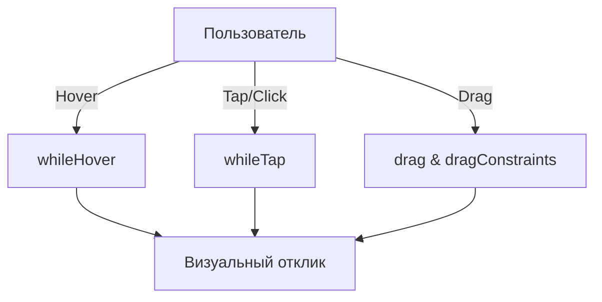

# Жесты и интерактив во [Framer Motion](/react/framer-motion-intro)

[Framer Motion](/react/framer-motion-intro) предоставляет мощные инструменты для обработки жестов: наведение, клик, перетаскивание (drag) и панорамирование.

Icon: Hand (Рука)

## Описание

Вместо ручной обработки `onMouseDown`, `onMouseMove` и `onMouseUp`, вы просто передаете декларативные пропсы компоненту `motion`.

## Mermaid Диаграмма



## Примеры жестов

### Наведение и Клик
```jsx
<motion.button
  whileHover={{ scale: 1.1, backgroundColor: "#f00" }}
  whileTap={{ scale: 0.9 }}
>
  Нажми меня
</motion.button>
```

### Перетаскивание (Drag)
```jsx
<motion.div
  drag
  dragConstraints={{ left: -50, right: 50, top: -50, bottom: 50 }}
  dragElastic={0.2}
  whileDrag={{ scale: 1.2, boxShadow: "0px 5px 10px rgba(0,0,0,0.2)" }}
  style={{ width: 100, height: 100, background: 'green' }}
/>
```

## Drag Constraints

Вы можете ограничить область перетаскивания:
- Объектом с координатами: `{ left: 0, right: 100 }`.
- Рефом на родительский элемент (`ref`).

## События жестов

Вы можете подписываться на колбэки:
- `onDragStart`
- `onDragEnd`
- `onHoverStart`
- `onTap`

Это позволяет синхронизировать анимацию с логикой вашего приложения.

---

## 🔗 Полезные ссылки
- [Основы Framer Motion](/react/framer-motion-intro)

### Практика

Попробуйте примеры в интерактивном редакторе:

<Playground template="react" files={{
    "/App.tsx": `import { useState, useRef, useCallback } from 'react';

export default function App() {
  // --- Hover + Tap demo ---
  const [hovered, setHovered] = useState(false);
  const [tapped, setTapped] = useState(false);
  const [tapCount, setTapCount] = useState(0);
  const [tapLog, setTapLog] = useState<string[]>([]);

  const handleTap = () => {
    setTapCount(c => c + 1);
    const t = new Date().toLocaleTimeString();
    setTapLog(log => [\`\${t} — onTap\`, ...log.slice(0, 3)]);
    setTapped(false);
  };

  // --- Drag demo ---
  const constraintRef = useRef<HTMLDivElement>(null);
  const [dragPos, setDragPos] = useState({ x: 0, y: 0 });
  const [isDragging, setIsDragging] = useState(false);
  const [dragLog, setDragLog] = useState<string[]>([]);
  const dragStart = useRef({ mx: 0, my: 0, ex: 0, ey: 0 });

  const onDragStart = useCallback((e: React.MouseEvent) => {
    e.preventDefault();
    setIsDragging(true);
    dragStart.current = { mx: e.clientX, my: e.clientY, ex: dragPos.x, ey: dragPos.y };
    const t = new Date().toLocaleTimeString();
    setDragLog(log => [\`\${t} — onDragStart\`, ...log.slice(0, 3)]);
  }, [dragPos]);

  const onDragMove = useCallback((e: React.MouseEvent) => {
    if (!isDragging) return;
    const box = constraintRef.current?.getBoundingClientRect();
    if (!box) return;
    const lim = 70;
    const nx = Math.max(-lim, Math.min(lim, dragStart.current.ex + e.clientX - dragStart.current.mx));
    const ny = Math.max(-lim, Math.min(lim, dragStart.current.ey + e.clientY - dragStart.current.my));
    setDragPos({ x: nx, y: ny });
  }, [isDragging]);

  const onDragEnd = useCallback(() => {
    if (!isDragging) return;
    setIsDragging(false);
    const t = new Date().toLocaleTimeString();
    setDragLog(log => [\`\${t} — onDragEnd\`, ...log.slice(0, 3)]);
  }, [isDragging]);

  return (
    <div style={{ background: '#0f172a', minHeight: '100vh', padding: 24, fontFamily: 'system-ui, sans-serif' }}>
      <div style={{ maxWidth: 600, margin: '0 auto' }}>
        <h2 style={{ color: '#e2e8f0', marginTop: 0, marginBottom: 4 }}>Framer Motion — Жесты</h2>
        <p style={{ color: '#475569', fontSize: 13, marginBottom: 20 }}>whileHover · whileTap · drag · dragConstraints</p>

        <div style={{ display: 'grid', gridTemplateColumns: '1fr 1fr', gap: 14, marginBottom: 14 }}>
          {/* whileHover + whileTap */}
          <div style={{ background: '#1e293b', borderRadius: 12, padding: 18 }}>
            <div style={{ color: '#94a3b8', fontSize: 11, marginBottom: 14 }}>whileHover + whileTap</div>
            <div style={{ display: 'flex', justifyContent: 'center', marginBottom: 14 }}>
              <div
                style={{
                  width: 80, height: 80, borderRadius: 14,
                  background: tapped
                    ? 'linear-gradient(135deg, #ef4444, #f97316)'
                    : hovered
                    ? 'linear-gradient(135deg, #6366f1, #8b5cf6)'
                    : 'linear-gradient(135deg, #3b82f6, #6366f1)',
                  transform: tapped ? 'scale(0.88)' : hovered ? 'scale(1.15)' : 'scale(1)',
                  transition: 'all 0.15s ease-out',
                  cursor: 'pointer',
                  display: 'flex', alignItems: 'center', justifyContent: 'center',
                  boxShadow: hovered ? '0 0 28px #6366f155' : '0 2px 8px #0004',
                  userSelect: 'none', fontSize: 28,
                }}
                onMouseEnter={() => setHovered(true)}
                onMouseLeave={() => { setHovered(false); setTapped(false); }}
                onMouseDown={() => setTapped(true)}
                onMouseUp={handleTap}
              >
                {tapped ? '💥' : hovered ? '✨' : '🎯'}
              </div>
            </div>
            <div style={{ textAlign: 'center', marginBottom: 8 }}>
              <div style={{ color: '#64748b', fontSize: 11, minHeight: 16 }}>
                {tapped ? 'whileTap — нажат!' : hovered ? 'whileHover — наведён!' : 'Наведи или нажми'}
              </div>
              <div style={{ color: '#38bdf8', fontSize: 12, marginTop: 4 }}>
                onTap: {tapCount} раз
              </div>
            </div>
            {tapLog.length > 0 && (
              <div style={{ background: '#0f172a', borderRadius: 6, padding: 8 }}>
                {tapLog.map((l, i) => (
                  <div key={i} style={{ color: '#34d399', fontSize: 10, marginBottom: 2 }}>{l}</div>
                ))}
              </div>
            )}
          </div>

          {/* drag */}
          <div style={{ background: '#1e293b', borderRadius: 12, padding: 18 }}>
            <div style={{ color: '#94a3b8', fontSize: 11, marginBottom: 14 }}>drag + dragConstraints</div>
            <div
              ref={constraintRef}
              style={{
                height: 140, background: '#0f172a', borderRadius: 10, position: 'relative',
                display: 'flex', alignItems: 'center', justifyContent: 'center',
                border: '1px dashed #334155', overflow: 'hidden',
                cursor: isDragging ? 'grabbing' : 'default',
              }}
              onMouseMove={onDragMove}
              onMouseUp={onDragEnd}
              onMouseLeave={onDragEnd}
            >
              <div style={{ position: 'absolute', inset: 0, display: 'flex', alignItems: 'center', justifyContent: 'center', pointerEvents: 'none' }}>
                <div style={{ width: 140, height: 140, border: '1px dashed #334155', borderRadius: '50%' }} />
              </div>
              <div
                style={{
                  width: 56, height: 56, borderRadius: 12, position: 'relative', zIndex: 1,
                  background: isDragging
                    ? 'linear-gradient(135deg, #10b981, #06b6d4)'
                    : 'linear-gradient(135deg, #3b82f6, #10b981)',
                  transform: \`translate(\${dragPos.x}px, \${dragPos.y}px) scale(\${isDragging ? 1.18 : 1})\`,
                  transition: isDragging ? 'transform 0.05s, background 0.2s' : 'background 0.3s, transform 0.3s',
                  cursor: isDragging ? 'grabbing' : 'grab',
                  display: 'flex', alignItems: 'center', justifyContent: 'center',
                  userSelect: 'none', fontSize: 22,
                  boxShadow: isDragging ? '0 8px 24px #10b98166' : '0 2px 8px #0004',
                }}
                onMouseDown={onDragStart}
              >✋</div>
            </div>
            <div style={{ textAlign: 'center', marginTop: 8, color: '#64748b', fontSize: 11, minHeight: 16 }}>
              {isDragging ? '🔄 onDrag — перетаскивается!' : 'Перетащи в ограниченной зоне'}
            </div>
            {dragLog.length > 0 && (
              <div style={{ background: '#0f172a', borderRadius: 6, padding: 8, marginTop: 8 }}>
                {dragLog.map((l, i) => (
                  <div key={i} style={{ color: '#fbbf24', fontSize: 10, marginBottom: 2 }}>{l}</div>
                ))}
              </div>
            )}
          </div>
        </div>

        <div style={{ background: '#1e293b', borderRadius: 12, padding: 16 }}>
          <div style={{ color: '#94a3b8', fontSize: 11, marginBottom: 8 }}>FRAMER MOTION КОД</div>
          <pre style={{ margin: 0, fontSize: 11, color: '#93c5fd', lineHeight: 1.6 }}>{
\`// whileHover + whileTap + onTap
<motion.div
  whileHover={{ scale: 1.15, background: "#6366f1" }}
  whileTap={{ scale: 0.88, background: "#ef4444" }}
  onTap={() => setTapCount(c => c + 1)}
/>

// drag с ограничениями
<motion.div
  drag
  dragConstraints={constraintRef}
  dragElastic={0.1}
  whileDrag={{ scale: 1.18 }}
  onDragStart={() => log("onDragStart")}
  onDragEnd={() => log("onDragEnd")}
/>\`
          }</pre>
        </div>
      </div>
    </div>
  );
}
`
  }} />
