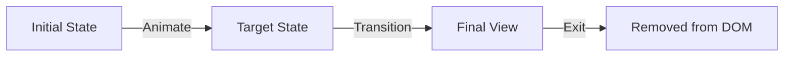

# Основы Framer Motion

Framer Motion — это мощная библиотека анимаций для React, которая делает создание сложных интерфейсов простым и декларативным.

Icon: Sparkles (Искры)

## Описание

Вместо сложного CSS-кода, Framer Motion предлагает использовать компонент `motion`, который расширяет стандартные HTML-теги.

## Mermaid Диаграмма



## Установка

```bash
npm install framer-motion
```

## Базовый пример

```jsx
import { motion } from 'framer-motion';

const SimpleBox = () => (
  <motion.div
    initial={{ opacity: 0, scale: 0.5 }}
    animate={{ opacity: 1, scale: 1 }}
    transition={{ duration: 0.5 }}
    style={{ width: 100, height: 100, background: 'blue' }}
  />
);
```

## Ключевые пропсы

- **initial**: Начальное состояние (стили) при монтировании.
- **animate**: Конечное состояние или текущее состояние анимации.
- **transition**: Настройки анимации (длительность, тип: spring, tween и т.д.).
- **whileHover**: Анимация при наведении мыши.
- **whileTap**: Анимация при клике.

## Преимущества

- **Декларативность**: Вы описываете ЧТО должно произойти, а не КАК.
- **Производительность**: Использует аппаратное ускорение.
- **Умное прерывание**: Анимации плавно перетекают друг в друга, если стейт меняется в процессе.

### Практика

Попробуйте примеры в интерактивном редакторе:

<Playground template="react" files={{
    "/App.tsx": `import { useState, useEffect } from 'react';

const presets = [
  {
    label: 'Fade In',
    initial: { opacity: 0, scale: 1, y: 0 },
    animate: { opacity: 1, scale: 1, y: 0 },
  },
  {
    label: 'Scale Up',
    initial: { opacity: 0, scale: 0.2, y: 0 },
    animate: { opacity: 1, scale: 1, y: 0 },
  },
  {
    label: 'Slide Up',
    initial: { opacity: 0, scale: 1, y: 60 },
    animate: { opacity: 1, scale: 1, y: 0 },
  },
  {
    label: 'Bounce',
    initial: { opacity: 0, scale: 0.4, y: -40 },
    animate: { opacity: 1, scale: 1, y: 0 },
  },
];

const easings = ['ease-out', 'ease-in', 'ease-in-out', 'linear', 'cubic-bezier(0.68,-0.55,0.27,1.55)'];

export default function App() {
  const [preset, setPreset] = useState(0);
  const [duration, setDuration] = useState(0.5);
  const [easing, setEasing] = useState('ease-out');
  const [animKey, setAnimKey] = useState(0);
  const [isAnimated, setIsAnimated] = useState(true);
  const [hovered, setHovered] = useState(false);
  const [tapped, setTapped] = useState(false);

  const current = presets[preset];

  const replay = () => {
    setIsAnimated(false);
    setTimeout(() => { setIsAnimated(true); setAnimKey(k => k + 1); }, 30);
  };

  useEffect(() => { replay(); }, [preset]);

  const { initial, animate } = current;

  const boxTransform = isAnimated
    ? \`translateY(\${animate.y}px) scale(\${animate.scale})\`
    : \`translateY(\${initial.y}px) scale(\${initial.scale})\`;

  const hoverScale = hovered && !tapped ? 1.1 : tapped ? 0.9 : 1;

  return (
    <div style={{ background: '#0f172a', minHeight: '100vh', padding: 24, fontFamily: 'system-ui, sans-serif' }}>
      <div style={{ maxWidth: 560, margin: '0 auto' }}>
        <h2 style={{ color: '#e2e8f0', marginTop: 0, marginBottom: 4 }}>Framer Motion — Основы</h2>
        <p style={{ color: '#475569', fontSize: 13, marginBottom: 20 }}>initial → animate → transition (через CSS transitions)</p>

        <div style={{ background: '#1e293b', borderRadius: 12, padding: 20, marginBottom: 12 }}>
          <div style={{ color: '#94a3b8', fontSize: 11, marginBottom: 8 }}>ПРЕСЕТ</div>
          <div style={{ display: 'flex', gap: 6, flexWrap: 'wrap', marginBottom: 20 }}>
            {presets.map((p, i) => (
              <button
                key={p.label}
                onClick={() => setPreset(i)}
                style={{
                  padding: '6px 14px', borderRadius: 6, border: 'none', cursor: 'pointer', fontSize: 12,
                  background: preset === i ? '#6366f1' : '#0f172a',
                  color: preset === i ? '#fff' : '#64748b',
                }}
              >{p.label}</button>
            ))}
          </div>

          <div style={{ display: 'grid', gridTemplateColumns: '1fr 1fr', gap: 14, marginBottom: 20 }}>
            <div>
              <div style={{ color: '#64748b', fontSize: 11, marginBottom: 4 }}>Duration: {duration}s</div>
              <input
                type="range" min={0.1} max={2.5} step={0.1} value={duration}
                onChange={e => setDuration(+e.target.value)}
                style={{ width: '100%', accentColor: '#6366f1' }}
              />
            </div>
            <div>
              <div style={{ color: '#64748b', fontSize: 11, marginBottom: 4 }}>Easing</div>
              <select
                value={easing} onChange={e => setEasing(e.target.value)}
                style={{ width: '100%', background: '#0f172a', color: '#cbd5e1', border: '1px solid #334155', borderRadius: 6, padding: '5px 8px', fontSize: 11 }}
              >
                {easings.map(e => <option key={e} value={e}>{e}</option>)}
              </select>
            </div>
          </div>

          <div style={{ height: 160, background: '#0f172a', borderRadius: 10, display: 'flex', alignItems: 'center', justifyContent: 'center' }}>
            <div
              key={animKey}
              style={{
                width: 90, height: 90, borderRadius: 16,
                background: 'linear-gradient(135deg, #3b82f6, #8b5cf6)',
                opacity: isAnimated ? animate.opacity : initial.opacity,
                transform: \`\${boxTransform} scale(\${hoverScale})\`,
                transition: isAnimated
                  ? \`opacity \${duration}s \${easing}, transform \${duration}s \${easing}\`
                  : 'none',
                cursor: 'pointer',
                display: 'flex', alignItems: 'center', justifyContent: 'center',
                color: '#fff', fontWeight: 700, fontSize: 13,
                boxShadow: hovered ? '0 0 32px #6366f155' : '0 4px 16px #0004',
                userSelect: 'none',
              }}
              onMouseEnter={() => setHovered(true)}
              onMouseLeave={() => { setHovered(false); setTapped(false); }}
              onMouseDown={() => setTapped(true)}
              onMouseUp={() => setTapped(false)}
            >
              {hovered ? '✨' : '▶'}
            </div>
          </div>
        </div>

        <div style={{ background: '#1e293b', borderRadius: 12, padding: 16, marginBottom: 14 }}>
          <div style={{ color: '#94a3b8', fontSize: 11, marginBottom: 8 }}>FRAMER MOTION КОД</div>
          <pre style={{ margin: 0, fontSize: 11, color: '#93c5fd', lineHeight: 1.6 }}>{
\`<motion.div
  initial={{ opacity: \${initial.opacity}, scale: \${initial.scale}, y: \${initial.y} }}
  animate={{ opacity: \${animate.opacity}, scale: \${animate.scale}, y: \${animate.y} }}
  transition={{ duration: \${duration}, ease: "\${easing}" }}
  whileHover={{ scale: 1.1 }}
  whileTap={{ scale: 0.9 }}
/>\`
          }</pre>
        </div>

        <div style={{ display: 'flex', gap: 10 }}>
          <button
            onClick={replay}
            style={{ padding: '10px 24px', background: '#3b82f6', color: '#fff', border: 'none', borderRadius: 8, cursor: 'pointer', fontWeight: 600 }}
          >▶ Replay</button>
          <div style={{ background: '#1e293b', borderRadius: 8, padding: '10px 16px', flex: 1 }}>
            <span style={{ color: '#475569', fontSize: 12 }}>
              {hovered ? '🌟 whileHover активен' : tapped ? '💥 whileTap активен' : '🖱️ Наведи мышь на блок'}
            </span>
          </div>
        </div>
      </div>
    </div>
  );
}
`
  }} />
