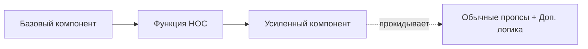

# Higher-Order Components (HOC)

Компонент высшего порядка (HOC) — это функция, которая принимает компонент и возвращает новый компонент.

Icon: Blocks (Блоки / Конструктор)

## Описание

HOC — это продвинутая методика в React для повторного использования логики компонентов. Это не часть API React, а паттерн, вытекающий из композиционной природы библиотеки.

## Mermaid Диаграмма



## Пример использования

```jsx
import React, { useState, useEffect } from 'react';

// HOC для добавления индикатора загрузки
function withLoading(Component) {
  return function WithLoadingComponent({ isLoading, ...props }) {
    if (!isLoading) return <Component {...props} />;
    return <p>Загрузка данных...</p>;
  };
}

const UserList = ({ users }) => (
  <ul>
    {users.map(user => <li key={user.id}>{user.name}</li>)}
  </ul>
);

const UserListWithLoading = withLoading(UserList);

// Использование
const App = () => {
  const [loading, setLoading] = useState(true);
  
  useEffect(() => {
    setTimeout(() => setLoading(false), 2000);
  }, []);

  return <UserListWithLoading isLoading={loading} users={[{id: 1, name: 'Ivan'}]} />;
};
```

## Правила использования

1. **Не изменяйте оригинальный компонент**: Используйте композицию.
2. **Прокидывайте неотносящиеся пропсы**: Используйте spread оператор `{...props}`.
3. **Оборачивайте отображаемое имя**: Для удобства отладки (DisplayName).
4. **Не используйте HOC внутри метода render**: Это приводит к полной перерисовке и потере состояния.

### Практика

Попробуйте примеры в интерактивном редакторе:

<Playground template="react" files={{ "/App.tsx": `import { useState, useEffect, useRef } from 'react';
import type { ComponentType } from 'react';

function withLoading<P extends object>(Component: ComponentType<P>) {
  return function WithLoadingComponent({
    isLoading,
    ...props
  }: P & { isLoading: boolean }) {
    if (isLoading) {
      return (
        <div style={{ display: 'flex', alignItems: 'center', gap: '0.6rem', color: '#60a5fa', padding: '0.8rem' }}>
          <span style={{ display: 'inline-block', animation: 'none', fontSize: '1.2rem' }}>⏳</span>
          Загрузка данных...
        </div>
      );
    }
    return <Component {...(props as P)} />;
  };
}

function withRenderCount<P extends object>(Component: ComponentType<P>, label: string) {
  return function WithRenderCount(props: P) {
    const count = useRef(0);
    count.current += 1;
    return (
      <div style={{ position: 'relative' }}>
        <div
          style={{
            position: 'absolute',
            top: '-10px',
            right: '0',
            background: '#7c3aed',
            color: '#fff',
            fontSize: '0.65rem',
            padding: '1px 6px',
            borderRadius: '4px',
            whiteSpace: 'nowrap',
          }}
        >
          {label} renders: {count.current}
        </div>
        <Component {...props} />
      </div>
    );
  };
}

function UserCard({ name, role }: { name: string; role: string }) {
  return (
    <div
      style={{
        background: '#0f172a',
        borderRadius: '8px',
        padding: '1rem',
        display: 'flex',
        gap: '0.75rem',
        alignItems: 'center',
      }}
    >
      <div
        style={{
          width: '40px',
          height: '40px',
          borderRadius: '50%',
          background: '#3b82f6',
          display: 'flex',
          alignItems: 'center',
          justifyContent: 'center',
          fontSize: '1.2rem',
          flexShrink: 0,
        }}
      >
        👤
      </div>
      <div>
        <div style={{ color: '#f1f5f9', fontWeight: 600 }}>{name}</div>
        <div style={{ color: '#94a3b8', fontSize: '0.85rem' }}>{role}</div>
      </div>
    </div>
  );
}

const UserCardWithLoading = withLoading(UserCard);
const UserCardTracked = withRenderCount(withLoading(UserCard), 'UserCard');

export default function App() {
  const [loading, setLoading] = useState(true);
  const [parentUpdates, setParentUpdates] = useState(0);

  useEffect(() => {
    const t = setTimeout(() => setLoading(false), 2000);
    return () => clearTimeout(t);
  }, []);

  const reload = () => {
    setLoading(true);
    setTimeout(() => setLoading(false), 2000);
  };

  return (
    <div
      style={{ fontFamily: 'sans-serif', background: '#0f172a', minHeight: '100vh', padding: '2rem', color: '#f1f5f9' }}
    >
      <h2 style={{ color: '#60a5fa', marginBottom: '0.5rem' }}>Higher-Order Components Demo</h2>

      <section style={{ marginBottom: '2rem' }}>
        <h3 style={{ color: '#e2e8f0', fontSize: '1rem', marginBottom: '0.75rem' }}>
          1. withLoading HOC{' '}
          <span style={{ color: '#64748b', fontWeight: 400, fontSize: '0.85rem' }}>(авто-загрузка 2с)</span>
        </h3>
        <div style={{ background: '#1e293b', borderRadius: '10px', padding: '1rem' }}>
          <UserCardWithLoading isLoading={loading} name="Иван Петров" role="Senior Developer" />
        </div>
        <button
          onClick={reload}
          style={{
            marginTop: '0.75rem',
            padding: '0.4rem 1rem',
            background: '#334155',
            color: '#e2e8f0',
            border: 'none',
            borderRadius: '6px',
            cursor: 'pointer',
          }}
        >
          ↺ Перезагрузить
        </button>
      </section>

      <section>
        <h3 style={{ color: '#e2e8f0', fontSize: '1rem', marginBottom: '1rem' }}>
          2. withRenderCount + withLoading (HOC composition)
        </h3>
        <div style={{ background: '#1e293b', borderRadius: '10px', padding: '1.2rem', paddingTop: '1.8rem' }}>
          <UserCardTracked isLoading={false} name="Анна Сидорова" role="UX Designer" />
        </div>
        <button
          onClick={() => setParentUpdates((c) => c + 1)}
          style={{
            marginTop: '0.75rem',
            padding: '0.4rem 1rem',
            background: '#334155',
            color: '#e2e8f0',
            border: 'none',
            borderRadius: '6px',
            cursor: 'pointer',
          }}
        >
          Обновить родителя ({parentUpdates})
        </button>
      </section>

      <div
        style={{
          marginTop: '1.5rem',
          background: '#1e293b',
          borderRadius: '8px',
          padding: '1rem',
          fontSize: '0.85rem',
          color: '#94a3b8',
        }}
      >
        <span style={{ color: '#60a5fa' }}>HOC:</span> функция, принимающая компонент и возвращающая{' '}
        <em>новый усиленный компонент</em>
      </div>
    </div>
  );
}
` }} />
