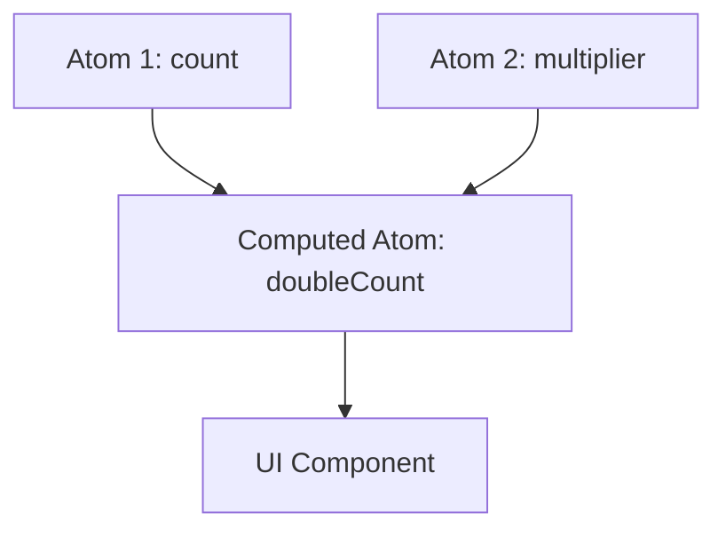

# Jotai: Атомарное управление состоянием

**Jotai** (от японского "состояние") — это библиотека, использующая **атомарный подход**. Вместо одного большого объекта (как в Redux или [Zustand](/react/zustand-basics)), вы разделяете состояние на маленькие независимые единицы — **атомы**.

### Концепция Атомов

Атомы можно сравнить с ячейками таблицы: они могут содержать данные или вычисляться на основе других атомов.



### Базовое использование

1.  **Создание атома:** Атомы определяются вне компонентов.
2.  **Использование:** С помощью хука `useAtom`.

```tsx
import { atom, useAtom } from 'jotai';

// Базовый атом
const countAtom = atom(0);

// Производный атом (computed)
const doubleCountAtom = atom((get) => get(countAtom) * 2);

function Counter() {
  const [count, setCount] = useAtom(countAtom);
  const [doubleCount] = useAtom(doubleCountAtom);

  return (
    <>
      <h1>{count} x 2 = {doubleCount}</h1>
      <button onClick={() => setCount(c => c + 1)}>+1</button>
    </>
  );
}
```

### Преимущества Jotai

- **Минимальный рендеринг:** Компонент обновляется только если изменился конкретный атом, на который он подписан.
- **Нет Prop Drilling:** Атомы доступны глобально.
- **Масштабируемость:** Вы можете создавать атомы на лету, например, внутри циклов.
- **Размер:** Библиотека весит всего пару килобайт.

### Сравнение с [Context API](/react/use-context)

[Icon: Zap] В отличие от Context, Jotai не вызывает ререндера всех дочерних компонентов при обновлении одного значения. Это делает его идеальным для высокопроизводительных интерфейсов.

### Типы атомов

- **Read-only:** Только для чтения (вычисляемые).
- **Write-only:** Только для записи (экшены).
- **Read-Write:** Обычное состояние.

[Icon: Layers] Jotai отлично подходит для приложений со сложными связями между данными, где изменение одной настройки должно мгновенно отражаться в разных частях UI.

---

## 🔗 Полезные ссылки
- [Zustand: Простое управление стейтом](/react/zustand-basics)
- [Props State](/react/props-state)
- [Use Context](/react/use-context)
- [Обзор подходов к управлению стейтом](/react/state-management-overview)

### Практика

Попробуйте примеры в интерактивном редакторе:

<Playground template="react" files={{ "/App.tsx": `import { useState, useMemo } from "react";

// Симуляция атомарного подхода Jotai
// В Jotai: const countAtom = atom(0)
// Здесь: каждый атом — независимый useState

// Базовые атомы (примитивные единицы состояния)
function useAtom<T>(initial: T) {
  return useState<T>(initial);
}

// Производный атом (computed) — аналог atom((get) => get(a) * get(b))
function useDerivedAtom<T>(compute: () => T, deps: unknown[]): T {
  return useMemo(compute, deps);
}

export default function App() {
  // atom(0) — базовый атом для первого числа
  const [a, setA] = useAtom(3);
  // atom(0) — базовый атом для второго числа
  const [b, setB] = useAtom(4);
  // atom("") — базовый атом для строки
  const [text, setText] = useAtom("Jotai");

  // Производные атомы — пересчитываются только при изменении зависимостей
  const sum = useDerivedAtom(() => a + b, [a, b]);
  const product = useDerivedAtom(() => a * b, [a, b]);
  const hypotenuse = useDerivedAtom(() => Math.sqrt(a * a + b * b).toFixed(2), [a, b]);
  const reversed = useDerivedAtom(() => text.split("").reverse().join(""), [text]);
  const charCount = useDerivedAtom(() => text.length, [text]);
  const upper = useDerivedAtom(() => text.toUpperCase(), [text]);

  const row = { display: "flex", alignItems: "center", gap: 12, marginBottom: 10 };
  const label = { color: "#94a3b8", fontSize: 12, width: 100, flexShrink: 0 };
  const val = { color: "#60a5fa", fontWeight: 700, fontSize: 14, minWidth: 60 };
  const derived = { color: "#a78bfa", fontWeight: 700, fontSize: 13 };
  const inp = {
    width: 60, padding: "5px 10px", borderRadius: 8, border: "1px solid #334155",
    background: "#0f172a", color: "#f8fafc", fontSize: 14, textAlign: "center" as const,
  };

  return (
    <div style={{ minHeight: "100vh", background: "#0f172a", display: "flex", alignItems: "center", justifyContent: "center", fontFamily: "sans-serif", padding: 16 }}>
      <div style={{ background: "#1e293b", borderRadius: 12, padding: 28, width: 420, boxShadow: "0 8px 32px rgba(0,0,0,.5)" }}>
        <span style={{ background: "#8b5cf6", color: "#fff", borderRadius: 6, fontSize: 11, fontWeight: 700, padding: "2px 8px" }}>Jotai</span>
        <h2 style={{ color: "#f8fafc", margin: "10px 0 4px", fontSize: 18 }}>Атомы и производные атомы</h2>
        <p style={{ color: "#94a3b8", fontSize: 11, marginBottom: 20 }}>
          atom() — базовые; atom(get ={">"} ...) — производные (computed)
        </p>

        <div style={{ background: "#0f172a", borderRadius: 8, padding: "14px 16px", marginBottom: 16 }}>
          <div style={{ color: "#64748b", fontSize: 11, marginBottom: 10 }}>// Базовые атомы:</div>
          <div style={row}>
            <span style={label}>countAtom A</span>
            <input type="number" value={a} onChange={e => setA(Number(e.target.value))} style={inp} />
            <span style={val}>{a}</span>
          </div>
          <div style={row}>
            <span style={label}>countAtom B</span>
            <input type="number" value={b} onChange={e => setB(Number(e.target.value))} style={inp} />
            <span style={val}>{b}</span>
          </div>
        </div>

        <div style={{ background: "#0f172a", borderRadius: 8, padding: "14px 16px", marginBottom: 16 }}>
          <div style={{ color: "#64748b", fontSize: 11, marginBottom: 10 }}>// Производные атомы (пересчёт автоматический):</div>
          <div style={row}><span style={label}>сумма A+B</span><span style={derived}>{sum}</span></div>
          <div style={row}><span style={label}>произв. A×B</span><span style={derived}>{product}</span></div>
          <div style={row}><span style={label}>гипотенуза</span><span style={derived}>{hypotenuse}</span></div>
        </div>

        <div style={{ background: "#0f172a", borderRadius: 8, padding: "14px 16px" }}>
          <div style={{ color: "#64748b", fontSize: 11, marginBottom: 10 }}>// Атом строки + производные:</div>
          <input
            value={text}
            onChange={e => setText(e.target.value)}
            style={{ ...inp, width: "100%", textAlign: "left", marginBottom: 10 }}
          />
          <div style={row}><span style={label}>символов</span><span style={derived}>{charCount}</span></div>
          <div style={row}><span style={label}>UPPERCASE</span><span style={derived}>{upper}</span></div>
          <div style={row}><span style={label}>реверс</span><span style={derived}>{reversed}</span></div>
        </div>
      </div>
    </div>
  );
}
` }} />
