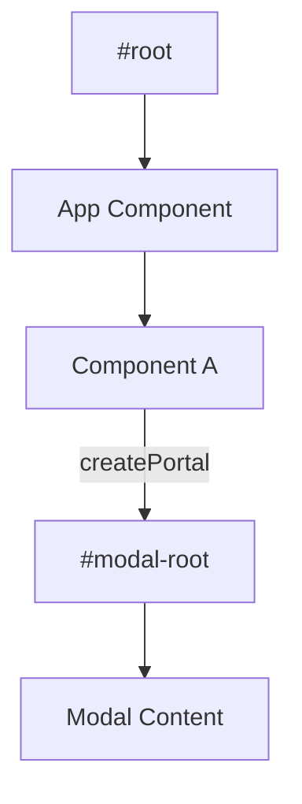

# React Portals

Порталы позволяют рендерить дочерние компоненты в другой части DOM-дерева, вне иерархии родительского компонента.

Icon: ExternalLink (Внешняя ссылка)

## Описание

Типичный случай использования — модальные окна, тултипы и выпадающие списки. Порталы решают проблему с CSS-свойствами `overflow: hidden` или `z-index` у родительских компонентов, которые могут "обрезать" всплывающее окно.

## Mermaid Диаграмма



## Пример использования

Сначала добавьте в ваш `index.html`:
```html
<div id="modal-root"></div>
```

Затем создайте компонент модалки:

```jsx
import React from 'react';
import ReactDOM from 'react-dom';

const Modal = ({ isOpen, children, onClose }) => {
  if (!isOpen) return null;

  return ReactDOM.createPortal(
    <div className="modal-overlay">
      <div className="modal-content">
        <button onClick={onClose}>Закрыть</button>
        {children}
      </div>
    </div>,
    document.getElementById('modal-root')
  );
};

// Использование
const App = () => {
  const [show, setShow] = React.useState(false);
  return (
    <div style={{ overflow: 'hidden' }}>
      <h1>Основной контент</h1>
      <button onClick={() => setShow(true)}>Открыть модалку</button>
      <Modal isOpen={show} onClose={() => setShow(false)}>
        <h2>Я внутри портала!</h2>
      </Modal>
    </div>
  );
};
```

## Важные особенности

- **Всплытие событий**: Несмотря на то, что портал может находиться в любом месте DOM-дерева, он ведет себя как обычный дочерний React-компонент. События (например, клики), сгенерированные внутри портала, будут всплывать к родителям в React-дереве.
- **Жизненный цикл**: Портал сохраняет контекст и жизненный цикл родительского компонента.

### Практика

Попробуйте примеры в интерактивном редакторе:

<Playground template="react" files={{ "/App.tsx": `import { useState, useEffect } from 'react';
import { createPortal } from 'react-dom';
import type { ReactNode } from 'react';

function Modal({
  isOpen,
  onClose,
  title,
  children,
}: {
  isOpen: boolean;
  onClose: () => void;
  title: string;
  children: ReactNode;
}) {
  useEffect(() => {
    const handleKey = (e: KeyboardEvent) => {
      if (e.key === 'Escape') onClose();
    };
    document.addEventListener('keydown', handleKey);
    return () => document.removeEventListener('keydown', handleKey);
  }, [onClose]);

  if (!isOpen) return null;

  return createPortal(
    <div
      onClick={onClose}
      style={{
        position: 'fixed',
        inset: 0,
        background: 'rgba(0,0,0,0.75)',
        display: 'flex',
        alignItems: 'center',
        justifyContent: 'center',
        zIndex: 9999,
      }}
    >
      <div
        onClick={(e) => e.stopPropagation()}
        style={{
          background: '#1e293b',
          borderRadius: '14px',
          padding: '2rem',
          minWidth: '300px',
          maxWidth: '90vw',
          border: '1px solid #475569',
          boxShadow: '0 25px 50px rgba(0,0,0,0.6)',
        }}
      >
        <div
          style={{
            display: 'flex',
            justifyContent: 'space-between',
            alignItems: 'center',
            marginBottom: '1rem',
          }}
        >
          <h3 style={{ margin: 0, color: '#60a5fa', fontSize: '1.1rem' }}>{title}</h3>
          <button
            onClick={onClose}
            style={{
              background: 'none',
              border: 'none',
              color: '#94a3b8',
              cursor: 'pointer',
              fontSize: '1.4rem',
              lineHeight: 1,
              padding: '0 0.2rem',
            }}
          >
            ×
          </button>
        </div>
        <div style={{ color: '#e2e8f0', lineHeight: '1.6' }}>{children}</div>
        <button
          onClick={onClose}
          style={{
            marginTop: '1.2rem',
            padding: '0.5rem 1.5rem',
            background: '#3b82f6',
            color: '#fff',
            border: 'none',
            borderRadius: '7px',
            cursor: 'pointer',
            fontWeight: 600,
          }}
        >
          Закрыть
        </button>
      </div>
    </div>,
    document.body
  );
}

export default function App() {
  const [modal1, setModal1] = useState(false);
  const [modal2, setModal2] = useState(false);

  return (
    <div
      style={{
        fontFamily: 'sans-serif',
        background: '#0f172a',
        minHeight: '100vh',
        padding: '2rem',
        color: '#f1f5f9',
        overflow: 'hidden',
      }}
    >
      <h2 style={{ color: '#60a5fa', marginBottom: '0.5rem' }}>React Portals Demo</h2>
      <p style={{ color: '#94a3b8', marginBottom: '1.5rem', fontSize: '0.9rem' }}>
        Контент рендерится в <code>document.body</code> — вне DOM-иерархии компонента
      </p>

      <div
        style={{
          background: '#1e293b',
          borderRadius: '12px',
          padding: '1.5rem',
          border: '2px dashed #334155',
          position: 'relative',
          overflow: 'hidden',
        }}
      >
        <div
          style={{
            position: 'absolute',
            top: 0,
            left: 0,
            right: 0,
            background: '#334155',
            padding: '3px 12px',
            fontSize: '0.72rem',
            color: '#94a3b8',
          }}
        >
          overflow: hidden — обычный модал был бы обрезан, но портал рендерится вне!
        </div>
        <div style={{ display: 'flex', gap: '0.75rem', flexWrap: 'wrap', marginTop: '1.5rem' }}>
          <button
            onClick={() => setModal1(true)}
            style={{
              padding: '0.6rem 1.2rem',
              background: '#3b82f6',
              color: '#fff',
              border: 'none',
              borderRadius: '7px',
              cursor: 'pointer',
              fontWeight: 600,
            }}
          >
            Открыть Портал 1
          </button>
          <button
            onClick={() => setModal2(true)}
            style={{
              padding: '0.6rem 1.2rem',
              background: '#7c3aed',
              color: '#fff',
              border: 'none',
              borderRadius: '7px',
              cursor: 'pointer',
              fontWeight: 600,
            }}
          >
            Открыть Портал 2
          </button>
        </div>
      </div>

      <div
        style={{
          marginTop: '1.5rem',
          background: '#1e293b',
          borderRadius: '8px',
          padding: '1rem',
          fontSize: '0.85rem',
          color: '#94a3b8',
          lineHeight: '1.5',
        }}
      >
        <span style={{ color: '#60a5fa' }}>createPortal(children, container)</span> — рендерит
        в произвольный DOM-узел, сохраняя React-контекст и всплытие событий
      </div>

      <Modal isOpen={modal1} onClose={() => setModal1(false)} title="Портал 1">
        <p>
          Я отрендерен в <strong style={{ color: '#60a5fa' }}>document.body</strong> через портал!
        </p>
        <p style={{ fontSize: '0.85rem', color: '#94a3b8' }}>
          Нажмите Escape или кликните за пределами — чтобы закрыть
        </p>
      </Modal>

      <Modal isOpen={modal2} onClose={() => setModal2(false)} title="Портал 2">
        <p>События всплывают через React-дерево, а не через DOM!</p>
        <p style={{ fontSize: '0.85rem', color: '#94a3b8' }}>
          Это позволяет Context и обработчикам событий работать корректно.
        </p>
      </Modal>
    </div>
  );
}
` }} />
