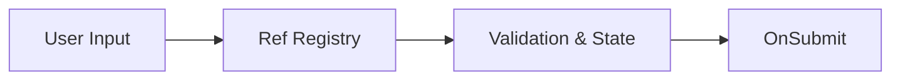

# React Hook Form: Работа с формами

**React Hook Form (RHF)** — это библиотека для управления состоянием форм, которая фокусируется на производительности и гибкости. В отличие от традиционных подходов, RHF минимизирует количество ререндеров при вводе текста.

### Почему RHF?

[Icon: Cpu] **Производительность:** Использует `uncontrolled components` и `ref`, что избавляет от рендера всего компонента на каждое нажатие клавиши.
[Icon: File-Json] **Валидация:** Простая интеграция со схемами валидации (Zod, Yup).
[Icon: Zap] **Размер:** Очень легкая библиотека без зависимостей.



### Базовое использование

Основной хук — `useForm`. Он возвращает методы для регистрации полей и обработки отправки.

```tsx
import { useForm } from 'react-hook-form';

function MyForm() {
  const { register, handleSubmit, formState: { errors } } = useForm();

  const onSubmit = (data) => console.log(data);

  return (
    <form onSubmit={handleSubmit(onSubmit)}>
      {/* Регистрируем поле с правилами валидации */}
      <input {...register("firstName", { required: true, minLength: 2 })} />
      {errors.firstName && <span>Минимум 2 символа</span>}

      <input {...register("email", { pattern: /^\S+@\S+$/i })} />
      
      <button type="submit">Отправить</button>
    </form>
  );
}
```

### Интеграция с Zod (Рекомендуется)

Использование схем валидации делает ваш код чище и безопаснее.

[Icon: Shield-Check] `npm install @hookform/resolvers zod`

```tsx
import { zodResolver } from '@hookform/resolvers/zod';
import { z } from 'zod';

const schema = z.object({
  age: z.number().min(18, "Доступно только взрослым"),
});

const { register, handleSubmit } = useForm({
  resolver: zodResolver(schema)
});
```

### Когда использовать?

- **Простые формы:** Быстрая настройка без лишнего бойлерплейта.
- **Сложные формы:** Динамические поля, вложенные объекты, массивы данных.
- **Высокая нагрузка:** [Формы](/react/forms) с сотнями полей ввода (например, конструкторы документов).

[Icon: Info] React Hook Form стал стандартом индустрии, вытеснив более тяжеловесные решения вроде Formik.

---

## 🔗 Полезные ссылки
- [Forms](/react/forms)

### Практика

Попробуйте примеры в интерактивном редакторе:

<Playground template="react" files={{ "/App.tsx": `import { useState } from 'react';

interface FormData {
  firstName: string;
  email: string;
  age: string;
  password: string;
}

interface Errors {
  firstName?: string;
  email?: string;
  age?: string;
  password?: string;
}

function validate(data: FormData): Errors {
  const errors: Errors = {};
  if (!data.firstName || data.firstName.length < 2) errors.firstName = 'Минимум 2 символа';
  if (!data.email || !/^\S+@\S+\.\S+$/.test(data.email)) errors.email = 'Некорректный email';
  if (!data.age || Number(data.age) < 18) errors.age = 'Должно быть 18+';
  if (!data.password || data.password.length < 6) errors.password = 'Минимум 6 символов';
  return errors;
}

export default function App() {
  const [form, setForm] = useState<FormData>({ firstName: '', email: '', age: '', password: '' });
  const [errors, setErrors] = useState<Errors>({});
  const [submitted, setSubmitted] = useState<FormData | null>(null);

  const set = (key: keyof FormData) => (e: React.ChangeEvent<HTMLInputElement>) => {
    setForm(p => ({ ...p, [key]: e.target.value }));
    if (errors[key]) setErrors(p => ({ ...p, [key]: undefined }));
  };

  const handleSubmit = (e: React.FormEvent) => {
    e.preventDefault();
    const errs = validate(form);
    if (Object.keys(errs).length > 0) { setErrors(errs); return; }
    setSubmitted(form);
  };

  const inputStyle = (hasError: boolean): React.CSSProperties => ({
    width: '100%', padding: '8px 12px', borderRadius: 8,
    border: hasError ? '1px solid #ef4444' : '1px solid #334155',
    background: '#0f172a', color: '#f1f5f9', outline: 'none', boxSizing: 'border-box',
  });

  if (submitted) {
    return (
      <div style={{ minHeight: '100vh', background: '#0f172a', display: 'flex', alignItems: 'center', justifyContent: 'center', fontFamily: 'system-ui,sans-serif' }}>
        <div style={{ background: '#1e293b', borderRadius: 12, padding: 32, maxWidth: 400, width: '100%', textAlign: 'center' }}>
          <div style={{ fontSize: '3rem', marginBottom: 12 }}>✅</div>
          <h2 style={{ color: '#4ade80', marginBottom: 16 }}>Форма отправлена!</h2>
          <div style={{ background: '#0f172a', borderRadius: 8, padding: 16, textAlign: 'left', marginBottom: 16 }}>
            {Object.entries(submitted).map(([k, v]) => (
              <div key={k} style={{ display: 'flex', gap: 8, marginBottom: 6 }}>
                <span style={{ color: '#60a5fa', fontSize: '0.8rem', minWidth: 90 }}>{k}:</span>
                <span style={{ color: '#e2e8f0', fontSize: '0.8rem' }}>{k === 'password' ? '••••••' : v}</span>
              </div>
            ))}
          </div>
          <button onClick={() => { setSubmitted(null); setForm({ firstName: '', email: '', age: '', password: '' }); }} style={{ padding: '8px 20px', borderRadius: 8, background: '#3b82f6', color: '#fff', border: 'none', cursor: 'pointer', fontWeight: 600 }}>← Назад</button>
        </div>
      </div>
    );
  }

  return (
    <div style={{ minHeight: '100vh', background: '#0f172a', fontFamily: 'system-ui,sans-serif', display: 'flex', flexDirection: 'column', alignItems: 'center', padding: '32px 20px' }}>
      <h1 style={{ color: '#60a5fa', fontSize: '1.4rem', marginBottom: 8 }}>📝 React Hook Form</h1>
      <p style={{ color: '#64748b', fontSize: '0.85rem', marginBottom: 24 }}>Симуляция с useState + валидация</p>

      <form onSubmit={handleSubmit} style={{ background: '#1e293b', borderRadius: 12, padding: 28, width: '100%', maxWidth: 420 }}>
        {[
          { key: 'firstName', label: 'Имя', type: 'text', placeholder: 'Алексей' },
          { key: 'email', label: 'Email', type: 'email', placeholder: 'user@example.com' },
          { key: 'age', label: 'Возраст', type: 'number', placeholder: '18' },
          { key: 'password', label: 'Пароль', type: 'password', placeholder: '••••••' },
        ].map(({ key, label, type, placeholder }) => (
          <div key={key} style={{ marginBottom: 16 }}>
            <label style={{ display: 'block', color: '#94a3b8', fontSize: '0.8rem', marginBottom: 6 }}>{label}</label>
            <input
              type={type}
              value={form[key as keyof FormData]}
              onChange={set(key as keyof FormData)}
              placeholder={placeholder}
              style={inputStyle(!!errors[key as keyof Errors])}
            />
            {errors[key as keyof Errors] && (
              <p style={{ color: '#f87171', fontSize: '0.75rem', margin: '4px 0 0' }}>⚠ {errors[key as keyof Errors]}</p>
            )}
          </div>
        ))}
        <button type="submit" style={{ width: '100%', padding: 10, borderRadius: 8, background: '#3b82f6', color: '#fff', border: 'none', cursor: 'pointer', fontWeight: 600, marginTop: 4 }}>
          Отправить
        </button>
      </form>

      <div style={{ background: '#1e293b', borderRadius: 12, padding: 16, width: '100%', maxWidth: 420, marginTop: 16 }}>
        <p style={{ color: '#64748b', fontSize: '0.72rem', lineHeight: 1.6, margin: 0 }}>
          💡 <span style={{ color: '#94a3b8' }}>React Hook Form использует неконтролируемые компоненты через</span> <span style={{ color: '#60a5fa' }}>register()</span><span style={{ color: '#94a3b8' }}>, что минимизирует ререндеры. Это демо имитирует ту же логику через useState.</span>
        </p>
      </div>
    </div>
  );
}
` }} />
