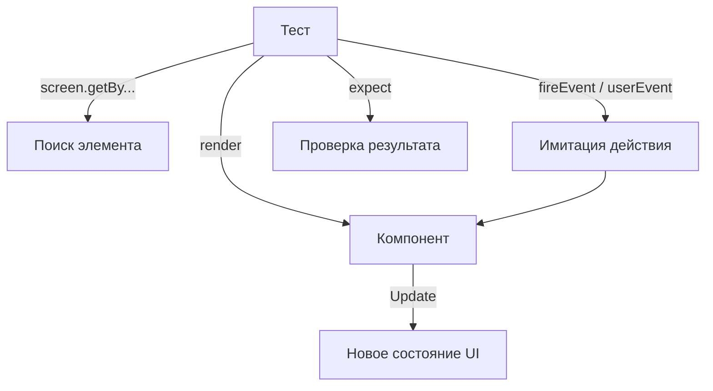

# React Testing Library: Основы

React Testing Library (RTL) — это библиотека для тестирования React-компонентов, которая поощряет лучшие практики, имитируя поведение пользователя.

Icon: CheckSquare (Галочка в квадрате)

## Описание

В отличие от тестов, которые проверяют детали реализации (состояние, методы класса), RTL фокусируется на том, что видит и делает пользователь: "Есть ли на экране кнопка?", "Меняется ли текст после клика?".

## Mermaid Диаграмма



## Базовый пример

Предположим, у нас есть компонент `Greeting`:

```jsx
const Greeting = ({ name }) => <h1>Привет, {name}!</h1>;
```

Тест для него:

```jsx
import { render, screen } from '@testing-library/react';
import Greeting from './Greeting';

test('отображает правильное приветствие', () => {
  render(<Greeting name="Алексей" />);
  const linkElement = screen.getByText(/Привет, Алексей/i);
  expect(linkElement).toBeInTheDocument();
});
```

## Приоритет запросов (Queries)

1. **getByRole**: Самый предпочтительный (доступность). `screen.getByRole('button', { name: /submit/i })`.
2. **getByLabelText**: Идеально для форм.
3. **getByPlaceholderText**: Если нет лейбла.
4. **getByText**: Для обычного контента.
5. **getByTestId**: Последний шанс, если ничего другое не подходит.

## Почему RTL?

- **Уверенность**: Если тесты проходят, значит приложение работает для пользователя.
- **Доступность (A11y)**: Использование `getByRole` заставляет вас писать семантичный HTML.
- **Устойчивость к рефакторингу**: Тесты не сломаются, если вы переименуете переменную состояния, но сохраните функциональность.

---

## 🔗 Полезные ссылки
- [Настройка Vitest для React](/react/vitest-setup)

### Практика

Попробуйте примеры в интерактивном редакторе:

<Playground template="react" files={{ "/App.tsx": `import { useState } from 'react';

const QUERIES = [
  { rank: 1, name: 'getByRole', example: "getByRole('button', { name: /submit/i })", color: '#4ade80' },
  { rank: 2, name: 'getByLabelText', example: "getByLabelText(/Email/i)", color: '#60a5fa' },
  { rank: 3, name: 'getByPlaceholderText', example: "getByPlaceholderText(/Search.../i)", color: '#a78bfa' },
  { rank: 4, name: 'getByText', example: "getByText(/Привет/i)", color: '#fb923c' },
  { rank: 5, name: 'getByTestId', example: "getByTestId('my-element')", color: '#f87171' },
];

function Greeting({ name }: { name: string }) {
  return (
    <div>
      <h2 style={{ color: '#e2e8f0', margin: '0 0 8px' }}>Привет, {name}!</h2>
      <p style={{ color: '#94a3b8', margin: 0 }}>Добро пожаловать в RTL</p>
    </div>
  );
}

export default function App() {
  const [name, setName] = useState('Алексей');

  return (
    <div style={{ minHeight: '100vh', background: '#0f172a', fontFamily: 'system-ui,sans-serif', padding: '32px 20px', display: 'flex', flexDirection: 'column', alignItems: 'center' }}>
      <h1 style={{ color: '#60a5fa', fontSize: '1.4rem', marginBottom: 24 }}>🔍 React Testing Library</h1>

      <div style={{ background: '#1e293b', borderRadius: 12, padding: 24, width: '100%', maxWidth: 500, marginBottom: 20 }}>
        <p style={{ color: '#94a3b8', fontSize: '0.8rem', marginBottom: 12 }}>Компонент, который мы тестируем:</p>
        <div style={{ background: '#0f172a', borderRadius: 8, padding: 16 }}>
          <Greeting name={name} />
        </div>
        <div style={{ marginTop: 12, display: 'flex', gap: 8, alignItems: 'center' }}>
          <label htmlFor="name-input" style={{ color: '#94a3b8', fontSize: '0.85rem' }}>Имя:</label>
          <input
            id="name-input"
            value={name}
            onChange={e => setName(e.target.value)}
            style={{ flex: 1, padding: '6px 10px', borderRadius: 6, border: '1px solid #334155', background: '#0f172a', color: '#f1f5f9', outline: 'none' }}
          />
        </div>
        <pre style={{ color: '#7dd3fc', fontSize: '0.7rem', marginTop: 16, background: '#0f172a', borderRadius: 8, padding: 12, overflowX: 'auto' }}>{
"// test\nrender(<Greeting name=\"" + name + "\" />);\nexpect(screen.getByText(/Привет, " + name + "/i)).toBeInTheDocument();"
        }</pre>
      </div>

      <div style={{ background: '#1e293b', borderRadius: 12, padding: 24, width: '100%', maxWidth: 500 }}>
        <p style={{ color: '#94a3b8', fontSize: '0.75rem', fontWeight: 600, textTransform: 'uppercase', marginBottom: 12, letterSpacing: '0.08em' }}>Приоритет запросов (Queries)</p>
        {QUERIES.map(q => (
          <div key={q.rank} style={{ display: 'flex', alignItems: 'flex-start', gap: 10, marginBottom: 10 }}>
            <span style={{ minWidth: 22, height: 22, borderRadius: '50%', background: q.color, color: '#0f172a', display: 'flex', alignItems: 'center', justifyContent: 'center', fontSize: '0.7rem', fontWeight: 700 }}>{q.rank}</span>
            <div>
              <span style={{ color: q.color, fontWeight: 600, fontSize: '0.85rem' }}>{q.name}</span>
              <code style={{ display: 'block', color: '#94a3b8', fontSize: '0.7rem', marginTop: 2 }}>{q.example}</code>
            </div>
          </div>
        ))}
      </div>
    </div>
  );
}
` }} />
