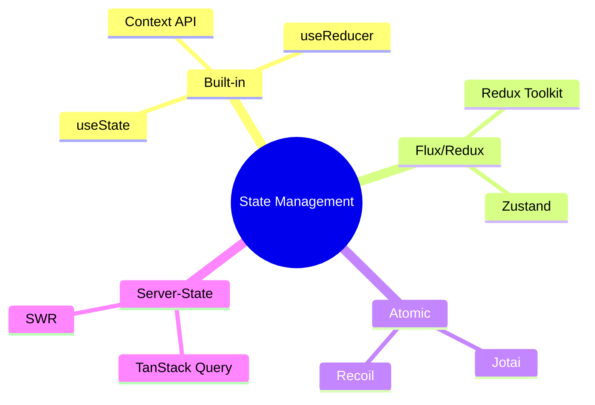

# Обзор подходов к управлению стейтом

Управление состоянием ([State](/react/props-state) Management) — одна из самых горячих тем в экосистеме React. С ростом приложения "прокидывание" пропсов (Prop Drilling) становится кошмаром, и возникает необходимость в глобальном хранилище.

### Классификация состояний

Прежде чем выбирать библиотеку, нужно понять, какой тип данных вы храните:

1.  **Local [State](/react/props-state):** Состояние одного компонента (`useState`).
2.  **Global [State](/react/props-state):** Данные, нужные многим компонентам (авторизация, тема).
3.  **Server Cache:** Данные с сервера (список товаров, профиль пользователя).
4.  **Form [State](/react/props-state):** Данные полей ввода и их валидация.

### Основные архитектурные подходы

### Сравнение популярных решений

| Инструмент | Подход | Сложность | Когда использовать |
| :--- | :--- | :--- | :--- |
| **[Context API](/react/use-context)** | Встроенный | Низкая | Для редко меняющихся данных (тема, язык) |
| **[Redux Toolkit](/react/redux-toolkit-intro)** | Flux (Centralized) | Высокая | Крупные корпоративные проекты, строгий контроль |
| **[Zustand](/react/zustand-basics)** | Centralized (Proxy-like) | Средняя | Современный стандарт для большинства задач |
| **[Jotai](/react/jotai-atomic) / [Recoil](/react/recoil-atoms)** | Atomic | Средняя | Сложные зависимости между частями стейта |
| **[TanStack Query](/react/react-query-intro)** | Server [State](/react/props-state) | Низкая | Для работы с API и кэшированием |

### Как выбрать?

[Icon: Check-Circle] **Масштаб проекта:** Для лендинга хватит `useState`. Для админ-панели — [Zustand](/react/zustand-basics) или Redux.
[Icon: Zap] **Производительность:** Если у вас тысячи обновлений в секунду, выбирайте Atomic-библиотеки или [Zustand](/react/zustand-basics).
[Icon: Cloud] **Источник данных:** Если 90% вашего глобального стейта — это данные из API, начните с [TanStack Query](/react/react-query-intro).

### Золотое правило
Не выносите в глобальный стейт то, что может жить внутри компонента. Чем локальнее состояние, тем проще тестировать и поддерживать код.

---

## 🔗 Полезные ссылки
- [Recoil: Atoms и Selectors](/react/recoil-atoms)
- [Use Context](/react/use-context)
- [Jotai: Атомарное управление состоянием](/react/jotai-atomic)
- [Props State](/react/props-state)
- [Redux Toolkit (RTK): Современный Redux](/react/redux-toolkit-intro)

### Практика

Попробуйте примеры в интерактивном редакторе:

<Playground template="react" files={{ "/App.tsx": `import { useState, useReducer, createContext, useContext } from "react";

// Демо: интерактивное сравнение подходов к управлению стейтом

// --- 1. useState (локальный стейт) ---
function UseStateDemo() {
  const [count, setCount] = useState(0);
  return (
    

      
{count}

      

        <button onClick={() => setCount(c => c - 1)} style={btnStyle("#ef4444")}>−</button>
        <button onClick={() => setCount(c => c + 1)} style={btnStyle("#22c55e")}>+</button>
        <button onClick={() => setCount(0)} style={btnStyle("#64748b")}>reset</button>
      

      
useState(0) — просто и локально

    

  );
}

// --- 2. useReducer (Redux-подобный паттерн) ---
type Action2 = { type: "inc" } | { type: "dec" } | { type: "reset" };
function reducer2(state: number, action: Action2): number {
  if (action.type === "inc") return state + 1;
  if (action.type === "dec") return state - 1;
  return 0;
}
function UseReducerDemo() {
  const [state, dispatch] = useReducer(reducer2, 0);
  return (
    

      
{state}

      

        <button onClick={() => dispatch({ type: "dec" })} style={btnStyle("#ef4444")}>−</button>
        <button onClick={() => dispatch({ type: "inc" })} style={btnStyle("#22c55e")}>+</button>
        <button onClick={() => dispatch({ type: "reset" })} style={btnStyle("#64748b")}>reset</button>
      

      
useReducer — Redux-паттерн локально

    

  );
}

// --- 3. Context API (глобальный стейт без библиотек) ---
const CountCtx = createContext<{ count: number; inc: () => void; dec: () => void } | null>(null);
function ContextChild() {
  const ctx = useContext(CountCtx)!;
  return (
    

      
{ctx.count}

      

        <button onClick={ctx.dec} style={btnStyle("#ef4444")}>−</button>
        <button onClick={ctx.inc} style={btnStyle("#22c55e")}>+</button>
      

      
Context API — без prop drilling

    

  );
}
function ContextDemo() {
  const [count, setCount] = useState(0);
  return (
    <CountCtx.Provider value={{ count, inc: () => setCount(c => c + 1), dec: () => setCount(c => c - 1) }}>
      <ContextChild />
    </CountCtx.Provider>
  );
}

// --- 4. Zustand-style (замыкание стора) ---
function createMiniStore(init: number) {
  let val = init;
  const subs = new Set<() => void>();
  return {
    get: () => val,
    set: (fn: (v: number) => number) => { val = fn(val); subs.forEach(f => f()); },
    sub: (fn: () => void) => { subs.add(fn); return () => subs.delete(fn); },
  };
}
const zustandStore = createMiniStore(0);
function ZustandDemo() {
  const [, re] = useState(0);
  useState(() => { zustandStore.sub(() => re(n => n + 1)); });
  return (
    

      
{zustandStore.get()}

      

        <button onClick={() => zustandStore.set(v => v - 1)} style={btnStyle("#ef4444")}>−</button>
        <button onClick={() => zustandStore.set(v => v + 1)} style={btnStyle("#22c55e")}>+</button>
        <button onClick={() => zustandStore.set(() => 0)} style={btnStyle("#64748b")}>reset</button>
      

      
Zustand — глобально, без провайдеров

    

  );
}

function btnStyle(bg: string) {
  return { padding: "8px 20px", background: bg, color: "#fff", border: "none", borderRadius: 8, cursor: "pointer", fontWeight: 700, fontSize: 14 };
}

const TABS = [
  { id: "useState",    label: "useState",    color: "#3b82f6", demo: UseStateDemo },
  { id: "useReducer",  label: "useReducer",  color: "#8b5cf6", demo: UseReducerDemo },
  { id: "context",     label: "Context API", color: "#10b981", demo: ContextDemo },
  { id: "zustand",     label: "Zustand ✦",   color: "#f59e0b", demo: ZustandDemo },
];

const WHEN = [
  { id: "useState",   text: "Локальный UI-стейт одного компонента" },
  { id: "useReducer", text: "Сложная логика переходов, Redux-паттерн" },
  { id: "context",    text: "Тема, язык, редко меняющиеся данные" },
  { id: "zustand",    text: "Большинство глобальных задач, без boilerplate" },
];

export default function App() {
  const [active, setActive] = useState("useState");
  const tab = TABS.find(t => t.id === active)!;
  const Demo = tab.demo;

  return (
    

      

        
          Обзор
        
        <h2 style={{ color: "#f8fafc", margin: "10px 0 4px", fontSize: 18 }}>State Management — сравнение</h2>
        

          Выбери подход и увидишь его в действии
        

        

          {TABS.map(t => (
            <button
              key={t.id}
              onClick={() => setActive(t.id)}
              style={{ padding: "7px 14px", background: active === t.id ? t.color : "#0f172a", color: active === t.id ? "#fff" : "#94a3b8", border: "1px solid " + (active === t.id ? t.color : "#334155"), borderRadius: 8, cursor: "pointer", fontWeight: 700, fontSize: 12, transition: "all .15s" }}
            >
              {t.label}
            </button>
          ))}
        

        

          <Demo />
        

        

          
// Когда использовать:

          {WHEN.map(w => (
            

               t.id === w.id)!.color, fontSize: 12, flexShrink: 0 }}>●
              <b style={{ color: "#f8fafc" }}>{w.id}:</b> {w.text}
            

          ))}
        

      

    

  );
}
` }} />
