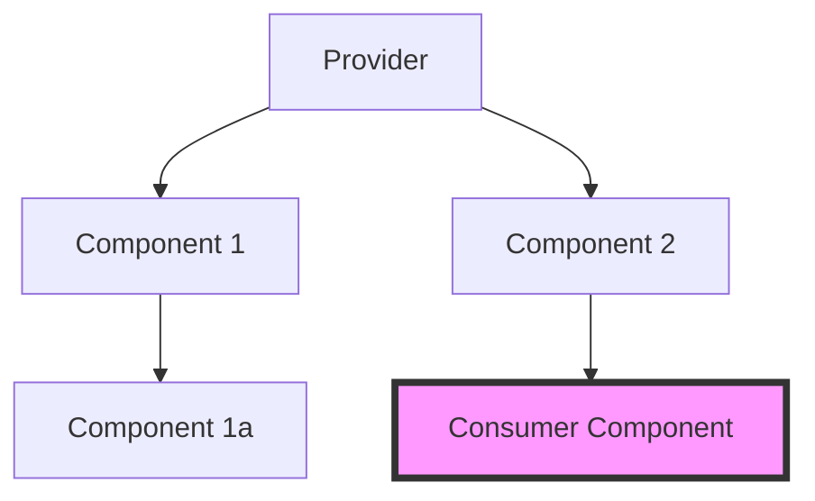

# React Context API

Context API — это встроенный механизм React для передачи данных через дерево компонентов без необходимости передавать пропсы вручную на каждом уровне (prop drilling).

### Когда использовать Context API

Context идеально подходит для данных, которые можно считать "глобальными" для дерева компонентов:
- Текущий авторизованный пользователь.
- Тема оформления (светлая/темная).
- Выбранный язык (локализация).

### Механизм работы



### Пример использования

1. Создание контекста:
```tsx
const ThemeContext = React.createContext('light');
```

2. Обертывание провайдером:
```tsx
<ThemeContext.Provider value="dark">
  <Toolbar />
</ThemeContext.Provider>
```

3. Потребление значения:
```tsx
const theme = useContext(ThemeContext);
```

### Ограничения и проблемы

Context API не является полноценным стейт-менеджером. Основная проблема — **избыточные ререндеры**. Когда значение в `Provider` меняется, все компоненты, использующие `useContext(MyContext)`, перерисовываются, даже если они используют только ту часть объекта, которая не изменилась.

### Сравнение: Context vs State Managers

| Характеристика | Context API | Стейт-менеджеры (Zustand, MobX) |
| :--- | :--- | :--- |
| **Установка** | Встроено в React | Требуется библиотека |
| **Prop Drilling** | Решает | Решает |
| **Производительность** | Средняя (ререндеры) | Высокая (селекторы/атомы) |
| **Логика** | Только хранение | Middleware, логика, дебаггинг |
| **Сложность** | Низкая | От средней до высокой |

---

## Интерактивный пример

<Playground
  template="react"
  files={{
    "/App.js": `import { createContext, useContext, useState } from 'react';

const ThemeContext = createContext();
const useTheme = () => useContext(ThemeContext);

function ThemeProvider({ children }) {
  const [theme, setTheme] = useState('dark');
  return (
    <ThemeContext.Provider value={{ theme, toggle: () => setTheme(t => t === 'dark' ? 'light' : 'dark') }}>
      {children}
    </ThemeContext.Provider>
  );
}

function Header() {
  const { theme, toggle } = useTheme();
  const d = theme === 'dark';
  return (
    <div style={{ background: d ? '#313244' : '#dde1f4', padding: '12px 16px', borderRadius: 8, display: 'flex', justifyContent: 'space-between', alignItems: 'center', marginBottom: 12 }}>
      <span style={{ color: d ? '#cdd6f4' : '#1e1e2e', fontWeight: 'bold' }}>Шапка — читает Context</span>
      <button onClick={toggle} style={{ background: d ? '#89b4fa' : '#1e1e2e', color: d ? '#1e1e2e' : '#cdd6f4', border: 'none', padding: '6px 14px', borderRadius: 6, cursor: 'pointer' }}>
        {d ? '☀️ Светлая' : '🌙 Тёмная'}
      </button>
    </div>
  );
}

function Card({ title }) {
  const { theme } = useTheme();
  const d = theme === 'dark';
  return (
    <div style={{ background: d ? '#313244' : '#e8eaf6', borderRadius: 8, padding: 14, margin: '8px 0', color: d ? '#cdd6f4' : '#1e1e2e', transition: 'all 0.3s' }}>
      <strong>{title}</strong>
      <p style={{ fontSize: 13, margin: '4px 0 0', color: d ? '#bac2de' : '#555' }}>Читает тему через useContext — без prop drilling</p>
    </div>
  );
}

function Inner() {
  const { theme } = useTheme();
  const d = theme === 'dark';
  return (
    <div style={{ padding: 20, background: d ? '#1e1e2e' : '#ffffff', minHeight: '100vh', fontFamily: 'sans-serif', transition: 'background 0.3s' }}>
      <Header />
      <Card title="Карточка 1" />
      <Card title="Карточка 2" />
      <Card title="Карточка 3" />
    </div>
  );
}

export default function App() {
  return <ThemeProvider><Inner /></ThemeProvider>;
}`,
  }}
/>
