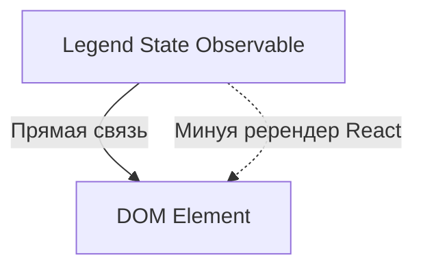

# Legend State: Сверхбыстрое состояние

Legend State — это современная библиотека управления состоянием, созданная для обеспечения максимальной производительности в React. Она утверждает, что является самой быстрой библиотекой на рынке.

### В чем секрет скорости?

В отличие от большинства библиотек, Legend State не заставляет компоненты перерендериваться при изменении стейта, если вы используете специальные компоненты или пропсы.

### Ключевые фишки

1.  **Observables:** Состояние оборачивается в прокси-объекты.
2.  **Fine-grained reactivity:** Обновляется только точечно тот узел DOM, который привязан к данным.
3.  **Persist:** Мощная система сохранения данных (Local/Remote).

### Когда использовать?

Legend State идеален для высоконагруженных интерфейсов (дашборды, редакторы, сложные формы), где сотни или тысячи элементов должны обновляться независимо и мгновенно.

---

## Интерактивный пример

<Playground
  template="react"
  files={{
    "/package.json": `{
  "dependencies": {
    "react": "^18.0.0",
    "react-dom": "^18.0.0",
    "@legendapp/state": "^2.1.0",
    "@legendapp/state": "^2.1.0"
  }
}`,
    "/App.js": `import { observable } from '@legendapp/state';
import { observer } from '@legendapp/state/react';
import { useState } from 'react';

// Глобальные observables — без Provider, без хуков
const state$ = observable({
  count: 0,
  todos: [],
  filter: 'all',
});

const btn = (bg, active) => ({
  background: active !== undefined ? (active ? bg : '#45475a') : bg || '#89b4fa',
  color: '#1e1e2e', border: 'none', padding: '7px 14px',
  borderRadius: 6, cursor: 'pointer', fontWeight: 'bold', margin: '0 3px',
});

const App = observer(function App() {
  const count = state$.count.get();
  const todos = state$.todos.get();
  const filter = state$.filter.get();
  const [input, setInput] = useState('');

  const visible = todos.filter(t =>
    filter === 'all' ? true : filter === 'active' ? !t.done : t.done
  );

  const addTodo = () => {
    if (!input.trim()) return;
    state$.todos.push({ id: Date.now(), text: input, done: false });
    setInput('');
  };

  const toggle = (id) => {
    const idx = state$.todos.findIndex(t => t.get().id === id);
    if (idx >= 0) state$.todos[idx].done.set(v => !v);
  };

  return (
    

      <h2 style={{ margin: '0 0 4px' }}>Legend State</h2>
      
observable() • observer() • Fine-grained reactivity

      

        
Observable Counter

        
{count}

        <button onClick={() => state$.count.set(c => c - 1)} style={btn()}>−</button>
        <button onClick={() => state$.count.set(c => c + 1)} style={btn()}>+</button>
        <button onClick={() => state$.count.set(0)} style={btn('#45475a')}>↺</button>
      

      

        
Observable Todo List

        

          <input value={input} onChange={e => setInput(e.target.value)} onKeyDown={e => e.key === 'Enter' && addTodo()}
            placeholder="Новая задача..." style={{ flex: 1, background: '#181825', color: '#cdd6f4', border: '1px solid #45475a', padding: '7px 10px', borderRadius: 6 }} />
          <button onClick={addTodo} style={btn()}>+</button>
        

        

          {['all','active','done'].map(f => (
            <button key={f} onClick={() => state$.filter.set(f)} style={{ ...btn('#89b4fa', filter === f), fontSize: 12, padding: '4px 10px' }}>{f}</button>
          ))}
        

        {visible.length === 0 && 
Пусто
}
        {visible.map(t => (
          
 toggle(t.id)} style={{ background: '#45475a', borderRadius: 6, padding: '8px 12px', marginBottom: 6, cursor: 'pointer', display: 'flex', alignItems: 'center', gap: 10 }}>
            {t.done ? '✅' : '⬜'}
            {t.text}
          

        ))}
      

    

  );
});

export default App;`,
  }}
/>
