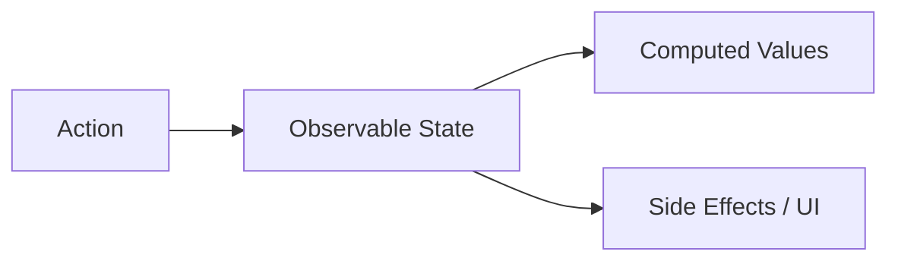

# MobX: Объектно-ориентированная реактивность

MobX — это библиотека, которая делает управление состоянием простым и масштабируемым путем применения функционального реактивного программирования (TFRP).

### Основная концепция

В отличие от Redux или Zustand, MobX не требует неизменяемости (immutability). Вы просто изменяете свойства объектов, а MobX автоматически обновляет только те части интерфейса, которые зависят от этих свойств.



### Три столпа MobX

1.  **State (Состояние):** Любые структуры данных (объекты, массивы, классы), помеченные как `makeAutoObservable`.
2.  **Actions (Действия):** Функции, которые изменяют состояние.
3.  **Derivations (Производные):** Все, что может быть вычислено автоматически (Computed values) или обновлено (UI).

### Пример на классах

```tsx
import { makeAutoObservable } from "mobx";

class CounterStore {
  count = 0;

  constructor() {
    makeAutoObservable(this);
  }

  increment() {
    this.count++;
  }
}

const store = new CounterStore();
```

### Плюсы и минусы

**Плюсы:**
- Минимум шаблонного кода.
- Высокая производительность "из коробки" (автоматическая оптимизация рендеров).
- Привычный объектно-ориентированный подход.

**Минусы:**
- Слишком много "магии" под капотом.
- Сложность отладки в очень больших приложениях из-за мутаций.
- Несовместимость с некоторыми концепциями Concurrent Mode в React.

---

## Интерактивный пример

<Playground
  template="react"
  files={{
    "/package.json": `{
  "dependencies": {
    "react": "^18.0.0",
    "react-dom": "^18.0.0",
    "mobx": "^6.12.0",
    "mobx-react-lite": "^4.0.5"
  }
}`,
    "/store.js": `import { makeAutoObservable } from 'mobx';

class CounterStore {
  count = 0;
  history = [];

  constructor() {
    makeAutoObservable(this);
  }

  increment() {
    this.history.push(this.count);
    this.count++;
  }

  decrement() {
    this.history.push(this.count);
    this.count--;
  }

  incrementBy(n) {
    this.history.push(this.count);
    this.count += n;
  }

  reset() {
    this.history.push(this.count);
    this.count = 0;
  }

  get doubled() {
    return this.count * 2;
  }
}

export const counterStore = new CounterStore();`,
    "/App.js": `import { observer } from 'mobx-react-lite';
import { counterStore } from './store';

const btn = (bg) => ({ background: bg || '#89b4fa', color: '#1e1e2e', border: 'none', padding: '8px 16px', borderRadius: 6, cursor: 'pointer', fontWeight: 'bold', margin: '0 4px' });

const App = observer(() => {
  const s = counterStore;
  return (
    <div style={{ padding: 20, background: '#1e1e2e', color: '#cdd6f4', minHeight: '100vh', fontFamily: 'sans-serif' }}>
      <h2 style={{ margin: '0 0 4px' }}>MobX — observable store</h2>
      <p style={{ color: '#bac2de', fontSize: 13, margin: '0 0 16px' }}>makeAutoObservable + observer()</p>
      <div style={{ background: '#313244', borderRadius: 8, padding: 20, marginBottom: 12, textAlign: 'center' }}>
        <div style={{ fontSize: 52, fontWeight: 'bold', color: '#89b4fa' }}>{s.count}</div>
        <div style={{ fontSize: 13, color: '#bac2de', marginBottom: 12 }}>computed: ×2 = <strong style={{ color: '#a6e3a1' }}>{s.doubled}</strong></div>
        <div>
          <button onClick={() => s.decrement()} style={btn()}>−1</button>
          <button onClick={() => s.increment()} style={btn()}>+1</button>
          <button onClick={() => s.incrementBy(5)} style={btn('#a6e3a1')}>+5</button>
          <button onClick={() => s.reset()} style={btn('#45475a')}>↺</button>
        </div>
      </div>
      <div style={{ background: '#181825', borderRadius: 8, padding: 12 }}>
        <div style={{ fontSize: 12, color: '#bac2de', marginBottom: 4 }}>История (мутации):</div>
        <div style={{ fontFamily: 'monospace', fontSize: 13, color: '#a6e3a1' }}>
          {s.history.length === 0 ? <span style={{ color: '#585b70' }}>Нет изменений</span> :
            s.history.slice(-6).map((v, i) => <span key={i} style={{ marginRight: 6 }}>{v}</span>)}
          {s.history.length > 0 && <span style={{ color: '#89b4fa', fontWeight: 'bold' }}>→ {s.count}</span>}
        </div>
      </div>
    </div>
  );
});

export default App;`,
  }}
/>
