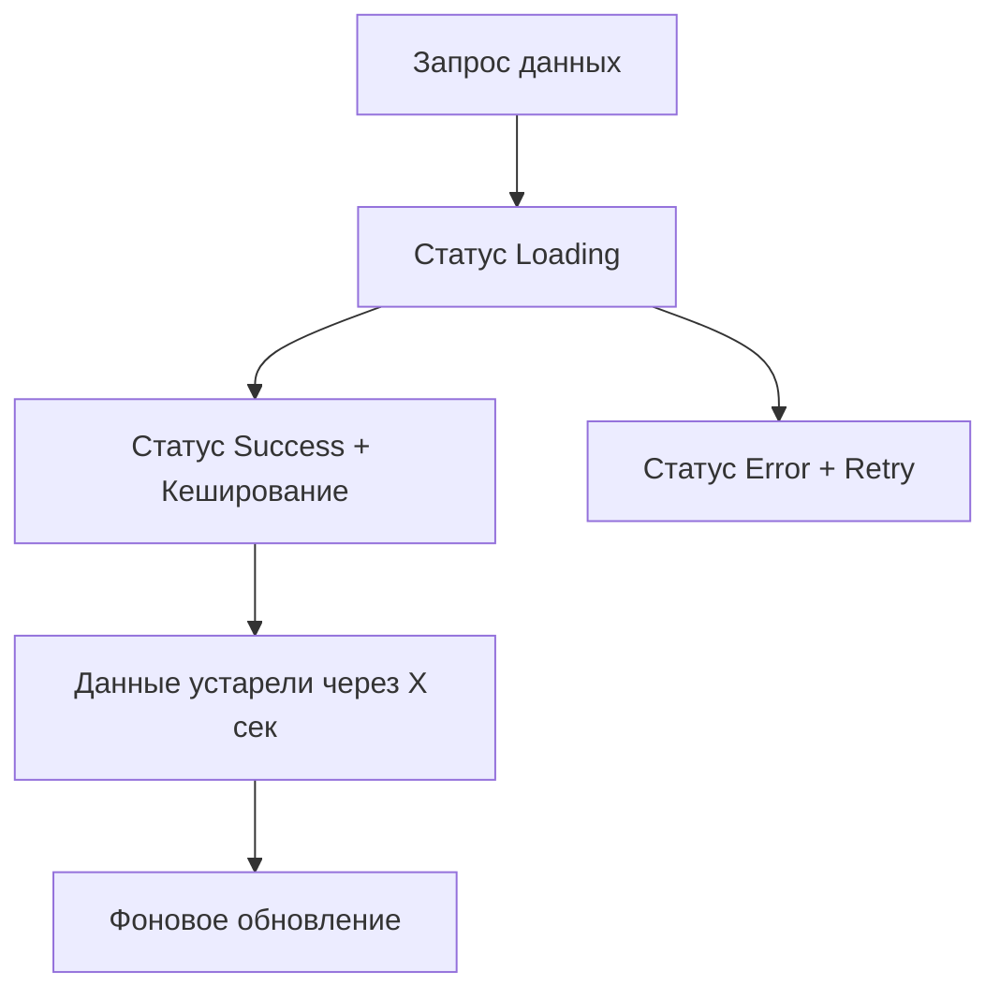

# TanStack Query: Серверное состояние

TanStack Query (ранее известный как React Query) — это мощная библиотека для управления асинхронным состоянием (запросами к API, кешированием, синхронизацией).

### Почему не useEffect?

Многие разработчики используют `useEffect` и `useState` для загрузки данных. Это приводит к проблемам:
- Отсутствие кеширования.
- Дублирование запросов.
- Сложность обработки состояний загрузки и ошибок.
- Проблемы с "протуханием" данных (stale data).

### Жизненный цикл данных

### Основные возможности

1.  **Caching:** Данные сохраняются в памяти и возвращаются мгновенно при повторном запросе.
2.  **Deduping:** Если два компонента запрашивают одни и те же данные одновременно, выполнится только один запрос.
3.  **Automatic Refetch:** Данные обновляются при смене фокуса окна или восстановлении сети.
4.  **Pagination & Infinite Scroll:** Встроенная поддержка сложных сценариев загрузки.

### Сравнение с клиентскими стейт-менеджерами

TanStack Query управляет **серверным состоянием** (то, что лежит в БД). Zustand или Redux лучше подходят для **клиентского состояния** (открыта ли модалка, фильтры поиска).

---

## Интерактивный пример

<Playground
  template="react"
  files={{
    "/package.json": `{
  "dependencies": {
    "react": "^18.0.0",
    "react-dom": "^18.0.0",
    "@tanstack/react-query": "^5.17.0"
  }
}`,
    "/App.js": `import { QueryClient, QueryClientProvider, useQuery, useQueryClient } from '@tanstack/react-query';
import { useState } from 'react';

const queryClient = new QueryClient();

const mockData = {
  users: [
    { id: 1, name: 'Алекс', email: 'alex@mail.com' },
    { id: 2, name: 'Мария', email: 'maria@mail.com' },
    { id: 3, name: 'Дмитрий', email: 'dima@mail.com' },
  ],
  todos: [
    { id: 1, title: 'Изучить TanStack Query', done: true },
    { id: 2, title: 'Написать тесты', done: false },
    { id: 3, title: 'Задеплоить приложение', done: false },
  ],
};

const fetchData = (key) =>
  new Promise((res) => setTimeout(() => res(mockData[key]), 700));

function DataSection({ queryKey }) {
  const qc = useQueryClient();
  const { data, isLoading, isFetching, status } = useQuery({
    queryKey: [queryKey],
    queryFn: () => fetchData(queryKey),
    staleTime: 5000,
  });

  const statusColor = { loading: '#fab387', success: '#a6e3a1', error: '#f38ba8' };

  return (
    

      

        useQuery(["{queryKey}"])
        
          {isFetching ? '⏳ fetching' : status}
        
      

      {isLoading && 
Загрузка...
}
      {data && data.map(item => (
        

          {item.name || item.title}
          {item.email || (item.done ? '✅' : '⏳')}
        

      ))}
      <button onClick={() => qc.invalidateQueries({ queryKey: [queryKey] })}
        style={{ background: '#89b4fa', color: '#1e1e2e', border: 'none', padding: '6px 14px', borderRadius: 6, cursor: 'pointer', marginTop: 8, fontSize: 13 }}>
        🔄 Invalidate Cache
      </button>
    

  );
}

function Inner() {
  const [tab, setTab] = useState('users');
  return (
    

      <h2 style={{ margin: '0 0 4px' }}>TanStack Query</h2>
      
Кэш • Статусы • Автоматическое обновление

      

        {['users', 'todos'].map(t => (
          <button key={t} onClick={() => setTab(t)}
            style={{ background: tab === t ? '#89b4fa' : '#313244', color: tab === t ? '#1e1e2e' : '#cdd6f4', border: 'none', padding: '8px 14px', borderRadius: 6, cursor: 'pointer' }}>
            {t}
          </button>
        ))}
      

      <DataSection key={tab} queryKey={tab} />
    

  );
}

export default function App() {
  return <QueryClientProvider client={queryClient}><Inner /></QueryClientProvider>;
}`,
  }}
/>
