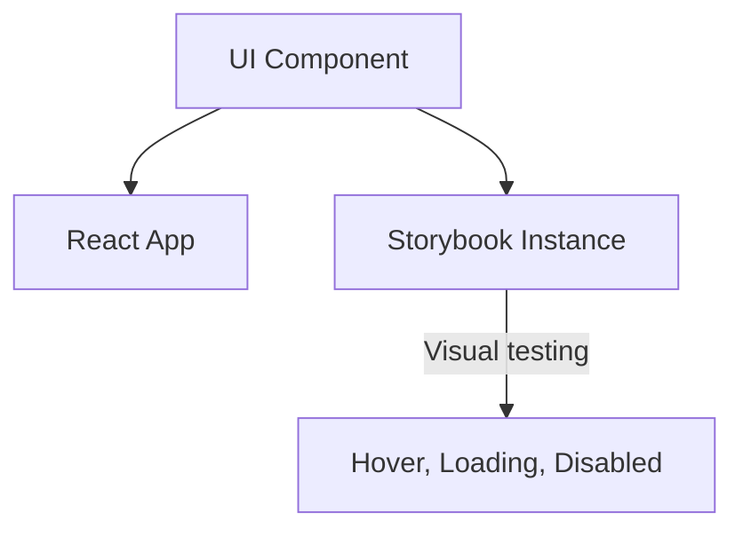

# [Компоненты](/react/components) в Storybook

Storybook — это инструмент для разработки UI-компонентов в изоляции. Он позволяет визуализировать компоненты в разных состояниях без запуска всего приложения.

Icon: BookOpen (Открытая книга)

## Описание

Storybook служит "песочницей" и живой документацией проекта. Дизайнеры и разработчики могут видеть все варианты кнопок, инпутов и карточек в одном месте.

## Mermaid Диаграмма



## Установка

```bash
npx storybook@latest init
```

## Пример "Истории" (Story)

Создайте файл `src/components/MyButton.stories.tsx`:

```tsx
import type { Meta, StoryObj } from '@storybook/react';
import { MyButton } from './MyButton';

const meta: Meta<typeof MyButton> = {
  component: MyButton,
  title: 'Components/MyButton',
};

export default meta;
type Story = StoryObj<typeof MyButton>;

export const Primary: Story = {
  args: {
    primary: true,
    label: 'Нажми меня',
  },
};

export const Large: Story = {
  args: {
    size: 'large',
    label: 'Большая кнопка',
  },
};
```

## Преимущества Storybook

1. **Разработка в изоляции**: Вам не нужно переходить на 5-й экран приложения, чтобы протестировать модалку.
2. **Документация**: Автоматическая генерация документации по пропсам.
3. **Controls**: Интерактивная панель, где можно менять пропсы на лету и видеть результат.
4. **Аддоны**: Поддержка проверки доступности, измерения размеров и переключения тем (Dark/Light mode).

---

## 🔗 Полезные ссылки
- [React Компоненты](/react/components)

### Практика

Попробуйте примеры в интерактивном редакторе:

<Playground template="react" files={{ "/App.tsx": `import { useState } from 'react';

type ButtonProps = {
  label: string;
  primary?: boolean;
  size?: 'small' | 'medium' | 'large';
  disabled?: boolean;
  onClick?: () => void;
};

function MyButton({ label, primary = false, size = 'medium', disabled = false, onClick }: ButtonProps) {
  const sizes: Record<string, React.CSSProperties> = {
    small: { padding: '5px 12px', fontSize: '0.78rem' },
    medium: { padding: '8px 18px', fontSize: '0.9rem' },
    large: { padding: '12px 26px', fontSize: '1rem' },
  };
  return (
    <button
      onClick={onClick}
      disabled={disabled}
      style={{ ...sizes[size], borderRadius: 8, border: primary ? 'none' : '1px solid #475569', background: disabled ? '#1e293b' : primary ? '#3b82f6' : 'transparent', color: disabled ? '#475569' : primary ? '#fff' : '#94a3b8', cursor: disabled ? 'not-allowed' : 'pointer', fontWeight: 600, transition: 'all 0.15s' }}
    >{label}</button>
  );
}

const STORIES = [
  { name: 'Primary', args: { label: 'Нажми меня', primary: true, size: 'medium' as const } },
  { name: 'Secondary', args: { label: 'Отмена', primary: false, size: 'medium' as const } },
  { name: 'Large', args: { label: 'Большая кнопка', primary: true, size: 'large' as const } },
  { name: 'Small', args: { label: 'Маленькая', primary: false, size: 'small' as const } },
  { name: 'Disabled', args: { label: 'Недоступна', primary: true, size: 'medium' as const, disabled: true } },
];

const META_CODE = [
  "// MyButton.stories.tsx",
  "import type { Meta, StoryObj } from '@storybook/react';",
  "import { MyButton } from './MyButton';",
  "",
  "const meta: Meta<typeof MyButton> = {",
  "  component: MyButton,",
  "  title: 'Components/MyButton',",
  "};",
  "export default meta;",
  "type Story = StoryObj<typeof MyButton>;",
  "",
  "export const Primary: Story = {",
  "  args: { primary: true, label: 'Нажми меня' },",
  "};",
].join('\n');

export default function App() {
  const [selected, setSelected] = useState(0);
  const [log, setLog] = useState<string>('');
  const current = STORIES[selected];

  return (
    <div style={{ minHeight: '100vh', background: '#0f172a', fontFamily: 'system-ui,sans-serif', display: 'flex', flexDirection: 'column', alignItems: 'center', padding: '32px 20px' }}>
      <h1 style={{ color: '#60a5fa', fontSize: '1.4rem', marginBottom: 8 }}>📖 Storybook — компоненты</h1>
      <p style={{ color: '#64748b', fontSize: '0.85rem', marginBottom: 24 }}>UI-компонент в разных состояниях</p>

      <div style={{ display: 'flex', gap: 16, width: '100%', maxWidth: 560 }}>
        <div style={{ background: '#1e293b', borderRadius: 12, padding: 16, width: 160, flexShrink: 0 }}>
          <p style={{ color: '#64748b', fontSize: '0.7rem', fontWeight: 600, textTransform: 'uppercase', letterSpacing: '0.06em', marginBottom: 10 }}>Stories</p>
          {STORIES.map((s, i) => (
            <button key={s.name} onClick={() => { setSelected(i); setLog(''); }}
              style={{ display: 'block', width: '100%', textAlign: 'left', padding: '7px 10px', borderRadius: 6, background: selected === i ? '#3b82f6' : 'transparent', color: selected === i ? '#fff' : '#94a3b8', border: 'none', cursor: 'pointer', fontSize: '0.82rem', marginBottom: 2 }}>
              {s.name}
            </button>
          ))}
        </div>

        <div style={{ flex: 1, display: 'flex', flexDirection: 'column', gap: 12 }}>
          <div style={{ background: '#1e293b', borderRadius: 12, padding: 24, display: 'flex', alignItems: 'center', justifyContent: 'center', minHeight: 100 }}>
            <MyButton {...current.args} onClick={() => setLog(\`onClick fired — "\${current.args.label}"\`)} />
          </div>
          {log && <div style={{ background: '#1e293b', borderRadius: 8, padding: '10px 14px', color: '#4ade80', fontSize: '0.78rem' }}>✓ {log}</div>}
          <div style={{ background: '#1e293b', borderRadius: 12, padding: 16 }}>
            <p style={{ color: '#64748b', fontSize: '0.7rem', fontWeight: 600, textTransform: 'uppercase', letterSpacing: '0.06em', marginBottom: 8 }}>Args</p>
            {Object.entries(current.args).map(([k, v]) => (
              <div key={k} style={{ display: 'flex', gap: 6, marginBottom: 4 }}>
                <span style={{ color: '#60a5fa', fontSize: '0.75rem', minWidth: 70 }}>{k}:</span>
                <span style={{ color: '#f1f5f9', fontSize: '0.75rem' }}>{String(v)}</span>
              </div>
            ))}
          </div>
        </div>
      </div>

      <div style={{ background: '#1e293b', borderRadius: 12, padding: 20, width: '100%', maxWidth: 560, marginTop: 16 }}>
        <p style={{ color: '#94a3b8', fontSize: '0.75rem', fontWeight: 600, textTransform: 'uppercase', marginBottom: 10, letterSpacing: '0.08em' }}>📝 Файл истории</p>
        <pre style={{ color: '#7dd3fc', fontSize: '0.7rem', lineHeight: 1.7, margin: 0, overflowX: 'auto', whiteSpace: 'pre-wrap' }}>{META_CODE}</pre>
      </div>
    </div>
  );
}
` }} />
