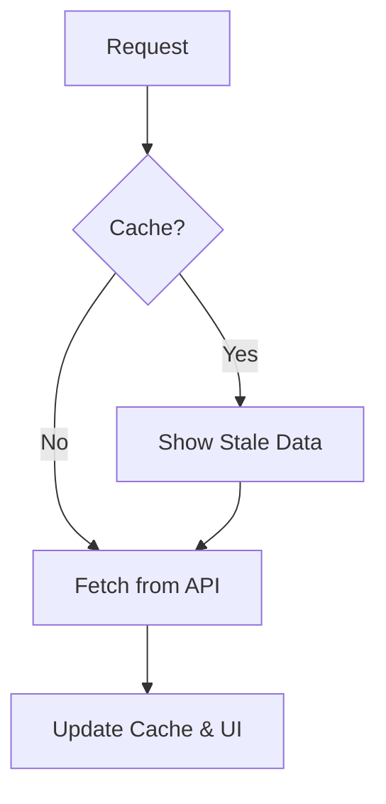

# SWR: Fetching данных от Vercel

**SWR** (Stale-While-Revalidate) — это библиотека от команды Vercel (создателей Next.js) для получения данных. Она легче, чем [TanStack Query](/react/react-query-intro), и фокусируется на простоте и скорости.

### Стратегия SWR

Название происходит от HTTP-заголовка `Cache-Control: stale-while-revalidate`.



### Базовый синтаксис

SWR максимально лаконичен. Вам нужно передать ключ (URL) и функцию-фетчер.

```tsx
import useSWR from 'swr';

const fetcher = (url: string) => fetch(url).then((res) => res.json());

function Profile() {
  const { data, error, isLoading } = useSWR('/api/user/123', fetcher);

  if (error) return <div>Ошибка загрузки</div>;
  if (isLoading) return <div>Загрузка...</div>;
  return <div>Привет, {data.name}!</div>;
}
```

### Преимущества SWR

- **Автоматический ревалидация:** Обновляет данные при смене фокуса вкладки или восстановлении сети.
- **Поддержка SSR/Next.js:** Идеально интегрируется с Next.js.
- **Маленький размер:** Минимум зависимостей.
- **Shared [State](/react/props-state):** Если два компонента вызывают `useSWR` с одним и тем же ключом, будет отправлен только один запрос.

### Мутации в SWR

Для изменения данных используется функция `mutate`.

[Icon: Edit] **Local Mutate:** Обновить данные только в текущем кэше.
[Icon: Globe] **Global Mutate:** Обновить данные во всех компонентах по ключу.

```tsx
import { useSWRConfig } from 'swr';

function UpdateButton() {
  const { mutate } = useSWRConfig();
  
  return (
    <button onClick={() => mutate('/api/user/123')}>
      Обновить профиль
    </button>
  );
}
```

### Когда выбрать SWR вместо [React Query](/react/react-query-intro)?

[Icon: Scaling] Выбирайте **SWR**, если вам нужно простое решение для фетчинга данных без сложного управления мутациями, бесконечными списками и тяжелым кэшированием. Для большинства стандартных приложений SWR более чем достаточно.

---

## 🔗 Полезные ссылки
- [Props State](/react/props-state)
- [TanStack Query (React Query): Работа с серверным стейтом](/react/react-query-intro)

### Практика

Попробуйте примеры в интерактивном редакторе:

<Playground template="react" files={{ "/App.tsx": `import { useState, useEffect, useCallback, useRef } from 'react';

interface User {
  id: number;
  name: string;
  email: string;
  role: string;
}

const MOCK_USERS: Record<number, User> = {
  1: { id: 1, name: 'Алексей Иванов', email: 'alex@dev.ru', role: 'Frontend Dev' },
  2: { id: 2, name: 'Мария Петрова', email: 'maria@design.ru', role: 'UI/UX Designer' },
  3: { id: 3, name: 'Дмитрий Сидоров', email: 'dmitry@backend.ru', role: 'Backend Dev' },
};

// Simulates useSWR hook with stale-while-revalidate
function useSWR(key: number | null) {
  const cache = useRef<Record<number, User>>({});
  const [data, setData] = useState<User | null>(null);
  const [isLoading, setIsLoading] = useState(false);
  const [error, setError] = useState<string | null>(null);
  const [isValidating, setIsValidating] = useState(false);

  const revalidate = useCallback(async (userId: number, isBackground = false) => {
    if (!isBackground) {
      const stale = cache.current[userId];
      if (stale) {
        setData(stale);
        setIsLoading(false);
      } else {
        setIsLoading(true);
      }
    }
    setIsValidating(true);
    setError(null);

    await new Promise(r => setTimeout(r, isBackground ? 600 : 800));

    const user = MOCK_USERS[userId];
    if (!user) {
      setError('Пользователь не найден');
      setIsLoading(false);
      setIsValidating(false);
      return;
    }
    const fresh = { ...user, name: user.name + (isBackground ? ' ↺' : '') };
    cache.current[userId] = fresh;
    setData(fresh);
    setIsLoading(false);
    setIsValidating(false);
  }, []);

  useEffect(() => {
    if (!key) return;
    revalidate(key, !!cache.current[key]);
  }, [key]);

  const mutate = () => key && revalidate(key, true);
  return { data, isLoading, error, isValidating, mutate };
}

export default function App() {
  const [userId, setUserId] = useState<number>(1);
  const { data, isLoading, error, isValidating, mutate } = useSWR(userId);

  return (
    <div style={{ minHeight: '100vh', background: '#0f172a', fontFamily: 'system-ui,sans-serif', padding: '32px 20px', display: 'flex', flexDirection: 'column', alignItems: 'center' }}>
      <h1 style={{ color: '#60a5fa', fontSize: '1.4rem', marginBottom: 8 }}>🌊 SWR — Stale-While-Revalidate</h1>
      <p style={{ color: '#64748b', fontSize: '0.85rem', marginBottom: 24 }}>Симуляция useSWR от Vercel</p>

      <div style={{ display: 'flex', gap: 8, marginBottom: 20, flexWrap: 'wrap', justifyContent: 'center' }}>
        {[1, 2, 3].map(id => (
          <button key={id} onClick={() => setUserId(id)}
            style={{ padding: '8px 20px', borderRadius: 8, background: userId === id ? '#3b82f6' : '#1e293b', color: userId === id ? '#fff' : '#94a3b8', border: '1px solid #334155', cursor: 'pointer', fontWeight: userId === id ? 600 : 400 }}>
            User {id}
          </button>
        ))}
        <button onClick={mutate}
          style={{ padding: '8px 16px', borderRadius: 8, background: '#1e293b', color: '#fbbf24', border: '1px solid #334155', cursor: 'pointer' }}>
          ↺ Mutate
        </button>
      </div>

      <div style={{ display: 'flex', gap: 8, marginBottom: 20 }}>
        {[
          { label: 'isLoading', val: isLoading, c: '#fbbf24' },
          { label: 'isValidating', val: isValidating, c: '#60a5fa' },
          { label: 'hasData', val: !!data, c: '#4ade80' },
        ].map(s => (
          <span key={s.label} style={{ padding: '3px 10px', borderRadius: 20, background: '#1e293b', fontSize: '0.72rem', color: s.val ? s.c : '#475569', border: \`1px solid \${s.val ? s.c : '#334155'}\` }}>
            {s.label}: <b>{String(s.val)}</b>
          </span>
        ))}
      </div>

      <div style={{ background: '#1e293b', borderRadius: 12, padding: 24, width: '100%', maxWidth: 440, marginBottom: 16, minHeight: 120 }}>
        {isLoading && !data && (
          <div style={{ textAlign: 'center', padding: 24 }}>
            <p style={{ color: '#94a3b8' }}>⏳ Загрузка...</p>
          </div>
        )}
        {error && <p style={{ color: '#f87171' }}>❌ {error}</p>}
        {data && (
          <div style={{ opacity: isValidating ? 0.7 : 1, transition: 'opacity 0.2s' }}>
            <div style={{ display: 'flex', alignItems: 'center', gap: 16 }}>
              <div style={{ width: 56, height: 56, borderRadius: '50%', background: '#3b82f6', display: 'flex', alignItems: 'center', justifyContent: 'center', fontSize: '1.4rem', flexShrink: 0 }}>
                {data.name[0]}
              </div>
              <div>
                <h2 style={{ color: '#e2e8f0', margin: '0 0 4px', fontSize: '1rem' }}>{data.name}</h2>
                <p style={{ color: '#60a5fa', margin: '0 0 2px', fontSize: '0.82rem' }}>{data.role}</p>
                <p style={{ color: '#475569', margin: 0, fontSize: '0.78rem' }}>{data.email}</p>
              </div>
            </div>
            {isValidating && <p style={{ color: '#60a5fa', fontSize: '0.75rem', marginTop: 12, marginBottom: 0 }}>🔄 Фоновое обновление...</p>}
          </div>
        )}
      </div>

      <div style={{ background: '#1e293b', borderRadius: 12, padding: 20, width: '100%', maxWidth: 440 }}>
        <p style={{ color: '#94a3b8', fontSize: '0.75rem', fontWeight: 600, textTransform: 'uppercase', marginBottom: 10, letterSpacing: '0.08em' }}>📦 SWR API</p>
        <pre style={{ color: '#7dd3fc', fontSize: '0.7rem', lineHeight: 1.7, margin: 0, overflowX: 'auto', whiteSpace: 'pre-wrap' }}>{[
          "import useSWR from 'swr';",
          "",
          "const fetcher = (url: string) =>",
          "  fetch(url).then(r => r.json());",
          "",
          "function Profile() {",
          "  const { data, error, isLoading } =",
          "    useSWR('/api/user/1', fetcher);",
          "",
          "  if (isLoading) return <div>Загрузка...</div>;",
          "  if (error) return <div>Ошибка</div>;",
          "  return <div>{data.name}</div>;",
          "}",
        ].join('\n')}</pre>
      </div>
    </div>
  );
}
` }} />
