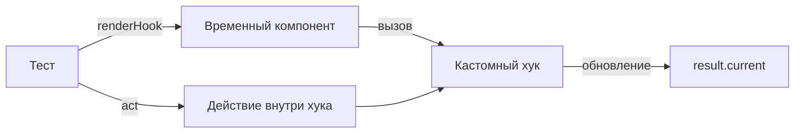

# Тестирование кастомных хуков

[Хуки](/react/hooks) нельзя вызывать вне функциональных компонентов, поэтому для их тестирования используется специальная утилита `renderHook`.

Icon: Anchor (Якорь)

## Описание

`renderHook` создает временный компонент-обертку, вызывает внутри него ваш хук и предоставляет доступ к возвращаемым значениям через объект `result`.

## Mermaid Диаграмма



## Пример тестирования `useCounter`

Хук:
```javascript
export function useCounter() {
  const [count, setCount] = useState(0);
  const increment = () => setCount((c) => c + 1);
  return { count, increment };
}
```

Тест:
```javascript
import { renderHook, act } from '@testing-library/react';
import { useCounter } from './useCounter';

test('должен увеличивать счетчик', () => {
  const { result } = renderHook(() => useCounter());

  expect(result.current.count).toBe(0);

  act(() => {
    result.current.increment();
  });

  expect(result.current.count).toBe(1);
});
```

## Почему нужен `act`?

Любые действия, приводящие к обновлению состояния в React (клики, изменение стейта в хуке), в тестах должны быть обернуты в `act(...)`. Это гарантирует, что все обновления будут применены до того, как вы начнете проверять результат (assertions).

## Тестирование асинхронных хуков

Для хуков, которые загружают данные, используйте `waitFor`:

```javascript
const { result } = renderHook(() => useUser(1));
await waitFor(() => expect(result.current.isLoaded).toBe(true));
```

---

## 🔗 Полезные ссылки
- [Настройка Vitest для React](/react/vitest-setup)
- [React Testing Library: Основы](/react/rtl-basics)
- [Hooks](/react/hooks)

### Практика

Попробуйте примеры в интерактивном редакторе:

<Playground template="react" files={{ "/App.tsx": `import { useState, useCallback } from 'react';

// Custom hook under test
function useCounter(initial = 0) {
  const [count, setCount] = useState(initial);
  const increment = useCallback(() => setCount(c => c + 1), []);
  const decrement = useCallback(() => setCount(c => c - 1), []);
  const reset = useCallback(() => setCount(initial), [initial]);
  return { count, increment, decrement, reset };
}

function useToggle(initial = false) {
  const [value, setValue] = useState(initial);
  const toggle = useCallback(() => setValue(v => !v), []);
  return [value, toggle] as const;
}

const TEST_CODE = [
  "import { renderHook, act } from '@testing-library/react';",
  "import { useCounter } from './useCounter';",
  "",
  "test('should increment counter', () => {",
  "  const { result } = renderHook(() => useCounter(0));",
  "",
  "  expect(result.current.count).toBe(0);",
  "",
  "  act(() => {",
  "    result.current.increment();",
  "  });",
  "",
  "  expect(result.current.count).toBe(1);",
  "});",
].join('\n');

export default function App() {
  const { count, increment, decrement, reset } = useCounter(0);
  const [dark, toggleDark] = useToggle(true);

  return (
    <div style={{ minHeight: '100vh', background: '#0f172a', fontFamily: 'system-ui,sans-serif', padding: '32px 20px', display: 'flex', flexDirection: 'column', alignItems: 'center' }}>
      <h1 style={{ color: '#60a5fa', fontSize: '1.4rem', marginBottom: 24 }}>⚓ Тестирование кастомных хуков</h1>

      <div style={{ background: '#1e293b', borderRadius: 12, padding: 24, width: '100%', maxWidth: 480, marginBottom: 20 }}>
        <p style={{ color: '#94a3b8', fontSize: '0.8rem', marginBottom: 16 }}>🎣 useCounter — живая демо</p>
        <div style={{ display: 'flex', alignItems: 'center', justifyContent: 'center', gap: 16, marginBottom: 16 }}>
          <button onClick={decrement} style={{ width: 40, height: 40, borderRadius: 8, background: '#334155', color: '#f1f5f9', border: 'none', cursor: 'pointer', fontSize: '1.2rem' }}>−</button>
          <span style={{ color: '#60a5fa', fontSize: '2.5rem', fontWeight: 700, minWidth: 60, textAlign: 'center' }}>{count}</span>
          <button onClick={increment} style={{ width: 40, height: 40, borderRadius: 8, background: '#3b82f6', color: '#fff', border: 'none', cursor: 'pointer', fontSize: '1.2rem' }}>+</button>
        </div>
        <div style={{ textAlign: 'center' }}>
          <button onClick={reset} style={{ padding: '6px 16px', borderRadius: 6, background: '#475569', color: '#fff', border: 'none', cursor: 'pointer', fontSize: '0.85rem' }}>Сбросить</button>
        </div>
      </div>

      <div style={{ background: '#1e293b', borderRadius: 12, padding: 24, width: '100%', maxWidth: 480, marginBottom: 20 }}>
        <p style={{ color: '#94a3b8', fontSize: '0.8rem', marginBottom: 12 }}>🎣 useToggle — живая демо</p>
        <div style={{ display: 'flex', alignItems: 'center', gap: 12 }}>
          <button onClick={toggleDark} style={{ padding: '8px 20px', borderRadius: 8, background: dark ? '#3b82f6' : '#334155', color: '#fff', border: 'none', cursor: 'pointer', fontWeight: 600 }}>
            {dark ? '🌙 Тёмная тема' : '☀️ Светлая тема'}
          </button>
          <span style={{ color: '#64748b', fontSize: '0.8rem' }}>value: <span style={{ color: '#f1f5f9' }}>{String(dark)}</span></span>
        </div>
      </div>

      <div style={{ background: '#1e293b', borderRadius: 12, padding: 24, width: '100%', maxWidth: 480 }}>
        <p style={{ color: '#94a3b8', fontSize: '0.75rem', fontWeight: 600, textTransform: 'uppercase', marginBottom: 10, letterSpacing: '0.08em' }}>🧪 renderHook тест</p>
        <pre style={{ color: '#86efac', fontSize: '0.7rem', lineHeight: 1.7, margin: 0, overflowX: 'auto', whiteSpace: 'pre-wrap' }}>{TEST_CODE}</pre>
      </div>
    </div>
  );
}
` }} />
