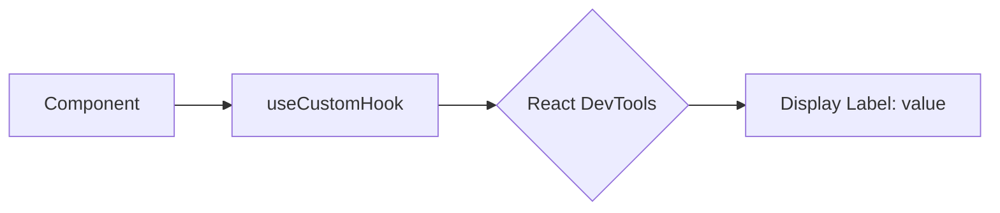

# useDebugValue: Отладка кастомных хуков

`useDebugValue` — это встроенный хук React, который позволяет выводить дополнительную информацию о состоянии вашего кастомного хука в **React Developer Tools**.

### Зачем это нужно?

Когда у вас много кастомных хуков, бывает сложно понять, какое именно внутреннее состояние они имеют, просто глядя на дерево компонентов. `useDebugValue` добавляет метку (label) рядом с вашим хуком в инспекторе.

[Icon: Bug] Это чисто инструмент для разработчика, он никак не влияет на логику работы приложения в продакшене.

### Базовое использование

```tsx
import { useState, useDebugValue } from 'react';

function useIsOnline() {
  const [isOnline, setIsOnline] = useState(null);

  // В React DevTools рядом с этим хуком появится надпись: "Online Status: Online" или "Offline"
  useDebugValue(isOnline ? 'Online' : 'Offline');

  // ... логика подписки на статус ...

  return isOnline;
}
```

### Отложенное форматирование

Если вычисление отладочного значения является ресурсоемким (например, парсинг большой даты), вы можете передать функцию форматирования вторым аргументом. Она будет вызвана только тогда, когда DevTools открыты и хук инспектируется.

```tsx
useDebugValue(date, date => date.toDateString());
```

### Визуализация в DevTools



### Когда использовать?

1.  **Библиотеки общего пользования:** Если вы создаете хук, который будут использовать другие разработчики.
2.  **Сложные хуки:** Где внутреннее состояние неочевидно из возвращаемого значения.
3.  **Мониторинг состояний:** Например, для отслеживания статуса HTTP-запроса (`loading`, `error`, `success`).

[Icon: Eye] Помните, что не стоит добавлять `useDebugValue` в каждый маленький хук — это может перегрузить интерфейс инструментов разработчика.

### Практика

Попробуйте примеры в интерактивном редакторе:

<Playground template="react" files={{ "/App.tsx": `import { useState, useEffect, useDebugValue } from 'react';

// Хук 1: статус сети — простая метка
function useOnlineStatus() {
  const [online, setOnline] = useState(navigator.onLine);
  // Метка видна в React DevTools → Components рядом с хуком
  useDebugValue(online ? 'Online ✅' : 'Offline ❌');
  useEffect(() => {
    const on = () => setOnline(true);
    const off = () => setOnline(false);
    window.addEventListener('online', on);
    window.addEventListener('offline', off);
    return () => { window.removeEventListener('online', on); window.removeEventListener('offline', off); };
  }, []);
  return online;
}

// Хук 2: счётчик с историей — отложенное форматирование
function useCounter(initial: number = 0) {
  const [count, setCount] = useState(initial);
  const [history, setHistory] = useState<number[]>([initial]);
  // Функция форматирования вызывается ТОЛЬКО когда DevTools открыты — экономит ресурсы
  useDebugValue(
    { count, history },
    (s) => 'count=' + s.count + ', history=[' + s.history.join(', ') + ']'
  );
  const inc = () => {
    setCount(c => {
      const next = c + 1;
      setHistory(h => [...h.slice(-4), next]);
      return next;
    });
  };
  const reset = () => { setCount(initial); setHistory([initial]); };
  return { count, history, inc, reset };
}

// Хук 3: поле формы с состоянием
function useFormField(fieldName: string) {
  const [value, setValue] = useState('');
  const [touched, setTouched] = useState(false);
  // Метка с состоянием поля — удобно при отладке форм
  useDebugValue(
    { fieldName, value, touched },
    (s) => s.fieldName + ': "' + s.value + '" touched=' + s.touched
  );
  return { value, touched, onChange: (v: string) => setValue(v), onBlur: () => setTouched(true) };
}

export default function App() {
  const isOnline = useOnlineStatus();
  const { count, history, inc, reset } = useCounter(0);
  const nameField = useFormField('Имя');
  const emailField = useFormField('Email');

  return (
    <div style={{ minHeight: '100vh', background: '#0f172a', padding: 24, fontFamily: 'sans-serif' }}>
      <h2 style={{ color: '#38bdf8', marginTop: 0, marginBottom: 4 }}>useDebugValue</h2>
      <p style={{ color: '#94a3b8', fontSize: 14, marginBottom: 20 }}>
        Добавляет метки к кастомным хукам в React DevTools (вкладка Components). Не влияет на логику.
      </p>

      {/* useOnlineStatus */}
      <div style={{ background: '#1e293b', borderRadius: 12, padding: 16, marginBottom: 12 }}>
        <div style={{ display: 'flex', alignItems: 'center', gap: 12 }}>
          <div style={{ width: 12, height: 12, borderRadius: '50%', background: isOnline ? '#10b981' : '#ef4444', boxShadow: '0 0 8px ' + (isOnline ? '#10b981' : '#ef4444') }} />
          <div>
            <div style={{ color: '#e2e8f0', fontSize: 14, fontWeight: 'bold' }}>useOnlineStatus()</div>
            <div style={{ color: '#64748b', fontSize: 12 }}>
              {'DevTools label: "' + (isOnline ? 'Online ✅' : 'Offline ❌') + '"'}
            </div>
          </div>
        </div>
      </div>

      {/* useCounter */}
      <div style={{ background: '#1e293b', borderRadius: 12, padding: 16, marginBottom: 12 }}>
        <div style={{ color: '#e2e8f0', fontSize: 14, fontWeight: 'bold', marginBottom: 8 }}>useCounter()</div>
        <div style={{ display: 'flex', alignItems: 'center', gap: 12, marginBottom: 8 }}>
          <span style={{ color: '#38bdf8', fontSize: 32, fontWeight: 'bold', minWidth: 56 }}>{count}</span>
          <button onClick={inc} style={{ background: '#0ea5e9', color: '#fff', border: 'none', borderRadius: 8, padding: '6px 16px', cursor: 'pointer' }}>+1</button>
          <button onClick={reset} style={{ background: '#0f172a', color: '#94a3b8', border: '1px solid #334155', borderRadius: 8, padding: '6px 16px', cursor: 'pointer' }}>сброс</button>
        </div>
        <div style={{ color: '#64748b', fontSize: 12 }}>
          {'DevTools: count=' + count + ', history=[' + history.join(', ') + ']'}
        </div>
      </div>

      {/* useFormField */}
      <div style={{ background: '#1e293b', borderRadius: 12, padding: 16 }}>
        <div style={{ color: '#e2e8f0', fontSize: 14, fontWeight: 'bold', marginBottom: 12 }}>useFormField()</div>
        {[
          { label: 'Имя', field: nameField },
          { label: 'Email', field: emailField },
        ].map(({ label, field }) => (
          <div key={label} style={{ marginBottom: 10 }}>
            <input
              value={field.value}
              onChange={e => field.onChange(e.target.value)}
              onBlur={field.onBlur}
              placeholder={label}
              style={{ width: '100%', background: '#0f172a', color: '#e2e8f0', border: '1px solid ' + (field.touched ? '#0ea5e9' : '#334155'), borderRadius: 8, padding: '8px 12px', boxSizing: 'border-box', fontSize: 14, outline: 'none' }}
            />
            <div style={{ color: '#64748b', fontSize: 11, marginTop: 2 }}>
              {label + ': "' + field.value + '" touched=' + field.touched}
            </div>
          </div>
        ))}
      </div>

      <p style={{ color: '#475569', fontSize: 12, marginTop: 16 }}>
        💡 Откройте React DevTools → Components чтобы увидеть метки useDebugValue рядом с хуками
      </p>
    </div>
  );
}
` }} />
