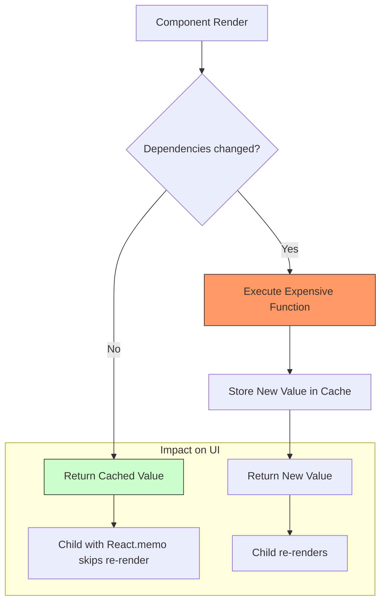

## TypeScript и useMemo: Когда и Зачем Оптимизировать Вычисления

Привет, коллега по коду! Сегодня мы погрузимся в одну из самых мощных техник оптимизации производительности в React-приложениях с использованием TypeScript — хук `useMemo`. Если ты уже знаком с базовыми концепциями React и TypeScript, то `useMemo` станет твоим надежным помощником в борьбе с ненужными перерасчетами и медленными рендерами.

Представь себе, что ты шеф-повар в очень популярном ресторане. Каждый раз, когда к тебе приходит новый заказ, ты не готовишь ингредиенты с нуля, если они уже готовы и ждут своего часа. Ты берешь уже нарезанные овощи, замешанное тесто — все, что можно использовать повторно без лишних усилий. `useMemo` в мире React — это твой "умный помощник" на кухне, который запоминает результат сложного вычисления и не пересчитывает его заново, пока ты не попросишь его обновить ингредиенты (зависимости).

### 🧠 Теория: Суть useMemo

В мире React-компонентов, перерендеры — это обычное дело. Любое изменение состояния или пропсов компонента обычно приводит к его повторному рендеру. И если внутри такого компонента у нас есть "тяжелые" вычисления (например, фильтрация большого массива, сложная математика, глубокое копирование объектов), то они будут выполняться при каждом рендере, даже если данные для этих вычислений не изменились. Это может заметно замедлить наше приложение.

`useMemo` — это хук React, который позволяет **мемоизировать (запомнить) результат вычисления** и возвращать его из кэша, если зависимости этого вычисления не изменились с момента последнего рендера.

### Схема оптимизации рендеринга


*Алгоритм работы useMemo: экономия ресурсов за счет кэширования.*

**Как это работает:**

1.  Ты передаешь `useMemo` функцию-"создатель" (фабрику), которая выполняет твое дорогостоящее вычисление и возвращает результат.
2.  Ты также передаешь массив зависимостей (как второй аргумент).
3.  При первом рендере `useMemo` вызывает твою функцию, запоминает ее результат и возвращает его.
4.  При последующих рендерах `useMemo` сначала сравнивает текущие значения зависимостей с теми, что были при предыдущем рендере.
    *   Если **зависимости не изменились** (поверхностное сравнение ссылок), `useMemo` не вызывает твою функцию, а просто возвращает ранее запомненный результат.
    *   Если **зависимости изменились**, `useMemo` снова вызывает твою функцию, запоминает новый результат и возвращает его.

**Сигнатура:**

```typescript
const memoizedValue = useMemo<T>(
  () => computeExpensiveValue(dependencyA, dependencyB), // Функция-фабрика
  [dependencyA, dependencyB] // Массив зависимостей
);
```

Где `T` — это тип значения, которое возвращает твоя функция-фабрика. TypeScript прекрасно справляется с выводом этого типа, но иногда явное указание помогает.

### 🚀 useMemo в Действии: Практические Примеры

Давайте посмотрим, как это выглядит на практике.

#### Пример 1: [Оптимизация](/react/optimization-patterns) дорогостоящих вычислений

Представим, что у нас есть большой список данных, и мы хотим его фильтровать. Фильтрация может быть достаточно затратной, если список очень большой.

```typescript
import React, { useState, useMemo } from 'react';

// Определяем интерфейс для элемента списка
interface Item {
  id: number;
  name: string;
  value: number;
}

// Вспомогательная функция для генерации большого списка
const generateLargeList = (size: number): Item[] => {
  console.log('Генерируем большой список...');
  return Array.from({ length: size }, (_, i) => ({
    id: i,
    name: `Элемент ${i} - ${Math.random().toFixed(2)}`,
    value: Math.floor(Math.random() * 100),
  }));
};

function ItemListWithMemoOptimization() {
  const [filterTerm, setFilterTerm] = useState('');
  // Инициализируем список один раз при монтировании компонента
  const [list] = useState<Item[]>(() => generateLargeList(10000));
  const [renderCount, setRenderCount] = useState(0); // Счетчик для демонстрации ререндеров

  console.log(`ItemListWithMemoOptimization рендерится. Счетчик: ${renderCount}`);

  // ❌ Без useMemo: Эта операция будет выполняться при КАЖДОМ рендере компонента,
  // даже если filterTerm и list не изменились.
  // const filteredItems = list.filter(item => item.name.includes(filterTerm));

  // ✅ С useMemo: Фильтрация будет пересчитана только тогда, когда
  // изменится filterTerm или сам list.
  const filteredItems: Item[] = useMemo(() => {
    console.log('Вычисление отфильтрованных элементов...'); // Увидим это сообщение только при изменении зависимостей
    return list.filter(item => item.name.toLowerCase().includes(filterTerm.toLowerCase()));
  }, [filterTerm, list]); // Зависимости: filterTerm и list

  return (
    <div style={{ padding: '20px', border: '1px solid grey', marginBottom: '20px' }}>
      <h3>Список элементов с useMemo (Оптимизация вычислений)</h3>
      <p>Количество рендеров компонента: {renderCount}</p>
      <input
        type="text"
        value={filterTerm}
        onChange={(e) => setFilterTerm(e.target.value)}
        placeholder="Фильтровать по имени..."
        style={{ marginRight: '10px', padding: '5px' }}
      />
      <button onClick={() => setRenderCount(prev => prev + 1)}>
        Вызвать ререндер (без изменения фильтра)
      </button>
      <p>Найдено элементов: {filteredItems.length}</p>
      <ul style={{ maxHeight: '150px', overflowY: 'auto', border: '1px solid lightgrey', padding: '10px' }}>
        {/* Отображаем только первые 10 элементов для избежания перегрузки DOM */}
        {filteredItems.slice(0, 10).map(item => (
          <li key={item.id}>{item.name}</li>
        ))}
      </ul>
    </div>
  );
}

// <ItemListWithMemoOptimization /> // Для использования в корневом компоненте
```
Обрати внимание на логи в консоли. Если ты будешь нажимать кнопку "Вызвать ререндер", ты увидишь сообщение о рендере компонента, но не увидишь сообщение "Вычисление отфильтрованных элементов...", пока не изменишь текст в поле фильтра. Это значит, что `useMemo` успешно предотвращает ненужные перерасчеты.

#### Пример 2: Предотвращение ненужных ререндеров дочерних компонентов с `React.memo`

`useMemo` также очень полезен, когда нужно передать сложный объект или массив в пропсы дочернего компонента, обернутого в `React.memo`. `React.memo` предотвращает ререндер дочернего компонента, если его пропсы не изменились. Однако, если ты каждый раз создаешь новый объект/массив в родительском компоненте, `React.memo` будет считать, что пропс изменился (потому что ссылка на объект изменилась), и дочерний компонент будет ререндериться.

```typescript
import React, { useState, useMemo, memo } from 'react';

// Интерфейс для пропсов дочернего компонента
interface ChildProps {
  config: {
    theme: string;
    fontSize: number;
    margin: number;
  };
  data: number[];
  onAction: () => void;
}

// Дочерний компонент, обернутый в React.memo
const MemoizedChildComponent = memo(({ config, data, onAction }: ChildProps) => {
  console.log('  -> MemoizedChildComponent рендерится', config, data);
  return (
    <div style={{
      border: `2px solid ${config.theme === 'dark' ? 'white' : 'black'}`,
      padding: `${config.margin}px`,
      margin: '10px',
      fontSize: `${config.fontSize}px`,
      color: config.theme === 'dark' ? 'white' : 'black',
      backgroundColor: config.theme === 'dark' ? '#333' : '#eee'
    }}>
      <h4>Дочерний компонент (React.memo)</h4>
      <p>Тема: {config.theme}, Размер шрифта: {config.fontSize}, Отступ: {config.margin}</p>
      <p>Количество элементов данных: {data.length}</p>
      <button onClick={onAction}>Выполнить действие</button>
    </div>
  );
});

function ParentComponentWithMemoAndMemo() {
  const [count, setCount] = useState(0);
  const [theme, setTheme] = useState('light');
  const [margin, setMargin] = useState(10);

  console.log('ParentComponentWithMemoAndMemo рендерится');

  // ❌ Без useMemo: Этот объект 'config' будет создаваться заново при КАЖДОМ рендере,
  // что приведет к ререндеру MemoizedChildComponent, даже если 'theme', 'fontSize', 'margin' не менялись.
  // const config = { theme: theme, fontSize: 16, margin: margin };

  // ✅ С useMemo: Объект 'config' будет пересоздан только если 'theme' или 'margin' изменятся.
  // 'fontSize' здесь константа, но если бы она была переменной, она тоже должна быть в зависимостях.
  const memoizedConfig = useMemo(() => ({
    theme: theme,
    fontSize: 16,
    margin: margin,
  }), [theme, margin]); // Зависимости для config

  // ✅ Аналогично для массива данных: создаем его один раз.
  const memoizedData = useMemo(() => [10, 20, 30, 40, 50], []); // Пустой массив зависимостей -> создается один раз

  // ✅ Для мемоизации функций чаще используют useCallback, но useMemo тоже можно.
  // Он создает функцию один раз, если зависимости не меняются.
  const memoizedOnAction = useMemo(() => {
    return () => {
      console.log('Действие в дочернем компоненте выполнено!');
      // Здесь может быть доступ к 'count' или другим переменным из родителя.
      // Если бы 'count' использовался внутри, его нужно было бы добавить в зависимости!
    };
  }, []); // Пустой массив зависимостей, так как функция не использует внешние переменные, которые могут меняться.

  return (
    <div style={{ padding: '20px', border: '1px solid blue' }}>
      <h3>Родительский компонент с useMemo для пропсов</h3>
      <p>Счетчик родителя: {count}</p>
      <button onClick={() => setCount(prev => prev + 1)}>
        Обновить счетчик (Ререндер родителя)
      </button>
      <button onClick={() => setTheme(theme === 'light' ? 'dark' : 'light')} style={{ margin: '0 10px' }}>
        Сменить тему ({theme})
      </button>
      <button onClick={() => setMargin(m => m + 2)}>
        Увеличить отступ ({margin}px)
      </button>
      <MemoizedChildComponent
        config={memoizedConfig}
        data={memoizedData}
        onAction={memoizedOnAction}
      />
    </div>
  );
}

// <ParentComponentWithMemoAndMemo /> // Для использования в корневом компоненте
```
В этом примере, если ты нажимаешь кнопку "Обновить счетчик", родительский компонент ререндерится, но `MemoizedChildComponent` **не будет ререндериться**, потому что `memoizedConfig` и `memoizedData` имеют те же ссылки, что и раньше. Только при изменении темы или отступа `memoizedConfig` будет пересоздан, что вызовет ререндер дочернего компонента.

### 💡 Продвинутые Техники и Ошибки

`useMemo` — мощный инструмент, но его нужно использовать с умом.

#### Когда useMemo НЕ нужен (или даже вреден)

1.  **Незначительные вычисления**: Если вычисление очень простое и быстрое (например, `a + b`, `array.map(x => x * 2)` на небольшом массиве), накладные расходы на сам `useMemo` (сравнение зависимостей, хранение кэша) могут превысить выгоду. Он создан для "дорогих" операций.
2.  **Мутирующие объекты**: Если ты мемоизируешь объект, а затем мутируешь его где-то еще, `useMemo` не узнает об этом. Он проверяет только изменение ссылки на объект в зависимостях, а не его внутреннее содержимое. Это может привести к устаревшим данным.
3.  **Чрезмерное использование**: Не нужно оборачивать абсолютно каждое значение или объект в `useMemo`. Это может запутать код, а потенциальный прирост производительности будет минимальным или отсутствовать.

#### Ошибка: Устаревшее замыкание (Stale Closure)

Одна из самых распространенных и коварных ошибок при работе с хуками, имеющими массив зависимостей (как `useMemo` или `useCallback`), — это `stale closure` (устаревшее замыкание). Это происходит, когда функция внутри `useMemo` использует переменную, которая меняется, но эта переменная **не включена** в массив зависимостей. `useMemo` думает, что зависимости не изменились, и возвращает старый результат, полученный с устаревшим значением переменной.

```typescript
import React, { useState, useMemo } from 'react';

function StaleClosureExample() {
  const [count, setCount] = useState(0);
  const [multiplier, setMultiplier] = useState(2);
  const [anotherState, setAnotherState] = useState(0); // Дополнительное состояние для ререндера

  console.log(`StaleClosureExample рендерится. count: ${count}, multiplier: ${multiplier}`);

  // ❌ ОШИБКА: multiplier используется внутри, но отсутствует в массиве зависимостей.
  // При изменении 'multiplier', 'memoizedBadValue' не будет пересчитан с новым значением множителя.
  const memoizedBadValue = useMemo(() => {
    console.log('  -> Вычисление memoizedBadValue (с потенциальной stale closure)');
    // Если multiplier изменится, здесь всегда будет использоваться его значение, которое было
    // при первом вызове useMemo, потому что он не в зависимостях.
    return count * multiplier;
  }, [count]); // Должно быть [count, multiplier]

  // ✅ КОРРЕКТНО: Все используемые внутри переменные-зависимости включены.
  const memoizedCorrectValue = useMemo(() => {
    console.log('  -> Вычисление memoizedCorrectValue (корректно)');
    return count * multiplier;
  }, [count, multiplier]); // Корректные зависимости

  return (
    <div style={{ padding: '20px', border: '1px solid red' }}>
      <h3>Пример устаревшего замыкания (Stale Closure)</h3>
      <p>Счетчик: {count}</p>
      <p>Множитель: {multiplier}</p>
      <p>Дополнительное состояние: {anotherState}</p>
      <hr />
      <p>
        **Некорректное вычисление (useMemo без всех зависимостей):**{' '}
        <span style={{ color: 'red', fontWeight: 'bold' }}>{memoizedBadValue}</span>
      </p>
      <p>
        **Корректное вычисление (useMemo со всеми зависимостями):**{' '}
        <span style={{ color: 'green', fontWeight: 'bold' }}>{memoizedCorrectValue}</span>
      </p>
      <hr />
      <button onClick={() => setCount(c => c + 1)}>
        Увеличить счетчик (count)
      </button>
      <button onClick={() => setMultiplier(m => m + 1)} style={{ margin: '0 10px' }}>
        Увеличить множитель (multiplier)
      </button>
      <button onClick={() => setAnotherState(s => s + 1)}>
        Изменить другое состояние (rerender без изменения зависимостей)
      </button>
    </div>
  );
}

// <StaleClosureExample /> // Для использования в корневом компоненте
```
Попробуй поиграться с кнопками.
1.  Нажми "Увеличить множитель". Заметишь, что `memoizedBadValue` не обновится, потому что `multiplier` не был в его зависимостях.
2.  Нажми "Увеличить счетчик". Обновятся оба значения, потому что `count` есть в обеих зависимостях.
3.  Нажми "Изменить другое состояние". Компонент ререндерится, но ни одно из мемоизированных значений не пересчитывается, так как их зависимости не изменились.

**Решение**: Всегда включай все переменные, функции и объекты, используемые внутри `useMemo` (или `useCallback`), в массив зависимостей. ESLint правило `react-hooks/exhaustive-deps` (включено в CRA и Next.js) — твой лучший друг в борьбе с этой проблемой, оно всегда подскажет, чего не хватает.

### 🎯 Практика

Время для самостоятельной работы, Яша! Примени полученные знания на практике.

#### Задание 1: [Оптимизация](/react/optimization-patterns) поиска по списку товаров

Создайте React-компонент `ProductList`.
1.  Он должен отображать список товаров (минимум 1000 товаров), каждый с `id`, `name`, `price` и `category`. Типизируйте товар с помощью интерфейса.
2.  Добавьте `input` для поиска товаров по `name`.
3.  Добавьте `button` для увеличения произвольного счетчика (`count`) в родительском компоненте.
4.  Используйте `useMemo` для мемоизации отфильтрованного списка товаров, чтобы он пересчитывался только при изменении поискового запроса (`filterTerm`) или самого списка товаров.
5.  Проверьте с помощью `console.log`, что фильтрация не происходит при изменении `count`.

```typescript
// Начальная структура для Задания 1
import React, { useState, useMemo } from 'react';

interface Product {
  id: number;
  name: string;
  price: number;
  category: string;
}

const generateProducts = (count: number): Product[] => {
  // ... ваша реализация
  return [];
};

function ProductList() {
  const [filterTerm, setFilterTerm] = useState('');
  const [renderCounter, setRenderCounter] = useState(0);
  const [products] = useState<Product[]>(() => generateProducts(1500)); // Создаем большой список один раз

  // TODO: Используйте useMemo здесь для filteredProducts

  // const filteredProducts = products.filter(...) // Без useMemo

  return (
    <div>
      <h3>Задание 1: Оптимизация поиска по товарам</h3>
      {/* ... ваш JSX */}
    </div>
  );
}
```

#### Задание 2: Мемоизация конфигурации для дочернего компонента

Создайте два компонента: `ChartContainer` (родитель) и `ChartDisplay` (дочерний).
1.  `ChartContainer` должен иметь состояния для `chartType` ('bar' | 'line') и `zoomLevel` (number).
2.  `ChartDisplay` должен быть обернут в `React.memo` и принимать пропс `config` типа `{ type: 'bar' | 'line'; zoom: number; theme: 'light' | 'dark' }` и `data` (массив чисел).
3.  В `ChartContainer` используйте `useMemo` для создания объекта `config`, который будет передаваться в `ChartDisplay`. `theme` всегда должна быть 'dark'.
4.  Добавьте кнопки в `ChartContainer` для изменения `chartType`, `zoomLevel` и для увеличения произвольного счетчика (`parentCount`).
5.  Убедитесь, что `ChartDisplay` ререндерится только при изменении `chartType` или `zoomLevel`, но не при изменении `parentCount`.

#### Задание 3: Мемоизация результата сложной функции

Разработайте компонент `FibonacciCalculator`.
1.  Он должен иметь `input` для ввода числа `n`.
2.  Добавьте кнопку "Вычислить Фибоначчи".
3.  Реализуйте **рекурсивную** функцию для вычисления `n`-го числа Фибоначчи (это достаточно "дорогая" операция для больших `n`).
4.  Используйте `useMemo` для мемоизации результата этой функции, чтобы она не пересчитывалась при каждом рендере компонента, если `n` не изменилось.
5.  Добавьте произвольный `counter` в компонент и кнопку для его изменения, чтобы продемонстрировать, что Фибоначчи не пересчитывается.

### 💡 Совет

`useMemo` — твой друг, но не твой раб. Используй его, когда:
*   Ты явно видишь, что компонент "тормозит" из-за тяжелых вычислений.
*   Ты передаешь сложные объекты или массивы в пропсы компонентам, обернутым в `React.memo`, и хочешь избежать ненужных ререндеров.
*   Ты хочешь, чтобы объект или массив был создан один раз при монтировании и оставался стабильным (пустой массив зависимостей `[]`).

Всегда помни про правила зависимостей: **включай все переменные, которые используются внутри функции `useMemo` и могут меняться**. ESLint с `exhaustive-deps` обязательно тебе поможет. И для мемоизации функций, рассмотри `useCallback` — он семантически более явно указывает на то, что мемоизируется именно функция, хотя `useMemo` тоже может это делать.

Успехов в оптимизации, Яша! И помни, чистый и производительный код — это искусство!

---

## 🔗 Полезные ссылки
- [React Memo](/react/react-memo)
- [Паттерны оптимизации](/react/optimization-patterns)
- [Use Callback](/react/use-callback)

### Практика

Попробуйте примеры в интерактивном редакторе:

<Playground template="react" files={{ "/App.tsx": `import { useState, useMemo } from 'react';

// Тяжёлое вычисление с искусственной задержкой
function expensiveFilter(list: string[], q: string): string[] {
  const start = Date.now();
  while (Date.now() - start < 40) {} // имитация CPU-нагрузки
  return q ? list.filter(item => item.toLowerCase().includes(q.toLowerCase())) : list;
}

const ALL_ITEMS = Array.from({ length: 1000 }, (_, i) => {
  const fruits = ['яблоко', 'банан', 'манго', 'груша', 'вишня'];
  return fruits[i % 5] + ' #' + (i + 1);
});

export default function App() {
  const [query, setQuery] = useState('');
  const [counter, setCounter] = useState(0);
  const [memoOn, setMemoOn] = useState(true);

  // С useMemo — фильтрация только при изменении query
  const memoResult = useMemo(() => expensiveFilter(ALL_ITEMS, query), [query]);

  // Без useMemo — выполняется при КАЖДОМ рендере (даже при изменении counter)
  const plainResult = expensiveFilter(ALL_ITEMS, query);

  const result = memoOn ? memoResult : plainResult;

  return (
    <div style={{ minHeight: '100vh', background: '#0f172a', padding: 24, fontFamily: 'sans-serif' }}>
      <h2 style={{ color: '#38bdf8', marginTop: 0, marginBottom: 4 }}>useMemo</h2>
      <p style={{ color: '#94a3b8', fontSize: 14, marginBottom: 16 }}>
        Фильтрация 1000 элементов с нагрузкой. При useMemo OFF — тормоза при нажатии кнопки.
      </p>
      <div style={{ display: 'flex', gap: 10, marginBottom: 12, flexWrap: 'wrap' }}>
        <input
          value={query}
          onChange={e => setQuery(e.target.value)}
          placeholder="Поиск фрукта..."
          style={{ flex: 1, background: '#1e293b', color: '#e2e8f0', border: '1px solid #334155', borderRadius: 8, padding: '8px 12px', fontSize: 14, outline: 'none' }}
        />
        <button
          onClick={() => setCounter(c => c + 1)}
          style={{ background: '#1e293b', color: '#e2e8f0', border: '1px solid #334155', borderRadius: 8, padding: '8px 14px', cursor: 'pointer', fontSize: 13 }}
        >
          {'Другой счётчик: ' + counter}
        </button>
        <button
          onClick={() => setMemoOn(v => !v)}
          style={{ background: memoOn ? '#0ea5e9' : '#dc2626', color: '#fff', border: 'none', borderRadius: 8, padding: '8px 14px', cursor: 'pointer', fontSize: 13 }}
        >
          {'useMemo: ' + (memoOn ? 'ВКЛ' : 'ВЫКЛ')}
        </button>
      </div>
      <p style={{ color: '#64748b', fontSize: 13, marginBottom: 8 }}>
        {'Найдено: ' + result.length + ' из ' + ALL_ITEMS.length}
      </p>
      <div style={{ maxHeight: 240, overflowY: 'auto', background: '#1e293b', borderRadius: 8, padding: '8px 12px' }}>
        {result.slice(0, 25).map((item, i) => (
          <div key={i} style={{ color: '#e2e8f0', padding: '4px 0', borderBottom: '1px solid #0f172a', fontSize: 13 }}>
            {item}
          </div>
        ))}
        {result.length > 25 && (
          <div style={{ color: '#64748b', fontSize: 12, paddingTop: 6 }}>{'...ещё ' + (result.length - 25)}</div>
        )}
      </div>
      <p style={{ color: '#64748b', fontSize: 13, marginTop: 12 }}>
        {memoOn
          ? '✅ useMemo ON — "Другой счётчик" не вызывает повторную фильтрацию'
          : '⚠️ useMemo OFF — фильтрация запускается при каждом нажатии кнопки'}
      </p>
    </div>
  );
}
` }} />
