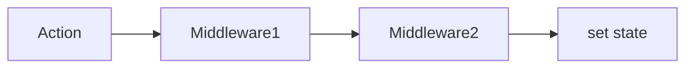

# [Zustand](/react/zustand-basics): Продвинутые возможности

[Zustand](/react/zustand-basics) не просто прост в использовании, он также обладает мощными инструментами для расширения функциональности через **Middleware** (промежуточное ПО).

### Архитектура Middleware

Middleware позволяют перехватывать процесс обновления стейта и добавлять логику: логирование, сохранение в хранилище или интеграцию с DevTools.



### Популярные Middleware

#### 1. Persist (Сохранение состояния)
Автоматически сохраняет ваш стейт в `localStorage`, `sessionStorage` или IndexedDB. Данные восстанавливаются после перезагрузки страницы.

```tsx
import { create } from 'zustand';
import { persist } from 'zustand/middleware';

const useAuthStore = create(
  persist(
    (set) => ({
      user: null,
      login: (userData) => set({ user: userData }),
      logout: () => set({ user: null }),
    }),
    {
      name: 'auth-storage', // уникальное имя ключа в localStorage
    }
  )
);
```

#### 2. Devtools
Позволяет просматривать изменения стейта [Zustand](/react/zustand-basics) в стандартном расширении **Redux DevTools**.

```tsx
import { devtools } from 'zustand/middleware';

const useStore = create(devtools(myStoreImplementation));
```

#### 3. Immer
Позволяет изменять стейт мутирующим способом, как в [Redux Toolkit](/react/redux-toolkit-intro).

```tsx
import { immer } from 'zustand/middleware/immer';

const useStore = create(
  immer((set) => ({
    nested: { count: 0 },
    inc: () => set((state) => { state.nested.count += 1 }),
  }))
);
```

### Работа вне React

[Icon: External-Link] Одно из уникальных свойств [Zustand](/react/zustand-basics) — возможность использовать его **вне компонентов** (например, в обычных JS-файлах или обработчиках событий).

```javascript
// Получить текущее значение без подписки
const bears = useStore.getState().bears;

// Подписаться на изменения (не в компоненте)
const unsub = useStore.subscribe((state) => console.log('Сменилось:', state));
```

[Icon: Shield] **Совет:** Для больших приложений используйте разделение сторов по смыслу (например, `useUserStore`, `useCartStore`), но помните, что вы всегда можете объединить их.

---

## 🔗 Полезные ссылки
- [Use Context](/react/use-context)
- [Props State](/react/props-state)
- [Redux Toolkit (RTK): Современный Redux](/react/redux-toolkit-intro)
- [Обзор подходов к управлению стейтом](/react/state-management-overview)
- [Zustand: Простое управление стейтом](/react/zustand-basics)

### Практика

Попробуйте примеры в интерактивном редакторе:

<Playground template="react" files={{ "/App.tsx": `import { useState, useEffect } from "react";

// Симуляция Zustand persist middleware — автосохранение в localStorage
interface AuthState {
  user: string | null;
  theme: "dark" | "light";
  visitCount: number;
  login: (name: string) => void;
  logout: () => void;
  toggleTheme: () => void;
}

// persist middleware: читает начальное состояние из localStorage
function createPersistedStore() {
  const KEY = "zustand-auth-demo";
  const saved = (() => {
    try { return JSON.parse(localStorage.getItem(KEY) || "{}"); }
    catch { return {}; }
  })();

  const listeners = new Set<() => void>();
  let state: AuthState = {
    user: saved.user ?? null,
    theme: saved.theme ?? "dark",
    visitCount: (saved.visitCount ?? 0) + 1,
    login: (name: string) => update({ user: name }),
    logout: () => update({ user: null }),
    toggleTheme: () => update({ theme: state.theme === "dark" ? "light" : "dark" }),
  };

  function update(partial: Partial<AuthState>) {
    state = { ...state, ...partial };
    // persist: сохраняем в localStorage при каждом изменении
    localStorage.setItem(KEY, JSON.stringify({ user: state.user, theme: state.theme, visitCount: state.visitCount }));
    listeners.forEach(fn => fn());
  }

  // Сохраняем visitCount сразу при создании
  localStorage.setItem(KEY, JSON.stringify({ user: state.user, theme: state.theme, visitCount: state.visitCount }));

  return {
    getState: () => state,
    subscribe: (fn: () => void) => { listeners.add(fn); return () => listeners.delete(fn); },
  };
}

const store = createPersistedStore();

function useStore<U>(selector: (s: AuthState) => U): U {
  const [, rerender] = useState(0);
  useEffect(() => store.subscribe(() => rerender(n => n + 1)), []);
  return selector(store.getState());
}

export default function App() {
  const user = useStore(s => s.user);
  const theme = useStore(s => s.theme);
  const visitCount = useStore(s => s.visitCount);
  const { login, logout, toggleTheme } = store.getState();
  const [input, setInput] = useState("");

  const isDark = theme === "dark";
  const bg = isDark ? "#0f172a" : "#f1f5f9";
  const cardBg = isDark ? "#1e293b" : "#ffffff";
  const text = isDark ? "#f8fafc" : "#0f172a";
  const sub = isDark ? "#94a3b8" : "#64748b";

  const btn = (bg: string, small?: boolean) => ({
    padding: small ? "6px 14px" : "9px 18px",
    background: bg, color: "#fff", border: "none",
    borderRadius: 8, cursor: "pointer", fontWeight: 700, fontSize: small ? 12 : 13,
  });

  return (
    <div style={{ minHeight: "100vh", background: bg, display: "flex", alignItems: "center", justifyContent: "center", fontFamily: "sans-serif", padding: 16, transition: "background .3s" }}>
      <div style={{ background: cardBg, borderRadius: 12, padding: 28, width: 400, boxShadow: "0 8px 32px rgba(0,0,0,.3)", transition: "background .3s" }}>
        <div style={{ display: "flex", justifyContent: "space-between", alignItems: "center", marginBottom: 16 }}>
          <span style={{ background: "#f59e0b", color: "#000", borderRadius: 6, fontSize: 11, fontWeight: 700, padding: "2px 8px" }}>
            Zustand Advanced
          </span>
          <button style={btn(isDark ? "#334155" : "#64748b", true)} onClick={toggleTheme}>
            {isDark ? "☀️ light" : "🌙 dark"}
          </button>
        </div>

        <h2 style={{ color: text, margin: "0 0 4px", fontSize: 18 }}>persist middleware</h2>
        <p style={{ color: sub, fontSize: 11, marginBottom: 20 }}>
          Стейт сохраняется в localStorage — перезагрузи страницу!
        </p>

        <div style={{ background: isDark ? "#0f172a" : "#f8fafc", borderRadius: 8, padding: "12px 14px", marginBottom: 16, display: "flex", justifyContent: "space-between" }}>
          <div>
            <div style={{ color: sub, fontSize: 11 }}>Пользователь:</div>
            <div style={{ color: user ? "#22c55e" : "#ef4444", fontWeight: 700, fontSize: 14 }}>
              {user ?? "не авторизован"}
            </div>
          </div>
          <div style={{ textAlign: "right" }}>
            <div style={{ color: sub, fontSize: 11 }}>Визитов:</div>
            <div style={{ color: "#60a5fa", fontWeight: 700, fontSize: 14 }}>{visitCount}</div>
          </div>
        </div>

        {!user ? (
          <div style={{ display: "flex", gap: 8 }}>
            <input
              placeholder="Введите имя..."
              value={input}
              onChange={e => setInput(e.target.value)}
              onKeyDown={e => { if (e.key === "Enter" && input) { login(input); setInput(""); } }}
              style={{ flex: 1, padding: "9px 12px", borderRadius: 8, border: "1px solid #334155", background: isDark ? "#0f172a" : "#f1f5f9", color: text, fontSize: 13 }}
            />
            <button style={btn("#22c55e")} onClick={() => { if (input) { login(input); setInput(""); } }}>
              Войти
            </button>
          </div>
        ) : (
          <button style={{ ...btn("#ef4444"), width: "100%" }} onClick={logout}>
            Выйти (logout)
          </button>
        )}

        <div style={{ background: isDark ? "#0f172a" : "#f8fafc", borderRadius: 8, padding: "10px 14px", marginTop: 14, fontSize: 11, color: sub, lineHeight: 1.7 }}>
          // persist(store, {"{ name: 'auth-storage' }"})<br />
          // devtools(store) — интеграция с Redux DevTools
        </div>
      </div>
    </div>
  );
}
` }} />
