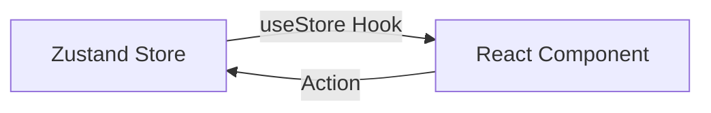

# Zustand: Простое управление стейтом

**Zustand** — это маленькая, быстрая и масштабируемая библиотека для управления состоянием. Она завоевала огромную популярность благодаря своей простоте: в отличие от Redux, вам не нужно настраивать провайдеры (Context Providers) или писать горы шаблонного кода.

### Почему Zustand?

[Icon: Rocket] **Минимализм:** Создание стора занимает несколько строк.
[Icon: Zap] **Производительность:** [Компоненты](/react/components) перерендериваются только при изменении тех данных, на которые они подписаны.
[Icon: Box] **Без провайдеров:** Стор доступен везде без необходимости оборачивать `App`.

### Как это работает?



### Создание стора

Стор создается функцией `create`. Внутри него описываются и данные, и функции для их изменения.

```tsx
import { create } from 'zustand';

interface BearState {
  bears: number;
  increase: (by: number) => void;
  removeAll: () => void;
}

const useStore = create<BearState>((set) => ({
  bears: 0,
  increase: (by) => set((state) => ({ bears: state.bears + by })),
  removeAll: () => set({ bears: 0 }),
}));
```

### Использование в компоненте

Вы вызываете хук `useStore` и выбираете (select) нужные части стейта. Это критически важно для оптимизации.

```tsx
function BearCounter() {
  // Подписываемся только на переменную bears
  const bears = useStore((state) => state.bears);
  return <h1>Популяция медведей: {bears}</h1>;
}

function Controls() {
  // Получаем функцию изменения
  const increase = useStore((state) => state.increase);
  return <button onClick={() => increase(1)}>Добавить медведя</button>;
}
```

### Важные моменты

[Icon: Mouse-Pointer] **Селекторы:** Всегда используйте селекторы `(state) => state.value`, чтобы избежать лишних рендеров.
[Icon: Refresh-Ccw] **Асинхронность:** Функции в Zustand могут быть `async` без каких-либо дополнительных настроек.

```javascript
fetchBears: async () => {
  const response = await fetch('/api/bears');
  set({ bears: await response.json() });
}
```

---

## 🔗 Полезные ссылки
- [Props State](/react/props-state)
- [React Компоненты](/react/components)
- [Use Context](/react/use-context)
- [Обзор подходов к управлению стейтом](/react/state-management-overview)

### Практика

Попробуйте примеры в интерактивном редакторе:

<Playground template="react" files={{ "/App.tsx": `import { useState, useCallback } from "react";

// Симуляция Zustand create() через замыкание
// В реальном Zustand: const useStore = create<BearState>((set) => ({ ... }))
function createStore<T>(init: (set: (partial: Partial<T> | ((s: T) => Partial<T>)) => void) => T) {
  let state: T;
  const listeners = new Set<() => void>();
  const set = (partial: Partial<T> | ((s: T) => Partial<T>)) => {
    state = { ...state, ...(typeof partial === "function" ? partial(state) : partial) };
    listeners.forEach(fn => fn());
  };
  state = init(set);
  return {
    getState: () => state,
    subscribe: (fn: () => void) => { listeners.add(fn); return () => listeners.delete(fn); },
  };
}

// Определение стора — аналог create() в Zustand
interface BearState {
  bears: number;
  honey: number;
  increase: (by?: number) => void;
  eat: () => void;
  removeAll: () => void;
}

const bearStore = createStore<BearState>((set) => ({
  bears: 0,
  honey: 10,
  increase: (by = 1) => set((s) => ({ bears: s.bears + by })),
  eat: () => set((s) => ({ honey: Math.max(0, s.honey - 1) })),
  removeAll: () => set({ bears: 0, honey: 10 }),
}));

// Хук useStore — аналог useStore(selector) в Zustand
function useBearStore<U>(selector: (s: BearState) => U): U {
  const [, rerender] = useState(0);
  // Подписываемся только на нужные изменения (selector pattern)
  useCallback(() => bearStore.subscribe(() => rerender(n => n + 1)), [])();
  return selector(bearStore.getState());
}

// Компонент счётчика медведей — подписан только на bears
function BearCounter() {
  const bears = useBearStore((s) => s.bears);
  return (
    <div style={{ color: "#fbbf24", fontSize: 40, fontWeight: 700, textAlign: "center" }}>
      {"🐻".repeat(Math.min(bears, 8))} {bears > 8 ? "+" + (bears - 8) : ""}
      <div style={{ color: "#94a3b8", fontSize: 13, fontWeight: 400, marginTop: 4 }}>
        {bears} медведей
      </div>
    </div>
  );
}

// Компонент мёда — подписан только на honey
function HoneyCounter() {
  const honey = useBearStore((s) => s.honey);
  const eat = useBearStore((s) => s.eat);
  return (
    <div style={{ textAlign: "center" }}>
      <div style={{ color: "#fb923c", fontSize: 28, fontWeight: 700 }}>🍯 {honey}</div>
      <div style={{ color: "#94a3b8", fontSize: 11, marginBottom: 8 }}>банок мёда</div>
      <button
        onClick={eat}
        disabled={honey === 0}
        style={{ padding: "6px 16px", background: honey === 0 ? "#334155" : "#f59e0b", color: "#000", border: "none", borderRadius: 8, cursor: "pointer", fontWeight: 700, fontSize: 12 }}
      >
        Съесть банку
      </button>
    </div>
  );
}

// Контролы — получает только actions (не данные)
function Controls() {
  const increase = useBearStore((s) => s.increase);
  const removeAll = useBearStore((s) => s.removeAll);
  const btn = (bg: string) => ({ padding: "9px 18px", background: bg, color: "#fff", border: "none", borderRadius: 8, cursor: "pointer", fontWeight: 700, fontSize: 13 });
  return (
    <div style={{ display: "flex", gap: 8, justifyContent: "center", flexWrap: "wrap" }}>
      <button style={btn("#22c55e")} onClick={() => increase()}>+ медведь</button>
      <button style={btn("#3b82f6")} onClick={() => increase(5)}>+ 5 медведей</button>
      <button style={btn("#ef4444")} onClick={removeAll}>Очистить</button>
    </div>
  );
}

export default function App() {
  return (
    <div style={{ minHeight: "100vh", background: "#0f172a", display: "flex", alignItems: "center", justifyContent: "center", fontFamily: "sans-serif", padding: 16 }}>
      <div style={{ background: "#1e293b", borderRadius: 12, padding: 28, width: 400, boxShadow: "0 8px 32px rgba(0,0,0,.5)" }}>
        <span style={{ background: "#f59e0b", color: "#000", borderRadius: 6, fontSize: 11, fontWeight: 700, padding: "2px 8px" }}>
          Zustand
        </span>
        <h2 style={{ color: "#f8fafc", margin: "10px 0 4px", fontSize: 18 }}>Bear Store — основы</h2>
        <p style={{ color: "#94a3b8", fontSize: 11, marginBottom: 20 }}>
          create(set) → стор без провайдеров, selector-подписки
        </p>
        <BearCounter />
        <div style={{ height: 1, background: "#334155", margin: "16px 0" }} />
        <HoneyCounter />
        <div style={{ height: 1, background: "#334155", margin: "16px 0" }} />
        <Controls />
        <div style={{ background: "#0f172a", borderRadius: 8, padding: "10px 14px", marginTop: 16, fontSize: 11, color: "#64748b", lineHeight: 1.7 }}>
          // Каждый компонент подписан только на нужные данные<br />
          // Zustand: без Provider, без boilerplate!
        </div>
      </div>
    </div>
  );
}
` }} />
