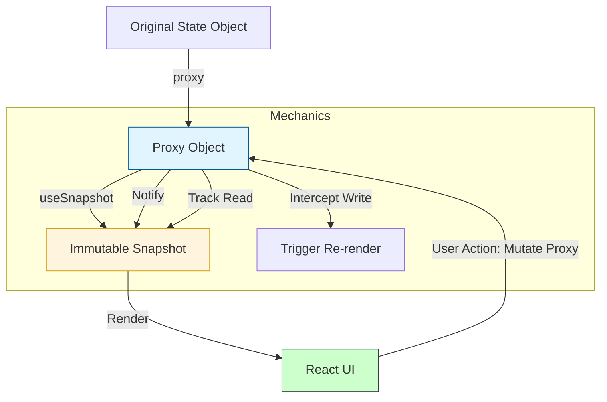

## TypeScript: Valtio + TypeScript: основы

Привет, кодеры! Яша здесь, и сегодня мы погрузимся в мир реактивного состояния с Valtio – простой, но мощной библиотекой для управления состоянием, которая использует магию JavaScript-прокси. Если вы устали от бойлерплейта и хотите чего-то, что ощущается как "ванильный JavaScript, но с реактивностью", то Valtio — ваш выбор. А когда мы добавляем к этому мощь TypeScript, мы получаем предсказуемое, хорошо типизированное и легко отлаживаемое решение.

### 🌐 Что такое Valtio и почему он крут?

Представьте, что у вас есть обычный JavaScript-объект. Вы его изменяете, и он просто изменяется. Никаких иммутабельных обновлений, никаких `setState` с функциями, никаких редьюсеров. Valtio делает именно это: позволяет вам напрямую изменять обычный объект, а затем волшебным образом делает так, что все компоненты React, которые "следят" за этим объектом, автоматически перерисовываются при любых изменениях.

Как это работает? Valtio использует `Proxy` API JavaScript. Когда вы создаете состояние с `proxy()`, Valtio оборачивает ваш объект в прокси. Любые операции чтения или записи через этот прокси перехватываются. При чтении Valtio отслеживает, кто читает. При записи Valtio уведомляет всех "слушателей" об изменениях.

### Valtio Proxy Flow


*Жизненный цикл состояния в Valtio: от прокси-объекта до реактивного снимка в UI.*

**Основные преимущества Valtio:**

*   **Простота**: Мутабельное API. Изменяем объект напрямую.
*   **Минимализм**: Малый размер бандла, никаких сложных концепций.
*   **Реактивность**: Автоматическая перерисовка компонентов при изменении состояния.
*   **TypeScript-Friendly**: Отлично интегрируется с TypeScript, обеспечивая полную типобезопасность.

### 🚀 Начинаем с основ: `proxy()` и `useSnapshot()`

Сердце Valtio — это функция `proxy()` для создания реактивного объекта состояния и хук `useSnapshot()` для чтения этого состояния в компонентах React. `useSnapshot()` возвращает *снимок* (snapshot) состояния – иммутабельную копию, которая безопасна для рендеринга в React и гарантирует, что ваши компоненты будут перерисовываться только при фактических изменениях.

#### Пример 1: Простой счетчик

Начнем с классического примера – счетчик.

```typescript
import { proxy, useSnapshot } from 'valtio';
import React from 'react';

// 1. Определяем тип нашего состояния
interface CounterState {
  count: number;
  lastUpdated: number;
}

// 2. Создаем прокси-объект состояния. Тип указываем явно.
const counterStore = proxy<CounterState>({
  count: 0,
  lastUpdated: Date.now(),
});

// 3. Определяем действия (functions, которые изменяют состояние)
const increment = () => {
  counterStore.count++; // Прямое изменение состояния
  counterStore.lastUpdated = Date.now(); // Обновляем время
};

const decrement = () => {
  counterStore.count--;
  counterStore.lastUpdated = Date.now();
};

// 4. Компонент React, который использует это состояние
function CounterDisplay() {
  // useSnapshot возвращает иммутабельный "снимок" текущего состояния.
  // Это важно: мы читаем данные из снимка, а не напрямую из proxy-объекта в компоненте,
  // чтобы React мог корректно отслеживать зависимости и перерисовываться.
  const snap = useSnapshot(counterStore);

  return (
    <div>
      <h3>Счетчик Valtio</h3>
      <p>Текущее значение: {snap.count}</p>
      <p>Последнее обновление: {new Date(snap.lastUpdated).toLocaleTimeString()}</p>
      <button onClick={increment}>Увеличить</button>
      <button onClick={decrement} style={{ marginLeft: '10px' }}>Уменьшить</button>
    </div>
  );
}

// Пример использования в другом компоненте (или App.tsx)
export function App() {
  return (
    <div>
      <CounterDisplay />
    </div>
  );
}
```

Как видите, мы просто изменяем `counterStore.count` и `counterStore.lastUpdated` напрямую. `useSnapshot(counterStore)` гарантирует, что `CounterDisplay` будет перерисовываться при каждом изменении `counterStore`.

### 📝 Продвинутые примеры

#### Пример 2: Список задач (Todo List)

Давайте усложним: создадим список задач с возможностью добавления и переключения статуса.

```typescript
import { proxy, useSnapshot } from 'valtio';
import React, { useState } from 'react';

interface Todo {
  id: string;
  text: string;
  completed: boolean;
}

interface TodoListState {
  todos: Todo[];
}

const todoStore = proxy<TodoListState>({
  todos: [],
});

// Функции для управления задачами
const addTodo = (text: string) => {
  // Генерируем уникальный ID для новой задачи
  const newTodo: Todo = {
    id: String(Date.now()), // Простой способ для примера
    text,
    completed: false,
  };
  todoStore.todos.push(newTodo); // Прямая мутация массива
};

const toggleTodo = (id: string) => {
  const todo = todoStore.todos.find(t => t.id === id);
  if (todo) {
    todo.completed = !todo.completed; // Прямая мутация объекта в массиве
  }
};

function TodoApp() {
  const snap = useSnapshot(todoStore);
  const [newTodoText, setNewTodoText] = useState('');

  const handleAddTodo = () => {
    if (newTodoText.trim()) {
      addTodo(newTodoText.trim());
      setNewTodoText('');
    }
  };

  return (
    <div style={{ marginTop: '20px' }}>
      <h3>Список Задач (Valtio)</h3>
      <input
        type="text"
        value={newTodoText}
        onChange={(e) => setNewTodoText(e.target.value)}
        placeholder="Новая задача..."
      />
      <button onClick={handleAddTodo} style={{ marginLeft: '10px' }}>Добавить</button>

      <ul>
        {snap.todos.map((todo) => (
          <li key={todo.id} style={{ textDecoration: todo.completed ? 'line-through' : 'none' }}>
            <input
              type="checkbox"
              checked={todo.completed}
              onChange={() => toggleTodo(todo.id)}
            />
            {todo.text}
          </li>
        ))}
      </ul>
      <p>Всего задач: {snap.todos.length}</p>
      <p>Выполнено: {snap.todos.filter(t => t.completed).length}</p>
    </div>
  );
}

// Обновляем App, чтобы включить TodoApp
export function AppWithTodos() {
    return (
        <>
            <CounterDisplay />
            <TodoApp />
        </>
    );
}
```

Здесь мы видим, как Valtio легко справляется с мутацией массивов и объектов внутри массивов. Просто изменяем их напрямую, и Valtio берет на себя всю работу по отслеживанию изменений.

#### Пример 3: Производное состояние (Derived State)

Иногда вам нужно вычислять данные на основе существующего состояния. В Valtio это делается путем простого доступа к `snapshot` в вашем компоненте или создания функций, которые работают с `snapshot`.

```typescript
// Продолжаем использовать todoStore из примера 2
import { useSnapshot } from 'valtio';
import React from 'react';

// Эта функция не мутирует состояние, а лишь вычисляет значение
const getCompletedTodosCount = (snap: typeof todoStore) => {
  // Для простоты, здесь мы используем snap напрямую
  return snap.todos.filter(t => t.completed).length;
};

const getIncompleteTodos = (snap: typeof todoStore) => {
    return snap.todos.filter(t => !t.completed);
}

function TodoStats() {
  const snap = useSnapshot(todoStore); // Получаем свежий снимок

  // Вычисляем производные данные на основе снимка
  const completedCount = getCompletedTodosCount(snap);
  const incompleteTodos = getIncompleteTodos(snap);

  return (
    <div style={{ marginTop: '20px', borderTop: '1px solid #eee', paddingTop: '10px' }}>
      <h3>Статистика Задач</h3>
      <p>Всего задач: {snap.todos.length}</p>
      <p>Выполнено: {completedCount}</p>
      <p>В процессе: {incompleteTodos.length}</p>
      {incompleteTodos.length > 0 && (
          <div>
              <h4>Невыполненные задачи:</h4>
              <ul>
                  {incompleteTodos.map(todo => <li key={todo.id}>{todo.text}</li>)}
              </ul>
          </div>
      )}
    </div>
  );
}

// Обновляем App, чтобы включить TodoStats
export function AppWithTodoStats() {
    return (
        <>
            <CounterDisplay />
            <TodoApp />
            <TodoStats />
        </>
    );
}
```

Важно помнить, что производные данные, вычисляемые внутри компонента, будут пересчитываться при каждом ре-рендере, если они зависят от `snap`. Для более сложных вычислений, которые должны быть мемоизированы или кэшированы, вы можете использовать `React.useMemo` или вынести их в отдельный "селектор" который будет работать с `snapshot` и сам будет мемоизироваться.

#### Пример 4: Асинхронные действия

Работа с API или другими асинхронными операциями легко интегрируется в Valtio. Просто выполняйте ваши асинхронные вызовы и, когда данные готовы, мутируйте состояние.

```typescript
import { proxy, useSnapshot } from 'valtio';
import React from 'react';

interface User {
  id: number;
  name: string;
  email: string;
}

interface UserProfileState {
  user: User | null;
  isLoading: boolean;
  error: string | null;
}

const userProfileStore = proxy<UserProfileState>({
  user: null,
  isLoading: false,
  error: null,
});

// Асинхронное действие для загрузки пользователя
const fetchUser = async (userId: number) => {
  userProfileStore.isLoading = true; // Устанавливаем флаг загрузки
  userProfileStore.error = null; // Сбрасываем предыдущие ошибки
  try {
    const response = await fetch(`https://jsonplaceholder.typicode.com/users/${userId}`);
    if (!response.ok) {
      throw new Error(`HTTP error! status: ${response.status}`);
    }
    const userData: User = await response.json();
    userProfileStore.user = userData; // Обновляем пользователя
  } catch (err: any) {
    userProfileStore.error = err.message; // Сохраняем ошибку
    userProfileStore.user = null;
  } finally {
    userProfileStore.isLoading = false; // Сбрасываем флаг загрузки
  }
};

function UserProfile() {
  const snap = useSnapshot(userProfileStore);

  // useEffect для вызова fetchUser при монтировании компонента
  React.useEffect(() => {
    fetchUser(1); // Загружаем пользователя с ID 1
  }, []);

  if (snap.isLoading) {
    return <p>Загрузка пользователя...</p>;
  }

  if (snap.error) {
    return <p style={{ color: 'red' }}>Ошибка: {snap.error}</p>;
  }

  if (!snap.user) {
    return <p>Пользователь не загружен.</p>;
  }

  return (
    <div style={{ marginTop: '20px' }}>
      <h3>Профиль Пользователя</h3>
      <p>Имя: {snap.user.name}</p>
      <p>Email: {snap.user.email}</p>
    </div>
  );
}

// Обновляем App
export function AppWithUserProfile() {
    return (
        <>
            <CounterDisplay />
            <TodoApp />
            <TodoStats />
            <UserProfile />
        </>
    );
}
```

Обратите внимание, что `fetchUser` — это обычная асинхронная функция, которая напрямую мутирует `userProfileStore` в разных точках жизненного цикла запроса.

#### Пример 5: `ref()` для нереактивных значений

Иногда вам нужно хранить значения в состоянии, которые не должны вызывать перерисовку компонентов при их изменении. Например, ссылки на DOM-элементы, большие объекты, которые вы не хотите проксировать, или другие внешние сущности. Для этого Valtio предоставляет `ref()`.

```typescript
import { proxy, ref, useSnapshot } from 'valtio';
import React, { useRef, useEffect } from 'react';

interface NonReactiveState {
  message: string;
  domElementRef: React.RefObject<HTMLDivElement>; // Это должно быть нереактивным
  bigData: object; // Это тоже может быть нереактивным, если не хотим проксировать
}

const nonReactiveStore = proxy<NonReactiveState>({
  message: "Я реактивный!",
  // Оборачиваем в ref(), чтобы Valtio не пытался сделать его реактивным
  domElementRef: ref(React.createRef<HTMLDivElement>()),
  bigData: ref({ users: Array(1000).fill({ name: 'Test', id: 1 }) }),
});

const updateMessage = (newMessage: string) => {
    nonReactiveStore.message = newMessage;
};

function NonReactiveComponent() {
  const snap = useSnapshot(nonReactiveStore);
  const localDivRef = useRef<HTMLDivElement>(null); // Локальная ссылка

  useEffect(() => {
    // ref из состояния
    if (snap.domElementRef.current) {
      snap.domElementRef.current.style.backgroundColor = 'lightblue';
      console.log('DOM Element ref from store used:', snap.domElementRef.current);
    }

    // Локальный ref
    if (localDivRef.current) {
        localDivRef.current.style.border = '2px dashed gray';
        console.log('Local DOM Element ref used:', localDivRef.current);
    }
  }, [snap.domElementRef]); // Зависит от изменения ссылки на объект, а не его свойств

  console.log('Big data from store (should not cause re-render on internal changes):', snap.bigData);

  return (
    <div style={{ marginTop: '20px' }}>
      <h3>Нереактивные значения с `ref()`</h3>
      <p>{snap.message}</p>
      <button onClick={() => updateMessage("Сообщение изменено!")}>Изменить сообщение</button>
      <div ref={nonReactiveStore.domElementRef} style={{ padding: '10px', margin: '10px 0' }}>
        Это элемент, управляемый через `ref` из состояния.
      </div>
      <div ref={localDivRef} style={{ padding: '10px', margin: '10px 0' }}>
        Это элемент, управляемый через локальный `ref`.
      </div>
      <p>
        Проверка: bigData.users.length = {(snap.bigData as any).users.length} (изменять напрямую не будет реактивно!)
      </p>
    </div>
  );
}

// Обновляем App
export function AppWithNonReactive() {
    return (
        <>
            <CounterDisplay />
            <TodoApp />
            <TodoStats />
            <UserProfile />
            <NonReactiveComponent />
        </>
    );
}
```
`ref()` гарантирует, что Valtio не будет пытаться проксировать внутренности объекта, переданного в `ref()`, и изменения внутри него не вызовут перерисовку компонентов. Только изменение самой ссылки на объект, обернутый в `ref()`, приведет к реакции.

### 🐛 Типичные ошибки и их решения

1.  **Попытка мутировать `snapshot` напрямую**:
    *   **Ошибка**: `const snap = useSnapshot(myStore); snap.count++;`
    *   **Причина**: `snap` – это иммутабельная копия. Вы не можете ее изменить.
    *   **Решение**: Всегда мутируйте оригинальный `proxy`-объект. `myStore.count++;`

2.  **Забыли `useSnapshot` в компоненте**:
    *   **Ошибка**: `function MyComp() { return <p>{myStore.count}</p>; }`
    *   **Причина**: Без `useSnapshot`, React не знает, что компонент должен перерисовываться при изменении `myStore`.
    *   **Решение**: Используйте `const snap = useSnapshot(myStore);` и обращайтесь к `snap.count`.

3.  **Неправильная типизация вложенных объектов/массивов**:
    *   **Ошибка**: Неполная или отсутствующая типизация для сложных структур.
    *   **Решение**: Определяйте интерфейсы для всех вложенных объектов и используйте их. TypeScript очень хорошо работает с Valtio, если вы предоставляете правильные типы.
    ```typescript
    // Пример правильной типизации
    interface User { id: number; name: string; }
    interface AppState {
        users: User[];
        settings: { theme: 'light' | 'dark' };
    }
    const store = proxy<AppState>({ users: [], settings: { theme: 'light' } });
    ```

### ### 🎯 Практика

Ваше задание, мой дорогой студент! Создайте небольшое приложение, используя Valtio и TypeScript, которое будет управлять выбором товаров в корзине.

1.  **Создайте тип `Product`**: с полями `id`, `name`, `price`, `quantity` (количество в корзине).
2.  **Создайте `proxy` хранилище `cartStore`**:
    *   Должно хранить массив `Product` (`items`).
    *   Должно хранить общее количество уникальных товаров (`totalItemsCount`).
    *   Должно хранить общую стоимость всех товаров (`totalPrice`).
3.  **Реализуйте следующие действия**:
    *   `addToCart(product: Omit<Product, 'quantity'>)`: Добавляет товар в корзину. Если товар уже есть, увеличивает его `quantity`.
    *   `removeFromCart(productId: string)`: Удаляет товар из корзины.
    *   `updateQuantity(productId: string, quantity: number)`: Изменяет количество товара. Если `quantity` становится 0 или меньше, товар должен быть удален.
    *   `clearCart()`: Очищает всю корзину.
4.  **Создайте компоненты React**:
    *   `ProductList`: Отображает список доступных товаров (можете захардкодить 3-4 товара) и кнопки "Добавить в корзину".
    *   `Cart`: Отображает текущее содержимое `cartStore.items`, а также `totalItemsCount` и `totalPrice`. Для каждого товара должны быть кнопки для увеличения/уменьшения количества и удаления.
5.  **Используйте `useSnapshot`** для реактивного отображения состояния в компонентах.
6.  **Убедитесь, что `totalItemsCount` и `totalPrice`** автоматически обновляются при изменении `items` (это производное состояние, которое должно вычисляться на основе `items`).

### ### 💡 Совет

Держите ваши прокси-объекты максимально плоскими (flat). Хотя Valtio может проксировать глубоко вложенные объекты, это усложняет отладку и может привести к неожиданным реакциям. Если у вас есть сложные вложенные структуры, рассмотрите возможность разделения их на несколько отдельных `proxy` хранилищ или используйте `ref()` для частей, которые не нуждаются в глубокой реактивности. Всегда явно типизируйте ваши прокси-объекты, чтобы TypeScript мог обеспечить максимальную безопасность и автодополнение.


## Интерактивный пример

<Playground
  template="static"
  files={{
    "/index.html": `
<!DOCTYPE html>
<html lang="en">
<head>
    <meta charset="UTF-8">
    <meta name="viewport" content="width=device-width, initial-scale=1.0">
    <title>Valtio Counter</title>
    <style>
        body { background-color: #282c34; color: white; font-family: sans-serif; display: flex; justify-content: center; align-items: center; height: 100vh; margin: 0; }
        .container { text-align: center; }
        button { background-color: #61dafb; border: none; color: #282c34; padding: 10px 20px; margin: 5px; cursor: pointer; }
    <\/style>
</head>
<body>
    <div class="container">
        <h1 id="counter">0</h1>
        <button id="increment">Increment</button>
    </div>
    <script type="module">
        import { proxy, useSnapshot } from 'valtio';

        const state = proxy({ count: 0 });

        const increment = () => {
            state.count++;
            updateCounter();
        };

        const updateCounter = () => {
            document.getElementById('counter').textContent = state.count.toString();
        };

        document.getElementById('increment').addEventListener('click', increment);
        updateCounter();
    <\/script>
</body>
</html>
`
  }}
/>
