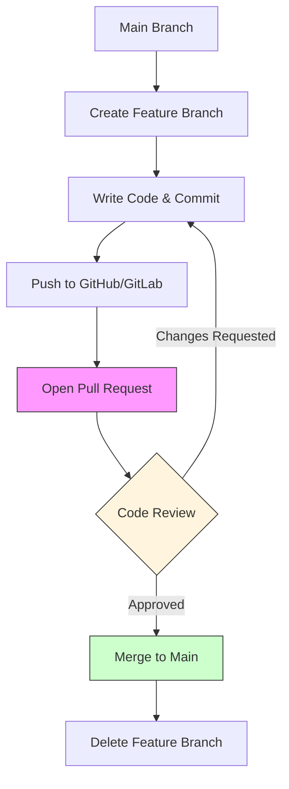

# Git: Машина времени. Урок 5: GitHub/GitLab workflow

Этот урок посвящен workflow, то есть рабочему процессу, который обычно используется при командной разработке с использованием Git и платформ вроде GitHub или GitLab. Мы рассмотрим, как эффективно взаимодействовать с репозиторием, чтобы избежать конфликтов и поддерживать чистоту кодовой базы.

### Flowchart: PR Workflow


*Стандартный цикл разработки с использованием Pull Request.*

## Что такое GitHub/GitLab workflow?

GitHub/GitLab workflow – это набор практик, которые команды используют для совместной работы над проектом. Он основан на ветках (branches), запросах на слияние (pull requests/merge requests) и code review. Главная цель – обеспечить плавную интеграцию изменений и избежать проблем, связанных с параллельной разработкой.

## Основные шаги workflow

1.  **Создание ветки (branching):** Для каждой новой фичи, исправления бага или эксперимента создается отдельная ветка от основной ветки (обычно `main` или `master`).

    ```bash
    git checkout -b feature/new-feature
    ```

    Эта команда создаст и переключит вас на новую ветку с именем `feature/new-feature`.

2.  **Разработка и коммиты (development & commits):** В этой ветке вы пишете код, тестируете его и делаете коммиты.

    ```bash
    git add .
    git commit -m "Implement new feature"
    ```

    Важно писать понятные и информативные сообщения к коммитам.

3.  **Отправка ветки на удаленный репозиторий (push):** После завершения работы над фичей, ветку нужно отправить на GitHub/GitLab.

    ```bash
    git push origin feature/new-feature
    ```

4.  **Создание запроса на слияние (pull request/merge request):** На GitHub/GitLab создается запрос на слияние вашей ветки с основной.

5.  **Code review:** Другие разработчики просматривают ваш код, оставляют комментарии и предлагают улучшения.

6.  **Внесение изменений (addressing feedback):** Вы вносите необходимые изменения на основе code review и снова делаете коммиты.

    ```bash
    git add .
    git commit -m "Address feedback from code review"
    git push origin feature/new-feature
    ```

7.  **Слияние (merging):** После одобрения кода, запрос на слияние принимается, и ваш код объединяется с основной веткой.

    После слияния, локальную ветку можно удалить:

    ```bash
    git checkout main
    git pull origin main
    git branch -d feature/new-feature
    git push origin --delete feature/new-feature
    ```

## Жизненный пример

Представьте, что вы разрабатываете веб-сайт. Один разработчик работает над новой формой обратной связи, а другой – над улучшением производительности. Каждый создает свою ветку, работает независимо, а затем отправляет запросы на слияние. Code review позволяет выявить ошибки и улучшить качество кода до того, как он попадет в основную ветку.  Этот workflow применяется в разработке React, Vue, Angular, Django, Rails и других популярных фреймворков и библиотек. Команда, работающая над React, может использовать этот workflow для добавления новых компонентов или исправления ошибок в существующих.

## Ключевые моменты

*   Используйте ветки для каждой новой фичи или исправления.
*   Пишите информативные сообщения к коммитам.
*   Регулярно отправляйте свои изменения на удаленный репозиторий.
*   Внимательно относитесь к code review и вносите необходимые изменения.
*   Удаляйте ветки после слияния.
*   Регулярно обновляйте свою локальную основную ветку (main/master) с удаленного репозитория.

```bash
git checkout main
git pull origin main
```
```
