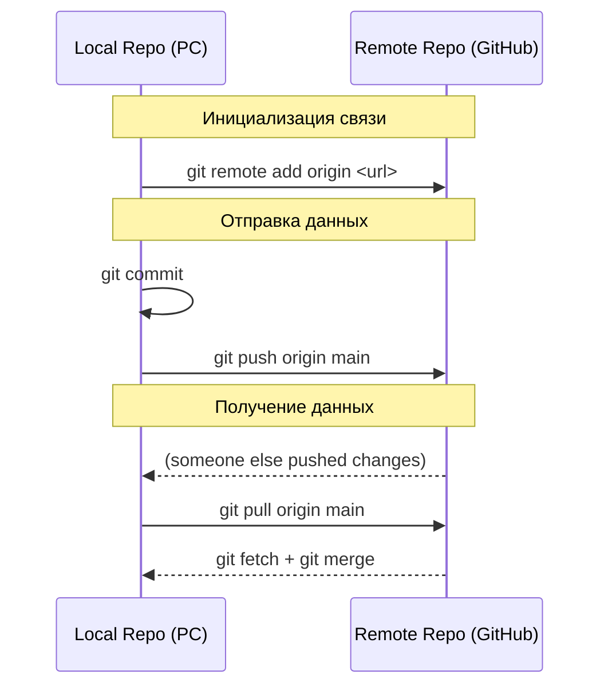

# Git: Машина времени. Урок 4: Remote и Push/Pull

В этом уроке мы разберемся, как взаимодействовать с удаленными репозиториями, чтобы делиться кодом и получать обновления от других разработчиков. Мы изучим команды `remote`, `push` и `pull`.

### Схема синхронизации Remote и Local


*Взаимодействие между вашим компьютером и удаленным сервером.*

## Что такое Remote?

Remote (удаленный репозиторий) - это Git-репозиторий, расположенный не на вашем компьютере, а, например, на сервере GitHub, GitLab или Bitbucket.  Он позволяет нескольким разработчикам работать над одним проектом, обмениваясь изменениями.  Представьте, что это центральное хранилище вашего кода.

### Добавление Remote

Чтобы связать ваш локальный репозиторий с удаленным, используйте команду `git remote add`.

```bash
git remote add origin <URL_удаленного_репозитория>
```

Например:

```bash
git remote add origin git@github.com:your_username/your_repository.git
```

Здесь `origin` - это общепринятое имя для удаленного репозитория. Вы можете выбрать любое другое имя, но `origin` - это стандарт.  `<URL_удаленного_репозитория>` - это адрес вашего репозитория на GitHub или другом сервисе.

### Просмотр Remote

Чтобы увидеть список подключенных удаленных репозиториев, используйте:

```bash
git remote -v
```

Эта команда покажет вам имя удаленного репозитория и его URL для операций `fetch` (получение данных) и `push` (отправка данных).

## Push: Отправляем изменения

`git push` используется для отправки ваших локальных коммитов в удаленный репозиторий.

```bash
git push origin <имя_ветки>
```

Например, чтобы отправить изменения из вашей локальной ветки `main` в удаленный репозиторий `origin`, используйте:

```bash
git push origin main
```

Если это ваш первый `push` в ветку, возможно, вам потребуется добавить флаг `-u` или `--set-upstream`:

```bash
git push -u origin main
```

Этот флаг устанавливает связь между вашей локальной веткой `main` и удаленной веткой `origin/main`, чтобы в дальнейшем можно было использовать просто `git push`.

## Pull: Получаем изменения

`git pull` используется для получения последних изменений из удаленного репозитория и объединения их с вашей локальной веткой.

```bash
git pull origin <имя_ветки>
```

Например, чтобы получить изменения из ветки `main` удаленного репозитория `origin`, используйте:

```bash
git pull origin main
```

`git pull` фактически выполняет две операции: `git fetch` (получает данные) и `git merge` (объединяет изменения).

## Жизненный пример

Представьте, что вы работаете над веб-приложением. У вас есть репозиторий на GitHub, где хранится код вашего проекта.

1.  **Несколько разработчиков:** Несколько разработчиков работают над разными частями проекта. Каждый разработчик клонирует репозиторий на свой компьютер.
2.  **Работа над фичей:** Один разработчик работает над новой функциональностью – добавлением формы обратной связи. Он создает новую ветку, вносит изменения, коммитит их и отправляет ветку на GitHub (`git push origin feature/feedback-form`).
3.  **Обновление:** Другой разработчик хочет получить последние изменения. Он выполняет `git pull origin main`, чтобы обновить свою локальную ветку `main`.
4.  **Слияние:** После проверки кода, изменения из ветки `feature/feedback-form` сливаются в ветку `main` на GitHub.
5.  **Общий код:** Все разработчики теперь имеют актуальную версию кода.

Этот процесс повторяется снова и снова, обеспечивая совместную разработку и контроль версий.

## Ключевые моменты

*   `remote` связывает локальный репозиторий с удаленным.
*   `push` отправляет локальные коммиты в удаленный репозиторий.
*   `pull` получает изменения из удаленного репозитория и объединяет их с локальной веткой.
*   `origin` - общепринятое имя для удаленного репозитория.
*   Всегда делайте `git pull` перед началом работы, чтобы убедиться, что у вас самая свежая версия кода.
