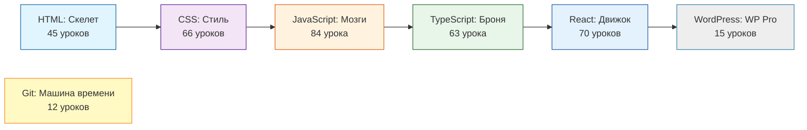

# Yasha Learn Code 🚀

**Полноценная платформа для изучения Full-Stack разработки.** От основ HTML до продвинутых паттернов TypeScript и React.

---

## 📊 Что внутри?

**Всего: 355 уроков** | **7 курсов** | **Все темы с диаграммами**

---

## 🎯 Курсы

### 📄 [HTML: Скелет](/html)
**45 уроков** — от базовых тегов до Web Components и Accessibility.

- Основы: теги, формы, таблицы, медиа
- Accessibility: ARIA, WCAG, семантика
- Canvas & SVG: графика и анимации
- Web Components: Custom Elements, Shadow DOM
- Продвинутое: Schema.org, OpenGraph, lazy loading

---

### 🎨 [CSS: Стиль](/css)
**66 уроков** — самый полный курс! От селекторов до современных фич.

- Базовые: селекторы, Box Model, Flexbox, Grid
- Продвинутые: Subgrid, Container Queries, CSS Layers
- Анимации: keyframes, transitions, View Transitions API
- 3D и трансформации: perspective, transform
- Архитектура: БЭМ, SMACSS, Utility-first

---

### 🧠 [JavaScript: Мозги](/javascript)
**84 урока** — глубокое погружение в язык.

- Основы: типы, функции, объекты, массивы
- Async: Promises, async/await, Event Loop
- Продвинутое: Closures, Prototypes, Proxy, Generators
- Web APIs: Workers, WebSocket, Storage, IndexedDB
- Паттерны: Module, Singleton, Observer

---

### 🛡️ [TypeScript: Броня](/typescript)
**63 урока** — от базовых типов до продвинутых паттернов.

- Типы: Conditional, Mapped, Template Literal
- Интерфейсы, Дженерики, Utility Types
- **State Management:** Redux (RTK), Zustand, Valtio
- Практика: миграция, tsconfig, React + TS, Express + TS

---

### ⚛️ [React: Движок](/react)
**70 уроков** — современный React с хуками и оптимизацией.

- Хуки: useState, useEffect, useCallback, useMemo
- Performance: React.memo, lazy, Suspense, code splitting
- Продвинутое: useTransition, useDeferredValue
- State Management: Redux Toolkit, Zustand, Jotai, TanStack Query

---

### 📝 [WordPress: WP Pro](/wordpress)
**15 уроков** — разработка тем и плагинов на профессиональном уровне.

- Основы: Hooks, The Loop, Theme Structure
- Продвинутое: Custom Post Types, Security, $wpdb
- Разработка: Plugin Development, Gutenberg Blocks (React)
- E-commerce: Основы WooCommerce и хуки
- Оптимизация: Кэширование, Redis, производительность

---

### 🕰️ [Git: Машина времени](/git)
**12 уроков** — управление версиями как профессионал.

- Основы: init, commit, branches
- Продвинутое: merge, rebase, Git Flow
- Работа с remote: GitHub, GitLab workflow
- Решение конфликтов, хуки

---

## 🎨 Особенности

- ✅ **Диаграммы Mermaid** — схемы и визуализации для сложных концепций
- ✅ **Тёмная/светлая темы** — Dark Green Terminal + Light Professional
- ✅ **Примеры кода** — практика в каждом уроке
- ✅ **Жизненные примеры** — связь с реальными проектами
- ✅ **Прогрессивное изучение** — от простого к сложному

---

## 🚀 Начать обучение

1. Выбери курс слева
2. Читай последовательно
3. Практикуй код
4. Применяй в проектах

**Удачи в обучении!** 💚

---

*Создано с 💜 от Яши*
