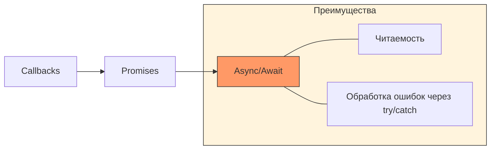

## JavaScript: Мозги. Урок 3: Асинхронность (Promise, async/await)


В JavaScript многие операции, такие как загрузка данных с сервера или работа с таймерами, выполняются асинхронно. Это значит, что код не ждет завершения этих операций, а продолжает выполняться дальше. В этом уроке мы разберемся с тем, как обрабатывать асинхронные операции с помощью `Promise` и `async/await`.

### Эволюция асинхронности в JS


*Переход от вложенных колбэков к чистому асинхронному синтаксису.*

### Что такое асинхронность?

Представьте, что вы завариваете чай. Вы не стоите и не смотрите, как вода нагревается, а пока занимаетесь чем-то другим (например, подготавливаете печенье). Когда вода закипит, вы услышите свисток и продолжите заваривать чай. Асинхронность в JavaScript работает похоже: мы запускаем операцию (например, запрос к серверу) и продолжаем выполнять другие задачи, а когда операция завершится, нас "уведомят" (с помощью колбэка, Promise или async/await).

### Promise

`Promise` – это объект, представляющий собой результат асинхронной операции, который может быть доступен сейчас, в будущем или никогда. Promise имеет три состояния:

*   **Pending (Ожидание):** Начальное состояние, операция еще не завершена.
*   **Fulfilled (Выполнено):** Операция успешно завершена, Promise содержит результат.
*   **Rejected (Отклонено):** Операция завершилась с ошибкой, Promise содержит причину ошибки.

```javascript
const myPromise = new Promise((resolve, reject) => {
  // Имитируем асинхронную операцию (например, запрос к серверу)
  setTimeout(() => {
    const success = true; //  Предположим, операция прошла успешно

    if (success) {
      resolve("Данные успешно получены!"); // Переходим в состояние Fulfilled
    } else {
      reject("Ошибка при получении данных!"); // Переходим в состояние Rejected
    }
  }, 2000); // Задержка в 2 секунды
});

myPromise
  .then((result) => {
    console.log("Успех:", result); // Обрабатываем успешный результат
  })
  .catch((error) => {
    console.error("Ошибка:", error); // Обрабатываем ошибку
  });

console.log("Promise создан, ждем результат..."); // Этот код выполнится раньше, чем сработает then/catch
```

### async/await

`async/await` – это синтаксический сахар над `Promise`, который делает асинхронный код более читаемым и похожим на синхронный.

*   `async` – ставится перед функцией, чтобы указать, что она будет содержать асинхронные операции.
*   `await` – ставится перед Promise, чтобы "остановить" выполнение функции до тех пор, пока Promise не будет выполнен или отклонен.

```javascript
async function fetchData() {
  try {
    const result = await myPromise; // Ждем, пока Promise выполнится
    console.log("Данные получены:", result);
  } catch (error) {
    console.error("Ошибка:", error);
  }
}

fetchData();
console.log("Функция fetchData запущена..."); // Этот код выполнится раньше, чем сработает console.log внутри fetchData
```

### Жизненный пример

В реальных веб-приложениях асинхронность используется повсеместно. Например, при загрузке данных с API.

```javascript
async function getPosts() {
  try {
    const response = await fetch('https://jsonplaceholder.typicode.com/posts');
    const posts = await response.json(); // response.json() тоже возвращает Promise!
    console.log(posts); // Выводим полученные посты
  } catch (error) {
    console.error("Ошибка при загрузке постов:", error);
  }
}

getPosts();
```

Этот код использует `fetch` API для получения данных с сервера. `fetch` возвращает `Promise`, который разрешается с `response` объектом. Чтобы получить данные из `response`, мы используем метод `json()`, который также возвращает `Promise`. `async/await` позволяет нам дождаться завершения обоих этих Promise и обработать результат последовательно. Многие фреймворки, такие как React, Vue и Angular, активно используют асинхронность для работы с данными и обновления пользовательского интерфейса.

### Ключевые моменты

*   Асинхронность позволяет выполнять операции, не блокируя основной поток выполнения JavaScript.
*   `Promise` представляет собой результат асинхронной операции.
*   `async/await` упрощает работу с `Promise`, делая асинхронный код более читаемым.
*   `try...catch` используется для обработки ошибок в `async/await` функциях.
*   Асинхронность активно используется в веб-разработке для работы с API, таймерами и другими операциями, требующими времени.

### Практика

Попробуйте примеры в интерактивном редакторе:

import { Sandpack } from "@codesandbox/sandpack-react";

<Sandpack
  template="vanilla"
  files={{
    "/index.js": `// Демонстрация Promise и async/await
async function fetchUserData(userId) {
  const output = document.getElementById('output');
  const btn = document.getElementById('fetchBtn');
  
  btn.disabled = true;
  output.innerHTML = '<p class="loading">⏳ Загружаем данные...</p>';
  
  try {
    // Симулируем запрос к API
    await new Promise(resolve => setTimeout(resolve, 1000));
    const response = await fetch(\`https://jsonplaceholder.typicode.com/users/\${userId}\`);
    const user = await response.json();
    
    // Загружаем посты пользователя
    output.innerHTML += '<p class="loading">⏳ Загружаем посты...</p>';
    await new Promise(resolve => setTimeout(resolve, 800));
    const postsResponse = await fetch(\`https://jsonplaceholder.typicode.com/users/\${userId}/posts\`);
    const posts = await postsResponse.json();
    
    // Отображаем результат
    output.innerHTML = \`
      <div class="success">
        <h3>✅ Данные загружены!</h3>
        <p><strong>Имя:</strong> \${user.name}</p>
        <p><strong>Email:</strong> \${user.email}</p>
        <p><strong>Город:</strong> \${user.address.city}</p>
        <p><strong>Постов:</strong> \${posts.length}</p>
      </div>
    \`;
  } catch (error) {
    output.innerHTML = \`<p class="error">❌ Ошибка: \${error.message}</p>\`;
  } finally {
    btn.disabled = false;
  }
}

document.getElementById('fetchBtn').addEventListener('click', () => {
  const userId = Math.floor(Math.random() * 10) + 1;
  fetchUserData(userId);
});`,
    "/index.html": `<!DOCTYPE html>
<html>
<head>
  <style>
    body {
      font-family: system-ui, -apple-system, sans-serif;
      padding: 20px;
      background: linear-gradient(135deg, #667eea 0%, #764ba2 100%);
      min-height: 100vh;
    }
    .container {
      max-width: 500px;
      margin: 0 auto;
      background: white;
      padding: 30px;
      border-radius: 12px;
      box-shadow: 0 10px 40px rgba(0,0,0,0.2);
    }
    h2 {
      margin-top: 0;
      color: #667eea;
    }
    button {
      width: 100%;
      padding: 12px;
      font-size: 16px;
      background: #667eea;
      color: white;
      border: none;
      border-radius: 6px;
      cursor: pointer;
      transition: all 0.3s;
    }
    button:hover:not(:disabled) {
      background: #764ba2;
      transform: translateY(-2px);
    }
    button:disabled {
      opacity: 0.6;
      cursor: not-allowed;
    }
    #output {
      margin-top: 20px;
      min-height: 150px;
    }
    .loading {
      color: #ff9800;
      font-weight: bold;
    }
    .success {
      background: #e8f5e9;
      padding: 15px;
      border-radius: 8px;
      border-left: 4px solid #4caf50;
    }
    .error {
      background: #ffebee;
      padding: 15px;
      border-radius: 8px;
      border-left: 4px solid #f44336;
      color: #c62828;
    }
  </style>
</head>
<body>
  <div class="container">
    <h2>🔄 Async/Await Demo</h2>
    <button id="fetchBtn">Загрузить данные пользователя</button>
    <div id="output"></div>
  </div>
  <script src="/index.js"></script>
</body>
</html>`
  }}
  options={{
    showNavigator: false,
    showLineNumbers: true,
    editorHeight: 450
  }}
/>
