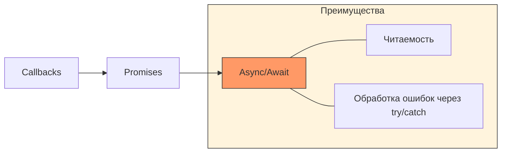

## JavaScript: Мозги. Урок 3: Асинхронность (Promise, async/await)


В JavaScript многие операции, такие как загрузка данных с сервера или работа с таймерами, выполняются асинхронно. Это значит, что код не ждет завершения этих операций, а продолжает выполняться дальше. В этом уроке мы разберемся с тем, как обрабатывать асинхронные операции с помощью `Promise` и `async/await`.

### Эволюция асинхронности в JS


*Переход от вложенных колбэков к чистому асинхронному синтаксису.*

### Что такое асинхронность?

Представьте, что вы завариваете чай. Вы не стоите и не смотрите, как вода нагревается, а пока занимаетесь чем-то другим (например, подготавливаете печенье). Когда вода закипит, вы услышите свисток и продолжите заваривать чай. Асинхронность в JavaScript работает похоже: мы запускаем операцию (например, запрос к серверу) и продолжаем выполнять другие задачи, а когда операция завершится, нас "уведомят" (с помощью колбэка, Promise или async/await).

### Promise

`Promise` – это объект, представляющий собой результат асинхронной операции, который может быть доступен сейчас, в будущем или никогда. Promise имеет три состояния:

*   **Pending (Ожидание):** Начальное состояние, операция еще не завершена.
*   **Fulfilled (Выполнено):** Операция успешно завершена, Promise содержит результат.
*   **Rejected (Отклонено):** Операция завершилась с ошибкой, Promise содержит причину ошибки.

```javascript
const myPromise = new Promise((resolve, reject) => {
  // Имитируем асинхронную операцию (например, запрос к серверу)
  setTimeout(() => {
    const success = true; //  Предположим, операция прошла успешно

    if (success) {
      resolve("Данные успешно получены!"); // Переходим в состояние Fulfilled
    } else {
      reject("Ошибка при получении данных!"); // Переходим в состояние Rejected
    }
  }, 2000); // Задержка в 2 секунды
});

myPromise
  .then((result) => {
    console.log("Успех:", result); // Обрабатываем успешный результат
  })
  .catch((error) => {
    console.error("Ошибка:", error); // Обрабатываем ошибку
  });

console.log("Promise создан, ждем результат..."); // Этот код выполнится раньше, чем сработает then/catch
```

### async/await

`async/await` – это синтаксический сахар над `Promise`, который делает асинхронный код более читаемым и похожим на синхронный.

*   `async` – ставится перед функцией, чтобы указать, что она будет содержать асинхронные операции.
*   `await` – ставится перед Promise, чтобы "остановить" выполнение функции до тех пор, пока Promise не будет выполнен или отклонен.

```javascript
async function fetchData() {
  try {
    const result = await myPromise; // Ждем, пока Promise выполнится
    console.log("Данные получены:", result);
  } catch (error) {
    console.error("Ошибка:", error);
  }
}

fetchData();
console.log("Функция fetchData запущена..."); // Этот код выполнится раньше, чем сработает console.log внутри fetchData
```

### Жизненный пример

В реальных веб-приложениях асинхронность используется повсеместно. Например, при загрузке данных с API.

```javascript
async function getPosts() {
  try {
    const response = await fetch('https://jsonplaceholder.typicode.com/posts');
    const posts = await response.json(); // response.json() тоже возвращает Promise!
    console.log(posts); // Выводим полученные посты
  } catch (error) {
    console.error("Ошибка при загрузке постов:", error);
  }
}

getPosts();
```

Этот код использует `fetch` API для получения данных с сервера. `fetch` возвращает `Promise`, который разрешается с `response` объектом. Чтобы получить данные из `response`, мы используем метод `json()`, который также возвращает `Promise`. `async/await` позволяет нам дождаться завершения обоих этих Promise и обработать результат последовательно. Многие фреймворки, такие как React, Vue и Angular, активно используют асинхронность для работы с данными и обновления пользовательского интерфейса.

### Ключевые моменты

*   Асинхронность позволяет выполнять операции, не блокируя основной поток выполнения JavaScript.
*   `Promise` представляет собой результат асинхронной операции.
*   `async/await` упрощает работу с `Promise`, делая асинхронный код более читаемым.
*   `try...catch` используется для обработки ошибок в `async/await` функциях.
*   Асинхронность активно используется в веб-разработке для работы с API, таймерами и другими операциями, требующими времени.

### Практика

Попробуйте примеры в интерактивном редакторе:

import { Sandpack } from "@codesandbox/sandpack-react";
