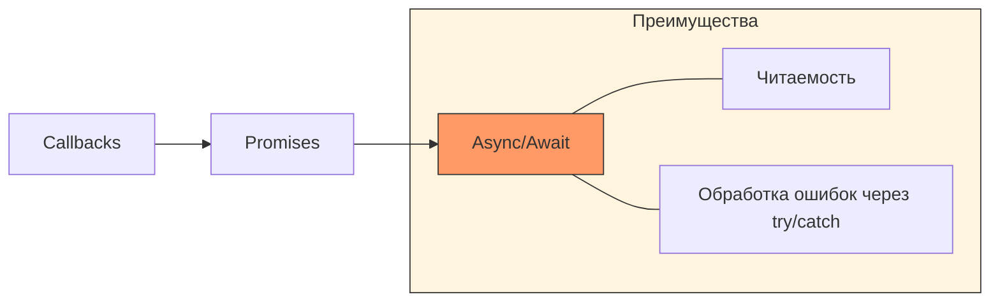

## JavaScript: Мозги. Урок 3: Асинхронность (Promise, async/await)


В JavaScript многие операции, такие как загрузка данных с сервера или работа с таймерами, выполняются асинхронно. Это значит, что код не ждет завершения этих операций, а продолжает выполняться дальше. В этом уроке мы разберемся с тем, как обрабатывать асинхронные операции с помощью `Promise` и `async/await`.

### Эволюция асинхронности в JS


```mermaid
flowchart LR
    CB[Callbacks] --> P[Promises]
    P --> AA[Async/Await]
    
    subgraph Pros [Преимущества]
    AA --- R1[Читаемость]
    AA --- R2[Обработка ошибок через try/catch]
    end
    
    style AA fill:#f96,stroke:#333
    style Pros fill:#fff4dd,stroke:#333
```
*Переход от вложенных колбэков к чистому асинхронному синтаксису.*

### Что такое асинхронность?

Представьте, что вы завариваете чай. Вы не стоите и не смотрите, как вода нагревается, а пока занимаетесь чем-то другим (например, подготавливаете печенье). Когда вода закипит, вы услышите свисток и продолжите заваривать чай. Асинхронность в JavaScript работает похоже: мы запускаем операцию (например, запрос к серверу) и продолжаем выполнять другие задачи, а когда операция завершится, нас "уведомят" (с помощью колбэка, Promise или async/await).

### Promise

`Promise` – это объект, представляющий собой результат асинхронной операции, который может быть доступен сейчас, в будущем или никогда. Promise имеет три состояния:

*   **Pending (Ожидание):** Начальное состояние, операция еще не завершена.
*   **Fulfilled (Выполнено):** Операция успешно завершена, Promise содержит результат.
*   **Rejected (Отклонено):** Операция завершилась с ошибкой, Promise содержит причину ошибки.

```javascript
const myPromise = new Promise((resolve, reject) => {
  // Имитируем асинхронную операцию (например, запрос к серверу)
  setTimeout(() => {
    const success = true; //  Предположим, операция прошла успешно

    if (success) {
      resolve("Данные успешно получены!"); // Переходим в состояние Fulfilled
    } else {
      reject("Ошибка при получении данных!"); // Переходим в состояние Rejected
    }
  }, 2000); // Задержка в 2 секунды
});

myPromise
  .then((result) => {
    console.log("Успех:", result); // Обрабатываем успешный результат
  })
  .catch((error) => {
    console.error("Ошибка:", error); // Обрабатываем ошибку
  });

console.log("Promise создан, ждем результат..."); // Этот код выполнится раньше, чем сработает then/catch
```

### async/await

`async/await` – это синтаксический сахар над `Promise`, который делает асинхронный код более читаемым и похожим на синхронный.

*   `async` – ставится перед функцией, чтобы указать, что она будет содержать асинхронные операции.
*   `await` – ставится перед Promise, чтобы "остановить" выполнение функции до тех пор, пока Promise не будет выполнен или отклонен.

```javascript
async function fetchData() {
  try {
    const result = await myPromise; // Ждем, пока Promise выполнится
    console.log("Данные получены:", result);
  } catch (error) {
    console.error("Ошибка:", error);
  }
}

fetchData();
console.log("Функция fetchData запущена..."); // Этот код выполнится раньше, чем сработает console.log внутри fetchData
```

### Жизненный пример

В реальных веб-приложениях асинхронность используется повсеместно. Например, при загрузке данных с API.

```javascript
async function getPosts() {
  try {
    const response = await fetch('https://jsonplaceholder.typicode.com/posts');
    const posts = await response.json(); // response.json() тоже возвращает Promise!
    console.log(posts); // Выводим полученные посты
  } catch (error) {
    console.error("Ошибка при загрузке постов:", error);
  }
}

getPosts();
```

Этот код использует `fetch` API для получения данных с сервера. `fetch` возвращает `Promise`, который разрешается с `response` объектом. Чтобы получить данные из `response`, мы используем метод `json()`, который также возвращает `Promise`. `async/await` позволяет нам дождаться завершения обоих этих Promise и обработать результат последовательно. Многие фреймворки, такие как React, Vue и Angular, активно используют асинхронность для работы с данными и обновления пользовательского интерфейса.

### Ключевые моменты

*   Асинхронность позволяет выполнять операции, не блокируя основной поток выполнения JavaScript.
*   `Promise` представляет собой результат асинхронной операции.
*   `async/await` упрощает работу с `Promise`, делая асинхронный код более читаемым.
*   `try...catch` используется для обработки ошибок в `async/await` функциях.
*   Асинхронность активно используется в веб-разработке для работы с API, таймерами и другими операциями, требующими времени.

## Интерактивный пример

<Playground
  template="static"
  files={{
    "/index.html": `<!DOCTYPE html>
<html lang="en">
<head>
  <meta charset="UTF-8">
  <style>
    body { background: #1e1e2e; color: #cdd6f4; font-family: sans-serif; padding: 20px; margin: 0; }
    button { background: #89b4fa; color: #1e1e2e; border: none; padding: 8px 16px; border-radius: 6px; cursor: pointer; margin: 4px; font-size: 14px; }
    button:hover { background: #74c7ec; }
    .box { background: #313244; border-radius: 8px; padding: 16px; margin: 10px 0; }
    .output { background: #181825; border-radius: 6px; padding: 10px; font-family: monospace; font-size: 12px; min-height: 50px; max-height: 140px; overflow-y: auto; }
    .cols { display: flex; gap: 10px; }
    .col { flex: 1; }
    .col-title { font-size: 13px; color: #f9e2af; margin-bottom: 8px; font-weight: bold; text-align: center; }
    .entry { padding: 2px 0; border-bottom: 1px solid #313244; }
    .ok { color: #a6e3a1; } .info { color: #89dceb; } .warn { color: #f9e2af; }
    h3 { margin: 0 0 10px; font-size: 15px; color: #cba6f7; }
    .run-all { background: #a6e3a1; }
  </style>
</head>
<body>
  <h3>Коллбэк → Promise → async/await — одна задача, три стиля</h3>
  <div class="box" style="text-align:center">
    <button class="run-all" onclick="runAll()">▶ Запустить все три подхода</button>
    <button onclick="clearAll()">↺ Очистить</button>
  </div>
  <div class="cols">
    <div class="col box">
      <div class="col-title">📞 Callback</div>
      <div class="output" id="out-cb"></div>
    </div>
    <div class="col box">
      <div class="col-title">🤝 Promise</div>
      <div class="output" id="out-promise"></div>
    </div>
    <div class="col box">
      <div class="col-title">⚡ async/await</div>
      <div class="output" id="out-async"></div>
    </div>
  </div>
  <script>
    function addTo(id, msg, cls = '') {
      const el = document.getElementById(id);
      const d = document.createElement('div');
      d.className = 'entry ' + cls;
      d.textContent = msg;
      el.appendChild(d);
    }
    function clearAll() {
      ['out-cb','out-promise','out-async'].forEach(id => document.getElementById(id).innerHTML = '');
    }

    // ── Callback approach ──
    function loadDataCallback(cb) {
      addTo('out-cb', 'Запрос отправлен...', 'info');
      setTimeout(() => cb(null, 'Данные получены!'), 800);
    }

    // ── Promise approach ──
    function loadDataPromise() {
      addTo('out-promise', 'Promise создан (pending)...', 'info');
      return new Promise(resolve => setTimeout(() => resolve('Данные получены!'), 800));
    }

    // ── async/await approach ──
    async function loadDataAsync() {
      addTo('out-async', 'await — ждём...', 'info');
      const result = await new Promise(resolve => setTimeout(() => resolve('Данные получены!'), 800));
      return result;
    }

    function runAll() {
      clearAll();

      // Callback
      addTo('out-cb', '1. loadData(callback) вызван', 'info');
      loadDataCallback((err, data) => {
        if (err) addTo('out-cb', 'Ошибка: ' + err, 'warn');
        else addTo('out-cb', '✅ callback: ' + data, 'ok');
      });
      addTo('out-cb', '2. Код продолжается синхронно', 'info');

      // Promise
      addTo('out-promise', '1. loadData().then(...) вызван', 'info');
      loadDataPromise().then(data => {
        addTo('out-promise', '✅ .then: ' + data, 'ok');
      });
      addTo('out-promise', '2. Код продолжается синхронно', 'info');

      // async/await
      addTo('out-async', '1. async function запущена', 'info');
      loadDataAsync().then(data => {
        addTo('out-async', '✅ result: ' + data, 'ok');
      });
      addTo('out-async', '2. Код продолжается синхронно', 'info');
    }
  </script>
</body>
</html>`,
  }}
/>
