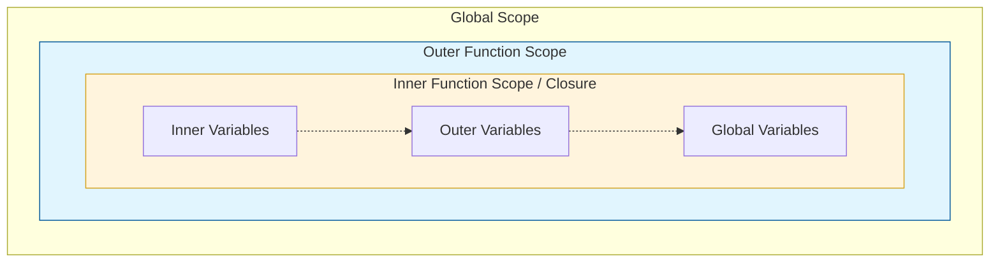

## JavaScript: Мозги. Урок: Замыкания (closures) детально

Замыкания – это мощный инструмент JavaScript, позволяющий функциям "запоминать" и получать доступ к переменным из лексического окружения, в котором они были созданы, даже после того, как это окружение перестало существовать. Понимание замыканий – ключ к написанию более эффективного и поддерживаемого кода.

### Схема Scope Chain


*Цепочка областей видимости: функция ищет переменную сначала у себя, затем во внешнем окружении.*

### Что такое замыкание?

Простыми словами, замыкание – это функция, которая "помнит" переменные, объявленные вне ее тела.  Представьте, что функция забирает с собой маленький "рюкзак" с переменными из того места, где она была создана.

Рассмотрим пример:

```javascript
function outerFunction(outerVar) {
  function innerFunction(innerVar) {
    console.log("outerVar:", outerVar);
    console.log("innerVar:", innerVar);
  }
  return innerFunction;
}

const myInnerFunction = outerFunction("Привет из outer!");
myInnerFunction("Привет из inner!"); // Вывод: outerVar: Привет из outer! , innerVar: Привет из inner!
```

В этом примере `innerFunction` формирует замыкание вокруг `outerVar`. Даже после того, как `outerFunction` завершила свое выполнение, `innerFunction` все еще имеет доступ к `outerVar`.

### Практические примеры

**1. Счетчик:**

```javascript
function createCounter() {
  let count = 0;

  return {
    increment: function() {
      count++;
      console.log(count);
    },
    decrement: function() {
      count--;
      console.log(count);
    }
  };
}

const counter = createCounter();
counter.increment(); // Вывод: 1
counter.increment(); // Вывод: 2
counter.decrement(); // Вывод: 1
```

Здесь `count` является приватной переменной, доступной только через методы `increment` и `decrement`, возвращаемые функцией `createCounter`. Это достигается благодаря замыканию.

**2. Функция с задержкой:**

```javascript
function delayedLog(value, delay) {
  return function() {
    setTimeout(() => console.log(value), delay);
  };
}

const logHello = delayedLog("Привет!", 2000);
logHello(); // Вывод "Привет!" через 2 секунды
```

Функция, возвращаемая `delayedLog`, "помнит" `value` благодаря замыканию и использует его при вызове `console.log` внутри `setTimeout`.

### Жизненный пример

Замыкания активно используются в JavaScript-библиотеках и фреймворках для создания модулей, инкапсуляции данных и реализации паттернов проектирования.

*   **React Hooks:**  Хуки, такие как `useState` и `useEffect`, используют замыкания для сохранения состояния компонентов между рендерами.  Состояние, которое нужно сохранить, находится в замыкании, доступном только для хука.

*   **Event Listeners:** Когда мы добавляем обработчик события, функция-обработчик часто нуждается в доступе к данным, которые были доступны в момент добавления обработчика. Замыкания позволяют сохранить эти данные.

*   **Module Pattern:** Замыкания часто используются для создания приватных переменных и методов в модулях. Это позволяет скрывать внутреннюю реализацию модуля и предоставлять только необходимый интерфейс.

### Ключевые моменты

*   Замыкание – это функция вместе с лексическим окружением, в котором она была создана.
*   Замыкания позволяют функциям "запоминать" переменные из внешних областей видимости.
*   Замыкания обеспечивают инкапсуляцию данных и помогают создавать приватные переменные.
*   Замыкания широко используются в JavaScript-библиотеках и фреймворках для реализации различных паттернов проектирования.
*   Неправильное использование замыканий может привести к утечкам памяти, поэтому важно понимать, как они работают.

### Практика

Попробуйте примеры в интерактивном редакторе:

import { Sandpack } from "@codesandbox/sandpack-react";

<Sandpack
  template="vanilla"
  files={{
    "/index.js": `// Демонстрация замыканий (closures)

const output = document.getElementById('output');

// Пример 1: Счетчик с приватным состоянием
function createCounter(name) {
  let count = 0; // Приватная переменная
  
  return {
    increment() {
      count++;
      return count;
    },
    decrement() {
      count--;
      return count;
    },
    getCount() {
      return count;
    },
    getName() {
      return name;
    }
  };
}

const counter1 = createCounter('Счетчик 1');
const counter2 = createCounter('Счетчик 2');

function showCounter() {
  output.innerHTML = \`
    <div class="demo">
      <h3>🔢 Счетчик с приватным состоянием</h3>
      <div class="counters">
        <div class="counter-box">
          <h4>\${counter1.getName()}</h4>
          <div class="count">\${counter1.getCount()}</div>
          <button onclick="counter1.increment(); showCounter()">➕</button>
          <button onclick="counter1.decrement(); showCounter()">➖</button>
        </div>
        <div class="counter-box">
          <h4>\${counter2.getName()}</h4>
          <div class="count">\${counter2.getCount()}</div>
          <button onclick="counter2.increment(); showCounter()">➕</button>
          <button onclick="counter2.decrement(); showCounter()">➖</button>
        </div>
      </div>
      <p class="note">✨ Каждый счетчик "запоминает" свое значение через замыкание!</p>
    </div>
  \`;
}

// Пример 2: Фабрика функций
function createMultiplier(multiplier) {
  return function(number) {
    return number * multiplier;
  };
}

const double = createMultiplier(2);
const triple = createMultiplier(3);
const quadruple = createMultiplier(4);

function showMultiplier() {
  const num = 5;
  output.innerHTML = \`
    <div class="demo">
      <h3>✖️ Фабрика функций</h3>
      <div class="result-box">
        <p>Число: <strong>\${num}</strong></p>
        <p>double(\${num}) = <strong>\${double(num)}</strong></p>
        <p>triple(\${num}) = <strong>\${triple(num)}</strong></p>
        <p>quadruple(\${num}) = <strong>\${quadruple(num)}</strong></p>
      </div>
      <p class="note">✨ Каждая функция "помнит" свой множитель!</p>
    </div>
  \`;
}

// Пример 3: Приватные переменные
function createUser(name, balance) {
  // Приватные переменные
  let _name = name;
  let _balance = balance;
  const _transactions = [];
  
  return {
    getName() {
      return _name;
    },
    getBalance() {
      return _balance;
    },
    deposit(amount) {
      _balance += amount;
      _transactions.push({ type: 'deposit', amount, date: new Date() });
      return \`✅ Пополнение на \${amount}₽\`;
    },
    withdraw(amount) {
      if (amount > _balance) {
        return \`❌ Недостаточно средств!\`;
      }
      _balance -= amount;
      _transactions.push({ type: 'withdraw', amount, date: new Date() });
      return \`✅ Снятие \${amount}₽\`;
    },
    getTransactions() {
      return _transactions;
    }
  };
}

const user = createUser('Иван', 1000);

function showUser() {
  const transactions = user.getTransactions();
  output.innerHTML = \`
    <div class="demo">
      <h3>👤 Пользователь с приватными данными</h3>
      <div class="user-card">
        <h4>\${user.getName()}</h4>
        <div class="balance">Баланс: <strong>\${user.getBalance()}₽</strong></div>
        <div class="controls">
          <button onclick="showMessage(user.deposit(100)); showUser()">💰 +100₽</button>
          <button onclick="showMessage(user.withdraw(50)); showUser()">💸 -50₽</button>
          <button onclick="showMessage(user.withdraw(2000)); showUser()">💸 -2000₽</button>
        </div>
        <div class="transactions">
          <h5>Транзакции:</h5>
          \${transactions.length > 0 ? 
            transactions.slice(-5).reverse().map(t => 
              \`<p>\${t.type === 'deposit' ? '➕' : '➖'} \${t.amount}₽</p>\`
            ).join('') : 
            '<p class="empty">Нет транзакций</p>'
          }
        </div>
      </div>
      <p class="note">✨ Баланс и транзакции недоступны напрямую - только через методы!</p>
    </div>
  \`;
}

function showMessage(msg) {
  const toast = document.createElement('div');
  toast.className = 'toast';
  toast.textContent = msg;
  document.body.appendChild(toast);
  setTimeout(() => toast.remove(), 2000);
}

// Обработчики кнопок
document.getElementById('counterBtn').addEventListener('click', showCounter);
document.getElementById('multiplierBtn').addEventListener('click', showMultiplier);
document.getElementById('userBtn').addEventListener('click', showUser);

// Показываем первый пример
showCounter();`,
    "/index.html": `<!DOCTYPE html>
<html>
<head>
  <style>
    body {
      font-family: system-ui, -apple-system, sans-serif;
      padding: 20px;
      background: linear-gradient(135deg, #667eea 0%, #764ba2 100%);
      min-height: 100vh;
    }
    .container {
      max-width: 800px;
      margin: 0 auto;
      background: white;
      padding: 30px;
      border-radius: 12px;
      box-shadow: 0 10px 40px rgba(0,0,0,0.3);
    }
    h2 {
      color: #667eea;
      margin-top: 0;
    }
    .tabs {
      display: flex;
      gap: 10px;
      margin: 20px 0;
    }
    .tabs button {
      flex: 1;
      padding: 12px;
      background: #e0e0e0;
      color: #333;
      border: none;
      border-radius: 6px;
      cursor: pointer;
      transition: all 0.3s;
    }
    .tabs button:hover {
      background: #667eea;
      color: white;
      transform: translateY(-2px);
    }
    .demo {
      padding: 20px;
      background: #f8f9fa;
      border-radius: 8px;
      margin: 20px 0;
    }
    .demo h3 {
      margin-top: 0;
      color: #667eea;
    }
    .counters {
      display: grid;
      grid-template-columns: repeat(2, 1fr);
      gap: 15px;
    }
    .counter-box {
      background: white;
      padding: 20px;
      border-radius: 8px;
      text-align: center;
    }
    .count {
      font-size: 48px;
      font-weight: bold;
      color: #667eea;
      margin: 15px 0;
    }
    button {
      padding: 10px 15px;
      background: #667eea;
      color: white;
      border: none;
      border-radius: 6px;
      cursor: pointer;
      margin: 5px;
      transition: all 0.3s;
    }
    button:hover {
      background: #764ba2;
    }
    .result-box {
      background: white;
      padding: 20px;
      border-radius: 8px;
      margin: 15px 0;
    }
    .result-box p {
      font-size: 18px;
      margin: 10px 0;
    }
    .user-card {
      background: white;
      padding: 20px;
      border-radius: 8px;
    }
    .balance {
      font-size: 24px;
      margin: 15px 0;
      color: #667eea;
    }
    .transactions {
      margin-top: 15px;
      background: #f8f9fa;
      padding: 15px;
      border-radius: 6px;
    }
    .transactions p {
      margin: 5px 0;
    }
    .note {
      background: rgba(102, 126, 234, 0.1);
      padding: 10px;
      border-radius: 6px;
      border-left: 4px solid #667eea;
      margin-top: 15px;
      font-style: italic;
    }
    .empty {
      color: #999;
      font-style: italic;
    }
    .toast {
      position: fixed;
      top: 20px;
      right: 20px;
      background: #333;
      color: white;
      padding: 15px 20px;
      border-radius: 6px;
      animation: slideIn 0.3s ease;
      z-index: 1000;
    }
    @keyframes slideIn {
      from {
        transform: translateX(400px);
      }
      to {
        transform: translateX(0);
      }
    }
  </style>
</head>
<body>
  <div class="container">
    <h2>🔐 Closures Deep Dive</h2>
    <div class="tabs">
      <button id="counterBtn">🔢 Счетчики</button>
      <button id="multiplierBtn">✖️ Множители</button>
      <button id="userBtn">👤 Пользователь</button>
    </div>
    <div id="output"></div>
  </div>
  <script src="/index.js"></script>
</body>
</html>`
  }}
  options={{
    showNavigator: false,
    showLineNumbers: true,
    editorHeight: 550
  }}
/>
