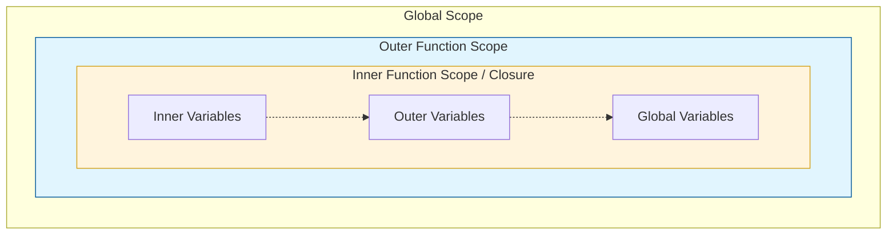

## JavaScript: Мозги. Урок: Замыкания (closures) детально

Замыкания – это мощный инструмент JavaScript, позволяющий функциям "запоминать" и получать доступ к переменным из лексического окружения, в котором они были созданы, даже после того, как это окружение перестало существовать. Понимание замыканий – ключ к написанию более эффективного и поддерживаемого кода.

### Схема Scope Chain


*Цепочка областей видимости: функция ищет переменную сначала у себя, затем во внешнем окружении.*

### Что такое замыкание?

Простыми словами, замыкание – это функция, которая "помнит" переменные, объявленные вне ее тела.  Представьте, что функция забирает с собой маленький "рюкзак" с переменными из того места, где она была создана.

Рассмотрим пример:

```javascript
function outerFunction(outerVar) {
  function innerFunction(innerVar) {
    console.log("outerVar:", outerVar);
    console.log("innerVar:", innerVar);
  }
  return innerFunction;
}

const myInnerFunction = outerFunction("Привет из outer!");
myInnerFunction("Привет из inner!"); // Вывод: outerVar: Привет из outer! , innerVar: Привет из inner!
```

В этом примере `innerFunction` формирует замыкание вокруг `outerVar`. Даже после того, как `outerFunction` завершила свое выполнение, `innerFunction` все еще имеет доступ к `outerVar`.

### Практические примеры

**1. Счетчик:**

```javascript
function createCounter() {
  let count = 0;

  return {
    increment: function() {
      count++;
      console.log(count);
    },
    decrement: function() {
      count--;
      console.log(count);
    }
  };
}

const counter = createCounter();
counter.increment(); // Вывод: 1
counter.increment(); // Вывод: 2
counter.decrement(); // Вывод: 1
```

Здесь `count` является приватной переменной, доступной только через методы `increment` и `decrement`, возвращаемые функцией `createCounter`. Это достигается благодаря замыканию.

**2. Функция с задержкой:**

```javascript
function delayedLog(value, delay) {
  return function() {
    setTimeout(() => console.log(value), delay);
  };
}

const logHello = delayedLog("Привет!", 2000);
logHello(); // Вывод "Привет!" через 2 секунды
```

Функция, возвращаемая `delayedLog`, "помнит" `value` благодаря замыканию и использует его при вызове `console.log` внутри `setTimeout`.

### Жизненный пример

Замыкания активно используются в JavaScript-библиотеках и фреймворках для создания модулей, инкапсуляции данных и реализации паттернов проектирования.

*   **React Hooks:**  Хуки, такие как `useState` и `useEffect`, используют замыкания для сохранения состояния компонентов между рендерами.  Состояние, которое нужно сохранить, находится в замыкании, доступном только для хука.

*   **Event Listeners:** Когда мы добавляем обработчик события, функция-обработчик часто нуждается в доступе к данным, которые были доступны в момент добавления обработчика. Замыкания позволяют сохранить эти данные.

*   **Module Pattern:** Замыкания часто используются для создания приватных переменных и методов в модулях. Это позволяет скрывать внутреннюю реализацию модуля и предоставлять только необходимый интерфейс.

### Ключевые моменты

*   Замыкание – это функция вместе с лексическим окружением, в котором она была создана.
*   Замыкания позволяют функциям "запоминать" переменные из внешних областей видимости.
*   Замыкания обеспечивают инкапсуляцию данных и помогают создавать приватные переменные.
*   Замыкания широко используются в JavaScript-библиотеках и фреймворках для реализации различных паттернов проектирования.
*   Неправильное использование замыканий может привести к утечкам памяти, поэтому важно понимать, как они работают.
