import { Sandpack } from '@codesandbox/sandpack-react'
## JavaScript: Мозги - Урок по ES Modules

ES Modules (ESM) - это стандартизированный способ организации и повторного использования JavaScript кода. Они позволяют разбивать код на отдельные файлы (модули) и импортировать/экспортировать функциональность между ними.

### Схема Module Resolution

```mermaid
flowchart TD
    Main[main.js] -->|"import &#123;add&#125; from"| MathMod[math.js]
    Main -->|"import user from"| User[user.js]
    MathMod -->|export| AddFn[add function]
    User -->|export default| UserObj[user object]
    
    subgraph Module_Graph [Module Dependency Graph]
    Main
    MathMod
    User
    end
    
    style Main fill:#e1f5fe,stroke:#01579b
    style MathMod fill:#fff4dd,stroke:#d4a017
    style User fill:#fff4dd,stroke:#d4a017
```


*Взаимосвязи между файлами: main.js собирает функциональность из других модулей.*

### Что такое ES Modules?

Представьте, что у вас есть огромная куча LEGO. ES Modules позволяют вам сортировать эти детальки по коробкам (модулям) и брать нужные детальки из нужной коробки, когда они вам нужны. Каждый модуль - это просто отдельный JavaScript файл.

**Экспорт (Export)**: Это процесс "выкладывания" функциональности из модуля, чтобы другие модули могли ее использовать.

**Импорт (Import)**: Это процесс "заимствования" функциональности из другого модуля.

### Примеры кода

**1. Создание модуля (module.js):**

```javascript
// module.js
export function add(a, b) {
  return a + b;
}

export const pi = 3.14159;

function privateFunction() {
  // Эта функция недоступна извне, так как она не экспортирована
  console.log("Это приватная функция");
}
```

**2. Использование модуля (main.js):**

```javascript
// main.js
import { add, pi } from './module.js'; // Укажите путь к вашему модулю

console.log(add(5, 3)); // Выведет 8
console.log(pi); // Выведет 3.14159
```

**3. Экспорт по умолчанию (default export):**

```javascript
// user.js
const user = {
  name: "John Doe",
  age: 30
};

export default user;
```

**4. Импорт по умолчанию:**

```javascript
// app.js
import user from './user.js'; // Можно использовать любое имя для импорта

console.log(user.name); // Выведет "John Doe"
```

**5. Импорт всего модуля:**

```javascript
// math.js
export function multiply(a, b) {
  return a * b;
}

export function divide(a, b) {
  return a / b;
}
```

```javascript
// main.js
import * as MathModule from './math.js';

console.log(MathModule.multiply(5, 2)); // Выведет 10
console.log(MathModule.divide(10, 2)); // Выведет 5
```

### Жизненный пример

ES Modules широко используются в современных JavaScript фреймворках и библиотеках, таких как React, Angular и Vue.js. Они позволяют разработчикам организовывать большие кодовые базы, делая их более поддерживаемыми и масштабируемыми.

Например, в React каждый компонент часто определяется как отдельный модуль, который затем импортируется и используется в других компонентах. Это позволяет создавать сложные пользовательские интерфейсы из небольших, повторно используемых частей.

Кроме того, системы сборки, такие как Webpack, Parcel и Rollup, используют ES Modules для создания оптимизированных бандлов для веб-приложений. Они анализируют зависимости между модулями и объединяют их в один или несколько файлов, которые затем загружаются браузером.

### Ключевые моменты

*   ES Modules - это стандартизированный способ организации JavaScript кода.
*   Используйте `export` для "выкладывания" функциональности из модуля.
*   Используйте `import` для "заимствования" функциональности из другого модуля.
*   Можно экспортировать и импортировать функции, переменные, классы и другие значения.
*   `default export` позволяет экспортировать одно значение по умолчанию из модуля.
*   ES Modules помогают создавать более структурированный, поддерживаемый и масштабируемый код.
*   ES Modules широко используются в современных JavaScript фреймворках и системах сборки.

### Практика

Попробуйте примеры в интерактивном редакторе:

<Sandpack template="vanilla">

```js index.js
import { add, multiply, pi } from './math.js';
import user from './user.js';
import * as Utils from './utils.js';

const app = document.querySelector('#app');

app.innerHTML = `
  <h2>📦 ES Modules</h2>
  <div style="background: #f5f5f5; padding: 20px; border-radius: 8px; font-family: monospace;">
    <h3 style="color: #2196F3; margin-top: 0;">1. Именованный импорт (named import)</h3>
    <div style="margin: 10px 0;">
      <code>import { add, multiply, pi } from './math.js'</code>
    </div>
    <div style="background: white; padding: 15px; border-radius: 4px; margin: 10px 0;">
      add(5, 3) = <strong style="color: #4CAF50;">${add(5, 3)}</strong><br>
      multiply(4, 7) = <strong style="color: #4CAF50;">${multiply(4, 7)}</strong><br>
      pi = <strong style="color: #4CAF50;">${pi}</strong>
    </div>
    
    <h3 style="color: #FF9800; margin-top: 20px;">2. Default импорт</h3>
    <div style="margin: 10px 0;">
      <code>import user from './user.js'</code>
    </div>
    <div style="background: white; padding: 15px; border-radius: 4px; margin: 10px 0;">
      user.name = <strong style="color: #FF9800;">${user.name}</strong><br>
      user.age = <strong style="color: #FF9800;">${user.age}</strong><br>
      user.city = <strong style="color: #FF9800;">${user.city}</strong>
    </div>
    
    <h3 style="color: #9C27B0; margin-top: 20px;">3. Импорт всего модуля (*)</h3>
    <div style="margin: 10px 0;">
      <code>import * as Utils from './utils.js'</code>
    </div>
    <div style="background: white; padding: 15px; border-radius: 4px; margin: 10px 0;">
      Utils.capitalize("hello") = <strong style="color: #9C27B0;">${Utils.capitalize("hello")}</strong><br>
      Utils.reverse("world") = <strong style="color: #9C27B0;">${Utils.reverse("world")}</strong><br>
      Utils.randomInt(1, 100) = <strong style="color: #9C27B0;">${Utils.randomInt(1, 100)}</strong>
    </div>
  </div>
  
  <div style="background: #e3f2fd; padding: 15px; border-radius: 8px; margin-top: 20px;">
    <h4 style="margin-top: 0;">💡 Преимущества ES Modules:</h4>
    <ul style="margin: 0;">
      <li>✅ Четкая структура зависимостей</li>
      <li>✅ Избежание глобальных переменных</li>
      <li>✅ Повторное использование кода</li>
      <li>✅ Tree-shaking (удаление неиспользуемого кода)</li>
      <li>✅ Стандартизированный способ организации кода</li>
    </ul>
  </div>
`;

console.log('📦 ES Modules demo loaded!');
console.log('Math:', { add: add(2, 3), multiply: multiply(2, 3), pi });
console.log('User:', user);
console.log('Utils:', { capitalize: Utils.capitalize('test'), reverse: Utils.reverse('test') });
```

```js math.js
// Именованный экспорт (named export)
export function add(a, b) {
  return a + b;
}

export function multiply(a, b) {
  return a * b;
}

export const pi = 3.14159;

// Эта функция не экспортирована - она приватная
function privateHelper() {
  console.log('Это приватная функция');
}
```

```js user.js
// Default экспорт (export default)
const user = {
  name: "John Doe",
  age: 30,
  city: "New York"
};

export default user;
```

```js utils.js
// Набор утилитарных функций
export function capitalize(str) {
  return str.charAt(0).toUpperCase() + str.slice(1);
}

export function reverse(str) {
  return str.split('').reverse().join('');
}

export function randomInt(min, max) {
  return Math.floor(Math.random() * (max - min + 1)) + min;
}
```

</Sandpack>
