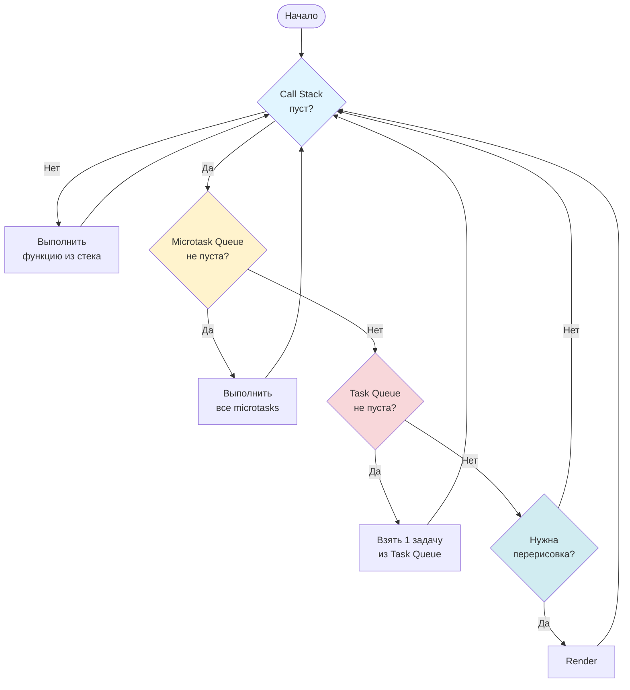

## JavaScript: Мозги. Event Loop глубже

Event Loop – это сердце JavaScript, позволяющее ему быть неблокирующим, несмотря на однопоточную природу. В этом уроке мы копнем глубже и разберем, как он работает на самом деле.

### Схема Event Loop



### Что такое Event Loop и как он работает?

JavaScript работает в одном потоке, то есть выполняет код последовательно, строка за строкой. Но что происходит, когда нужно выполнить длительную операцию, например, запросить данные с сервера? Если бы JavaScript просто ждал завершения этой операции, интерфейс пользователя "завис" бы. Event Loop решает эту проблему.

Event Loop – это цикл, который постоянно проверяет, есть ли задачи в очереди задач (task queue). Если очередь не пуста, он берет первую задачу и помещает ее в стек вызовов (call stack) для выполнения.  Когда стек вызовов пуст, Event Loop снова проверяет очередь задач.

Ключевые компоненты:

*   **Call Stack (Стек вызовов):** Место, где выполняется JavaScript код.
*   **Task Queue (Очередь задач):** Место, где хранятся задачи, ожидающие выполнения. Задачи добавляются в очередь асинхронными операциями (например, `setTimeout`, `fetch`, обработчики событий).
*   **Event Loop:** Цикл, который следит за стеком вызовов и очередью задач.

Пример:

```javascript
console.log("Первый");

setTimeout(() => {
  console.log("Второй");
}, 0);

console.log("Третий");
```

Ожидаемый вывод:

```
Первый
Третий
Второй
```

Почему "Второй" выводится последним?

1.  `console.log("Первый")` помещается в стек вызовов, выполняется, и выводится "Первый".
2.  `setTimeout` помещается в стек вызовов, выполняется. Он добавляет функцию обратного вызова (callback) в очередь задач через 0 миллисекунд.
3.  `console.log("Третий")` помещается в стек вызовов, выполняется, и выводится "Третий".
4.  Стек вызовов пуст. Event Loop проверяет очередь задач. Там находится функция обратного вызова из `setTimeout`.
5.  Функция обратного вызова помещается в стек вызовов, выполняется, и выводится "Второй".

### Практические примеры

```javascript
// Пример с Promise
console.log("Начало");

const promise = new Promise((resolve) => {
  resolve("Promise выполнен");
});

promise.then((value) => {
  console.log(value);
});

console.log("Конец");

// Вывод:
// Начало
// Конец
// Promise выполнен
```

В этом примере `then` тоже добавляет задачу в очередь задач.

```javascript
// Пример с requestAnimationFrame
function animate() {
  console.log("Кадр анимации");
  requestAnimationFrame(animate);
}

requestAnimationFrame(animate);
```

`requestAnimationFrame` добавляет функцию обратного вызова в очередь задач для выполнения перед следующим перерисовыванием экрана.

### Жизненный пример

Event Loop лежит в основе любого современного JavaScript-приложения.

*   **Обработка пользовательского ввода:** Когда пользователь кликает по кнопке, браузер добавляет обработчик события клика в очередь задач. Event Loop обрабатывает этот обработчик, вызывая соответствующую функцию.
*   **Загрузка данных с сервера:** Когда вы делаете запрос к API, браузер добавляет функцию обратного вызова для обработки ответа в очередь задач. Event Loop обрабатывает эту функцию, когда данные загружены.
*   **Анимация:** `requestAnimationFrame` использует Event Loop для плавной анимации.

Фреймворки, такие как React, Angular и Vue.js, активно используют Event Loop для управления пользовательским интерфейсом и обработки асинхронных операций. Они полагаются на Event Loop, чтобы обновлять DOM, реагировать на действия пользователя и загружать данные без блокировки основного потока.

### Ключевые моменты

*   JavaScript – однопоточный язык, но Event Loop позволяет ему быть неблокирующим.
*   Event Loop постоянно проверяет стек вызовов и очередь задач.
*   Асинхронные операции добавляют задачи в очередь задач.
*   `setTimeout`, `Promises`, `fetch`, обработчики событий и `requestAnimationFrame` используют Event Loop.
*   Event Loop – основа для работы современных JavaScript-приложений и фреймворков.

### Практика

Попробуйте примеры в интерактивном редакторе:

<Playground template="vanilla" />
