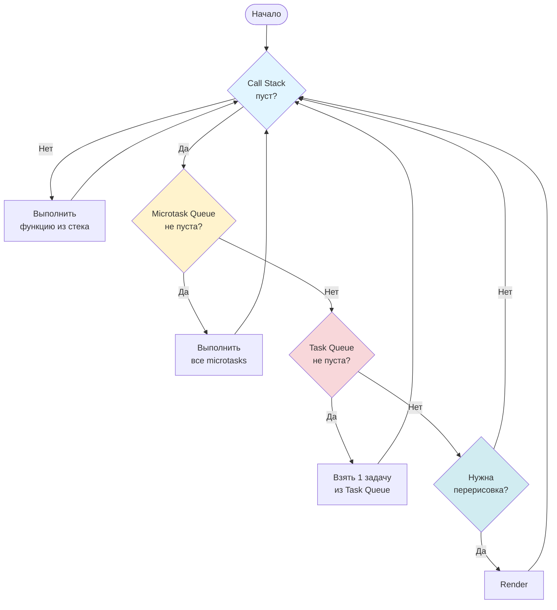

import { Sandpack } from '@codesandbox/sandpack-react'

## JavaScript: Мозги. Event Loop глубже

Event Loop – это сердце JavaScript, позволяющее ему быть неблокирующим, несмотря на однопоточную природу. В этом уроке мы копнем глубже и разберем, как он работает на самом деле.

### Схема Event Loop


```mermaid
flowchart TB
    Start([Начало]) --> CallStack{Call Stack<br/>пуст?}
    CallStack -->|Нет| Execute[Выполнить<br/>функцию из стека]
    Execute --> CallStack
    
    CallStack -->|Да| CheckMicro{Microtask Queue<br/>не пуста?}
    CheckMicro -->|Да| ExecMicro[Выполнить<br/>все microtasks]
    ExecMicro --> CallStack
    
    CheckMicro -->|Нет| CheckMacro{Task Queue<br/>не пуста?}
    CheckMacro -->|Да| ExecMacro[Взять 1 задачу<br/>из Task Queue]
    ExecMacro --> CallStack
    
    CheckMacro -->|Нет| Render{Нужна<br/>перерисовка?}
    Render -->|Да| DoRender[Render]
    Render -->|Нет| CallStack
    DoRender --> CallStack
    
    style CallStack fill:#e1f5ff
    style CheckMicro fill:#fff3cd
    style CheckMacro fill:#f8d7da
    style Render fill:#d1ecf1
```

### Что такое Event Loop и как он работает?

JavaScript работает в одном потоке, то есть выполняет код последовательно, строка за строкой. Но что происходит, когда нужно выполнить длительную операцию, например, запросить данные с сервера? Если бы JavaScript просто ждал завершения этой операции, интерфейс пользователя "завис" бы. Event Loop решает эту проблему.

Event Loop – это цикл, который постоянно проверяет, есть ли задачи в очереди задач (task queue). Если очередь не пуста, он берет первую задачу и помещает ее в стек вызовов (call stack) для выполнения.  Когда стек вызовов пуст, Event Loop снова проверяет очередь задач.

Ключевые компоненты:

*   **Call Stack (Стек вызовов):** Место, где выполняется JavaScript код.
*   **Task Queue (Очередь задач):** Место, где хранятся задачи, ожидающие выполнения. Задачи добавляются в очередь асинхронными операциями (например, `setTimeout`, `fetch`, обработчики событий).
*   **Event Loop:** Цикл, который следит за стеком вызовов и очередью задач.

Пример:

```javascript
console.log("Первый");

setTimeout(() => {
  console.log("Второй");
}, 0);

console.log("Третий");
```

Ожидаемый вывод:

```
Первый
Третий
Второй
```

Почему "Второй" выводится последним?

1.  `console.log("Первый")` помещается в стек вызовов, выполняется, и выводится "Первый".
2.  `setTimeout` помещается в стек вызовов, выполняется. Он добавляет функцию обратного вызова (callback) в очередь задач через 0 миллисекунд.
3.  `console.log("Третий")` помещается в стек вызовов, выполняется, и выводится "Третий".
4.  Стек вызовов пуст. Event Loop проверяет очередь задач. Там находится функция обратного вызова из `setTimeout`.
5.  Функция обратного вызова помещается в стек вызовов, выполняется, и выводится "Второй".

### Практические примеры

```javascript
// Пример с Promise
console.log("Начало");

const promise = new Promise((resolve) => {
  resolve("Promise выполнен");
});

promise.then((value) => {
  console.log(value);
});

console.log("Конец");

// Вывод:
// Начало
// Конец
// Promise выполнен
```

В этом примере `then` тоже добавляет задачу в очередь задач.

```javascript
// Пример с requestAnimationFrame
function animate() {
  console.log("Кадр анимации");
  requestAnimationFrame(animate);
}

requestAnimationFrame(animate);
```

`requestAnimationFrame` добавляет функцию обратного вызова в очередь задач для выполнения перед следующим перерисовыванием экрана.

### Жизненный пример

Event Loop лежит в основе любого современного JavaScript-приложения.

*   **Обработка пользовательского ввода:** Когда пользователь кликает по кнопке, браузер добавляет обработчик события клика в очередь задач. Event Loop обрабатывает этот обработчик, вызывая соответствующую функцию.
*   **Загрузка данных с сервера:** Когда вы делаете запрос к API, браузер добавляет функцию обратного вызова для обработки ответа в очередь задач. Event Loop обрабатывает эту функцию, когда данные загружены.
*   **Анимация:** `requestAnimationFrame` использует Event Loop для плавной анимации.

Фреймворки, такие как React, Angular и Vue.js, активно используют Event Loop для управления пользовательским интерфейсом и обработки асинхронных операций. Они полагаются на Event Loop, чтобы обновлять DOM, реагировать на действия пользователя и загружать данные без блокировки основного потока.

### Ключевые моменты

*   JavaScript – однопоточный язык, но Event Loop позволяет ему быть неблокирующим.
*   Event Loop постоянно проверяет стек вызовов и очередь задач.
*   Асинхронные операции добавляют задачи в очередь задач.
*   `setTimeout`, `Promises`, `fetch`, обработчики событий и `requestAnimationFrame` используют Event Loop.
*   Event Loop – основа для работы современных JavaScript-приложений и фреймворков.

### Практика

Попробуйте примеры в интерактивном редакторе:

<Sandpack
  template="vanilla"
  files={{
    '/index.js': `const app = document.querySelector('#app');

app.innerHTML = \`
  <h2>🔄 Event Loop в действии</h2>
  <div style="display: grid; gap: 10px; margin: 20px 0;">
    <button class="demo-btn" data-demo="basic">
      1️⃣ Базовый пример (sync vs async)
    </button>
    <button class="demo-btn" data-demo="promise">
      2️⃣ Promises (microtasks)
    </button>
    <button class="demo-btn" data-demo="mixed">
      3️⃣ Смешанные задачи
    </button>
    <button class="demo-btn" data-demo="complex">
      4️⃣ Сложный пример
    </button>
  </div>
  <div id="output" style="background: #f5f5f5; padding: 20px; border-radius: 8px; font-family: monospace; font-size: 13px; min-height: 250px;"></div>
\`;

const output = document.querySelector('#output');
let logIndex = 0;

function log(message, type = 'sync', delay = 0) {
  const colors = {
    sync: '#2196F3',
    async: '#FF9800',
    micro: '#4CAF50',
    info: '#666'
  };
  
  const labels = {
    sync: '🔵 Sync',
    async: '🟠 Macro',
    micro: '🟢 Micro',
    info: 'ℹ️'
  };
  
  setTimeout(() => {
    logIndex++;
    output.innerHTML += \`
      <div style="color: \${colors[type]}; margin: 5px 0; padding: 5px; border-left: 3px solid \${colors[type]}; background: white;">
        <span style="color: #999; font-size: 11px;">\${logIndex}.</span> 
        <strong>\${labels[type]}:</strong> \${message}
      </div>
    \`;
    console.log(\`\${logIndex}. \${labels[type]}: \${message}\`);
  }, delay);
}

function clearOutput() {
  output.innerHTML = '';
  logIndex = 0;
}

const demos = {
  basic: () => {
    clearOutput();
    output.innerHTML = '<h3 style="margin-top: 0; color: #333;">1️⃣ Базовый пример</h3>';
    
    log('console.log("Первый")', 'sync');
    
    setTimeout(() => {
      log('setTimeout 0ms', 'async', 10);
    }, 0);
    
    log('console.log("Третий")', 'sync');
    
    setTimeout(() => {
      output.innerHTML += '<div style="color: #999; font-style: italic; margin-top: 15px; padding: 10px; background: #fff;">💡 setTimeout попадает в Task Queue (macrotask), выполняется после синхронного кода</div>';
    }, 50);
  },
  
  promise: () => {
    clearOutput();
    output.innerHTML = '<h3 style="margin-top: 0; color: #333;">2️⃣ Promises (microtasks)</h3>';
    
    log('console.log("Начало")', 'sync');
    
    Promise.resolve().then(() => {
      log('Promise.then()', 'micro', 10);
    });
    
    log('console.log("Конец")', 'sync');
    
    setTimeout(() => {
      output.innerHTML += '<div style="color: #999; font-style: italic; margin-top: 15px; padding: 10px; background: #fff;">💡 Microtasks (Promise.then) выполняются раньше macrotasks (setTimeout)</div>';
    }, 50);
  },
  
  mixed: () => {
    clearOutput();
    output.innerHTML = '<h3 style="margin-top: 0; color: #333;">3️⃣ Смешанные задачи</h3>';
    
    log('console.log("Старт")', 'sync');
    
    setTimeout(() => {
      log('setTimeout 0ms', 'async', 20);
    }, 0);
    
    Promise.resolve().then(() => {
      log('Promise 1', 'micro', 10);
    }).then(() => {
      log('Promise 2 (chained)', 'micro', 15);
    });
    
    log('console.log("Финиш")', 'sync');
    
    setTimeout(() => {
      output.innerHTML += '<div style="color: #999; font-style: italic; margin-top: 15px; padding: 10px; background: #fff;">💡 Порядок: Sync → Microtasks → Macrotasks</div>';
    }, 100);
  },
  
  complex: () => {
    clearOutput();
    output.innerHTML = '<h3 style="margin-top: 0; color: #333;">4️⃣ Сложный пример</h3>';
    
    log('1: Синхронный код', 'sync');
    
    setTimeout(() => {
      log('2: setTimeout 0ms', 'async', 30);
      Promise.resolve().then(() => {
        log('5: Promise внутри setTimeout', 'micro', 40);
      });
    }, 0);
    
    Promise.resolve().then(() => {
      log('3: Promise 1', 'micro', 10);
      setTimeout(() => {
        log('6: setTimeout внутри Promise', 'async', 50);
      }, 0);
    });
    
    Promise.resolve().then(() => {
      log('4: Promise 2', 'micro', 20);
    });
    
    log('7: Последний синхронный', 'sync');
    
    setTimeout(() => {
      output.innerHTML += \`
        <div style="margin-top: 15px; padding: 15px; background: #e3f2fd; border-radius: 4px;">
          <h4 style="margin-top: 0;">📚 Правила Event Loop:</h4>
          <ol style="margin: 5px 0; padding-left: 20px; line-height: 1.8;">
            <li>Выполнить весь синхронный код</li>
            <li>Выполнить ВСЕ microtasks (Promises)</li>
            <li>Выполнить ОДНУ macrotask (setTimeout)</li>
            <li>Повторить с шага 2</li>
          </ol>
        </div>
      \`;
    }, 150);
  }
};

document.querySelectorAll('.demo-btn').forEach(btn => {
  btn.style.cssText = \`
    padding: 12px 20px;
    background: linear-gradient(135deg, #667eea 0%, #764ba2 100%);
    color: white;
    border: none;
    border-radius: 6px;
    cursor: pointer;
    font-size: 14px;
    text-align: left;
    transition: all 0.2s;
  \`;
  
  btn.addEventListener('mouseover', () => {
    btn.style.transform = 'scale(1.02)';
  });
  
  btn.addEventListener('mouseout', () => {
    btn.style.transform = 'scale(1)';
  });
  
  btn.addEventListener('click', () => {
    const demo = btn.getAttribute('data-demo');
    demos[demo]();
  });
});

output.innerHTML = '<div style="color: #666; text-align: center; padding: 60px 20px;">👆 Выберите пример Event Loop</div>';`
  }}
/>
