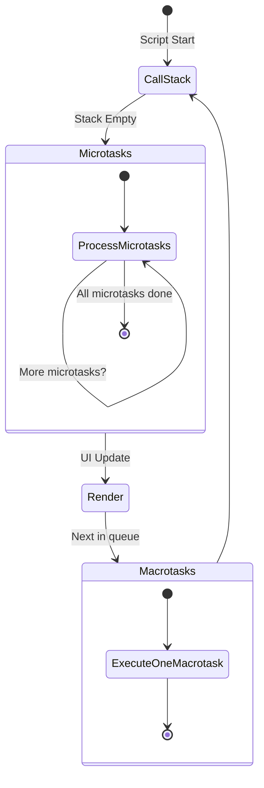

import { Sandpack } from '@codesandbox/sandpack-react'

## JavaScript: Microtasks vs Macrotasks. Погружение в асинхронность.

В JavaScript асинхронные операции играют ключевую роль. Чтобы понять, как JavaScript справляется с ними, важно разобраться в разнице между microtasks и macrotasks.

### Очередь выполнения (Event Loop)


*Цикл обработки задач: один макротаск -> все микротаски -> рендер.*

### Что такое Microtasks и Macrotasks?

JavaScript - однопоточный язык, но он умеет выполнять асинхронные операции.  Для этого существует механизм Event Loop (цикл событий), который управляет выполнением задач. Задачи делятся на два основных типа:

*   **Macrotasks (макрозадачи):** Это задачи, добавляемые в очередь задач (task queue). Примеры: `setTimeout`, `setInterval`, обработка событий (click, scroll), сетевые запросы (fetch, XMLHttpRequest).
*   **Microtasks (микрозадачи):** Это задачи, добавляемые в очередь микрозадач (microtask queue). Примеры: `Promise.then`, `MutationObserver`, `process.nextTick` (в Node.js).

Главное отличие в порядке выполнения: Event Loop сначала выполняет текущий macrotask, затем все доступные microtasks, и только потом переходит к следующему macrotask.

### Пример кода

```javascript
console.log("Начало");

setTimeout(() => {
  console.log("Macrotask: setTimeout");
}, 0);

Promise.resolve().then(() => {
  console.log("Microtask: Promise.then");
});

console.log("Конец");

// Вывод:
// Начало
// Конец
// Microtask: Promise.then
// Macrotask: setTimeout
```

В этом примере сначала выполняются синхронные операции ("Начало" и "Конец"). Затем, перед следующим macrotask, выполняются все microtasks, в данном случае `Promise.then`.  `setTimeout` добавляется в очередь macrotasks и выполняется позже.

### Еще один пример

```javascript
console.log("Начало");

setTimeout(() => {
  console.log("Macrotask 1");
  Promise.resolve().then(() => {
    console.log("Microtask внутри Macrotask 1");
  });
}, 0);

setTimeout(() => {
  console.log("Macrotask 2");
}, 0);

Promise.resolve().then(() => {
  console.log("Microtask 1");
  return Promise.resolve();
}).then(() => {
  console.log("Microtask 2");
});

console.log("Конец");

// Вывод:
// Начало
// Конец
// Microtask 1
// Microtask 2
// Macrotask 1
// Microtask внутри Macrotask 1
// Macrotask 2
```

Этот пример демонстрирует, что microtasks, созданные внутри macrotasks, выполняются после завершения текущего macrotask, но до начала следующего.

### Жизненный пример

В реальных веб-приложениях понимание разницы между microtasks и macrotasks важно для:

*   **Оптимизации производительности:**  Например, если у вас есть большое количество операций, которые нужно выполнить после обновления DOM, лучше использовать `Promise.then` (microtask), чтобы они выполнились сразу после обновления и не задерживали отрисовку следующего кадра.
*   **React:** React использует пакетные обновления. Изменения состояния (setState) часто планируются как microtasks, чтобы гарантировать, что все обновления состояния будут применены до того, как браузер перерисует DOM. Это помогает избежать ненужных перерисовок.
*   **Angular:** Angular использует Zone.js для отслеживания асинхронных операций. Zone.js также опирается на концепцию microtasks и macrotasks для управления жизненным циклом компонентов и обнаружения изменений.
*   **Vue.js:** Vue.js также использует microtasks для асинхронного обновления DOM.

### Ключевые моменты

*   Macrotasks (setTimeout, setInterval, обработчики событий, сетевые запросы) добавляются в очередь задач (task queue).
*   Microtasks (Promise.then, MutationObserver) добавляются в очередь микрозадач (microtask queue).
*   Event Loop сначала выполняет текущий macrotask.
*   Затем Event Loop выполняет все microtasks, накопившиеся в очереди.
*   Только после этого Event Loop переходит к следующему macrotask.
*   Знание разницы между microtasks и macrotasks помогает оптимизировать производительность и понимать, как работают популярные JavaScript фреймворки.

### Практика

Попробуйте примеры в интерактивном редакторе:

<Sandpack
  template="vanilla"
  files={{
    '/index.js': `index.js
// Демонстрация Microtasks vs Macrotasks

document.body.style.fontFamily = 'Arial, sans-serif';
document.body.style.padding = '20px';
document.body.style.lineHeight = '1.6';

const output = document.createElement('div');
output.id = 'output';
output.style.backgroundColor = '#f5f5f5';
output.style.padding = '20px';
output.style.borderRadius = '8px';
output.style.marginTop = '20px';
document.body.appendChild(output);

const title = document.createElement('h2');
title.textContent = 'Порядок выполнения Microtasks vs Macrotasks';
document.body.appendChild(title);

const description = document.createElement('p');
description.textContent = 'Смотрите порядок выполнения в выводе ниже:';
document.body.appendChild(description);

const logContainer = document.createElement('div');
logContainer.style.marginTop = '20px';
document.body.appendChild(logContainer);

let stepNumber = 1;

function log(message, type = 'sync') {
  const colors = {
    sync: '#000',
    micro: '#2196F3',
    macro: '#FF9800'
  };
  
  const emoji = {
    sync: '⚡',
    micro: '🔵',
    macro: '🟠'
  };
  
  const p = document.createElement('p');
  p.innerHTML = \`<strong>\${stepNumber++}.</strong> \${emoji[type]} <span style="color: \${colors[type]}">\${message}</span>\`;
  p.style.margin = '5px 0';
  logContainer.appendChild(p);
  
  console.log(\`[\${type.toUpperCase()}] \${message}\`);
}

// === ПРИМЕР 1: Базовый ===
log('🚀 Начало скрипта', 'sync');

setTimeout(() => {
  log('Macrotask: setTimeout(0)', 'macro');
}, 0);

Promise.resolve().then(() => {
  log('Microtask: Promise.then #1', 'micro');
});

Promise.resolve().then(() => {
  log('Microtask: Promise.then #2', 'micro');
});

log('Конец синхронного кода', 'sync');

// === ПРИМЕР 2: Вложенные задачи ===
setTimeout(() => {
  log('Macrotask: setTimeout #2', 'macro');
  
  Promise.resolve().then(() => {
    log('Microtask внутри Macrotask', 'micro');
  });
}, 0);

// Добавляем легенду
setTimeout(() => {
  const legend = document.createElement('div');
  legend.innerHTML = \`
    <h3>Легенда:</h3>
    <p>⚡ <strong>Синхронный код</strong> - выполняется сразу</p>
    <p>🔵 <strong style="color: #2196F3">Microtask</strong> - Promise.then, выполняется после синхронного кода, ДО macrotasks</p>
    <p>🟠 <strong style="color: #FF9800">Macrotask</strong> - setTimeout, выполняется в последнюю очередь</p>
    <hr>
    <p><strong>Порядок Event Loop:</strong></p>
    <ol>
      <li>Выполнить весь синхронный код</li>
      <li>Выполнить ВСЕ microtasks</li>
      <li>Выполнить ОДИН macrotask</li>
      <li>Повторить с шага 2</li>
    </ol>
  \`;
  legend.style.backgroundColor = '#e3f2fd';
  legend.style.padding = '15px';
  legend.style.borderRadius = '8px';
  legend.style.marginTop = '20px';
  document.body.appendChild(legend);
}, 100);`
  }}
/>
