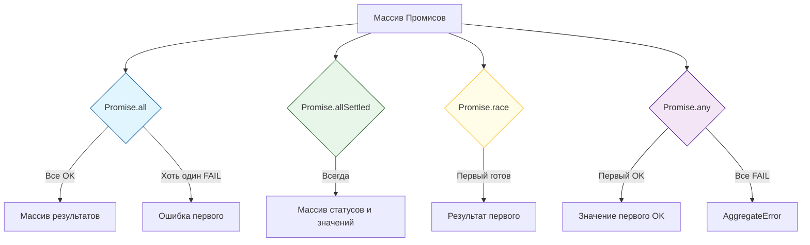

import { Sandpack } from '@codesandbox/sandpack-react'
## JavaScript: Мозги. Урок: Promise Combinators

Promise Combinators – это мощные инструменты JavaScript, позволяющие эффективно управлять несколькими промисами одновременно. Они значительно упрощают асинхронный код, делая его более читаемым и поддерживаемым.

### Визуализация стратегий слияния


*Различные способы обработки группы асинхронных операций.*

### Что такое Promise Combinators?

Promise Combinators – это статические методы класса `Promise`, которые принимают массив промисов и возвращают один промис, представляющий результат обработки этого массива.  Они позволяют выполнять операции над множеством асинхронных задач параллельно или последовательно, в зависимости от выбранного комбинатора.

#### Основные комбинаторы:

*   **`Promise.all(promises)`**: Возвращает промис, который разрешается, когда *все* промисы из массива `promises` успешно разрешились. В случае, если хотя бы один промис отклоняется, возвращаемый промис также отклоняется с причиной отклонения этого промиса.

    ```javascript
    const promise1 = Promise.resolve(1);
    const promise2 = new Promise((resolve) => setTimeout(() => resolve(2), 100));
    const promise3 = Promise.resolve(3);

    Promise.all([promise1, promise2, promise3])
      .then((values) => {
        console.log(values); // [1, 2, 3]
      })
      .catch((error) => {
        console.error(error);
      });
    ```

*   **`Promise.allSettled(promises)`**: Возвращает промис, который разрешается, когда *все* промисы из массива `promises` либо разрешились, либо отклонились. Результатом является массив объектов, каждый из которых описывает статус соответствующего промиса (`status: 'fulfilled'` или `status: 'rejected'`) и его значение (`value`) или причину отклонения (`reason`).

    ```javascript
    const promise1 = Promise.resolve(1);
    const promise2 = Promise.reject('Ошибка!');
    const promise3 = new Promise((resolve) => setTimeout(() => resolve(3), 100));

    Promise.allSettled([promise1, promise2, promise3])
      .then((results) => {
        console.log(results);
        // [
        //   { status: 'fulfilled', value: 1 },
        //   { status: 'rejected', reason: 'Ошибка!' },
        //   { status: 'fulfilled', value: 3 }
        // ]
      });
    ```

*   **`Promise.race(promises)`**: Возвращает промис, который разрешается или отклоняется в зависимости от того, какой из промисов в массиве `promises` разрешится или отклонится *первым*.

    ```javascript
    const promise1 = new Promise((resolve) => setTimeout(() => resolve(1), 500));
    const promise2 = new Promise((resolve) => setTimeout(() => resolve(2), 100));

    Promise.race([promise1, promise2])
      .then((value) => {
        console.log(value); // 2 (потому что promise2 разрешился первым)
      });
    ```

*   **`Promise.any(promises)`**: Возвращает промис, который разрешается, как только *один* из промисов в массиве `promises` успешно разрешится. Если все промисы отклоняются, возвращаемый промис отклоняется с ошибкой `AggregateError`, содержащей причины отклонения всех промисов.

    ```javascript
    const promise1 = Promise.reject('Ошибка 1');
    const promise2 = new Promise((resolve, reject) => setTimeout(() => reject('Ошибка 2'), 100));
    const promise3 = Promise.resolve(3);

    Promise.any([promise1, promise2, promise3])
      .then((value) => {
        console.log(value); // 3 (потому что promise3 разрешился)
      })
      .catch((error) => {
          console.log(error);
      });
    ```

### Жизненный пример

Представьте себе, что вам нужно загрузить данные с нескольких API и отобразить их на странице.

```javascript
async function fetchData() {
  const urls = [
    '/api/users',
    '/api/posts',
    '/api/comments'
  ];

  try {
    const responses = await Promise.all(urls.map(url => fetch(url).then(res => res.json())));
    const users = responses[0];
    const posts = responses[1];
    const comments = responses[2];

    // Отображение данных на странице...
    console.log('Данные загружены:', { users, posts, comments });

  } catch (error) {
    console.error('Ошибка при загрузке данных:', error);
  }
}

fetchData();
```

В этом примере `Promise.all` гарантирует, что все запросы к API будут выполнены параллельно, и только после этого данные будут обработаны и отображены. Если хотя бы один запрос завершится неудачей, вся операция будет прервана, и будет выведено сообщение об ошибке.  Такой подход часто применяется в веб-разработке для одновременной загрузки нескольких ресурсов, что значительно ускоряет загрузку страницы. Фреймворки и библиотеки, такие как React, Angular и Vue.js, активно используют Promise Combinators для управления асинхронными операциями, такими как запросы к серверу и обновление пользовательского интерфейса.

### Ключевые моменты

*   Promise Combinators позволяют управлять несколькими промисами одновременно.
*   `Promise.all` ожидает разрешения всех промисов.
*   `Promise.allSettled` ожидает завершения всех промисов (независимо от статуса).
*   `Promise.race` разрешается или отклоняется в зависимости от первого разрешенного или отклоненного промиса.
*   `Promise.any` разрешается при первом успешно разрешенном промисе.
*   Использование Promise Combinators делает асинхронный код более читаемым и управляемым.

### Практика

Попробуйте примеры в интерактивном редакторе:

<Sandpack template="vanilla">

```js index.js
const app = document.getElementById('app');

app.innerHTML = `
  <div class="controls">
    <h2>⚙️ Настройте промисы</h2>
    <div class="promise-config">
      <div class="promise-item">
        <label>Promise 1:</label>
        <select id="p1-status">
          <option value="resolve">✅ Resolve</option>
          <option value="reject">❌ Reject</option>
        </select>
        <input type="number" id="p1-delay" value="1000" min="100" max="5000" step="100">
        <span>ms</span>
      </div>
      
      <div class="promise-item">
        <label>Promise 2:</label>
        <select id="p2-status">
          <option value="resolve">✅ Resolve</option>
          <option value="reject" selected>❌ Reject</option>
        </select>
        <input type="number" id="p2-delay" value="1500" min="100" max="5000" step="100">
        <span>ms</span>
      </div>
      
      <div class="promise-item">
        <label>Promise 3:</label>
        <select id="p3-status">
          <option value="resolve">✅ Resolve</option>
          <option value="reject">❌ Reject</option>
        </select>
        <input type="number" id="p3-delay" value="800" min="100" max="5000" step="100">
        <span>ms</span>
      </div>
    </div>
  </div>
  
  <div class="combinators">
    <button onclick="testAll()" class="btn-all">Promise.all()</button>
    <button onclick="testAllSettled()" class="btn-allsettled">Promise.allSettled()</button>
    <button onclick="testRace()" class="btn-race">Promise.race()</button>
    <button onclick="testAny()" class="btn-any">Promise.any()</button>
  </div>
  
  <div id="result"></div>
`;

// Создание промиса с задержкой
function createPromise(id, shouldResolve, delay) {
  return new Promise((resolve, reject) => {
    setTimeout(() => {
      if (shouldResolve) {
        resolve(`Data ${id}`);
      } else {
        reject(`Error ${id}`);
      }
    }, delay);
  });
}

// Получение настроек промисов
function getPromises() {
  return [
    createPromise(
      1, 
      document.getElementById('p1-status').value === 'resolve',
      parseInt(document.getElementById('p1-delay').value)
    ),
    createPromise(
      2, 
      document.getElementById('p2-status').value === 'resolve',
      parseInt(document.getElementById('p2-delay').value)
    ),
    createPromise(
      3, 
      document.getElementById('p3-status').value === 'resolve',
      parseInt(document.getElementById('p3-delay').value)
    )
  ];
}

// Отображение результата
function showResult(title, result, isError = false) {
  const resultDiv = document.getElementById('result');
  const className = isError ? 'error' : 'success';
  
  resultDiv.innerHTML = `
    <h3>${title}</h3>
    <div class="${className}">
      <pre>${JSON.stringify(result, null, 2)}</pre>
    </div>
  `;
  
  console.log(title, result);
}

// Promise.all
window.testAll = async () => {
  const start = Date.now();
  showResult('⏳ Promise.all() выполняется...', 'Ожидание...');
  
  try {
    const results = await Promise.all(getPromises());
    showResult(
      `✅ Promise.all() успешно (${Date.now() - start}ms)`,
      results
    );
  } catch (error) {
    showResult(
      `❌ Promise.all() отклонен (${Date.now() - start}ms)`,
      { error: error.toString() },
      true
    );
  }
};

// Promise.allSettled
window.testAllSettled = async () => {
  const start = Date.now();
  showResult('⏳ Promise.allSettled() выполняется...', 'Ожидание...');
  
  const results = await Promise.allSettled(getPromises());
  showResult(
    `✅ Promise.allSettled() завершен (${Date.now() - start}ms)`,
    results
  );
};

// Promise.race
window.testRace = async () => {
  const start = Date.now();
  showResult('⏳ Promise.race() выполняется...', 'Ожидание...');
  
  try {
    const result = await Promise.race(getPromises());
    showResult(
      `🏁 Promise.race() успешно (${Date.now() - start}ms)`,
      { winner: result }
    );
  } catch (error) {
    showResult(
      `🏁 Promise.race() отклонен (${Date.now() - start}ms)`,
      { error: error.toString() },
      true
    );
  }
};

// Promise.any
window.testAny = async () => {
  const start = Date.now();
  showResult('⏳ Promise.any() выполняется...', 'Ожидание...');
  
  try {
    const result = await Promise.any(getPromises());
    showResult(
      `✨ Promise.any() успешно (${Date.now() - start}ms)`,
      { firstSuccess: result }
    );
  } catch (error) {
    showResult(
      `❌ Promise.any() отклонен (${Date.now() - start}ms)`,
      { error: error.toString(), errors: error.errors },
      true
    );
  }
};

console.log('💡 Настройте промисы и нажмите кнопку комбинатора!');
```

```css styles.css
body {
  font-family: 'Segoe UI', Tahoma, Geneva, Verdana, sans-serif;
  padding: 20px;
  background: linear-gradient(135deg, #667eea 0%, #764ba2 100%);
  margin: 0;
}

#app {
  max-width: 800px;
  margin: 0 auto;
}

.controls {
  background: white;
  border-radius: 12px;
  padding: 24px;
  margin-bottom: 20px;
  box-shadow: 0 4px 8px rgba(0,0,0,0.1);
}

.controls h2 {
  margin: 0 0 20px 0;
  color: #333;
}

.promise-config {
  display: flex;
  flex-direction: column;
  gap: 12px;
}

.promise-item {
  display: flex;
  align-items: center;
  gap: 12px;
  padding: 12px;
  background: #f8f9fa;
  border-radius: 8px;
}

.promise-item label {
  min-width: 90px;
  font-weight: bold;
  color: #555;
}

select, input {
  padding: 8px 12px;
  border: 2px solid #e0e0e0;
  border-radius: 6px;
  font-size: 14px;
}

input[type="number"] {
  width: 80px;
}

.combinators {
  display: grid;
  grid-template-columns: repeat(2, 1fr);
  gap: 12px;
  margin-bottom: 20px;
}

button {
  padding: 16px 24px;
  border: none;
  border-radius: 10px;
  font-size: 16px;
  font-weight: bold;
  color: white;
  cursor: pointer;
  transition: transform 0.2s, box-shadow 0.2s;
}

button:hover {
  transform: translateY(-2px);
  box-shadow: 0 6px 12px rgba(0,0,0,0.2);
}

button:active {
  transform: translateY(0);
}

.btn-all {
  background: linear-gradient(135deg, #667eea 0%, #764ba2 100%);
}

.btn-allsettled {
  background: linear-gradient(135deg, #f093fb 0%, #f5576c 100%);
}

.btn-race {
  background: linear-gradient(135deg, #4facfe 0%, #00f2fe 100%);
}

.btn-any {
  background: linear-gradient(135deg, #43e97b 0%, #38f9d7 100%);
}

#result {
  background: white;
  border-radius: 12px;
  padding: 24px;
  min-height: 200px;
  box-shadow: 0 4px 8px rgba(0,0,0,0.1);
}

#result h3 {
  margin: 0 0 16px 0;
  color: #333;
}

.success {
  background: #e8f5e9;
  border-left: 4px solid #4caf50;
  padding: 16px;
  border-radius: 8px;
}

.error {
  background: #ffebee;
  border-left: 4px solid #f44336;
  padding: 16px;
  border-radius: 8px;
}

pre {
  margin: 0;
  font-family: 'Courier New', monospace;
  font-size: 14px;
  overflow-x: auto;
}
```

</Sandpack>
