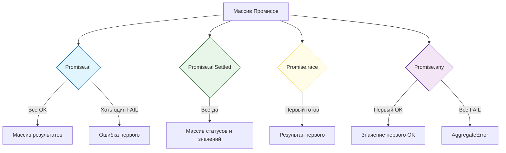

## JavaScript: Мозги. Урок: Promise Combinators

Promise Combinators – это мощные инструменты JavaScript, позволяющие эффективно управлять несколькими промисами одновременно. Они значительно упрощают асинхронный код, делая его более читаемым и поддерживаемым.

### Визуализация стратегий слияния


*Различные способы обработки группы асинхронных операций.*

### Что такое Promise Combinators?

Promise Combinators – это статические методы класса `Promise`, которые принимают массив промисов и возвращают один промис, представляющий результат обработки этого массива.  Они позволяют выполнять операции над множеством асинхронных задач параллельно или последовательно, в зависимости от выбранного комбинатора.

#### Основные комбинаторы:

*   **`Promise.all(promises)`**: Возвращает промис, который разрешается, когда *все* промисы из массива `promises` успешно разрешились. В случае, если хотя бы один промис отклоняется, возвращаемый промис также отклоняется с причиной отклонения этого промиса.

    ```javascript
    const promise1 = Promise.resolve(1);
    const promise2 = new Promise((resolve) => setTimeout(() => resolve(2), 100));
    const promise3 = Promise.resolve(3);

    Promise.all([promise1, promise2, promise3])
      .then((values) => {
        console.log(values); // [1, 2, 3]
      })
      .catch((error) => {
        console.error(error);
      });
    ```

*   **`Promise.allSettled(promises)`**: Возвращает промис, который разрешается, когда *все* промисы из массива `promises` либо разрешились, либо отклонились. Результатом является массив объектов, каждый из которых описывает статус соответствующего промиса (`status: 'fulfilled'` или `status: 'rejected'`) и его значение (`value`) или причину отклонения (`reason`).

    ```javascript
    const promise1 = Promise.resolve(1);
    const promise2 = Promise.reject('Ошибка!');
    const promise3 = new Promise((resolve) => setTimeout(() => resolve(3), 100));

    Promise.allSettled([promise1, promise2, promise3])
      .then((results) => {
        console.log(results);
        // [
        //   { status: 'fulfilled', value: 1 },
        //   { status: 'rejected', reason: 'Ошибка!' },
        //   { status: 'fulfilled', value: 3 }
        // ]
      });
    ```

*   **`Promise.race(promises)`**: Возвращает промис, который разрешается или отклоняется в зависимости от того, какой из промисов в массиве `promises` разрешится или отклонится *первым*.

    ```javascript
    const promise1 = new Promise((resolve) => setTimeout(() => resolve(1), 500));
    const promise2 = new Promise((resolve) => setTimeout(() => resolve(2), 100));

    Promise.race([promise1, promise2])
      .then((value) => {
        console.log(value); // 2 (потому что promise2 разрешился первым)
      });
    ```

*   **`Promise.any(promises)`**: Возвращает промис, который разрешается, как только *один* из промисов в массиве `promises` успешно разрешится. Если все промисы отклоняются, возвращаемый промис отклоняется с ошибкой `AggregateError`, содержащей причины отклонения всех промисов.

    ```javascript
    const promise1 = Promise.reject('Ошибка 1');
    const promise2 = new Promise((resolve, reject) => setTimeout(() => reject('Ошибка 2'), 100));
    const promise3 = Promise.resolve(3);

    Promise.any([promise1, promise2, promise3])
      .then((value) => {
        console.log(value); // 3 (потому что promise3 разрешился)
      })
      .catch((error) => {
          console.log(error);
      });
    ```

### Жизненный пример

Представьте себе, что вам нужно загрузить данные с нескольких API и отобразить их на странице.

```javascript
async function fetchData() {
  const urls = [
    '/api/users',
    '/api/posts',
    '/api/comments'
  ];

  try {
    const responses = await Promise.all(urls.map(url => fetch(url).then(res => res.json())));
    const users = responses[0];
    const posts = responses[1];
    const comments = responses[2];

    // Отображение данных на странице...
    console.log('Данные загружены:', { users, posts, comments });

  } catch (error) {
    console.error('Ошибка при загрузке данных:', error);
  }
}

fetchData();
```

В этом примере `Promise.all` гарантирует, что все запросы к API будут выполнены параллельно, и только после этого данные будут обработаны и отображены. Если хотя бы один запрос завершится неудачей, вся операция будет прервана, и будет выведено сообщение об ошибке.  Такой подход часто применяется в веб-разработке для одновременной загрузки нескольких ресурсов, что значительно ускоряет загрузку страницы. Фреймворки и библиотеки, такие как React, Angular и Vue.js, активно используют Promise Combinators для управления асинхронными операциями, такими как запросы к серверу и обновление пользовательского интерфейса.

### Ключевые моменты

*   Promise Combinators позволяют управлять несколькими промисами одновременно.
*   `Promise.all` ожидает разрешения всех промисов.
*   `Promise.allSettled` ожидает завершения всех промисов (независимо от статуса).
*   `Promise.race` разрешается или отклоняется в зависимости от первого разрешенного или отклоненного промиса.
*   `Promise.any` разрешается при первом успешно разрешенном промисе.
*   Использование Promise Combinators делает асинхронный код более читаемым и управляемым.

### Практика

Попробуйте примеры в интерактивном редакторе:

<Playground template="vanilla" />
