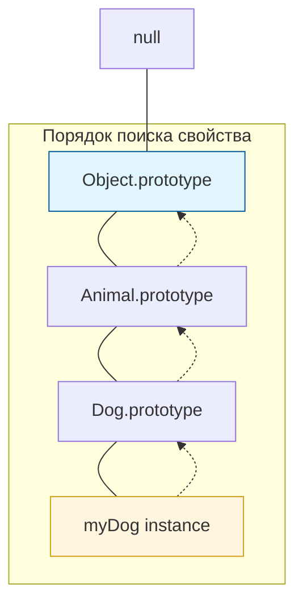

```markdown
# JavaScript: Мозги. Урок: Прототипное наследование

Прототипное наследование – это ключевой механизм в JavaScript, позволяющий объектам наследовать свойства и методы от других объектов. Понимание этого механизма – фундамент для эффективной работы с JavaScript.

### Схема Prototype Chain


*Цепочка прототипов: если свойства нет в объекте, JS ищет его выше по иерархии.*

## Что такое прототипное наследование?

В JavaScript каждый объект имеет прототип. Этот прототип – тоже объект. Когда вы обращаетесь к свойству объекта, JavaScript сначала ищет это свойство непосредственно в самом объекте. Если его там нет, он ищет это свойство в прототипе объекта, затем в прототипе прототипа и так далее, пока не достигнет `null`. Этот процесс называется "прототипной цепочкой".

Представьте себе, что прототип - это родитель, а объект - ребенок. Ребенок наследует черты характера и привычки от родителя.

## Практические примеры кода

### Создание объекта и его прототипа

```javascript
// Создаем объект animal
const animal = {
  name: 'Animal',
  eat: function() {
    console.log('Animal is eating');
  }
};

// Создаем объект dog, который наследует от animal
const dog = Object.create(animal);
dog.name = 'Dog'; // Переопределяем свойство name для dog
dog.bark = function() {
  console.log('Woof!');
};

// Теперь dog имеет свойства и методы от animal и свои собственные
console.log(dog.name); // Output: Dog
dog.eat(); // Output: Animal is eating
dog.bark(); // Output: Woof!
```

### Изменение прототипа

```javascript
// Добавим метод в прототип animal
animal.sleep = function() {
  console.log('Animal is sleeping');
};

// Теперь dog тоже имеет метод sleep, даже если мы его не определяли напрямую
dog.sleep(); // Output: Animal is sleeping

// Проверка прототипа
console.log(Object.getPrototypeOf(dog) === animal); // Output: true
```

### Использование конструкторов

```javascript
// Функция-конструктор Animal
function Animal(name) {
  this.name = name;
}

Animal.prototype.eat = function() {
  console.log(this.name + ' is eating');
};

// Создаем объект dog с помощью конструктора
const cat = new Animal('Cat');
cat.eat(); // Output: Cat is eating

// Добавляем метод в прототип Animal после создания объекта cat
Animal.prototype.meow = function() {
    console.log("Meow!")
}

cat.meow(); // Output: Meow!
```

## Жизненный пример

Прототипное наследование активно используется во многих JavaScript-фреймворках и библиотеках, таких как React, Angular и Vue.js. Например, компоненты в React часто наследуют методы и свойства от базового класса `React.Component`. Это позволяет повторно использовать код и создавать более структурированные приложения.

В DOM API, элементы наследуют свойства и методы от `HTMLElement`, который в свою очередь наследует от `Element`, а `Element` от `Node`.  Это значит, что каждый DOM элемент, например `<p>` или `<div>`, имеет доступ к общим методам, таким как `appendChild`, `addEventListener` и другим.

## Ключевые моменты

*   Каждый объект в JavaScript имеет прототип.
*   Прототип - это тоже объект.
*   Свойства и методы ищутся в прототипной цепочке.
*   Можно изменять прототипы существующих объектов.
*   Конструкторы используются для создания объектов с общим прототипом.
*   Прототипное наследование – важный механизм для повторного использования кода и создания иерархии объектов.
```
### Практика

Попробуйте примеры в интерактивном редакторе:

<Sandpack
  template="vanilla"
  files={{
    '/index.js': `// Создаем базовый объект Animal
const Animal = {
  type: 'Animal',
  eat() {
    return \`\${this.name} is eating\`;
  },
  sleep() {
    return \`\${this.name} is sleeping\`;
  }
};

// Создаем Dog, наследующий от Animal
const Dog = Object.create(Animal);
Dog.type = 'Dog';
Dog.bark = function() {
  return \`\${this.name} says Woof!\`;
};

// Создаем конкретный экземпляр
const buddy = Object.create(Dog);
buddy.name = 'Buddy';
buddy.age = 3;

const app = document.getElementById('app');

app.innerHTML = \`
  <div class="hierarchy">
    <h2>🏗️ Иерархия прототипов</h2>
    <div class="chain">
      <div class="proto-box animal">
        <h3>Animal (базовый)</h3>
        <p>type, eat(), sleep()</p>
      </div>
      <div class="arrow">↓ наследует</div>
      <div class="proto-box dog">
        <h3>Dog</h3>
        <p>+ bark()</p>
      </div>
      <div class="arrow">↓ наследует</div>
      <div class="proto-box instance">
        <h3>buddy</h3>
        <p>name: "Buddy", age: 3</p>
      </div>
    </div>
  </div>
  
  <div class="section">
    <h2>🐕 Buddy может:</h2>
    <div id="buddyMethods"></div>
  </div>
  
  <div class="section">
    <h2>🧪 Эксперименты</h2>
    <button onclick="addMethodToAnimal()">Добавить метод в Animal</button>
    <button onclick="addMethodToDog()">Добавить метод в Dog</button>
    <button onclick="addMethodToBuddy()">Добавить метод в buddy</button>
    <button onclick="showPrototypeChain()">Показать цепочку поиска</button>
  </div>
  
  <div id="result"></div>
\`;

// Показываем методы Buddy
updateBuddyMethods();

function updateBuddyMethods() {
  const methods = document.getElementById('buddyMethods');
  const methodsList = [];
  
  // Собственные свойства
  methodsList.push(\`<div class="method own">name: "\${buddy.name}" (собственное)</div>\`);
  methodsList.push(\`<div class="method own">age: \${buddy.age} (собственное)</div>\`);
  
  // Методы из прототипов
  if (buddy.bark) {
    methodsList.push(\`<div class="method dog">bark(): \${buddy.bark()} (из Dog)</div>\`);
  }
  if (buddy.eat) {
    methodsList.push(\`<div class="method animal">eat(): \${buddy.eat()} (из Animal)</div>\`);
  }
  if (buddy.sleep) {
    methodsList.push(\`<div class="method animal">sleep(): \${buddy.sleep()} (из Animal)</div>\`);
  }
  
  methods.innerHTML = methodsList.join('');
}

window.addMethodToAnimal = () => {
  Animal.breathe = function() {
    return \`\${this.name} is breathing\`;
  };
  
  showResult('➕ Метод breathe() добавлен в Animal!', {
    'buddy.breathe()': buddy.breathe(),
    'Эффект': 'Все объекты в цепочке получили доступ к новому методу!',
    'Почему?': 'buddy → Dog → Animal (поиск по цепочке)'
  });
  
  updateBuddyMethods();
  console.log('Добавлен breathe() в Animal');
};

window.addMethodToDog = () => {
  Dog.wagTail = function() {
    return \`\${this.name} is wagging tail\`;
  };
  
  showResult('➕ Метод wagTail() добавлен в Dog!', {
    'buddy.wagTail()': buddy.wagTail(),
    'Доступен buddy?': 'Да',
    'Доступен Animal?': 'Нет (Animal выше в цепочке)'
  });
  
  updateBuddyMethods();
  console.log('Добавлен wagTail() в Dog');
};

window.addMethodToBuddy = () => {
  buddy.playFetch = function() {
    return \`\${this.name} is playing fetch!\`;
  };
  
  showResult('➕ Метод playFetch() добавлен в buddy!', {
    'buddy.playFetch()': buddy.playFetch(),
    'Где метод?': 'Только в buddy (не в прототипе)',
    'Другие объекты?': 'Не имеют доступа'
  });
  
  updateBuddyMethods();
  console.log('Добавлен playFetch() в buddy');
};

window.showPrototypeChain = () => {
  const searchDemo = [
    { step: 1, location: 'buddy', found: 'name, age' },
    { step: 2, location: 'Dog (прототип buddy)', found: 'bark()' },
    { step: 3, location: 'Animal (прототип Dog)', found: 'eat(), sleep()' },
    { step: 4, location: 'Object.prototype', found: 'toString(), valueOf()...' },
    { step: 5, location: 'null', found: 'конец цепочки' }
  ];
  
  showResult('⛓️ Как JavaScript ищет свойство "eat":', {
    'Шаги поиска': searchDemo,
    'Принцип': 'Поиск идет от объекта вверх по цепочке прототипов',
    'Остановка': 'При первом найденном совпадении или при достижении null'
  });
  
  console.log('Цепочка прототипов:', {
    buddy: Object.getPrototypeOf(buddy) === Dog,
    Dog: Object.getPrototypeOf(Dog) === Animal,
    Animal: Object.getPrototypeOf(Animal) === Object.prototype
  });
};

function showResult(title, data) {
  const resultDiv = document.getElementById('result');
  resultDiv.innerHTML = \`
    <h3>\${title}</h3>
    <pre>\${JSON.stringify(data, null, 2)}</pre>
  \`;
}

console.log('💡 Экспериментируйте с прототипным наследованием!');
\`\`\`

\`\`\`css styles.css
body {
  font-family: 'Segoe UI', Tahoma, Geneva, Verdana, sans-serif;
  padding: 20px;
  background: linear-gradient(135deg, #667eea 0%, #764ba2 100%);
  margin: 0;
}

#app {
  max-width: 800px;
  margin: 0 auto;
}

.hierarchy, .section, #result {
  background: white;
  border-radius: 12px;
  padding: 24px;
  margin-bottom: 20px;
  box-shadow: 0 4px 8px rgba(0,0,0,0.1);
}

h2, h3 {
  margin: 0 0 16px 0;
  color: #333;
}

.chain {
  display: flex;
  flex-direction: column;
  align-items: center;
  gap: 8px;
}

.proto-box {
  width: 100%;
  max-width: 400px;
  padding: 20px;
  border-radius: 10px;
  text-align: center;
  box-shadow: 0 2px 6px rgba(0,0,0,0.1);
}

.proto-box.animal {
  background: linear-gradient(135deg, #a8edea 0%, #fed6e3 100%);
}

.proto-box.dog {
  background: linear-gradient(135deg, #fbc2eb 0%, #a6c1ee 100%);
}

.proto-box.instance {
  background: linear-gradient(135deg, #ffecd2 0%, #fcb69f 100%);
}

.proto-box h3 {
  margin: 0 0 8px 0;
  font-size: 1.3em;
}

.proto-box p {
  margin: 0;
  color: #555;
  font-size: 0.95em;
}

.arrow {
  font-size: 1.5em;
  font-weight: bold;
  color: #667eea;
}

#buddyMethods {
  display: flex;
  flex-direction: column;
  gap: 8px;
}

.method {
  padding: 12px;
  border-radius: 8px;
  border-left: 4px solid;
  background: #f8f9fa;
}

.method.own {
  border-color: #ff9800;
  background: #fff3e0;
}

.method.dog {
  border-color: #2196f3;
  background: #e3f2fd;
}

.method.animal {
  border-color: #4caf50;
  background: #e8f5e9;
}

button {
  background: linear-gradient(135deg, #667eea 0%, #764ba2 100%);
  color: white;
  border: none;
  padding: 12px 18px;
  border-radius: 8px;
  font-size: 14px;
  font-weight: bold;
  cursor: pointer;
  margin-right: 8px;
  margin-bottom: 8px;
  transition: transform 0.2s;
}

button:hover {
  transform: scale(1.05);
}

button:active {
  transform: scale(0.95);
}

pre {
  background: #f8f9fa;
  padding: 16px;
  border-radius: 8px;
  overflow-x: auto;
  font-family: 'Courier New', monospace;
  font-size: 13px;
  border-left: 4px solid #667eea;
}

#result {
  min-height: 100px;
}`
  }}
/>
