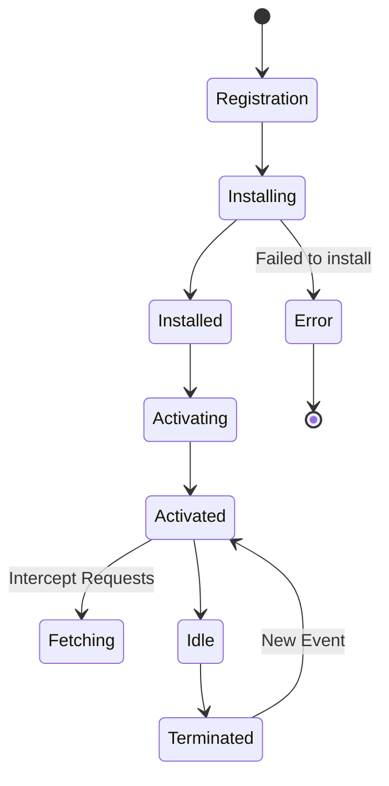

import { Sandpack } from '@codesandbox/sandpack-react'

## JavaScript: Мозги. Урок: Service Workers

Service Workers - это мощный инструмент JavaScript, позволяющий сделать ваши веб-приложения быстрее, надежнее и способными работать в оффлайн-режиме. По сути, это скрипт, который работает в фоновом режиме, независимо от вашей веб-страницы.

### Жизненный цикл Service Worker


*Стадии жизни Service Worker: от регистрации до перехвата запросов.*

### Что такое Service Worker?

Представьте Service Worker как посредника между вашим веб-приложением, браузером и сетью. Он перехватывает сетевые запросы, управляет кешем и может даже отправлять push-уведомления.  Он работает в отдельном потоке, поэтому не блокирует основной поток вашего приложения, обеспечивая плавную работу интерфейса.

### Регистрация Service Worker

Прежде чем использовать Service Worker, его необходимо зарегистрировать. Это делается в основном скрипте вашего приложения.

```javascript
// index.js
if ('serviceWorker' in navigator) {
  navigator.serviceWorker.register('/sw.js') // Путь к вашему service worker файлу
    .then(registration => {
      console.log('Service Worker зарегистрирован успешно:', registration);
    })
    .catch(error => {
      console.log('Ошибка при регистрации Service Worker:', error);
    });
}
```

Этот код проверяет, поддерживает ли браузер Service Workers, и регистрирует `/sw.js`.

### sw.js: Жизненный цикл Service Worker

Файл `sw.js` содержит логику вашего Service Worker.  Основные этапы жизненного цикла:

1.  **Install:**  Выполняется один раз при первой установке Service Worker.  Здесь обычно происходит кеширование статических ресурсов.

```javascript
// sw.js
const CACHE_NAME = 'my-site-cache-v1';
const urlsToCache = [
  '/',
  '/index.html',
  '/styles.css',
  '/script.js'
];

self.addEventListener('install', function(event) {
  // Выполняется при установке Service Worker
  event.waitUntil(
    caches.open(CACHE_NAME)
      .then(function(cache) {
        console.log('Открыт кеш:', CACHE_NAME);
        return cache.addAll(urlsToCache); // Кешируем ресурсы
      })
  );
});
```

2.  **Activate:** Выполняется после установки.  Здесь часто происходит очистка старого кеша.

```javascript
self.addEventListener('activate', function(event) {
  // Выполняется при активации Service Worker
  event.waitUntil(
    caches.keys().then(function(cacheNames) {
      return Promise.all(
        cacheNames.map(function(cacheName) {
          if (cacheName !== CACHE_NAME) {
            console.log('Удаляем старый кеш:', cacheName);
            return caches.delete(cacheName); // Удаляем старый кеш
          }
        })
      );
    })
  );
});
```

3.  **Fetch:** Перехватывает сетевые запросы.  Здесь вы можете вернуть данные из кеша или запросить их из сети.

```javascript
self.addEventListener('fetch', function(event) {
  // Перехватываем сетевые запросы
  event.respondWith(
    caches.match(event.request) // Проверяем, есть ли запрос в кеше
      .then(function(response) {
        // Если есть в кеше, возвращаем его
        if (response) {
          return response;
        }

        // Если нет в кеше, делаем запрос в сеть
        return fetch(event.request).then(
          function(response) {
            // Проверяем, что ответ корректный
            if(!response || response.status !== 200 || response.type !== 'basic') {
              return response;
            }

            // Клонируем ответ (потому что он может быть использован только один раз)
            var responseToCache = response.clone();

            caches.open(CACHE_NAME)
              .then(function(cache) {
                cache.put(event.request, responseToCache); // Кешируем ответ
              });

            return response;
          }
        );
      })
    );
});
```

### Жизненный пример

Многие современные веб-приложения и сайты используют Service Workers для повышения производительности и обеспечения оффлайн-доступа.  Например:

*   **Progressive Web Apps (PWAs):** Service Workers являются ключевой технологией для создания PWAs, позволяя им работать как нативные приложения.
*   **Google Maps:** Использует Service Workers для кеширования карт, позволяя пользователям просматривать карты даже без подключения к интернету.
*   **Новостные сайты:** Могут кешировать статьи для чтения в оффлайн-режиме.
*   **Фреймворки (например, React, Angular, Vue):**  Имеют встроенные инструменты или библиотеки для работы с Service Workers.  Например, `create-react-app` часто содержит `service-worker.js` по умолчанию.

### Ключевые моменты

*   Service Workers работают в отдельном потоке.
*   Они имеют доступ к Cache API для хранения ресурсов.
*   Они могут перехватывать и обрабатывать сетевые запросы.
*   Они позволяют создавать веб-приложения, работающие в оффлайн-режиме.
*   Важно понимать жизненный цикл Service Worker (install, activate, fetch).
*   При обновлении Service Worker важно очищать старый кеш.

### Практика

Попробуйте примеры в интерактивном редакторе:

<Sandpack template="vanilla">

```js
const app = document.querySelector('#app');

app.innerHTML = `
  <h2>⚙️ Service Worker API Demo</h2>
  
  <div style="background: linear-gradient(135deg, #667eea 0%, #764ba2 100%); color: white; padding: 20px; border-radius: 12px; margin: 20px 0;">
    <h3 style="margin: 0 0 10px 0;">🎯 Статус Service Worker</h3>
    <div id="swStatus" style="
      background: rgba(255,255,255,0.2);
      padding: 15px;
      border-radius: 8px;
      font-family: monospace;
      font-size: 14px;
    ">
      Проверка поддержки...
    </div>
  </div>
  
  <div style="display: grid; gap: 10px; margin: 20px 0;">
    <button id="checkSupport" class="demo-btn">
      ✅ Проверить поддержку Service Worker
    </button>
    <button id="showLifecycle" class="demo-btn">
      🔄 Показать жизненный цикл
    </button>
    <button id="showCaching" class="demo-btn">
      💾 Пример кеширования
    </button>
    <button id="showFetch" class="demo-btn">
      🌐 Перехват fetch-запросов
    </button>
    <button id="showPWA" class="demo-btn">
      📱 Использование в PWA
    </button>
    <button id="showCode" class="demo-btn">
      💻 Полный пример кода
    </button>
  </div>
  
  <div id="output" style="
    background: #f5f5f5; 
    padding: 20px; 
    border-radius: 8px; 
    font-family: monospace; 
    font-size: 13px; 
    min-height: 300px;
    line-height: 1.6;
  "></div>
  
  <div style="background: #fff3e0; padding: 15px; border-radius: 8px; border-left: 4px solid #FF9800; margin-top: 20px;">
    <h4 style="margin: 0 0 10px 0;">⚠️ Важно знать!</h4>
    <ul style="margin: 0; padding-left: 20px; font-size: 14px; line-height: 1.8;">
      <li>Service Workers работают только по <strong>HTTPS</strong> (кроме localhost)</li>
      <li>Работают в <strong>отдельном потоке</strong>, не блокируя UI</li>
      <li>Не имеют доступа к DOM напрямую</li>
      <li>Могут работать, даже когда страница закрыта</li>
      <li>Обновление SW требует перезагрузки страницы или skipWaiting()</li>
    </ul>
  </div>
`;

const output = document.querySelector('#output');
const swStatus = document.querySelector('#swStatus');

function log(message, color = '#333') {
  output.innerHTML += \`<div style="color: \${color}; margin: 5px 0;">\${message}</div>\`;
  console.log(message);
}

function clearOutput() {
  output.innerHTML = '';
}

function highlightCode(code) {
  return \`<pre style="background: #282c34; color: #abb2bf; padding: 15px; border-radius: 6px; overflow-x: auto; margin: 10px 0;"><code>\${code}</code></pre>\`;
}

// Проверка поддержки
function checkSupport() {
  if ('serviceWorker' in navigator) {
    swStatus.innerHTML = \`
      ✅ <strong>Service Worker поддерживается!</strong><br>
      <span style="font-size: 12px; opacity: 0.9;">Браузер: \${navigator.userAgent.split(' ').slice(-2).join(' ')}</span>
    \`;
    return true;
  } else {
    swStatus.innerHTML = \`
      ❌ <strong>Service Worker НЕ поддерживается</strong><br>
      <span style="font-size: 12px; opacity: 0.9;">Обновите браузер до последней версии</span>
    \`;
    return false;
  }
}

const demos = {
  checkSupport: () => {
    clearOutput();
    log('🔍 <strong>Проверка поддержки Service Worker</strong>', '#2196F3');
    log('');
    
    const supported = checkSupport();
    
    log(\`Результат: \${supported ? '✅ Поддерживается' : '❌ Не поддерживается'}\`, supported ? '#4CAF50' : '#f44336');
    log('');
    
    if (supported) {
      log('Проверка API:', '#666');
      log(\`  • navigator.serviceWorker: \${typeof navigator.serviceWorker}\`, '#4CAF50');
      log(\`  • Cache API: \${'caches' in window ? '✅' : '❌'}\`, 'caches' in window ? '#4CAF50' : '#f44336');
      log(\`  • Push API: \${'PushManager' in window ? '✅' : '❌'}\`, 'PushManager' in window ? '#4CAF50' : '#f44336');
      log(\`  • Notifications API: \${'Notification' in window ? '✅' : '❌'}\`, 'Notification' in window ? '#4CAF50' : '#f44336');
    }
  },
  
  showLifecycle: () => {
    clearOutput();
    log('🔄 <strong>Жизненный цикл Service Worker</strong>', '#9C27B0');
    log('');
    
    const stages = [
      { name: 'Registration', desc: 'Регистрация SW через navigator.serviceWorker.register()', icon: '📝' },
      { name: 'Installing', desc: 'Событие install - кеширование статических ресурсов', icon: '⬇️' },
      { name: 'Installed/Waiting', desc: 'SW установлен, ждет активации (если есть старый SW)', icon: '⏳' },
      { name: 'Activating', desc: 'Событие activate - очистка старого кеша', icon: '🔄' },
      { name: 'Activated', desc: 'SW активен и готов перехватывать запросы', icon: '✅' },
      { name: 'Fetch/Message', desc: 'Обработка событий fetch и message', icon: '🌐' },
      { name: 'Idle', desc: 'SW в режиме ожидания событий', icon: '💤' },
      { name: 'Terminated', desc: 'SW остановлен браузером для экономии памяти', icon: '🛑' }
    ];
    
    stages.forEach((stage, i) => {
      log(\`\${i + 1}. \${stage.icon} <strong>\${stage.name}</strong>\`, '#2196F3');
      log(\`   \${stage.desc}\`, '#666');
      log('');
    });
    
    log('💡 <strong>Важно:</strong> SW может быть остановлен в любой момент и перезапущен при новом событии', '#FF9800');
  },
  
  showCaching: () => {
    clearOutput();
    log('💾 <strong>Кеширование ресурсов</strong>', '#4CAF50');
    log('');
    
    const installCode = \`// sw.js - событие install
self.addEventListener('install', event => {
  const CACHE_NAME = 'my-app-v1';
  const urlsToCache = [
    '/',
    '/index.html',
    '/styles.css',
    '/script.js',
    '/logo.png'
  ];
  
  event.waitUntil(
    caches.open(CACHE_NAME)
      .then(cache => {
        console.log('Кеш открыт');
        return cache.addAll(urlsToCache);
      })
  );
  
  // Активировать новый SW сразу
  self.skipWaiting();
});\`;
    
    log('Кеширование происходит в событии <strong>install</strong>:', '#666');
    output.innerHTML += highlightCode(installCode);
    
    log('');
    log('🔑 <strong>Ключевые методы Cache API:</strong>', '#2196F3');
    log('  • caches.open(name) - открыть кеш', '#666');
    log('  • cache.addAll(urls) - добавить массив URL', '#666');
    log('  • cache.add(url) - добавить один URL', '#666');
    log('  • cache.put(request, response) - сохранить ответ', '#666');
    log('  • cache.delete(request) - удалить из кеша', '#666');
    log('  • caches.keys() - получить все кеши', '#666');
  },
  
  showFetch: () => {
    clearOutput();
    log('🌐 <strong>Перехват fetch-запросов</strong>', '#2196F3');
    log('');
    
    const fetchCode = \`// sw.js - событие fetch
self.addEventListener('fetch', event => {
  event.respondWith(
    caches.match(event.request)
      .then(cachedResponse => {
        // Если есть в кеше - возвращаем
        if (cachedResponse) {
          console.log('Из кеша:', event.request.url);
          return cachedResponse;
        }
        
        // Если нет - запрашиваем из сети
        return fetch(event.request)
          .then(response => {
            // Проверка корректности ответа
            if (!response || response.status !== 200 || 
                response.type !== 'basic') {
              return response;
            }
            
            // Клонируем ответ для кеша
            const responseToCache = response.clone();
            
            caches.open('my-app-v1')
              .then(cache => {
                cache.put(event.request, responseToCache);
              });
            
            return response;
          })
          .catch(() => {
            // Fallback при отсутствии сети
            return caches.match('/offline.html');
          });
      })
  );
});\`;
    
    log('Стратегия: <strong>Cache First, then Network</strong>', '#666');
    output.innerHTML += highlightCode(fetchCode);
    
    log('');
    log('📚 <strong>Популярные стратегии кеширования:</strong>', '#FF9800');
    log('  1. Cache First - сначала кеш, потом сеть', '#666');
    log('  2. Network First - сначала сеть, потом кеш', '#666');
    log('  3. Cache Only - только кеш', '#666');
    log('  4. Network Only - только сеть', '#666');
    log('  5. Stale While Revalidate - кеш + фоновое обновление', '#666');
  },
  
  showPWA: () => {
    clearOutput();
    log('📱 <strong>Service Workers в Progressive Web Apps</strong>', '#E91E63');
    log('');
    
    log('🎯 <strong>Основные возможности PWA:</strong>', '#2196F3');
    log('');
    
    const features = [
      { icon: '📴', name: 'Offline режим', desc: 'Работа без интернета через кеширование' },
      { icon: '🔔', name: 'Push-уведомления', desc: 'Отправка уведомлений даже при закрытом приложении' },
      { icon: '📲', name: 'Установка на устройство', desc: 'Добавление на главный экран (manifest.json)' },
      { icon: '⚡', name: 'Быстрая загрузка', desc: 'Мгновенный запуск через кеш' },
      { icon: '🔄', name: 'Фоновая синхронизация', desc: 'Sync API для отложенных операций' },
      { icon: '📊', name: 'Аналитика offline', desc: 'Сбор данных даже без сети' }
    ];
    
    features.forEach(f => {
      log(\`\${f.icon} <strong>\${f.name}</strong>\`, '#4CAF50');
      log(\`   \${f.desc}\`, '#666');
      log('');
    });
    
    log('🏢 <strong>Примеры использования:</strong>', '#9C27B0');
    log('  • Twitter Lite - PWA с offline режимом', '#666');
    log('  • Starbucks - заказ кофе без интернета', '#666');
    log('  • Pinterest - 60% увеличение engagement', '#666');
    log('  • Telegram Web - полноценный мессенджер в браузере', '#666');
  },
  
  showCode: () => {
    clearOutput();
    log('💻 <strong>Полный пример Service Worker</strong>', '#673AB7');
    log('');
    
    const registerCode = \`// main.js - регистрация
if ('serviceWorker' in navigator) {
  window.addEventListener('load', () => {
    navigator.serviceWorker
      .register('/sw.js')
      .then(registration => {
        console.log('SW registered:', registration.scope);
      })
      .catch(error => {
        console.error('SW registration failed:', error);
      });
  });
}\`;
    
    const swCode = \`// sw.js - полный пример
const CACHE_NAME = 'my-pwa-v1';
const OFFLINE_URL = '/offline.html';

// Install
self.addEventListener('install', event => {
  event.waitUntil(
    caches.open(CACHE_NAME).then(cache => 
      cache.addAll([
        '/',
        '/index.html',
        '/styles.css',
        '/app.js',
        OFFLINE_URL
      ])
    )
  );
  self.skipWaiting();
});

// Activate
self.addEventListener('activate', event => {
  event.waitUntil(
    caches.keys().then(cacheNames =>
      Promise.all(
        cacheNames
          .filter(name => name !== CACHE_NAME)
          .map(name => caches.delete(name))
      )
    )
  );
  self.clients.claim();
});

// Fetch
self.addEventListener('fetch', event => {
  if (event.request.mode === 'navigate') {
    event.respondWith(
      fetch(event.request).catch(() =>
        caches.match(OFFLINE_URL)
      )
    );
  } else {
    event.respondWith(
      caches.match(event.request).then(response =>
        response || fetch(event.request)
      )
    );
  }
});\`;
    
    log('1️⃣ Регистрация в основном файле:', '#666');
    output.innerHTML += highlightCode(registerCode);
    
    log('');
    log('2️⃣ Код Service Worker:', '#666');
    output.innerHTML += highlightCode(swCode);
    
    log('');
    log('✅ <strong>Готово!</strong> Теперь приложение работает offline', '#4CAF50');
  }
};

// Инициализация
checkSupport();

// Кнопки
document.querySelectorAll('.demo-btn').forEach(btn => {
  btn.style.cssText = \`
    padding: 12px 20px;
    background: linear-gradient(135deg, #667eea 0%, #764ba2 100%);
    color: white;
    border: none;
    border-radius: 6px;
    cursor: pointer;
    font-size: 14px;
    text-align: left;
    transition: all 0.2s;
  \`;
  
  btn.addEventListener('mouseover', () => {
    btn.style.transform = 'translateX(3px)';
    btn.style.boxShadow = '0 4px 12px rgba(0,0,0,0.2)';
  });
  
  btn.addEventListener('mouseout', () => {
    btn.style.transform = 'translateX(0)';
    btn.style.boxShadow = 'none';
  });
});

document.querySelector('#checkSupport').addEventListener('click', demos.checkSupport);
document.querySelector('#showLifecycle').addEventListener('click', demos.showLifecycle);
document.querySelector('#showCaching').addEventListener('click', demos.showCaching);
document.querySelector('#showFetch').addEventListener('click', demos.showFetch);
document.querySelector('#showPWA').addEventListener('click', demos.showPWA);
document.querySelector('#showCode').addEventListener('click', demos.showCode);

output.innerHTML = '<div style="color: #666; text-align: center; padding: 40px;">👆 Выберите тему для изучения</div>';
```

</Sandpack>
